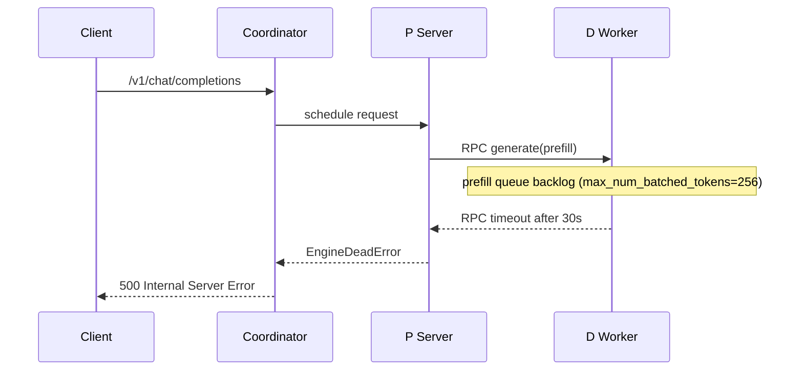

# Output Format Specification

The diagnosis JSON is the machine-readable source of truth. The Markdown
report is the human-readable projection. Both are emitted by the diagnosis
agent after the evidence + hypothesis phases complete.

---

## 1. Diagnosis JSON Schema

```json
{
  "schema_version": "1.0",
  "step_name": "tests/...",
  "log_file": "/path/to/ci.log",
  "generated_at": "2026-06-16T12:00:00+00:00",
  "routing": {
    "failure_stage": "startup",
    "failure_layer": "vllm_engine",
    "visible_failure": "EngineDeadError at CI summary",
    "first_failure_signal": "RPC timeout at line 3200 before EngineDeadError",
    "wrapper_errors": [{"type": "EngineDeadError", "line": 4200, "snippet": "..."}],
    "evidence_source_plan": [
      {"source": "main_ci_log", "role": "timeline", "status": "available"},
      {"source": "ascend_worker_logs", "role": "owning_source_for_engine_crash", "status": "required"}
    ],
    "candidate_routes": [...],
    "evidence_requests": [...],
    "missing_sources": [],
    "source_conflicts": [],
    "matched_playbooks": ["log-diagnosis-vllm-inference-timeout"]
  },
  "failure_family": "vllm_engine_runtime_timeout",
  "root_cause": "Inference batch timed out due to prefill queue bloat",
  "classification": "product_bug",
  "confidence": "medium",
  "root_layers": [
    {"layer": "appearance", "cause": "EngineDeadError at CI summary"},
    {"layer": "direct_cause", "cause": "RPC call to D worker timed out after 30s"},
    {"layer": "aggravating_factor", "cause": "max_num_batched_tokens too low causing prefill backlog"},
    {"layer": "trigger", "cause": "Commit aba1234 increased model size without adjusting batch config"}
  ],
  "evidence": [
    {"file": "/tmp/leader_logs.txt", "line": 3200, "snippet": "RPC call to worker timed out after 30s", "interpretation": "D worker did not respond in time"}
  ],
  "counter_evidence": [
    {"file": "/tmp/leader_logs.txt", "line": 2800, "snippet": "Registered RPC handler for generate", "interpretation": "RPC registration succeeded, so the channel was alive"}
  ],
  "wrapper_errors": [{"type": "EngineDeadError", "line": 4200, "snippet": "EngineDeadError: engine is dead"}],
  "evidence_sources": [
    {"source": "main_ci_log", "status": "used", "role": "visible failure and timeline"},
    {"source": "ascend_worker_logs", "status": "used", "role": "owning source for engine crash"},
    {"source": "k8s_diagnostics", "status": "used_as_counter_evidence", "role": "pod state"}
  ],
  "missing_sources": [
    {"source": "benchmark_results", "impact": "not needed for this non-benchmark route"}
  ],
  "source_conflicts": [],
  "failed_tests": ["tests/e2e/test_inference.py::test_basic"],
  "matched_playbooks": ["log-diagnosis-vllm-inference-timeout"],
  "next_actions": [
    {"priority": "P0", "action": "Increase max_num_batched_tokens in test config", "command": "sed -i 's/max_num_batched_tokens: 256/max_num_batched_tokens: 512/' config.yaml"}
  ],
  "needs_human_review": false
}
```

### Field Descriptions

| Field | Type | Description |
|---|---|---|
| `schema_version` | string | Always `"1.0"` |
| `step_name` | string | CI step name or config file |
| `log_file` | string | Path to the analyzed log |
| `generated_at` | string | ISO-8601 timestamp |
| `routing` | object | Routing decision (stage, layer, candidate routes) |
| `failure_family` | string | Human-readable failure family name |
| `root_cause` | string | Root cause summary (2-3 sentences) |
| `classification` | enum | `flake`, `test_bug`, `product_bug`, `infra_issue`, `unknown` |
| `confidence` | enum | `high`, `medium`, `low` |
| `root_layers` | array | Layered root cause (appearance, direct_cause, aggravating_factor, trigger) |
| `evidence[]` | array | Supporting evidence with `{file, line, snippet, interpretation}` |
| `counter_evidence[]` | array | Evidence against the root cause with `{file, line, snippet, interpretation}` |
| `wrapper_errors[]` | array | Wrapper-level errors detected |
| `evidence_sources[]` | array | Sources used, missing, or used as counter-evidence |
| `missing_sources[]` | array | Missing sources and their diagnostic impact |
| `source_conflicts[]` | array | Unresolved cross-source conflicts |
| `failed_tests[]` | array | List of pytest FAILED test paths |
| `matched_playbooks[]` | array | Matched log-diagnosis playbook names |
| `next_actions[]` | array | Actions with `{priority, action, command}` |
| `needs_human_review` | bool | `true` when confidence is low or agent hit a boundary |

---

## 2. Markdown Report Structure

The Markdown report MUST contain all 11 sections below in order. Section
numbering is part of the contract — downstream tools match on the headings.
If a section has no data, include the heading and add a placeholder.

### 2.1 Diagnosis Conclusion

- Classification and confidence badge
- One-line failure direction (e.g., "Inference batch timed out — product bug")
- Root cause summary (2-3 sentences)

### 2.2 Environment Summary

A 2-column table:

| Item | Value |
|---|---|
| Runner | `linux-aarch64-a3-0` |
| Image | `cann:9.0.0-910b-ubuntu22.04-py3.12` |
| Config | `llama3_70B_single_node.yaml` |
| Hardware | `Ascend 910B` |
| vLLM version | `0.6.4` |
| vLLM-Ascend version | `0.5.0` |

Also include the diagnosis metadata (generated_at, step_name, log_file).

### 2.3 Key Timeline

A table with columns: time, component, event. Ordered chronologically.
Include multi-component offsets when available.

Example:

| Time | Component | Event |
|---|---|---|
| 12:00:01 | Coordinator | Starting pod |
| 12:00:10 | P Server | Registered RPC handler |
| 12:00:15 | D Worker | Started model loading |
| 12:00:45 | P Server | Request timeout |
| 12:00:46 | CI | EngineDeadError |

### 2.4 Evidence Chain

A table with columns: 来源 | 日志位置 | 日志内容 | 推导结论.

| Source | Location | Content | Deduction |
|---|---|---|---|
| Main CI log | leader_logs.txt:3200 | `RPC call timed out after 30s` | D worker did not respond |
| Ascend worker logs | worker_rank3.log:1180 | `RuntimeError: connection closed by peer` | Rank-local failure happened before wrapper |
| K8s diagnostics | pods.json:1 | `phase=Running restartCount=0` | Pod-level failure is unlikely |

If a source was required but missing, add a row with `Source=missing` and
explain the diagnostic impact.

### 2.5 Success vs Failure Comparison

A table comparing a successful baseline request path against the failure path.

| Checkpoint | Success Baseline | Failure Request |
|---|---|---|
| Request received | 12:00:01 | 12:01:30 |
| Prefill started | 12:00:02 | 12:01:31 |
| Prefill completed | 12:00:05 | — N/A — |
| First token sent | 12:00:06 | — N/A — |

The `— N/A —` marker explicitly shows where the failure diverged.

### 2.6 Failure Chain Overview

A Mermaid `sequenceDiagram` showing the full causal chain:



### 2.7 Root Cause Analysis

A 2-3 sentence layered analysis covering:

- **Appearance**: What CI shows
- **Direct Cause**: The immediate trigger
- **Aggravating Factor**: What made it worse
- **Trigger**: The code/config change that introduced the failure

Presented as a table:

| Layer | Root Cause |
|---|---|
| appearance | EngineDeadError at CI summary |
| direct_cause | RPC call to D worker timed out after 30s |
| aggravating_factor | max_num_batched_tokens=256 causes prefill queue bloat |
| trigger | Commit aba1234 increased model params without adjusting batch config |

### 2.8 排除项 (Excluded Items)

A bulleted list of things the agent explicitly considered and ruled out:

- Coordinator scheduling issue — log shows `schedule succeeded` at line 2800
- Image pull failure — pods were Running
- K8s resource shortage — all pods had sufficient resources
- Network partition — RPC registration succeeded

Also list cross-source exclusions. Example: K8s summary shows pods were
Running with `restartCount=0`, so do not classify the failure as
CrashLoopBackOff even if the main log later shows HTTP 500.

### 2.9 下一步行动 (Next Actions)

A table with priority, direction, action, and confidence:

| Priority | Direction | Action | Confidence |
|---|---|---|---|
| P0 | Short-term | Increase max_num_batched_tokens | high |
| P1 | Mid-term | Add RPC timeout metrics | medium |
| P2 | Long-term | Add dynamic batch sizing | low |

### 2.10 修复建议 (Fix Recommendations)

Three subsections:

#### 修复建议

**短期（运维）** — What an on-call engineer can do today:
1. Restart the failed job
2. Increase `max_num_batched_tokens` in config.yaml

**中期（配置）** — Config changes:
1. Set `VLLM_ENGINE_READY_TIMEOUT_S=3600`
2. Reduce concurrent request count

**长期（代码/架构）** — Code/architecture changes:
1. Add dynamic batch sizing
2. Implement RPC timeout retry with backoff

### 2.11 关键日志检索命令 (Retrieval Commands)

Bash commands to re-derive the findings from the log:

```bash
# Find RPC timeout events
grep -n "timed out" /tmp/leader_logs.txt

# Find EngineDeadError context
grep -B 20 "EngineDeadError" /tmp/leader_logs.txt | head -40

# Check batch config settings
grep -n "max_num_batched_tokens\|max_num_seqs" /tmp/leader_logs.txt
```

---

## 3. Evidence Bundle Format (Pre-LLM)

When `ci_diagnosis_agent.py` runs in **evidence bundle mode** (no LLM),
it outputs a JSON bundle with this structure:

```json
{
  "schema_version": "1.0",
  "type": "evidence_bundle",
  "generated_at": "ISO-8601",
  "step_name": "tests",
  "log_file": "/path/to/log",
  "index": { /* output of build_index() */ },
  "git_context": { /* git branch, commit, changed_files */ },
  "evidence": [
    {
      "request": {"tool": "get_first_exception_context"},
      "payload": { /* tool output */ }
    }
  ],
  "summary": {
    "total_evidence": 5,
    "has_traceback": true,
    "has_failed_tests": true,
    "has_artifacts": false
  }
}
```

This bundle is consumed by the LLM agent (when invoked via the skill) to
avoid re-reading the raw log file.

---

## 4. Rendering Rules

1. Every claim in `root_cause` and `evidence` must reference a `{file, line}` pair.
2. Every wrapper error must be traced upstream (or explained why it cannot be).
3. Every hypothesis in `candidate_routes` must have at least one `supporting_evidence` entry.
4. Every diagnosis must list `evidence_sources[]`, even when only the main CI log was available.
5. Missing required sources must be listed in `missing_sources[]` with impact.
6. Unresolved source conflicts must be listed in `source_conflicts[]`.
7. `classification` must be exactly one of the allowed values.
8. `confidence` must be exactly `high`, `medium`, or `low`.
9. If requirements cannot be met, set `needs_human_review = true`.
10. Markdown sections with no data must still include the heading with a placeholder.
