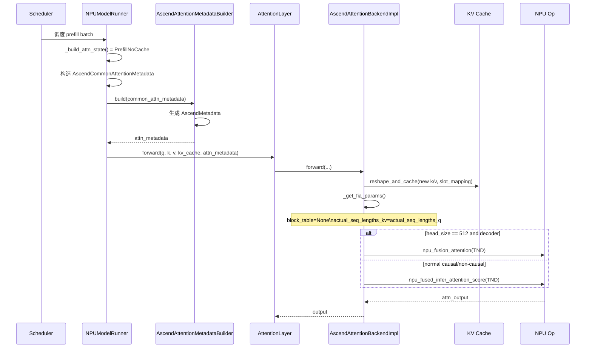
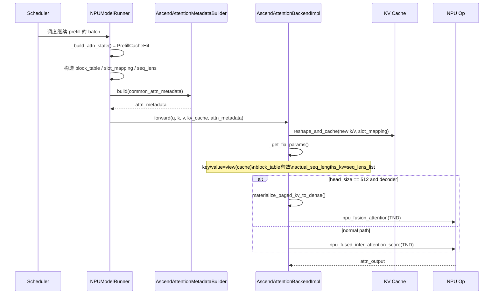
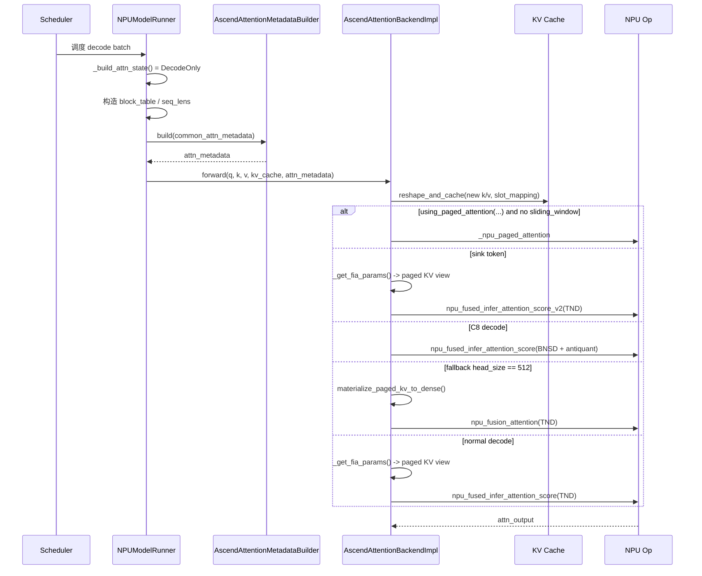
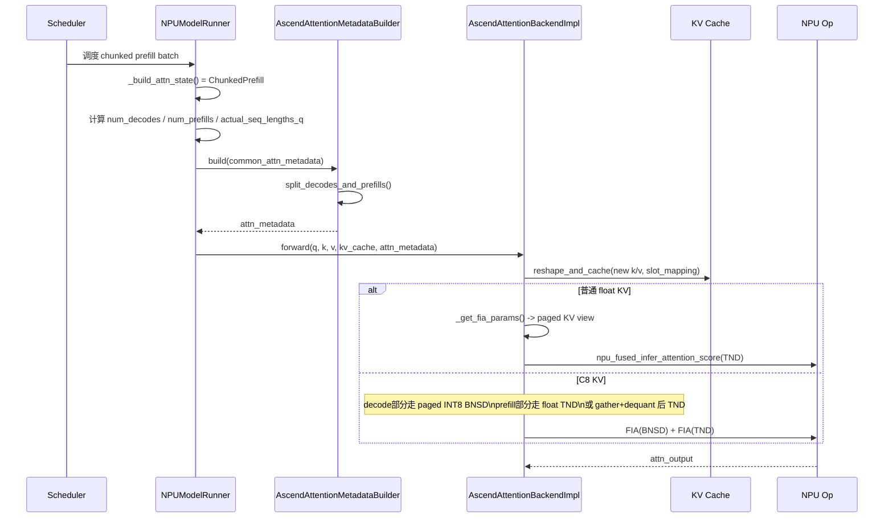
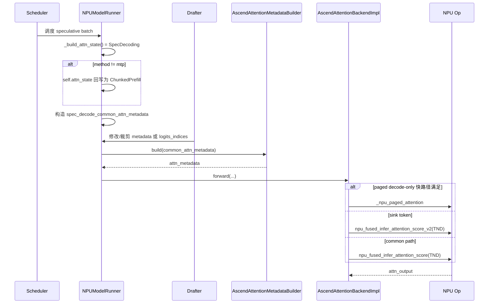

# vLLM Ascend `attention_v1.py` Adaptation Analysis

This article analyzes the attention adaptation implementation of `/home/cmq/code/vllm-ascend/vllm_ascend/attention/attention_v1.py`, and connects the metadata construction logic in `vllm_ascend/worker/model_runner_v1.py` in series to explain how Ascend NPU maps general attention requests to ascending operator calls under vLLM v1 model runner.

This article covers the following:

- Backend registration and overall architecture
- `model_runner_v1` How to construct attention metadata
- `AscendAttentionMetadataBuilder` How to sink public metadata to per-layer metadata
- `AscendAttentionBackendImpl` How to assign different ascension operators according to scenarios
- Specialized paths such as attention mask, paged KV, graph capture, shared KV cache, KV compression, C8 KV quantization, etc.
- Currently `attention_v1.py` has adapted scenarios, limitations and risk points

## 1. Overall conclusion

The essence of `attention_v1.py` is not to "implement an attention algorithm", but to do a layer of **scene normalization + operator dispatch**:

1. `NPUModelRunner` first constructs `AscendCommonAttentionMetadata` based on the scheduling status of the batch.
2. `AscendAttentionMetadataBuilder` is then converted into `AscendMetadata` shared by each layer.
3. `AscendAttentionBackendImpl.forward()` Based on:
- attention status (prefill/decode/chunked prefill/spec)
   - causal / non-causal
   - sliding window
   - sink token
- Is paged attention available?
- Whether KV is shared
- Whether KV is C8 INT8
- Whether graph capture is enabled
Choose different NPU operators and parameter organization methods.

Therefore, the core value of `attention_v1.py` lies not in the mathematical formula itself, but in:

- Map vLLM's request/batch status to shape/layout/metadata acceptable to the ascension operator;
- Switch the most appropriate execution path under different hardware capabilities and model characteristics;
- Try to reuse paged KV cache instead of frequently doing dense materialization;
- Roll back operator limits in necessary scenarios, for example, the TND decoder scenario with head dim=512 falls back to `npu_fusion_attention`.

## 2. Backend registration and basic data structure

### 2.1 Backend registration

`AscendAttentionBackend` is registered as a custom attention backend through `@register_backend(AttentionBackendEnum.CUSTOM, "ASCEND")`. The default block size only declares support for `128`. The KV cache shape is defined as:

```python
(2, num_blocks, block_size, num_kv_heads, head_size)
```

Corresponding source code:

- `vllm_ascend/attention/attention_v1.py:73-140`

in:

- `2` of dimension `0` represents K/V two caches.
- `get_impl_cls()` / `get_builder_cls()` will switch to the implementation of context parallel when CP is enabled, otherwise the default implementation in the current file will be used.

### 2.2 attention status enumeration

`AscendAttentionState` has a total of 5 states:

- `PrefillNoCache`
- `PrefillCacheHit`
- `DecodeOnly`
- `ChunkedPrefill`
- `SpecDecoding`

Corresponding source code:

- `vllm_ascend/attention/attention_v1.py:143-148`

These 5 states are the first level of control plane for the entire attention path distribution.

### 2.3 per-layer metadata：`AscendMetadata`

`AscendMetadata` is metadata used for specific attention layers. The key fields are as follows:

- `attn_mask`: operator mask
- `attn_state`: current attention status
- `num_actual_tokens`: real token number, excluding padding
- `num_decode_tokens` / `num_prefills` / `num_decodes`
- `seq_lens` / `seq_lens_cpu` / `seq_lens_list`
- `actual_seq_lengths_q`: Query cumulative length under TND layout
- `query_start_loc`
- `block_tables`
- `slot_mapping`
- `causal`
- `model_runner_type`
- `reshape_cache_event`
- `kvcomp_metadata`

Corresponding source code:

- `vllm_ascend/attention/attention_v1.py:151-211`

A direct observation is that there is a certain degree of redundancy in the fields, and TODO is clearly written in the code. We hope to unify the schema in the future. The current design is clearly intended to be compatible with different backends, graph capture, and history paths.

## 3. `model_runner_v1` How to determine attention status

### 3.1 State machine entry

`NPUModelRunner._build_attn_state()` uses `num_computed_tokens_cpu`, `num_scheduled_tokens`, and `num_valid_tokens` to determine which type of attention scenario the batch currently belongs to.

Corresponding source code:

- `vllm_ascend/worker/model_runner_v1.py:1256-1285`

The decision logic can be summarized as:

1. `num_computed_tokens == 0` for all requests
   - `PrefillNoCache`
2. Only 1 token is scheduled for all requests in this round.
   - `DecodeOnly`
- If speculative method is `mtp`, switch to `SpecDecoding`
3. All requests `num_valid_tokens == 1`
- If speculative is enabled, go to `SpecDecoding`
- Otherwise go `ChunkedPrefill`
4. If the scheduler enables chunked prefill
   - `ChunkedPrefill`
5. Other situations
   - `PrefillCacheHit`

### 3.2 `self.attn_state` is not exactly the same as the return status

There's an implementation detail here: when the status is `SpecDecoding` but the speculative method is not `mtp`, `self.attn_state` is written back to `ChunkedPrefill`.

This means:

- Externally it may be speculative decoding;
- However, in order to be compatible with existing paths such as PCP/Eagle3, the subsequent metadata will retain execution semantics closer to chunked prefill.

This is a typical adaptation point where "scheduling semantics" and "operator execution semantics" are not completely consistent.

## 4. `model_runner_v1` How to construct public metadata

### 4.1 `_build_attention_metadata()` is the final assembly entrance

Corresponding source code:

- `vllm_ascend/worker/model_runner_v1.py:2664-2985`

This function does several key things:

1. Process the token/req number after padding
2. If CP is enabled, construct PCP metadata
3. Prepare for each KV cache group:
   - `block_table_tensor`
   - `slot_mapping`
4. Construct `AscendCommonAttentionMetadata`
5. Traverse each attention group and use its respective builder to generate per-layer metadata

### 4.2 Sources of `block_table` and `slot_mapping`

`_get_block_table_and_slot_mapping()` is the core of paged KV cache:

- `slot_mapping` from `self.input_batch.block_table[kv_cache_gid].slot_mapping`
- `block_table_tensor` from `blk_table.get_device_tensor()`
- In graph mode or padding scenarios, invalid areas will be explicitly filled in as `-1` or `0`
- After PCP is turned on, padded slot mapping will be re-done.

Corresponding source code:

- `vllm_ascend/worker/model_runner_v1.py:2722-2780`

This means that most of the attention operators in `attention_v1.py` actually do not "determine where KV is" by themselves, but rely entirely on the physical mapping prepared in advance by the model runner.

### 4.3 Contents of `AscendCommonAttentionMetadata`

`cm_base = AscendCommonAttentionMetadata(...)` was passed in:

- `query_start_loc` / `query_start_loc_cpu`
- `seq_lens`
- `_seq_lens_cpu` and `seq_lens_cpu`
- `num_computed_tokens_cpu`
- `num_reqs`
- `num_actual_tokens`
- `max_query_len`
- `max_seq_len`
- `block_table_tensor`
- `slot_mapping`
- `causal=True`
- `num_input_tokens`
- `actual_seq_lengths_q`
- `positions`
- `attn_state`
- `decode_token_per_req`
- `prefill_context_parallel_metadata`

Corresponding source code:

- `vllm_ascend/worker/model_runner_v1.py:2805-2834`

The more critical design points here are:

- `_seq_lens_cpu` gives priority to saving the optimistic CPU version for use by the NPU backend to avoid GPU->CPU synchronization in the runtime.
- `actual_seq_lengths_q` is one of the most critical length metadata under TND layout.
- `attn_state` has been solidified into common metadata here.

### 4.4 Group-level metadata builder reuse

Multiple layers under a KV cache group will share a metadata:

- `attn_metadata_dict[layer_name] = attn_metadata_i`

Corresponding source code:

- `vllm_ascend/worker/model_runner_v1.py:2911-2912`

This can reduce repeated construction and also shows that `attention_v1.py` does not need to do complex host-side derivation for each layer.

## 5. Positioning of `AscendCommonAttentionMetadata`

`AscendCommonAttentionMetadata` is defined in `attention/utils.py` and is the middle layer between the model runner and the specific backend.

Corresponding source code:

- `vllm_ascend/attention/utils.py:146-240`

This structure solves several problems:

- Keep CPU and NPU double length information
- Reserve TND cumulative length `actual_seq_lengths_q`
- Pass `attn_state`
- Pass CP / PCP / kvcomp related metadata
- Support `unpadded()` cropped view in speculative / draft graph and other scenarios

It's worth noting that `using_paged_attention()` is also in this file:

- Only considered to be enabled in `FULL_DECODE_ONLY` graph mode
- speculative scene disabled
- A5 device disabled
- Enabled only if runtime shape hits `pa_shape_list`

Corresponding source code:

- `vllm_ascend/attention/utils.py:44-55`

Therefore, paged attention is not always enabled with decode, but a performance path with a shape whitelist.

## 6. `AscendAttentionMetadataBuilder` How to generate per-layer metadata

### 6.1 Responsibilities of builder

`AscendAttentionMetadataBuilder.build()` does very concentrated things:

1. Extract `num_reqs`, `num_actual_tokens`, `query_start_loc_cpu` from common metadata
2. Call `split_decodes_and_prefills()` statistics decode / prefill split
3. Select the preferred source of `seq_lens`
4. Select `slot_mapping`
5. Confirm `attn_state`
6. Generate `attn_mask`
7. Asynchronously copy the CPU side `query_start_loc` to the device side
8. Assemble as `AscendMetadata`

Corresponding source code:

- `vllm_ascend/attention/attention_v1.py:273-337`

### 6.2 `seq_lens` gives priority to the CPU version

builder specifies priorities:

1. `_seq_lens_cpu`
2. `seq_lens_cpu`
3. `seq_lens.to("cpu")`

The reason for this is straightforward:

- Many backend logic only requires host side length information;
- If you use GPU tensor and then `to("cpu")`, it will bring synchronization costs;
- During the speculative draft iteration, `_seq_lens_cpu` was the latest authoritative host copy.

### 6.3 Source of `actual_seq_lengths_q`

`actual_seq_lengths_q=query_start_loc_cpu[1:].tolist()`

Here are the key assumptions of TND layout:

- `query_start_loc` itself is the cumulative query offset of each request;
- After removing the leading 0, it is naturally the cumulative q lengths required by the Ascend TND operator.

### 6.4 attention mask strategy

What is called here is:

```python
self.attn_mask_builder.get_attention_mask(self.model_config)
```

The actual behavior of `AttentionMaskBuilder` is not universal, but rather "customized according to the current backend":

- `pooling` runner returns `2048x2048` bool causal mask
- Ordinary attention returns the splitfuse mask of `2048x2048` by default, and the dtype is `int8`

Corresponding source code:

- `vllm_ascend/attention/attention_mask.py:53-79`

In other words, `attention_v1.py` does not dynamically generate a mask of any size for each batch, but relies on a cached fixed large mask, which is then handed over to the operator for interpretation by `actual_seq_lengths_*`.

## 7. Operator dispatch graph in `attention_v1.py`

### 7.1 Main dispatch logic

`AscendAttentionBackendImpl.forward_impl()` is the outer dispatch point:

1. If the current value is `DecodeOnly`
2. AND `using_paged_attention(num_tokens, vllm_config)` is true
3. And `sliding_window is None`
4. Then go `_npu_paged_attention`
5. Otherwise go `forward_fused_infer_attention()`

Corresponding source code:

- `vllm_ascend/attention/attention_v1.py:1417-1424`

This shows that paged attention is currently mainly an optimization branch of decode-only, rather than a unified attention backbone.

### 7.2 Main ascending operators currently used

`attention_v1.py` actually involves 4 types of attention-related operators:

1. `torch_npu._npu_paged_attention`
2. `torch_npu.npu_fused_infer_attention_score`
3. `torch_npu.npu_fused_infer_attention_score_v2`
4. `torch_npu.npu_fusion_attention`

Their roles are roughly as follows:

- `_npu_paged_attention`
- decode-only fast path
- Direct consumption of paged KV cache
- `npu_fused_infer_attention_score`
- The current main reasoning attention operator
- Compatible with prefill / decode / chunked prefill
- Also supports paged KV, sliding window, and some quantization parameters
- `npu_fused_infer_attention_score_v2`
- The sink token path is dedicated
- Only used in the code when `self.sinks is not None`
- `npu_fusion_attention`
- as fallback
- Currently used for decoder TND scenario with head dim=512
- Also used for pooling / encoder style non-cache attention

## 8. Analysis of each execution path

### 8.1 `_get_fia_params()`: Translate status into operator parameters

`_get_fia_params()` is the most critical "state to physical view" conversion function of `attention_v1.py`.

Corresponding source code:

- `vllm_ascend/attention/attention_v1.py:991-1061`

It is determined based on `attn_state`:

- Does it have to require `key_cache` to already exist?
- `key` / `value` should come from new token or paged cache
- Whether `block_table` is `None`
- `actual_seq_lengths_kv` What should be taken?

Four typical scenarios:

1. `PrefillNoCache`
- Normal decoder: `block_table=None`
- Directly use the new K/V of the current batch to do intensive attention
   - `actual_seq_lengths_kv = actual_seq_lengths_q`
2. `PrefillNoCache + shared KV`
- Even for prefill, KV is fetched directly from the shared cache
- `block_table` is valid
3. `PrefillCacheHit`
- Read paged K/V from cache view
- `block_table` intercepted to batch size
4. `DecodeOnly / ChunkedPrefill`
- all get views from paged KV cache
- The difference is mainly reflected in the subsequent `actual_seq_lengths_q` and operator selection

This function itself does not perform calculations, but determines "whether the current attention is dense or paged, whether it is new KV or old KV".

### 8.2 Normal decode-only paged attention

When the paged attention condition is met, execute:

```python
torch_npu._npu_paged_attention(...)
```

Corresponding source code:

- `vllm_ascend/attention/attention_v1.py:1310-1329`

Features:

- Does not use FIA's TND/BNSD interface
- Directly consume `key_cache` / `value_cache` in cache format
- Requires `block_table`
- Requires `context_lens` for each request

This path is one of the current decode-only performance specialization paths.

### 8.3 FIA main path: `npu_fused_infer_attention_score`

The normal main path is in `forward_fused_infer_attention()`.

Corresponding source code:

- `vllm_ascend/attention/attention_v1.py:1186-1308`

Can be divided into three categories:

1. `non-causal`
   - `sparse_mode=0`
2. `causal + sliding_window`
   - `sparse_mode=4`
   - `pre_tokens=self.sliding_window`
   - `next_tokens=0`
3. `causal + full attention`
   - `sparse_mode=3`

These three categories all follow `input_layout="TND"`, and the main differences are:

- `atten_mask`
- `actual_seq_lengths`
- `actual_seq_lengths_kv`
- `block_table`
- `sparse_mode`
- `pre_tokens` / `next_tokens`

to express.

### 8.4 sink token path: `npu_fused_infer_attention_score_v2`

When `self.sinks is not None`, switch to the v2 interface:

Corresponding source code:

- `vllm_ascend/attention/attention_v1.py:1229-1254`

Implementation features:

- Still using `input_layout="TND"`
- When decode-only is used, force `actual_seq_qlen` to be changed to the cumulative form of all 1’s
- Enable sink token semantics via `learnable_sink=self.sinks`
- sliding window is still expressed via `sparse_mode=4`

This shows that v2 does not generally replace v1 in the current code, but carries additional capabilities such as "sink token".

### Fallback for 8.5 head dim = 512: `npu_fusion_attention`

The conditions for `_should_use_tnd_flash_attention_fallback()` are:

- `attn_type == DECODER`
- `head_size == 512`
- `sliding_window is None`
- `sinks is None`

Corresponding source code:

- `vllm_ascend/attention/attention_v1.py:1093-1099`

Then fall back to `_forward_tnd_flash_attention_fallback()`:

- If KV is still in paged form, first `materialize_paged_kv_to_dense()`
- Call `torch_npu.npu_fusion_attention(...)` again

Corresponding source code:

- `vllm_ascend/attention/attention_v1.py:1130-1184`

The code comments are very straightforward: for full-attention layers such as Gemma4, when RoPE has been folded into q/k and `D=512`, the FIA ​​V1 TND path does not meet the requirements, so it falls back.

This is the clearest adaptation point in the current document for “operator rollback for specific model defects”.

### 8.6 pooling / encoder style attention

For branches `model_runner_type == "pooling"` and `not causal`, call `_forward_encoder_attention()`:

- Use `npu_fusion_attention`
- `input_layout="TND"`
- Does not rely on KV cache

Corresponding source code:

- `vllm_ascend/attention/attention_v1.py:1332-1343`
- `vllm_ascend/attention/attention_v1.py:1479-1484`

Therefore, `attention_v1.py` not only serves decoder autoregressive models, but is also compatible with pooling / encoder style scenarios.

## 9. KV cache writing and shared KV adaptation

### 9.1 `reshape_and_cache()` is the entry point for writing cache

Normally, the new K/V will pass:

```python
DeviceOperator.reshape_and_cache(...)
```

Write to paged KV cache.

Corresponding source code:

- `vllm_ascend/attention/attention_v1.py:1381-1415`

It will be based on:

- Whether encoder-decoder
- `num_actual_tokens`
- `slot_mapping`

to decide which tokens to write.

### 9.2 Special handling of shared KV cache

If `self.uses_shared_kv_cache`, then:

- `reshape_and_cache()` returns directly without repeatedly writing KV
- `_get_fia_params()` also allows KV to be read directly from the shared cache in the `PrefillNoCache` scenario

Corresponding source code:

- `vllm_ascend/attention/attention_v1.py:411-414`
- `vllm_ascend/attention/attention_v1.py:1011-1023`
- `vllm_ascend/attention/attention_v1.py:1389-1394`

This is to support upper-layer capabilities such as KV sharing/fast prefill.

## 10. graph capture / full graph adaptation

### 10.1 build phase support

`AscendAttentionMetadataBuilder.build_for_graph_capture()` only supports:

- `DecodeOnly`
- `ChunkedPrefill`
- `SpecDecoding`

Corresponding source code:

- `vllm_ascend/attention/attention_v1.py:339-359`

This shows that dummy metadata under graph capture does not cover all states.

### 10.2 Execution phase support

`attention_v1.py` has made three sets of special logic for graph capture:

1. `full_graph_fia()`
2. `full_graph_fia_v2()`
3. `full_graph_pa()`

and unified `update_graph_params()`.

Corresponding source code:

- `vllm_ascend/attention/attention_v1.py:418-688`
- `vllm_ascend/attention/attention_v1.py:700-985`

What these logics do include:

- Obtain workspace in advance
- cache `attn_params`
- captured with `torch.npu.graph_task_group_begin/end()`
-Only update changed parameters during replay/update

### 10.3 Differences in execution paths in graph mode

In graph mode:

- The sink path will go `full_graph_fia_v2`
- The non-sink path will go to `full_graph_fia`
- paged decode-only will go `full_graph_pa`

This is implemented in parallel with the eager path, rather than sharing the same function.

## 11. Hamming sparse / KV compression adaptation

`attention_v1.py` also inserts `kvcomp_metadata` related logic:

- When prefill / chunked prefill, first `reshape_and_cache_kvcomp(...)`
- When decode-only, `get_kvcomp_decode_params(...)` rewrites `block_table` and `actual_seq_lengths_kv` first

Corresponding source code:

- `vllm_ascend/attention/attention_v1.py:699-706`
- `vllm_ascend/attention/attention_v1.py:1139-1146`
- `vllm_ascend/attention/attention_v1.py:1213-1218`

The meaning is:

- The attention operator itself does not "know hash sparsity";
- The upper layer first rewrites the selection result of KV compression into a new block table / seq lens;
-The attention kernel is still executed as normal paged attention.

This is a very typical engineering practice of "rewriting sparse selection into metadata".

## 12. C8 KV quantitative path analysis

### 12.1 Basic Strategy

`AscendC8AttentionBackendImpl` is a quantized specialization subclass of `AscendAttentionBackendImpl`.

Corresponding source code:

- `vllm_ascend/attention/attention_v1.py:1495-1870`

Its core strategy is:

1. The K/V newly written to the cache is first quantized into INT8
2. decode-only try to use paged INT8 KV + antiquant parameters directly to let FIA/BNSD calculate
3. prefill / prefill cache hit scenario:
- If it is a new token, try to keep float KV for the current round of calculations
- If you must read from the paged cache, dequantize to dense after gather, and then use TND

### 12.2 Quantification parameter preparation

`_prepare_c8_scales()` will:

- shard TP rank
- generate antiquant tensor of `(1, num_kv_heads, 1, head_size)`
- cache `inv_scale`

Corresponding source code:

- `vllm_ascend/attention/attention_v1.py:1590-1625`

### 12.3 decode-only INT8 fast path

`_forward_c8_decode()`：

- Directly change the paged INT8 KV view into `(num_block, block_size, hidden)`
- `query[:batch_size].unsqueeze(2)` forms BNSD
- Call `npu_fused_infer_attention_score`
- do per-channel antiquant via `key_antiquant_scale` / `offset` and `value_antiquant_*`

Corresponding source code:

- `vllm_ascend/attention/attention_v1.py:1683-1718`

This path avoids gathering the entire paged cache into dense float first.

### 12.4 chunked prefill mixed path

`_forward_c8_chunked_prefill()` is very representative because it splits a batch into two parts:

1. decode part
- Go directly to paged INT8 BNSD
2. prefill part
- If all are new tokens and `float_key/float_value` is available, use float KV directly.
- Otherwise gather + dequant from paged INT8 KV, then go to TND

Corresponding source code:

- `vllm_ascend/attention/attention_v1.py:1720-1818`

This is the most complex adaptation in the current file that is “compatible with both decode and prefill within a single batch”.

### 12.5 prefill cache hit scenario

`_forward_c8_fused_infer_attention()`：

- `PrefillNoCache` directly uses float KV
- `PrefillCacheHit` then gather + dequant from paged INT8 KV to dense
- The TND path to `npu_fused_infer_attention_score` is still called eventually

Corresponding source code:

- `vllm_ascend/attention/attention_v1.py:1820-1870`

This shows that the most ideal scenario for C8 quantification is still decoding; prefill is only as compatible as possible, and is not necessarily the optimal performance form.

## 13. attention mask analysis

The implementation of `AttentionMaskBuilder` reflects that the current mask design of attention_v1 is not a "generalized" solution, but strongly binds the current operator constraints.

Corresponding source code:

- `vllm_ascend/attention/attention_mask.py:22-85`

There are three main types of masks:

1. Universal triangle mask
   - `_generate_attn_mask()`
2. splitfuse mask
- Fixed `2048 x 2048`
- Upper triangle `int8`
3. MLA special mask
- Fixed `512 x 512`

In the main path of `attention_v1.py`, the default decoder attention is `get_splitfuse_attn_mask()`.

Several engineering assumptions can be seen here:

- Constantize the mask size to reduce repeated construction;
- The real effective length is supplemented by `actual_seq_lengths_*`;
- For operators, mask is mainly a "template", not a batch-level dynamic structure.

## 14. Operator interface analysis

The following operator analysis is based on the public documents of the Shengteng community and is combined with the actual usage of the current code.

### 14.1 `torch_npu.npu_fused_infer_attention_score`

Ascend documentation states that this interface also covers:

- PromptFlashAttention
- IncreFlashAttention

And enter the incremental branch at `Q_S == 1`, and the rest enter the full branch. The 7.3.0 document also provides:

- `block_table` KV block mapping for page attention
- When `input_layout="TND"` is used, `actual_seq_lengths` must be passed in and is the cumulative length

Combined with the code, we can get:

- `actual_seq_lengths_q = query_start_loc_cpu[1:]` of `attention_v1.py` is adapting to this TND cumulative length requirement;
- `block_table=None` represents dense KV;
- `block_table!=None` means paged KV;
- `sparse_mode=3/4/0` corresponds to causal / sliding window / non-causal semantics respectively.

Document version reference:

- Ascend Extension for PyTorch 7.3.0
- The 7.1.0 document also states additional inference restrictions, such as `N <= 256`, `D <= 512`

### 14.2 `torch_npu.npu_fused_infer_attention_score_v2`

Ascend 7.3.0 documentation:

- Still covers incremental and full inference scenarios
- When system prefix, left padding, KV quantization parameter integration, and pertensor full quantization are not involved, it is recommended to use v2
- Added `learnable_sink`

Combined with this code:

- v2 is currently only used in `self.sinks is not None` scenarios;
- That is, the code treats v2 as a "FIA variant that supports sink tokens" instead of unconditionally replacing v1.

### 14.3 `torch_npu._npu_paged_attention`

This interface in Ascend's public documentation is not as public and detailed as FIA, but it can be judged from the current code and the comments of `ascend_config.py`:

- It is still an important performance path for decode-only;
- Suitable for directly reading paged KV cache;
- Current code is only enabled when `FULL_DECODE_ONLY` + shape hits the whitelist.

This shows that in the current implementation of vLLM-Ascend, paged attention has not been completely replaced by FIA.

### 14.4 `torch_npu.npu_fusion_attention`

The public documentation is more focused on training scenarios, but the current code uses it for two types of fallback:

1. pooling / encoder style attention
2. Fallback path for decoder TND head dim=512

Therefore, in this project it is not the main path, but a backup operator to "make up for FIA constraints".

## 15. Algorithm level analysis

From the perspective of algorithm expression, `attention_v1.py` has not modified the standard attention formula. The adaptation mainly occurs at the four layers of **data layout, length expression, KV cache physical form, and incremental/full unified interface**.

### 15.1 Data layout

There are two types of core layouts:

1. `TND`
- Main layout
- Suitable for varlen / prefill / chunked prefill / sink
- Depends on cumulative `actual_seq_lengths`
2. `BNSD`
- Mainly used for C8 decode-only
- Suitable for incremental scenarios where query length is 1
- Directly cooperate with paged INT8 KV + antiquant parameters

### 15.2 Length expression

The Ascend operator relies specifically on length metadata:

- `actual_seq_lengths_q`: cumulative length of query
- `actual_seq_lengths_kv`: KV length
- `seq_lens_list`: host side list form

This length system is the real key to current fit. A lot of code exists to keep these lengths in:

- prefill
- decode
- chunked prefill
- graph capture
- CP / PCP
- speculative decode

remain consistent.

### 15.3 Unification of paged KV and dense KV

The current implementation attempts to unify both KV forms into the same set of APIs:

- paged KV: via `block_table` + cache view
- dense KV: via `block_table=None`

This is the core reason why `_get_fia_params()` exists.

### 15.4 The essence of chunked prefill

chunked prefill is not a single operator, but:

- There are both decode token and prefill token in the same batch;
- For common paths, they share the FIA ​​TND interface;
- For the C8 path, the decode part and the prefill part can even use different layouts and different KV sources.

Therefore, the key to chunked prefill adaptation is not the mathematical formula, but the "splitting and reorganization of mixed batches".

## 16. Current `attention_v1.py` adapted scenarios

Summarized by code behavior, the current file has been covered:

1. Standard decoder causal attention
   - prefill
   - prefill cache hit
   - decode-only
2. chunked prefill / splitfuse
3. Speculative decoding related compatibility
4. pooling / encoder style non-causal attention
5. sliding-window attention
6. sink token attention
7. paged KV cache
8. shared KV cache
9. graph capture / full graph replay
10. KV compression / hamming sparse metadata rewriting access
11. C8 INT8 KV cache path
12. Backend switching entrance of context parallel
13. head dim=512 specific model fallback

## 17. Timing diagram of five states

The following sequence diagram only describes the `attention_v1.py` main chain and does not expand other backends such as CP/MLA/SFA.

### 17.1 `PrefillNoCache`

Typical semantics: The first prefill is requested, the historical KV has not yet fallen into the paged cache, and the current round of attention mainly consumes "the newly generated K/V of this round".



### 17.2 `PrefillCacheHit`

Typical semantics: prefill is not executed for the first time, part or all of the historical context has fallen into the paged cache, and this round of attention needs to read the old KV in the cache.



### 17.3 `DecodeOnly`

Typical semantics: Each request only solves 1 token in this round, giving priority to the decode-only fast path of paged KV.



### 17.4 `ChunkedPrefill`

Typical semantics: There are both decode token and prefill token in a batch, or the scheduler turns on splitfuse/chunked prefill, and the mixed batch needs to be mapped to the unified attention interface.



### 17.5 `SpecDecoding`

Typical semantics: speculative decoding scenario; in the current implementation, scheduling state and execution state are not completely equivalent, and some methods still reuse chunked prefill semantics.



### 17.6 State Machine Observation

As you can see from these five pictures:

- The essential difference between `PrefillNoCache` and `PrefillCacheHit` is whether the KV source needs to go through the paged cache.
- The core optimization points of `DecodeOnly` are `_npu_paged_attention` and C8/BNSD.
- The core difficulty of `ChunkedPrefill` is not the different operators, but the mixed expression of decode and prefill in a batch.
- `SpecDecoding` is more of an "upper-layer scheduling semantics" in the current implementation, and the bottom layer often reuses the execution paths of `ChunkedPrefill` or `DecodeOnly`.

## 18. Operator dispatch table

### 18.1 Main path dispatch table

| Status | KV source | Typical layout | Main operator | Key conditions | Key metadata |
| --- | --- | --- | --- | --- | --- |
| `PrefillNoCache` | New K/V in the current round | `TND` | `npu_fused_infer_attention_score` | Main path other than normal decoder/pooling | `actual_seq_lengths_q`, `block_table=None` |
| `PrefillNoCache` | Shared KV cache | `TND` | `npu_fused_infer_attention_score` | `uses_shared_kv_cache=True` | `block_table`, `seq_lens_list` |
| `PrefillCacheHit` | paged KV cache | `TND` | `npu_fused_infer_attention_score` | Historical KV is already in cache | `block_tables`, `seq_lens_list` |
| `DecodeOnly` | paged KV cache | paged native | `_npu_paged_attention` | `using_paged_attention()` without SWA | `block_tables`, `seq_lens` |
| `DecodeOnly` | paged KV cache | `TND` | `npu_fused_infer_attention_score` | Normal decode | `actual_seq_lengths_q`, `seq_lens_list` |
| `DecodeOnly` | paged KV cache | `TND` | `npu_fused_infer_attention_score_v2` | `self.sinks is not None` | `learnable_sink`、`actual_seq_qlen` |
| `ChunkedPrefill` | paged KV cache | `TND` | `npu_fused_infer_attention_score` | float KV main path | `num_decodes`, `num_prefills`, `actual_seq_lengths_q` |
| `SpecDecoding` | paged KV cache / new K/V | `TND` | `npu_fused_infer_attention_score` | Usually reuses `ChunkedPrefill` semantics | `spec_decode_common_attn_metadata` |
| `pooling` non-causal | New K/V in the current round | `TND` | `npu_fusion_attention` | `model_runner_type == "pooling"` and `causal=False` | `actual_seq_lengths_q` |

### 18.2 Specialized dispatch tables

| Features | Applicable status | Operator/path | Remarks |
| --- | --- | --- | --- |
| Sliding Window | `DecodeOnly` / `Prefill*` / `ChunkedPrefill` | `npu_fused_infer_attention_score` | `sparse_mode=4`，`pre_tokens=sliding_window` |
| Sink Token | `DecodeOnly` / `ChunkedPrefill` / `SpecDecoding` | `npu_fused_infer_attention_score_v2` | The current code is only enabled when `self.sinks is not None` |
| head dim = 512 fallback | `PrefillNoCache` / `PrefillCacheHit` / `DecodeOnly` / `ChunkedPrefill` | `npu_fusion_attention` | Fallback when decoder, no SWA, no sink |
| Graph Capture | `DecodeOnly` / `ChunkedPrefill` / `SpecDecoding` | `full_graph_fia` / `full_graph_fia_v2` / `full_graph_pa` | The builder only explicitly supports these types of dummy metadata |
| Shared KV Cache | `PrefillNoCache`, etc. | `_get_fia_params()` specialization | No repeated writing to cache, shared cache can be consumed directly |
| KV Compression / Hamming Sparse | decode / non-decode | continue to FIA after metadata rewriting | The essence is to rewrite `block_table` / `seq_lens` |

### 18.3 C8 KV Dispatch Table

| Status | KV physical form | layout | Main operator | Description |
| --- | --- | --- | --- | --- |
| `DecodeOnly` | paged INT8 KV | `BNSD` | `npu_fused_infer_attention_score` | Directly bring the antiquant parameter to avoid gather+dequant |
| decode part of `ChunkedPrefill` | paged INT8 KV | `BNSD` | `npu_fused_infer_attention_score` | only process decode subsection |
| prefill part of `ChunkedPrefill` | dense KV after float KV or gather+dequant | `TND` | `npu_fused_infer_attention_score` | Mixed batch segmentation processing |
| `PrefillNoCache` | Current round float KV | `TND` | `npu_fused_infer_attention_score` | Current round calculation can directly use float KV |
| `PrefillCacheHit` | paged INT8 KV -> dense float KV | `TND` | `npu_fused_infer_attention_score` | gather+dequant first and then calculate |

### 18.4 Organization method from status to key parameters

| Status | `block_table` | `actual_seq_lengths_q` | `actual_seq_lengths_kv` | `query/key/value` Source |
| --- | --- | --- | --- | --- |
| `PrefillNoCache` | `None` or block table of shared KV | from `query_start_loc_cpu[1:]` | Normal scenario equals `actual_seq_lengths_q` | `q/k/v` from current round; shared KV exception |
| `PrefillCacheHit` | valid | from `query_start_loc_cpu[1:]` | `seq_lens_list` | `q` current round, `k/v` mainly from paged cache |
| `DecodeOnly` | Valid | Usually all-1 accumulation form or single-token accumulation form | `seq_lens_list` | `q` current round, `k/v` from paged cache |
| `ChunkedPrefill` | Valid | Cumulative length of mixed decode+prefill | `seq_lens_list` | Current round `q` + paged `k/v` |
| `SpecDecoding` | Valid | Depends on drafter's modified metadata | Depends on drafter/execution state | Often reuse chunked prefill organization method |

## 19. Limitations and risks in the current implementation

### 19.1 metadata fields are more redundant

There are multiple sets of semantically overlapping fields in `AscendMetadata` and `AscendCommonAttentionMetadata`, for example:

- `seq_lens`
- `seq_lens_cpu`
- `seq_lens_list`
- `actual_seq_lengths_q`
- `query_start_loc`

This increases maintenance costs and makes it easier for different paths to have the problem of "the length of one copy is updated, but the length of the other is not."

### 19.2 There is still unnecessary H2D in the builder

`query_start_loc_cpu.pin_memory().to(self.device, non_blocking=True)` There is already a TODO above, indicating that the author also believes that this step is not ideal.

Corresponding source code:

- `vllm_ascend/attention/attention_v1.py:315-316`

### 19.3 attention mask partial constant templating

The current decoder uses a fixed `2048x2048` splitfuse mask by default. This is sufficient for the operator, but it is not universal enough from the abstraction level, and it is easy for external code readers to mistakenly think that the supported range is a universal dynamic mask.

### 19.4 There is semantic folding between `SpecDecoding` and `ChunkedPrefill`

Some speculative states will fall back to `self.attn_state = ChunkedPrefill` in `model_runner_v1`, which is useful for compatibility with old paths, but will make the state semantics impure.

### 19.5 The conditions for enabling paged attention are very strict.

Currently not all decode-only options follow `_npu_paged_attention`, but are affected by:

- speculative disabled
- A5 disabled
- `FULL_DECODE_ONLY`
- runtime shape whitelist

common constraints.

This means that paged attention is more like a special optimization rather than a unified decoding main path.

### 19.6 C8 path still has dense fallback for prefill

C8 decode-only is very straightforward, but in some branches of prefill cache hit / chunked prefill, you still need:

- gather paged INT8 KV
- dequant into dense float

This will bring additional overhead, and also shows that the current C8 path is still optimized for decode.

## 20. Relationship with `fa3_v1.py` / `mla_v1.py` / `sfa_v1.py`

Although the focus of this article is `attention_v1.py`, from the overall design:

- `attention_v1.py`
- Main path for normal decoder/self-attention
- With FIA/paged attention as the core
- `fa3_v1.py`
- Direct reuse `AscendAttentionMetadataBuilder`
- The execution layer is changed to `flash_attn_npu_v3.flash_attn_with_kvcache`
- Does not support sliding window or FULL_DECODE_ONLY ACL graph
- `mla_v1.py`
- For MLA attention
- both metadata and execution paths are significantly more complex
- `sfa_v1.py`
- For SFA/MLACommon system

This shows that the metadata form of `attention_v1.py` has actually become one of the basic interfaces shared by several backends.

## 21. Suggestions for subsequent development

If you want to continue to expand `attention_v1.py` in the future, it is recommended to pay attention to the following things:

1. Unify metadata schema
- Reduce repeated expressions of `seq_lens*`, `actual_seq_lengths_q`, `query_start_loc`
2. Clarify status semantics
- Separate "scheduling status" and "operator execution status" to avoid the continued spread of semantic folding such as `SpecDecoding -> ChunkedPrefill`
3. Continue to converge the allocation of paged / dense / C8
- A lot of logic is now spread across `_get_fia_params()`, `forward_fused_infer_attention()` and C8 specialization branches
4. Reduce host-device length synchronization overhead
- Especially `query_start_loc` H2D in builder
5. Clarify which capabilities depend on specific operator versions
- For example, sink token depends on FIA v2, head dim=512 depends on fallback

## 22. Reference links

Source code:

- [`vllm_ascend/attention/attention_v1.py`](/home/cmq/code/vllm-ascend/vllm_ascend/attention/attention_v1.py)
- [`vllm_ascend/worker/model_runner_v1.py`](/home/cmq/code/vllm-ascend/vllm_ascend/worker/model_runner_v1.py)
- [`vllm_ascend/attention/attention_mask.py`](/home/cmq/code/vllm-ascend/vllm_ascend/attention/attention_mask.py)
- [`vllm_ascend/attention/utils.py`](/home/cmq/code/vllm-ascend/vllm_ascend/attention/utils.py)
- [`vllm_ascend/attention/fa3_v1.py`](/home/cmq/code/vllm-ascend/vllm_ascend/attention/fa3_v1.py)
- [`vllm_ascend/attention/mla_v1.py`](/home/cmq/code/vllm-ascend/vllm_ascend/attention/mla_v1.py)

Shengteng public documents:

- `torch_npu.npu_fused_infer_attention_score` 7.3.0
  - https://www.hiascend.com/document/detail/zh/Pytorch/730/apiref/torchnpuCustomsapi/docs/context/torch_npu-npu_fused_infer_attention_score.md
- `torch_npu.npu_fused_infer_attention_score_v2` 7.3.0
  - https://www.hiascend.com/document/detail/zh/Pytorch/730/apiref/torchnpuCustomsapi/docs/context/torch_npu-npu_fused_infer_attention_score_v2.md
- `torch_npu.npu_fused_infer_attention_score` 7.1.0
  - https://www.hiascend.com/document/detail/zh/Pytorch/710/apiref/torchnpuCustomsapi/context/torch_npu-npu_fused_infer_attention_score.md
- `torch_npu.npu_fusion_attention` 7.1.0
  - https://www.hiascend.com/document/detail/zh/Pytorch/710/apiref/torchnpuCustomsapi/context/torch_npu-npu_fusion_attention.md
