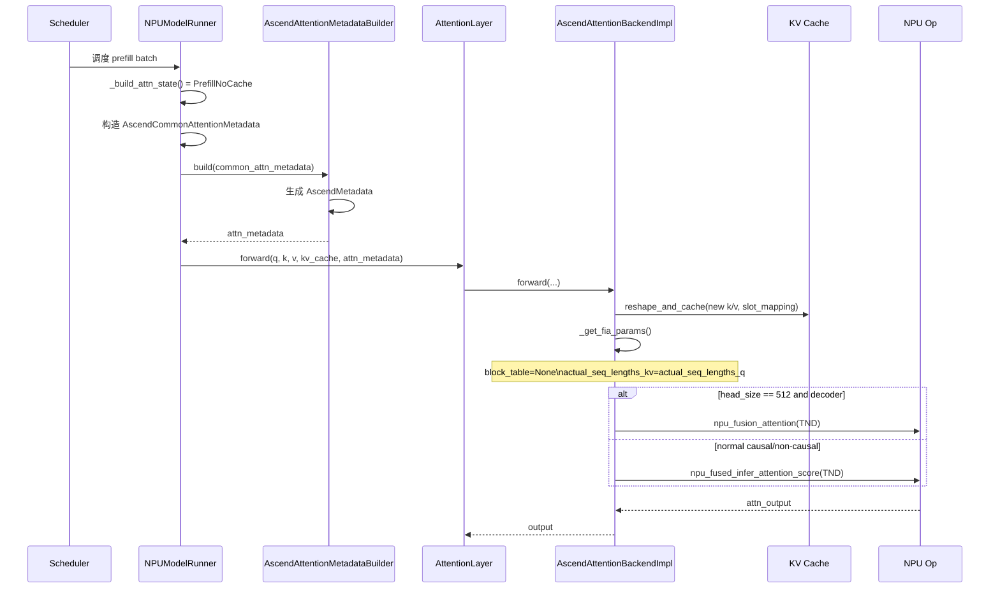
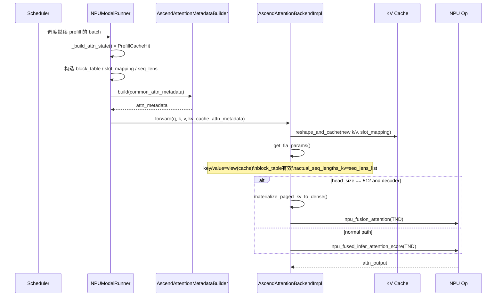
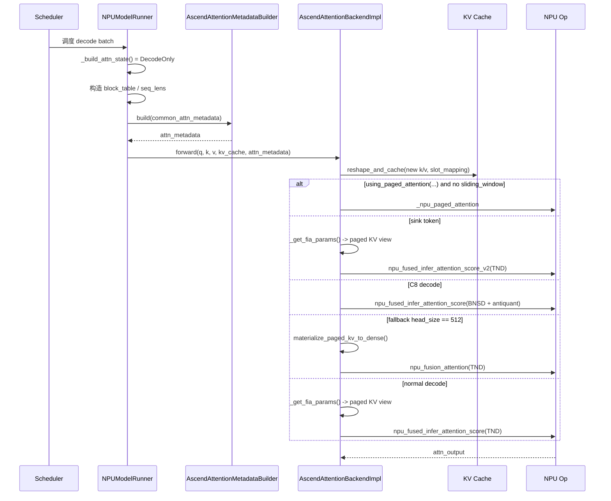
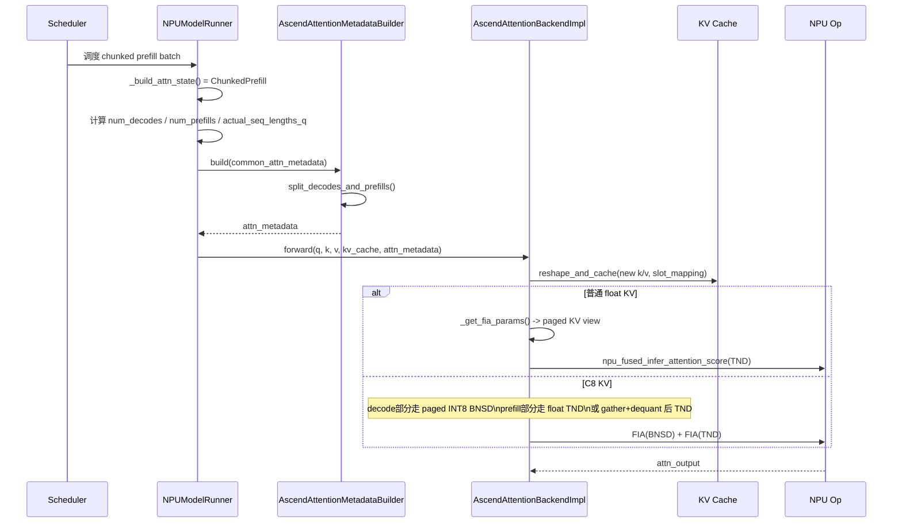
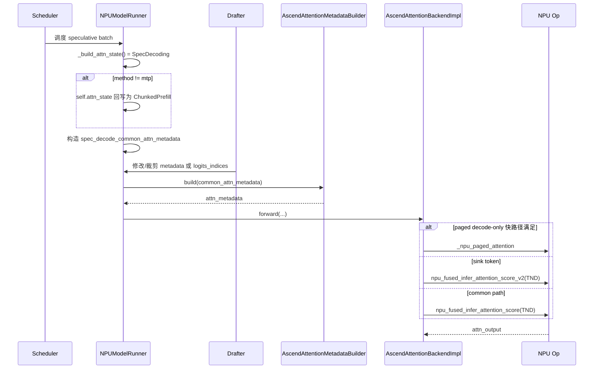

# vLLM Ascend `attention_v1.py` 适配分析

本文分析 `/home/cmq/code/vllm-ascend/vllm_ascend/attention/attention_v1.py` 的 attention 适配实现，并串联 `vllm_ascend/worker/model_runner_v1.py` 中的 metadata 构建逻辑，说明 Ascend NPU 在 vLLM v1 model runner 下是如何把通用 attention 请求映射到昇腾算子调用的。

本文覆盖以下内容：

- 后端注册与整体架构
- `model_runner_v1` 如何构造 attention metadata
- `AscendAttentionMetadataBuilder` 如何把公共 metadata 下沉到 per-layer metadata
- `AscendAttentionBackendImpl` 如何按场景分派到不同昇腾算子
- attention mask、paged KV、graph capture、共享 KV cache、KV 压缩、C8 KV 量化等特化路径
- 当前 `attention_v1.py` 已适配场景、限制与风险点

## 1. 总体结论

`attention_v1.py` 的本质不是“实现一种 attention 算法”，而是做一层 **场景归一化 + 算子分派**：

1. `NPUModelRunner` 先根据 batch 的调度状态构造 `AscendCommonAttentionMetadata`。
2. `AscendAttentionMetadataBuilder` 再将其转换为每层共享的 `AscendMetadata`。
3. `AscendAttentionBackendImpl.forward()` 根据：
   - attention 状态（prefill / decode / chunked prefill / spec）
   - causal / non-causal
   - sliding window
   - sink token
   - paged attention 是否可用
   - KV 是否共享
   - KV 是否为 C8 INT8
   - graph capture 是否开启
   选择不同的 NPU 算子与参数组织方式。

因此，`attention_v1.py` 的核心价值不在于数学公式本身，而在于：

- 把 vLLM 的 request/batch 状态映射为昇腾算子能接受的 shape/layout/metadata；
- 在不同硬件能力和模型特性下切换最合适的执行路径；
- 尽量复用 paged KV cache，而不是频繁做 dense materialization；
- 在必要场景下为算子限制做回退，例如 head dim=512 的 TND decoder 场景回退到 `npu_fusion_attention`。

## 2. 后端注册与基本数据结构

### 2.1 后端注册

`AscendAttentionBackend` 通过 `@register_backend(AttentionBackendEnum.CUSTOM, "ASCEND")` 注册为自定义 attention 后端，默认 block size 只声明支持 `128`，KV cache shape 定义为：

```python
(2, num_blocks, block_size, num_kv_heads, head_size)
```

对应源码：

- `vllm_ascend/attention/attention_v1.py:73-140`

其中：

- 维度 `0` 的 `2` 表示 K/V 两份 cache。
- `get_impl_cls()` / `get_builder_cls()` 会在启用 CP 时切到 context parallel 的实现，否则走当前文件里的默认实现。

### 2.2 attention 状态枚举

`AscendAttentionState` 一共有 5 个状态：

- `PrefillNoCache`
- `PrefillCacheHit`
- `DecodeOnly`
- `ChunkedPrefill`
- `SpecDecoding`

对应源码：

- `vllm_ascend/attention/attention_v1.py:143-148`

这 5 个状态是整个 attention 路径分派的第一层控制面。

### 2.3 per-layer metadata：`AscendMetadata`

`AscendMetadata` 是给具体 attention layer 使用的 metadata，重点字段如下：

- `attn_mask`：算子 mask
- `attn_state`：当前 attention 状态
- `num_actual_tokens`：真实 token 数，不含 padding
- `num_decode_tokens` / `num_prefills` / `num_decodes`
- `seq_lens` / `seq_lens_cpu` / `seq_lens_list`
- `actual_seq_lengths_q`：TND 布局下的 query 累积长度
- `query_start_loc`
- `block_tables`
- `slot_mapping`
- `causal`
- `model_runner_type`
- `reshape_cache_event`
- `kvcomp_metadata`

对应源码：

- `vllm_ascend/attention/attention_v1.py:151-211`

一个直接观察是：字段存在一定冗余，代码里也明确写了 TODO，希望未来统一 schema。当前设计明显是为了兼容不同后端、graph capture 和历史路径。

## 3. `model_runner_v1` 如何判断 attention 状态

### 3.1 状态机入口

`NPUModelRunner._build_attn_state()` 通过 `num_computed_tokens_cpu`、`num_scheduled_tokens`、`num_valid_tokens` 来决定 batch 当前属于哪类 attention 场景。

对应源码：

- `vllm_ascend/worker/model_runner_v1.py:1256-1285`

判定逻辑可以概括为：

1. 所有请求的 `num_computed_tokens == 0`
   - `PrefillNoCache`
2. 所有请求本轮只调度 1 个 token
   - `DecodeOnly`
   - 如果 speculative method 是 `mtp`，切到 `SpecDecoding`
3. 所有请求 `num_valid_tokens == 1`
   - 如果启用 speculative，走 `SpecDecoding`
   - 否则走 `ChunkedPrefill`
4. 如果 scheduler 启用了 chunked prefill
   - `ChunkedPrefill`
5. 其他情况
   - `PrefillCacheHit`

### 3.2 `self.attn_state` 与返回状态不完全相同

这里有一个实现细节：当状态是 `SpecDecoding` 但 speculative method 不是 `mtp` 时，`self.attn_state` 被回写为 `ChunkedPrefill`。

这意味着：

- 对外逻辑上它可能是 speculative decoding；
- 但为了兼容 PCP / Eagle3 等已有路径，后续 metadata 里保留的是更接近 chunked prefill 的执行语义。

这是一个典型的“调度语义”和“算子执行语义”不完全一致的适配点。

## 4. `model_runner_v1` 如何构造公共 metadata

### 4.1 `_build_attention_metadata()` 是总装入口

对应源码：

- `vllm_ascend/worker/model_runner_v1.py:2664-2985`

这个函数做了几件关键事情：

1. 处理 padding 后的 token / req 数
2. 如果启用 CP，构造 PCP metadata
3. 为每个 KV cache group 准备：
   - `block_table_tensor`
   - `slot_mapping`
4. 构造 `AscendCommonAttentionMetadata`
5. 遍历每个 attention group，用各自的 builder 生成 per-layer metadata

### 4.2 `block_table` 与 `slot_mapping` 的来源

`_get_block_table_and_slot_mapping()` 是 paged KV cache 的核心：

- `slot_mapping` 来自 `self.input_batch.block_table[kv_cache_gid].slot_mapping`
- `block_table_tensor` 来自 `blk_table.get_device_tensor()`
- 在 graph mode 或 padding 场景下，会显式把无效区域填成 `-1` 或 `0`
- PCP 开启后，还会重新做 padded slot mapping

对应源码：

- `vllm_ascend/worker/model_runner_v1.py:2722-2780`

这意味着 `attention_v1.py` 里大多数 attention 算子其实都不自己“决定 KV 在哪”，而是完全依赖 model runner 提前准备好的物理映射。

### 4.3 `AscendCommonAttentionMetadata` 的内容

`cm_base = AscendCommonAttentionMetadata(...)` 时传入了：

- `query_start_loc` / `query_start_loc_cpu`
- `seq_lens`
- `_seq_lens_cpu` 和 `seq_lens_cpu`
- `num_computed_tokens_cpu`
- `num_reqs`
- `num_actual_tokens`
- `max_query_len`
- `max_seq_len`
- `block_table_tensor`
- `slot_mapping`
- `causal=True`
- `num_input_tokens`
- `actual_seq_lengths_q`
- `positions`
- `attn_state`
- `decode_token_per_req`
- `prefill_context_parallel_metadata`

对应源码：

- `vllm_ascend/worker/model_runner_v1.py:2805-2834`

这里比较关键的设计点是：

- `_seq_lens_cpu` 优先保存 optimistic CPU 版本，供 NPU backend 使用，避免 runtime 再做 GPU->CPU 同步。
- `actual_seq_lengths_q` 是 TND 布局下最关键的长度元数据之一。
- `attn_state` 在这里就已经固化进 common metadata 了。

### 4.4 group 级 metadata builder 复用

一个 KV cache group 下的多个 layer 会共享一份 metadata：

- `attn_metadata_dict[layer_name] = attn_metadata_i`

对应源码：

- `vllm_ascend/worker/model_runner_v1.py:2911-2912`

这能减少重复构建，也说明 `attention_v1.py` 并不是每层都做一次复杂 host-side 推导。

## 5. `AscendCommonAttentionMetadata` 的定位

`AscendCommonAttentionMetadata` 定义在 `attention/utils.py`，是 model runner 和具体后端之间的中间层。

对应源码：

- `vllm_ascend/attention/utils.py:146-240`

这个结构解决了几个问题：

- 保留 CPU 与 NPU 双份长度信息
- 保留 TND 累积长度 `actual_seq_lengths_q`
- 传递 `attn_state`
- 传递 CP / PCP / kvcomp 相关 metadata
- 在 speculative / draft graph 等场景下支持 `unpadded()` 裁剪视图

值得注意的是 `using_paged_attention()` 也在这个文件：

- 仅 `FULL_DECODE_ONLY` graph 模式下考虑开启
- speculative 场景禁用
- A5 设备禁用
- 只有 runtime shape 命中 `pa_shape_list` 才启用

对应源码：

- `vllm_ascend/attention/utils.py:44-55`

因此 paged attention 并不是 decode 一律开启，而是一个带 shape 白名单的性能路径。

## 6. `AscendAttentionMetadataBuilder` 如何生成 per-layer metadata

### 6.1 builder 的职责

`AscendAttentionMetadataBuilder.build()` 做的事情很集中：

1. 从 common metadata 提取 `num_reqs`、`num_actual_tokens`、`query_start_loc_cpu`
2. 调用 `split_decodes_and_prefills()` 统计 decode / prefill 拆分
3. 选择 `seq_lens` 的优先来源
4. 选择 `slot_mapping`
5. 确定 `attn_state`
6. 生成 `attn_mask`
7. 将 CPU 端 `query_start_loc` 异步拷到设备侧
8. 组装为 `AscendMetadata`

对应源码：

- `vllm_ascend/attention/attention_v1.py:273-337`

### 6.2 `seq_lens` 优先用 CPU 版本

builder 明确优先级：

1. `_seq_lens_cpu`
2. `seq_lens_cpu`
3. `seq_lens.to("cpu")`

这样做的原因很直接：

- 很多后端逻辑只需要 host 侧长度信息；
- 如果用 GPU tensor 再 `to("cpu")`，会带来同步成本；
- speculative draft iteration 期间，`_seq_lens_cpu` 是最新的 authoritative host copy。

### 6.3 `actual_seq_lengths_q` 的来源

`actual_seq_lengths_q=query_start_loc_cpu[1:].tolist()`

这里体现了 TND 布局的关键假设：

- `query_start_loc` 本身是每个 request 的累积 query 偏移；
- 去掉开头的 0 后，天然就是 Ascend TND 算子所需的 cumulative q lengths。

### 6.4 attention mask 策略

这里调用的是：

```python
self.attn_mask_builder.get_attention_mask(self.model_config)
```

实际 `AttentionMaskBuilder` 的行为并不通用，而是偏“按当前后端定制”：

- `pooling` runner 返回 `2048x2048` bool causal mask
- 普通 attention 默认返回 `2048x2048` 的 splitfuse mask，dtype 是 `int8`

对应源码：

- `vllm_ascend/attention/attention_mask.py:53-79`

换句话说，`attention_v1.py` 并不是为每个 batch 动态生成任意尺寸的 mask，而是依赖一份缓存的固定大 mask，再交给算子配合 `actual_seq_lengths_*` 解释。

## 7. `attention_v1.py` 中的算子分派图

### 7.1 主分派逻辑

`AscendAttentionBackendImpl.forward_impl()` 是外层分派点：

1. 如果当前是 `DecodeOnly`
2. 并且 `using_paged_attention(num_tokens, vllm_config)` 为真
3. 并且 `sliding_window is None`
4. 则走 `_npu_paged_attention`
5. 否则走 `forward_fused_infer_attention()`

对应源码：

- `vllm_ascend/attention/attention_v1.py:1417-1424`

这说明 paged attention 目前主要是 decode-only 的优化分支，而不是统一 attention 主干。

### 7.2 当前使用到的主要昇腾算子

`attention_v1.py` 里实际涉及 4 类 attention 相关算子：

1. `torch_npu._npu_paged_attention`
2. `torch_npu.npu_fused_infer_attention_score`
3. `torch_npu.npu_fused_infer_attention_score_v2`
4. `torch_npu.npu_fusion_attention`

它们的角色大致如下：

- `_npu_paged_attention`
  - decode-only 快路径
  - 直接消费 paged KV cache
- `npu_fused_infer_attention_score`
  - 当前主力推理 attention 算子
  - 兼容 prefill / decode / chunked prefill
  - 同时支持 paged KV、sliding window、部分量化参数
- `npu_fused_infer_attention_score_v2`
  - sink token 路径专用
  - 代码里仅在 `self.sinks is not None` 时使用
- `npu_fusion_attention`
  - 作为 fallback
  - 当前用于 head dim=512 的 decoder TND 场景
  - 也用于 pooling / encoder 风格的非 cache attention

## 8. 各执行路径分析

### 8.1 `_get_fia_params()`：把状态翻译成算子参数

`_get_fia_params()` 是 `attention_v1.py` 最关键的“状态到物理视图”转换函数。

对应源码：

- `vllm_ascend/attention/attention_v1.py:991-1061`

它根据 `attn_state` 决定：

- 是否必须要求 `key_cache` 已存在
- `key` / `value` 应该来自新 token 还是来自 paged cache
- `block_table` 是否为 `None`
- `actual_seq_lengths_kv` 应该取什么

四类典型场景：

1. `PrefillNoCache`
   - 普通 decoder：`block_table=None`
   - 直接拿当前 batch 的新 K/V 做密集 attention
   - `actual_seq_lengths_kv = actual_seq_lengths_q`
2. `PrefillNoCache + shared KV`
   - 即使是 prefill，也直接从共享 cache 取 KV
   - `block_table` 有效
3. `PrefillCacheHit`
   - 从 cache view 读 paged K/V
   - `block_table` 截取到 batch 大小
4. `DecodeOnly / ChunkedPrefill`
   - 都从 paged KV cache 取 view
   - 区别主要体现在后续 `actual_seq_lengths_q` 和算子选择

这个函数本身不执行计算，但决定了“当前 attention 是 dense 还是 paged，是新 KV 还是旧 KV”。

### 8.2 普通 decode-only paged attention

当满足 paged attention 条件时，执行：

```python
torch_npu._npu_paged_attention(...)
```

对应源码：

- `vllm_ascend/attention/attention_v1.py:1310-1329`

特点：

- 不走 FIA 的 TND/BNSD 接口
- 直接消费 cache 格式的 `key_cache` / `value_cache`
- 需要 `block_table`
- 需要每个 request 的 `context_lens`

这条路径是当前 decode-only 的性能特化路径之一。

### 8.3 FIA 主路径：`npu_fused_infer_attention_score`

普通主路径在 `forward_fused_infer_attention()` 里。

对应源码：

- `vllm_ascend/attention/attention_v1.py:1186-1308`

可分为三类：

1. `non-causal`
   - `sparse_mode=0`
2. `causal + sliding_window`
   - `sparse_mode=4`
   - `pre_tokens=self.sliding_window`
   - `next_tokens=0`
3. `causal + full attention`
   - `sparse_mode=3`

这三类都统一走 `input_layout="TND"`，区别主要通过：

- `atten_mask`
- `actual_seq_lengths`
- `actual_seq_lengths_kv`
- `block_table`
- `sparse_mode`
- `pre_tokens` / `next_tokens`

来表达。

### 8.4 sink token 路径：`npu_fused_infer_attention_score_v2`

当 `self.sinks is not None` 时，切到 v2 接口：

对应源码：

- `vllm_ascend/attention/attention_v1.py:1229-1254`

实现特征：

- 仍然使用 `input_layout="TND"`
- decode-only 时强制将 `actual_seq_qlen` 改成全 1 的 cumulative 形式
- 通过 `learnable_sink=self.sinks` 启用 sink token 语义
- sliding window 仍通过 `sparse_mode=4` 表达

这说明 v2 在当前代码中并不是普遍替代 v1，而是承载了“sink token”这类额外能力。

### 8.5 head dim = 512 的 fallback：`npu_fusion_attention`

`_should_use_tnd_flash_attention_fallback()` 的条件是：

- `attn_type == DECODER`
- `head_size == 512`
- `sliding_window is None`
- `sinks is None`

对应源码：

- `vllm_ascend/attention/attention_v1.py:1093-1099`

然后回退到 `_forward_tnd_flash_attention_fallback()`：

- 如果 KV 仍是 paged 形式，先 `materialize_paged_kv_to_dense()`
- 再调用 `torch_npu.npu_fusion_attention(...)`

对应源码：

- `vllm_ascend/attention/attention_v1.py:1130-1184`

代码注释写得很直接：Gemma4 这类 full-attention layer 在 RoPE 已经折叠进 q/k 且 `D=512` 时，FIA V1 TND 路径不满足要求，因此回退。

这是当前文件里最明确的“为具体模型缺陷做算子回退”的适配点。

### 8.6 pooling / encoder 风格 attention

对于 `model_runner_type == "pooling"` 且 `not causal` 的分支，调用 `_forward_encoder_attention()`：

- 使用 `npu_fusion_attention`
- `input_layout="TND"`
- 不依赖 KV cache

对应源码：

- `vllm_ascend/attention/attention_v1.py:1332-1343`
- `vllm_ascend/attention/attention_v1.py:1479-1484`

所以 `attention_v1.py` 并不只服务 decoder 自回归模型，也兼容 pooling / encoder 风格场景。

## 9. KV cache 写入与 shared KV 适配

### 9.1 `reshape_and_cache()` 是写 cache 的入口

正常情况下，新的 K/V 会通过：

```python
DeviceOperator.reshape_and_cache(...)
```

写入 paged KV cache。

对应源码：

- `vllm_ascend/attention/attention_v1.py:1381-1415`

它会根据：

- 是否 encoder-decoder
- `num_actual_tokens`
- `slot_mapping`

来决定写入哪些 token。

### 9.2 shared KV cache 的特殊处理

如果 `self.uses_shared_kv_cache`，则：

- `reshape_and_cache()` 直接返回，不重复写 KV
- `_get_fia_params()` 在 `PrefillNoCache` 场景也允许直接从共享 cache 读 KV

对应源码：

- `vllm_ascend/attention/attention_v1.py:411-414`
- `vllm_ascend/attention/attention_v1.py:1011-1023`
- `vllm_ascend/attention/attention_v1.py:1389-1394`

这是为了支持 KV sharing / fast prefill 等上层能力。

## 10. graph capture / full graph 适配

### 10.1 build 阶段支持

`AscendAttentionMetadataBuilder.build_for_graph_capture()` 只支持：

- `DecodeOnly`
- `ChunkedPrefill`
- `SpecDecoding`

对应源码：

- `vllm_ascend/attention/attention_v1.py:339-359`

这说明 graph capture 下的 dummy metadata 并没有覆盖所有状态。

### 10.2 执行阶段支持

`attention_v1.py` 对 graph capture 做了三组专门逻辑：

1. `full_graph_fia()`
2. `full_graph_fia_v2()`
3. `full_graph_pa()`

以及统一的 `update_graph_params()`。

对应源码：

- `vllm_ascend/attention/attention_v1.py:418-688`
- `vllm_ascend/attention/attention_v1.py:700-985`

这些逻辑做的事包括：

- 提前获取 workspace
- 缓存 `attn_params`
- 用 `torch.npu.graph_task_group_begin/end()` 捕获
- replay/update 时只更新变动参数

### 10.3 图模式下的执行路径差异

图模式下：

- sink 路径会走 `full_graph_fia_v2`
- 非 sink 路径会走 `full_graph_fia`
- paged decode-only 会走 `full_graph_pa`

这与 eager 路径是并行实现，而不是统一共用一个函数。

## 11. Hamming sparse / KV compression 适配

`attention_v1.py` 还插入了 `kvcomp_metadata` 相关逻辑：

- prefill / chunked prefill 时，先 `reshape_and_cache_kvcomp(...)`
- decode-only 时，先 `get_kvcomp_decode_params(...)` 重写 `block_table` 和 `actual_seq_lengths_kv`

对应源码：

- `vllm_ascend/attention/attention_v1.py:699-706`
- `vllm_ascend/attention/attention_v1.py:1139-1146`
- `vllm_ascend/attention/attention_v1.py:1213-1218`

含义是：

- attention 算子本身没有“知道哈希稀疏”；
- 上层先把 KV compression 的选择结果改写成新的 block table / seq lens；
- attention 内核仍按普通 paged attention 去执行。

这是一个很典型的“把稀疏选择下沉为 metadata 改写”的工程做法。

## 12. C8 KV 量化路径分析

### 12.1 基本策略

`AscendC8AttentionBackendImpl` 是 `AscendAttentionBackendImpl` 的量化特化子类。

对应源码：

- `vllm_ascend/attention/attention_v1.py:1495-1870`

它的核心策略是：

1. 新写入 cache 的 K/V 先量化成 INT8
2. decode-only 尽量直接用 paged INT8 KV + antiquant 参数让 FIA/BNSD 算
3. prefill / prefill cache hit 场景：
   - 如果是新 token，尽量保留 float KV 做当前轮计算
   - 如果必须从 paged cache 读，则 gather 后 dequant 到 dense，再走 TND

### 12.2 量化参数准备

`_prepare_c8_scales()` 会：

- 对 TP rank 做 shard
- 生成 `(1, num_kv_heads, 1, head_size)` 的 antiquant tensor
- 缓存 `inv_scale`

对应源码：

- `vllm_ascend/attention/attention_v1.py:1590-1625`

### 12.3 decode-only INT8 快路径

`_forward_c8_decode()`：

- 直接把 paged INT8 KV view 成 `(num_block, block_size, hidden)`
- `query[:batch_size].unsqueeze(2)` 形成 BNSD
- 调用 `npu_fused_infer_attention_score`
- 通过 `key_antiquant_scale` / `offset` 和 `value_antiquant_*` 做 per-channel antiquant

对应源码：

- `vllm_ascend/attention/attention_v1.py:1683-1718`

这条路径避免了先把整个 paged cache gather 成 dense float。

### 12.4 chunked prefill 混合路径

`_forward_c8_chunked_prefill()` 非常有代表性，因为它把一个 batch 拆成两段：

1. decode 部分
   - 直接走 paged INT8 BNSD
2. prefill 部分
   - 若全是新 token 且 `float_key/float_value` 可用，直接用 float KV
   - 否则从 paged INT8 KV gather + dequant，再走 TND

对应源码：

- `vllm_ascend/attention/attention_v1.py:1720-1818`

这是当前文件里最复杂的“单 batch 内同时兼容 decode 与 prefill”的适配。

### 12.5 prefill cache hit 场景

`_forward_c8_fused_infer_attention()`：

- `PrefillNoCache` 直接用 float KV
- `PrefillCacheHit` 则从 paged INT8 KV gather + dequant 到 dense
- 最终仍调用 `npu_fused_infer_attention_score` 的 TND 路径

对应源码：

- `vllm_ascend/attention/attention_v1.py:1820-1870`

这说明 C8 量化真正最理想的场景还是 decode；prefill 只是尽量兼容，不一定是最优性能形态。

## 13. attention mask 分析

`AttentionMaskBuilder` 的实现反映出当前 attention_v1 的 mask 设计并不是“一般化”方案，而是强绑定当前算子约束。

对应源码：

- `vllm_ascend/attention/attention_mask.py:22-85`

主要有三种 mask：

1. 通用三角 mask
   - `_generate_attn_mask()`
2. splitfuse mask
   - 固定 `2048 x 2048`
   - 上三角 `int8`
3. MLA 专用 mask
   - 固定 `512 x 512`

在 `attention_v1.py` 主路径里，普通 decoder attention 默认拿的是 `get_splitfuse_attn_mask()`。

这里可以看出几个工程假设：

- mask 尺寸常量化，减少重复构造；
- 真实有效长度由 `actual_seq_lengths_*` 补充；
- 对算子来说，mask 主要是“模板”，不是 batch 级动态结构。

## 14. 算子接口分析

下面的算子分析以昇腾社区公开文档为准，并结合当前代码的实际用法。

### 14.1 `torch_npu.npu_fused_infer_attention_score`

昇腾文档说明该接口同时覆盖：

- PromptFlashAttention
- IncreFlashAttention

并在 `Q_S == 1` 时进入增量分支，其余进入全量分支。7.3.0 文档里也给出了：

- `block_table` 用于 page attention 的 KV block 映射
- `input_layout="TND"` 时，`actual_seq_lengths` 必须传入且是累积长度

结合代码可得出：

- `attention_v1.py` 的 `actual_seq_lengths_q = query_start_loc_cpu[1:]` 正是在适配这个 TND 累积长度要求；
- `block_table=None` 表示 dense KV；
- `block_table!=None` 表示 paged KV；
- `sparse_mode=3/4/0` 分别对应 causal / sliding window / non-causal 语义。

文档版本参考：

- Ascend Extension for PyTorch 7.3.0
- 7.1.0 文档还额外写明了推理限制，例如 `N <= 256`、`D <= 512`

### 14.2 `torch_npu.npu_fused_infer_attention_score_v2`

昇腾 7.3.0 文档说明：

- 仍覆盖增量和全量推理场景
- 在不涉及 system prefix、左 padding、KV 量化参数合一、pertensor 全量化时，推荐使用 v2
- 新增 `learnable_sink`

结合本代码：

- v2 目前只在 `self.sinks is not None` 的场景使用；
- 即代码把 v2 当成“支持 sink token 的 FIA 变体”，而不是无条件替代 v1。

### 14.3 `torch_npu._npu_paged_attention`

昇腾公开文档中这个接口不如 FIA 那样公开详细，但从当前代码和 `ascend_config.py` 的注释可以判断：

- 它仍然是 decode-only 的重要性能路径；
- 适合直接读取 paged KV cache；
- 当前代码仅在 `FULL_DECODE_ONLY` + shape 命中白名单时启用。

这说明在 vLLM-Ascend 当前实现里，paged attention 并未被 FIA 完全取代。

### 14.4 `torch_npu.npu_fusion_attention`

公开文档更偏训练场景，但当前代码把它用于两类 fallback：

1. pooling / encoder 风格 attention
2. decoder TND head dim=512 的回退路径

因此在本项目里它不是主路径，而是“弥补 FIA 约束”的备用算子。

## 15. 算法层面分析

从算法表达上看，`attention_v1.py` 没有修改标准 attention 公式，适配主要发生在 **数据布局、长度表达、KV cache 物理形态、以及增量/全量统一接口** 这四层。

### 15.1 数据布局

核心布局有两类：

1. `TND`
   - 主力布局
   - 适合 varlen / prefill / chunked prefill / sink
   - 依赖 cumulative `actual_seq_lengths`
2. `BNSD`
   - 主要用于 C8 decode-only
   - 适合 query 长度为 1 的增量场景
   - 直接配合 paged INT8 KV + antiquant 参数

### 15.2 长度表达

Ascend 算子特别依赖长度元数据：

- `actual_seq_lengths_q`：query 的累积长度
- `actual_seq_lengths_kv`：KV 长度
- `seq_lens_list`：host 侧 list 形式

这套长度系统是当前适配的真正关键。大量代码的存在都是为了让这些长度在：

- prefill
- decode
- chunked prefill
- graph capture
- CP / PCP
- speculative decode

下保持一致。

### 15.3 paged KV 与 dense KV 的统一

当前实现试图把两种 KV 形态都统一到同一套 API：

- paged KV：通过 `block_table` + cache view
- dense KV：通过 `block_table=None`

这就是 `_get_fia_params()` 存在的核心原因。

### 15.4 chunked prefill 的本质

chunked prefill 不是单独一种算子，而是：

- 同一 batch 内同时存在 decode token 和 prefill token；
- 对普通路径，它们共用 FIA TND 接口；
- 对 C8 路径，decode 部分和 prefill 部分甚至可以走不同 layout 与不同 KV 来源。

因此 chunked prefill 适配的关键不是数学公式，而是“混合 batch 的拆分与重组”。

## 16. 当前 `attention_v1.py` 已适配的场景

按代码行为归纳，当前文件已经覆盖：

1. 标准 decoder causal attention
   - prefill
   - prefill cache hit
   - decode-only
2. chunked prefill / splitfuse
3. speculative decoding 相关兼容
4. pooling / encoder 风格 non-causal attention
5. sliding-window attention
6. sink token attention
7. paged KV cache
8. shared KV cache
9. graph capture / full graph replay
10. KV compression / hamming sparse 的 metadata 改写接入
11. C8 INT8 KV cache 路径
12. context parallel 的后端切换入口
13. head dim=512 特定模型 fallback

## 17. 五种状态的时序图

下面的时序图只描述 `attention_v1.py` 主链，不展开 CP/MLA/SFA 等其他后端。

### 17.1 `PrefillNoCache`

典型语义：请求第一次 prefill，历史 KV 还没有落到 paged cache 中，当前轮 attention 主要消费“本轮新生成的 K/V”。



### 17.2 `PrefillCacheHit`

典型语义：prefill 不是首次执行，历史上下文已经部分或全部落入 paged cache，本轮 attention 需要读取 cache 中的旧 KV。



### 17.3 `DecodeOnly`

典型语义：每个请求本轮只解 1 个 token，优先考虑 paged KV 的 decode-only 快路径。



### 17.4 `ChunkedPrefill`

典型语义：一个 batch 内同时存在 decode token 和 prefill token，或者 scheduler 开启 splitfuse/chunked prefill，需要把混合 batch 映射到统一 attention 接口。



### 17.5 `SpecDecoding`

典型语义：speculative decoding 场景；在当前实现里，调度态和执行态并不完全等价，部分方法最终仍复用 chunked prefill 语义。



### 17.6 状态机观察

从这五张图可以看到：

- `PrefillNoCache` 与 `PrefillCacheHit` 的本质差别在于 KV 来源是否需要经过 paged cache。
- `DecodeOnly` 的核心优化点是 `_npu_paged_attention` 和 C8/BNSD。
- `ChunkedPrefill` 的核心难点不是算子不同，而是一个 batch 中 decode 与 prefill 的混合表达。
- `SpecDecoding` 在当前实现中更多是“上层调度语义”，底层经常复用 `ChunkedPrefill` 或 `DecodeOnly` 的执行路径。

## 18. 算子分派表

### 18.1 主路径分派表

| 状态 | KV 来源 | 典型 layout | 主算子 | 关键条件 | 关键 metadata |
| --- | --- | --- | --- | --- | --- |
| `PrefillNoCache` | 当前轮新 K/V | `TND` | `npu_fused_infer_attention_score` | 普通 decoder/pooling 之外的主路径 | `actual_seq_lengths_q`、`block_table=None` |
| `PrefillNoCache` | 共享 KV cache | `TND` | `npu_fused_infer_attention_score` | `uses_shared_kv_cache=True` | `block_table`、`seq_lens_list` |
| `PrefillCacheHit` | paged KV cache | `TND` | `npu_fused_infer_attention_score` | 历史 KV 已经在 cache 中 | `block_tables`、`seq_lens_list` |
| `DecodeOnly` | paged KV cache | paged native | `_npu_paged_attention` | `using_paged_attention()` 且无 SWA | `block_tables`、`seq_lens` |
| `DecodeOnly` | paged KV cache | `TND` | `npu_fused_infer_attention_score` | 普通 decode | `actual_seq_lengths_q`、`seq_lens_list` |
| `DecodeOnly` | paged KV cache | `TND` | `npu_fused_infer_attention_score_v2` | `self.sinks is not None` | `learnable_sink`、`actual_seq_qlen` |
| `ChunkedPrefill` | paged KV cache | `TND` | `npu_fused_infer_attention_score` | float KV 主路径 | `num_decodes`、`num_prefills`、`actual_seq_lengths_q` |
| `SpecDecoding` | paged KV cache / 新 K/V | `TND` | `npu_fused_infer_attention_score` | 通常复用 `ChunkedPrefill` 语义 | `spec_decode_common_attn_metadata` |
| `pooling` non-causal | 当前轮新 K/V | `TND` | `npu_fusion_attention` | `model_runner_type == "pooling"` 且 `causal=False` | `actual_seq_lengths_q` |

### 18.2 特化分派表

| 特性 | 适用状态 | 算子/路径 | 备注 |
| --- | --- | --- | --- |
| Sliding Window | `DecodeOnly` / `Prefill*` / `ChunkedPrefill` | `npu_fused_infer_attention_score` | `sparse_mode=4`，`pre_tokens=sliding_window` |
| Sink Token | `DecodeOnly` / `ChunkedPrefill` / `SpecDecoding` | `npu_fused_infer_attention_score_v2` | 当前代码只在 `self.sinks is not None` 时启用 |
| head dim = 512 fallback | `PrefillNoCache` / `PrefillCacheHit` / `DecodeOnly` / `ChunkedPrefill` | `npu_fusion_attention` | decoder、无 SWA、无 sink 时回退 |
| Graph Capture | `DecodeOnly` / `ChunkedPrefill` / `SpecDecoding` | `full_graph_fia` / `full_graph_fia_v2` / `full_graph_pa` | builder 仅显式支持这几类 dummy metadata |
| Shared KV Cache | `PrefillNoCache` 等 | `_get_fia_params()` 特化 | 不重复写 cache，可直接消费共享 cache |
| KV Compression / Hamming Sparse | decode / 非 decode | metadata 改写后继续走 FIA | 本质是重写 `block_table` / `seq_lens` |

### 18.3 C8 KV 分派表

| 状态 | KV 物理形态 | layout | 主算子 | 说明 |
| --- | --- | --- | --- | --- |
| `DecodeOnly` | paged INT8 KV | `BNSD` | `npu_fused_infer_attention_score` | 直接带 antiquant 参数，避免 gather+dequant |
| `ChunkedPrefill` 的 decode 部分 | paged INT8 KV | `BNSD` | `npu_fused_infer_attention_score` | 只处理 decode 子段 |
| `ChunkedPrefill` 的 prefill 部分 | float KV 或 gather+dequant 后 dense KV | `TND` | `npu_fused_infer_attention_score` | 混合批次分段处理 |
| `PrefillNoCache` | 当前轮 float KV | `TND` | `npu_fused_infer_attention_score` | 当前轮计算可以直接用 float KV |
| `PrefillCacheHit` | paged INT8 KV -> dense float KV | `TND` | `npu_fused_infer_attention_score` | 先 gather+dequant 再算 |

### 18.4 状态到关键参数组织方式

| 状态 | `block_table` | `actual_seq_lengths_q` | `actual_seq_lengths_kv` | `query/key/value` 来源 |
| --- | --- | --- | --- | --- |
| `PrefillNoCache` | `None` 或 shared KV 的 block table | 来自 `query_start_loc_cpu[1:]` | 普通场景等于 `actual_seq_lengths_q` | `q/k/v` 来自当前轮；shared KV 例外 |
| `PrefillCacheHit` | 有效 | 来自 `query_start_loc_cpu[1:]` | `seq_lens_list` | `q` 当前轮，`k/v` 主要来自 paged cache |
| `DecodeOnly` | 有效 | 通常是全 1 累积形式或单 token 累积形式 | `seq_lens_list` | `q` 当前轮，`k/v` 来自 paged cache |
| `ChunkedPrefill` | 有效 | 混合 decode+prefill 的累积长度 | `seq_lens_list` | 当前轮 `q` + paged `k/v` |
| `SpecDecoding` | 有效 | 取决于 drafter 修改后的 metadata | 取决于 drafter/执行态 | 经常复用 chunked prefill 组织方式 |

## 19. 当前实现中的限制与风险点

### 19.1 metadata 字段冗余较多

`AscendMetadata` 和 `AscendCommonAttentionMetadata` 里存在多组语义重叠字段，例如：

- `seq_lens`
- `seq_lens_cpu`
- `seq_lens_list`
- `actual_seq_lengths_q`
- `query_start_loc`

这增加了维护成本，也让不同路径更容易出现“某一份长度更新了，另一份没更新”的问题。

### 19.2 builder 里仍有不必要的 H2D

`query_start_loc_cpu.pin_memory().to(self.device, non_blocking=True)` 上方已经有 TODO，说明作者也认为这一步不够理想。

对应源码：

- `vllm_ascend/attention/attention_v1.py:315-316`

### 19.3 attention mask 偏常量模板化

当前 decoder 默认拿固定 `2048x2048` splitfuse mask，这对算子是够用的，但从抽象层看不够通用，也容易让外部读代码的人误以为支持范围是通用动态 mask。

### 19.4 `SpecDecoding` 与 `ChunkedPrefill` 存在语义折叠

`model_runner_v1` 中会把一部分 speculative 状态回落到 `self.attn_state = ChunkedPrefill`，这对兼容旧路径有用，但会让状态语义变得不纯粹。

### 19.5 paged attention 的启用条件很苛刻

当前并不是所有 decode-only 都走 `_npu_paged_attention`，而是受：

- speculative 禁用
- A5 禁用
- `FULL_DECODE_ONLY`
- runtime shape 白名单

共同约束。

这表示 paged attention 更像一个专项优化，而不是统一 decode 主路径。

### 19.6 C8 路径对 prefill 仍有 dense 回退

C8 decode-only 很直接，但在 prefill cache hit / chunked prefill 的一部分分支里，仍需要：

- gather paged INT8 KV
- dequant 成 dense float

这会带来额外开销，也说明当前 C8 路径最优化的还是 decode。

## 20. 与 `fa3_v1.py` / `mla_v1.py` / `sfa_v1.py` 的关系

虽然本文重点是 `attention_v1.py`，但从整体设计上看：

- `attention_v1.py`
  - 面向普通 decoder/self-attention 的主路径
  - 以 FIA/paged attention 为核心
- `fa3_v1.py`
  - 直接复用 `AscendAttentionMetadataBuilder`
  - 执行层改为 `flash_attn_npu_v3.flash_attn_with_kvcache`
  - 不支持 sliding window，也不支持 FULL_DECODE_ONLY ACL graph
- `mla_v1.py`
  - 面向 MLA attention
  - metadata 和执行路径都明显更复杂
- `sfa_v1.py`
  - 面向 SFA/MLACommon 体系

这说明 `attention_v1.py` 的 metadata 形态事实上已经成为若干后端共享的基础接口之一。

## 21. 对后续开发的建议

如果后续要继续扩展 `attention_v1.py`，优先建议关注下面几件事：

1. 统一 metadata schema
   - 减少 `seq_lens*`、`actual_seq_lengths_q`、`query_start_loc` 的重复表达
2. 明确状态语义
   - 把“调度状态”和“算子执行状态”拆开，避免 `SpecDecoding -> ChunkedPrefill` 这类语义折叠继续扩散
3. 继续收敛 paged / dense / C8 的分派
   - 现在很多逻辑分散在 `_get_fia_params()`、`forward_fused_infer_attention()` 和 C8 特化分支
4. 降低 host-device 长度同步开销
   - 尤其是 builder 内的 `query_start_loc` H2D
5. 明确哪些能力依赖特定算子版本
   - 例如 sink token 依赖 FIA v2，head dim=512 依赖 fallback

## 22. 参考链接

源码：

- [`vllm_ascend/attention/attention_v1.py`](/home/cmq/code/vllm-ascend/vllm_ascend/attention/attention_v1.py)
- [`vllm_ascend/worker/model_runner_v1.py`](/home/cmq/code/vllm-ascend/vllm_ascend/worker/model_runner_v1.py)
- [`vllm_ascend/attention/attention_mask.py`](/home/cmq/code/vllm-ascend/vllm_ascend/attention/attention_mask.py)
- [`vllm_ascend/attention/utils.py`](/home/cmq/code/vllm-ascend/vllm_ascend/attention/utils.py)
- [`vllm_ascend/attention/fa3_v1.py`](/home/cmq/code/vllm-ascend/vllm_ascend/attention/fa3_v1.py)
- [`vllm_ascend/attention/mla_v1.py`](/home/cmq/code/vllm-ascend/vllm_ascend/attention/mla_v1.py)

昇腾公开文档：

- `torch_npu.npu_fused_infer_attention_score` 7.3.0
  - https://www.hiascend.com/document/detail/zh/Pytorch/730/apiref/torchnpuCustomsapi/docs/context/torch_npu-npu_fused_infer_attention_score.md
- `torch_npu.npu_fused_infer_attention_score_v2` 7.3.0
  - https://www.hiascend.com/document/detail/zh/Pytorch/730/apiref/torchnpuCustomsapi/docs/context/torch_npu-npu_fused_infer_attention_score_v2.md
- `torch_npu.npu_fused_infer_attention_score` 7.1.0
  - https://www.hiascend.com/document/detail/zh/Pytorch/710/apiref/torchnpuCustomsapi/context/torch_npu-npu_fused_infer_attention_score.md
- `torch_npu.npu_fusion_attention` 7.1.0
  - https://www.hiascend.com/document/detail/zh/Pytorch/710/apiref/torchnpuCustomsapi/context/torch_npu-npu_fusion_attention.md
