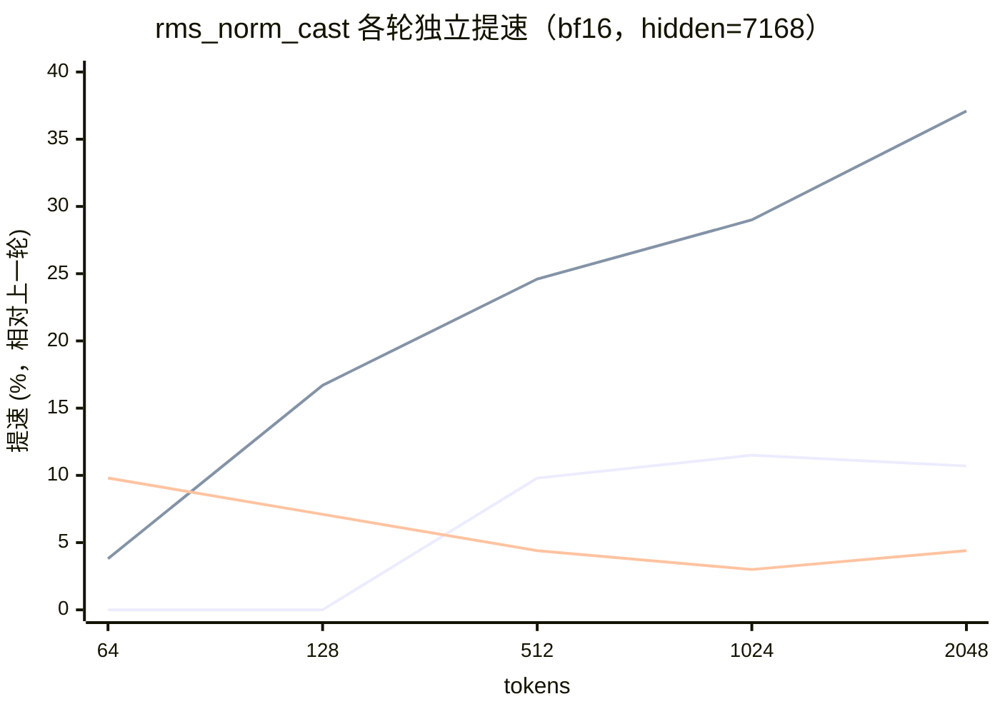
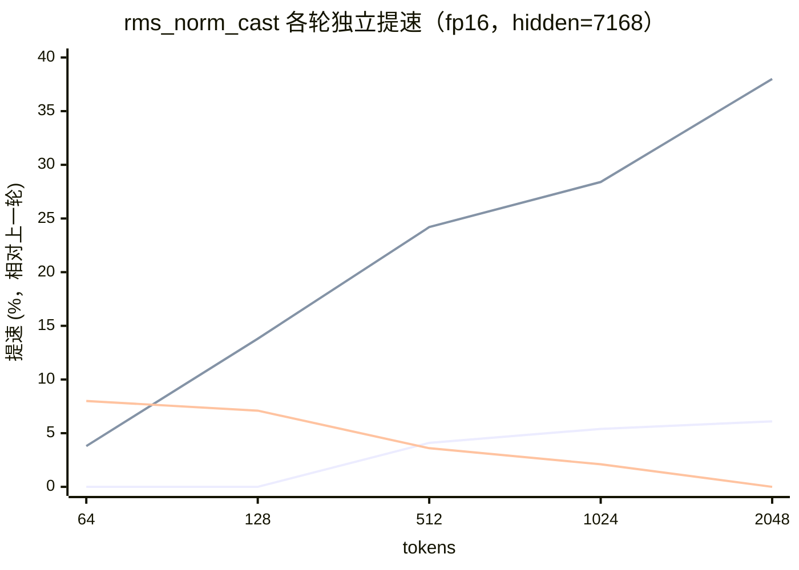
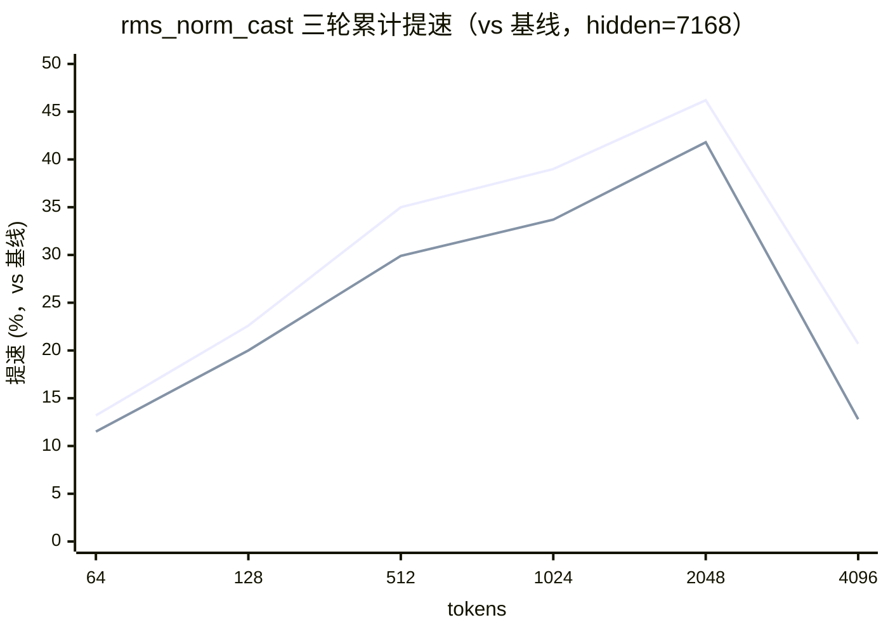
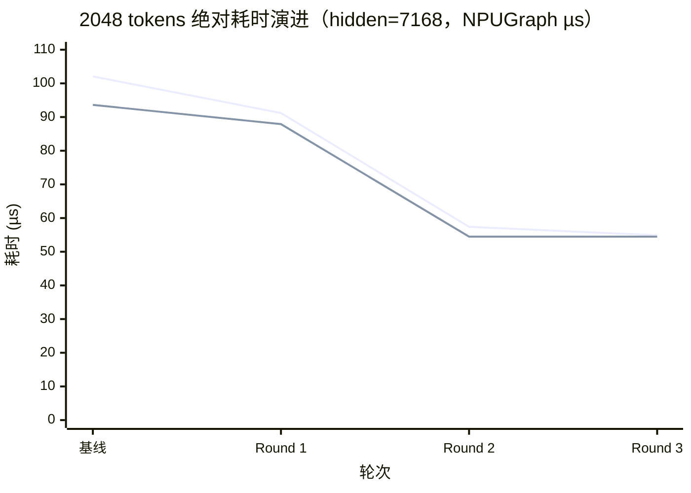

# rms_norm_cast 算子优化总结（910B）

## 1. 算子背景

**是什么**：`torch.ops._C_ascend.npu_rms_norm_cast` 是自研融合算子，一次 kernel
调用同时产出两份输出：

- 低精度 `y`（bf16/fp16）：RMSNorm 结果
- 宽化 `y_fp32`（fp32）：**已舍入 y 的精确宽化**

**为什么存在**：DeepSeek v4/v41 的 MoE 路由（HashTopK）同时需要这两份输出。不融合
时的现有做法是 `torch_npu.npu_rms_norm` + `y.float()` 两个算子串联，中间多一次 y
的读写（多 ~20% 数据搬运量）。融合后理论应始终更快。

**数值契约（不可破坏）**：`y_fp32` 必须是**已舍入到低精度后再宽化**的值，即
`y_fp32 == y.float()` 逐位相等——HashTopK 因此看到的数值与 unfused 路径完全一致。
这决定了输出侧两次 Cast（RINT + widen）不可合并。

**优化前的问题**：≥512 tokens 时 fused 反而比 unfused 慢（2048×7168 bf16：
102.1 vs 77.4µs）——搬运量少 20% 却更慢，说明 kernel 计算结构存在明确优化空间，
这正是本次优化的目标。

## 2. 优化环境与测量口径

| 项 | 值 |
|---|---|
| 硬件 | Ascend 910B3（dav_c220 向量核，40 AIV/Device，UB 192KB/核） |
| CANN | 9.1.0，驱动 npu-smi 25.5.1 |
| 被测 shape | hidden=7168，tokens 1~4096 |
| 记分板口径 | NPUGraph replay（`benchmarks/rms_norm_cast.py`）|
| pipe 归因口径 | `msprof op --aic-metrics=PipeUtilization` |
| 精度门槛 | `test_rms_norm_cast.py`（8 用例）+ `test_rms_norm_cast_coverage.py`（25 用例） |

**基线 profile（2048×7168 bf16，未优化）**：kernel 103.0µs，其中 vec 管线占
65.6%——**vec 是瓶颈**；每行 11 遍 vec pass；行间 MTE2→V→MTE3 完全串行，
vec 空转 ~31µs。

## 3. 优化总览

| 轮次 | 核心思路 | 2048 bf16 耗时 | 累计提速（vs 基线） |
|---|---|---|---|
| 基线 | — | 102.1µs | — |
| Round 1 | 减 2 遍冗余 vec pass | 91.2µs | 10.7% |
| Round 2 | 行间双缓冲流水 + rstd 向量广播 | 57.4µs | 43.8% |
| Round 3 | 序言去关键路径 + 常量外提 | ~54.9µs | **46.2%** |

每轮独立提交、独立可验证；精度门槛全程 33/33 通过，数值相对基线位级一致
（rstd 计算路径不变，仅消除冗余与串行）。

## 4. Round 1：减两遍冗余 vec pass（纯减计算量）

**为什么**：基线 pass 清单（bf16 每行 11 遍）里有两遍冗余：

1. reduce 之前的全向量 `Muls(work, 1/N, num_col)`——均值缩放可以移到 reduce
   之后对 1 个标量做（数学等价：sum(x²)/N == sum(x²)·(1/N)）；
2. bf16 路径每行重复 `Cast(gamma→fp32)`——gamma 每核不变，可以每核转换一次。

**怎么做**：

- inv 折叠：删除全向量 Muls，reduce 后对 1 元素做 `Muls(work, work, inv, 1)`；
- gamma 预转换：新增 `gamma_fp32_buf_`，每核 Cast 一次，行循环直接用；
  tiling `BYTES_PER_COLUMN` 12→16B/col（UB 预算同步调整）。

**结果**：2048 bf16 -10.7%（102.1→91.2µs），fp16 -6.1%；vec busy 59.5→48.9µs
（恰好 2 遍 pass）；小 shape 无回退。精度 8/8。

**遗留**：vec 占比 61%，但绝对空转扩大到 ~31µs——行间串行成为下一轮目标。

## 5. Round 2：行间双缓冲流水 + rstd 向量广播（核心轮）

**为什么**：R1 后的 profile 显示瓶颈从"vec 计算量"转为"行间串行"：

- 每行 MTE2(载入)→V(计算)→MTE3(落盘) 完全串行，vec 等搬运；
- 每行一次 V_S/GetValue/S_V 标量往返取 rstd——**唯一会阻塞发射线程的等待**
  （wait 挂在标量 pipe 上），每行停等。

**怎么做**：

- **乒乓流水**：x[2] / x_fp32[2] 双槽，行 i 处理期间 MTE2 预取行 i+1、MTE3
  异步落盘行 i；y 复用 x 槽（MTE3 不上 V 关键路径）。所有事件用四件套，
  MTE3_V 方向隔 2 行消费故持双 ID；
- **rstd 向量广播**（消除标量往返）：`Gather` 把 work[0] 复制成 8 份（32B 块），
  再用 `src1BlkStride=0, src1RepStride=0` 的 `Mul` 做块广播——rstd 全程留在
  UB，数值与 Muls 标量路径**位级一致**，发射线程从此不再中途停等；
- tiling 按 dtype 分档（bf16 22 / fp16 18 B/col），y 复用 x 槽比原方案再省 2B/col。

**过程中的三个 bug（均已修复，教训沉淀）**：序言槽位奇偶错位（NaN）、
FetchEventID 连续取同一 ID（死锁）、**退出标志未清零毒化同核下一个 kernel**
（本 kernel 正常完成但后续算子挂死）——修复方式是让每个 SetFlag 的发射条件与
消费条件严格一致（`i+2 < local_rows`），退出时零悬挂标志。

**结果**：2048 bf16 **91.2→57.4µs（-37.1%）**、fp16 -38.0%；512~1024 档
-24~-29%；**vec 占比 61%→91%**，MTE2/MTE3 时间不变但全部移出关键路径；
msprof task 103→53.7µs。精度 8/8。

**流水前后的 pipe 级对比**（2048×7168 bf16，单核实测）——流水是否生效最直观的
证据是**并行度 = 三条 pipe 忙碌时间之和 ÷ 墙钟**：串行时接近 1.0，重叠流水后
>1.0：

| 指标 | Round 1（流水前） | Round 2（流水后） |
|---|---|---|
| 墙钟时长 | 80.1µs | 51.3µs |
| vec（计算）忙碌 | 48.9µs（61.0%） | 46.7µs（90.9%） |
| MTE2（载入）忙碌 | 9.9µs（12.4%） | 20.5µs（39.9%） |
| MTE3（落盘）忙碌 | 17.3µs（21.6%） | 17.4µs（33.8%） |
| **三线忙碌之和 / 并行度** | 76.1µs / **0.95** | 84.6µs / **1.65** |

```mermaid
xychart-beta
    title "流水前后各 pipe 忙碌时间（2048×7168 bf16，单核 µs）"
    x-axis "pipe" ["vec 计算", "MTE2 载入", "MTE3 落盘", "三线忙碌总和"]
    y-axis "忙碌时间 (µs)" 0 --> 90
    bar "Round 1（流水前）" [48.9, 9.9, 17.3, 76.1]
    bar "Round 2（流水后）" [46.7, 20.5, 17.4, 84.6]
```

读法：vec 的计算量几乎不变（46.7 ≈ 48.9µs，算法没变），但墙钟从 80.1 降到
51.3µs——省掉的全部是串行等待；三线忙碌之和从 ≈ 墙钟（0.95，近乎完全串行）升到
墙钟的 1.65 倍，即载入/计算/落盘三线大部分时间在重叠执行。MTE2 忙碌上升是流水
的代价与特征：它开始执行跨 pipe 的同步指令（wait/set flag），但 40% ≪ vec 91%，
仍在关键路径之外。

（数据口径：R1 为 torch_npu.profiler、R2 为 msprof op PipeUtilization 40 核均值，
各自内部自洽；墙钟另以 NPUGraph 同口径复核为 91.2→57.4µs，-37.1%。）

## 6. Round 3：序言去关键路径 + 常量外提

**为什么**：c220 无点积类 reduce（仅 Sum/Max）——平方+求和两遍无法融合，
**pass 数已到算法层下限**（bf16 的 7 个全宽 pass 全部承载语义）。剩余优化空间
只剩启动斜坡与每行固定开销。

**怎么做**：

- x 行 0 的载入先上 MTE2（首位），gamma 次之；gamma 的等待（及 bf16 的宽化
  Cast）推迟到行 0 链中第一次 gamma 乘法前——装载完全藏在行 0 的 reduce 后面，
  每核省 ~0.15µs 启动串行（少行数/核的 shape 占比更高）；
- 行不变常量 1.0f 外提到每核一次（原每行 `Duplicate`），每行省 1 op + 1 barrier。

**结果**：64~1024 tokens 稳定 **-4~-8%**（如 bf16 128: 8.83→8.20µs）；
2048+ 持平（msprof 54.0µs / vec 90.3%）；数值位级不变，精度 8/8。

**小 shape 定位（msprof@1 token）**：scalar 1.77µs（44%）≫ vec 1.05µs（26%）
——1~16 tokens 是**发射（issue）瓶颈**，流水机制的指令数是其在 1-4 tokens
+0.3µs 的结构性代价（R1 指令少但有标量停等，互有胜负）。

## 7. 性能收益折线图

> 口径：NPUGraph replay，hidden=7168。提速% = (上一轮耗时 − 本轮耗时) / 上一轮
> 耗时 × 100，正值 = 变快。折线图覆盖 64~2048 tokens（全部为正收益的吞吐档）；
> 1~16 tokens（decode 档，±4% 结构权衡，见 §6）与 4096（背靠背系统效应主导、
> 噪声 ±3%，孤立口径 kernel 线性扩展）不列入折线，完整数据见 §8 记分板。

### 7.1 各轮独立收益 — bf16

| tokens | R1 vs 基线 | R2 vs R1 | R3 vs R2 |
|---|---|---|---|
| 64 | 0.0% | 3.8% | 9.8% |
| 128 | 0.0% | 16.7% | 7.1% |
| 512 | 9.8% | 24.6% | 4.4% |
| 1024 | 11.5% | 29.0% | 3.0% |
| 2048 | 10.7% | 37.1% | 4.4% |

### 7.2 各轮独立收益 — fp16

| tokens | R1 vs 基线 | R2 vs R1 | R3 vs R2 |
|---|---|---|---|
| 64 | 0.0% | 3.8% | 8.0% |
| 128 | 0.0% | 13.8% | 7.1% |
| 512 | 4.1% | 24.2% | 3.6% |
| 1024 | 5.4% | 28.4% | 2.1% |
| 2048 | 6.1% | 38.0% | 0.0% |

### 7.3 最终累计收益（vs 基线，64~4096）

| tokens | bf16 | fp16 |
|---|---|---|
| 64 | 13.2% | 11.5% |
| 128 | 22.6% | 20.0% |
| 512 | 35.0% | 29.9% |
| 1024 | 39.0% | 33.7% |
| 2048 | 46.2% | 41.8% |
| 4096 | 20.7% | 12.8% |

### 7.4 关键 shape 绝对耗时演进（2048 tokens）

| 轮次 | bf16 (µs) | fp16 (µs) |
|---|---|---|
| 基线 | 102.07 | 93.61 |
| Round 1 | 91.2 | 87.9 |
| Round 2 | 57.4 | 54.5 |
| Round 3 | 54.88 | 54.48 |

## 8. 最终记分板（NPUGraph，µs/次，hidden=7168）

| tokens | bf16 基线→终值 | 提速 | fp16 基线→终值 | 提速 |
|---|---|---|---|---|
| 1 | 2.91→3.03 | -4%* | 2.80→2.85 | -2%* |
| 4 | 3.06→3.18 | -4%* | 2.90→3.01 | -4%* |
| 16 | 3.82→3.82 | 0% | 3.69→3.69 | 0% |
| 64 | 7.11→6.17 | **13%** | 6.80→6.02 | **12%** |
| 128 | 10.60→8.20 | **23%** | 9.92→7.94 | **20%** |
| 512 | 25.72→16.73 | **35%** | 23.25→16.29 | **30%** |
| 1024 | 47.56→28.99 | **39%** | 42.39→28.10 | **34%** |
| 2048 | 102.07→54.88 | **46%** | 93.61→54.48 | **42%** |
| 4096 | 222.39→176.36 | **21%** | 209.27→182.43 | **13%** |

（提速为正 = 变快；*1~4 tokens 为发射瓶颈导致的结构权衡，变慢 0.1~0.3µs，见 §6。）

**vs unfused 参照**（npu_rms_norm + .float()）：2048 bf16 快 **29%**，4096 快 11%。
**kernel 内部**（msprof 孤立口径）：2048 bf16 103.0→54.0µs，vec 占比
65.6%→90.3%；4096 孤立时长恰为 2048 的 2 倍（线性扩展）。

## 9. 精度保障

- 原有用例 8 个（dtype × tokens 1/16/128 + NPUGraph）+ 新增覆盖用例 25 个：
  行流水边界（local_rows 1/2/3、混合核、空闲核）、hidden 尾部/非对齐（64/100/7184）、
  高 rank 输入、epsilon 边界、输入极值（全零/×100）、**同进程连续调用 + 交叉算子**
  （守护退出标志清零契约）、拒绝路径（超大 hidden/负 eps/dtype 不匹配）；
- 全程 **33/33 通过**；三轮优化对数值路径位级一致（rstd 计算不变，仅消除冗余
  与串行），`y_fp32 == y.float()` 契约逐用例断言。

## 10. 可复用沉淀

1. **事件四件套**：手工事件编排一律 `AllocEventID/SetFlag/WaitFlag/ReleaseEventID`
   （FetchEventID 只窥不占位，连续取会塌缩成同一 ID）；
2. **退出标志清零契约**：kernel 退出前每个 SetFlag 必须被 WaitFlag 消费，否则
   毒化同核下一个 kernel（表现为"下一个算子挂死"）；最稳做法是让标志的发射
   条件与消费条件严格一致；
3. **跨 pipe 等待不阻塞发射线程**（wait 挂 dstPipe）；唯一例外是 V_S——需要
   标量时优先考虑 Gather/stride-0 广播留在向量域；
4. **测量口径**：NPUGraph replay ≈ 背靠背 serving（大 shape 受前一 kernel 写出
   排空影响）；msprof ≈ 孤立峰值。对比大 shape 必须注明口径；
5. **小 shape 优化先看发射**：msprof 的 scalar/vec 占比直接判断是 issue-bound
   还是 compute-bound，二者优化手段完全不同。
