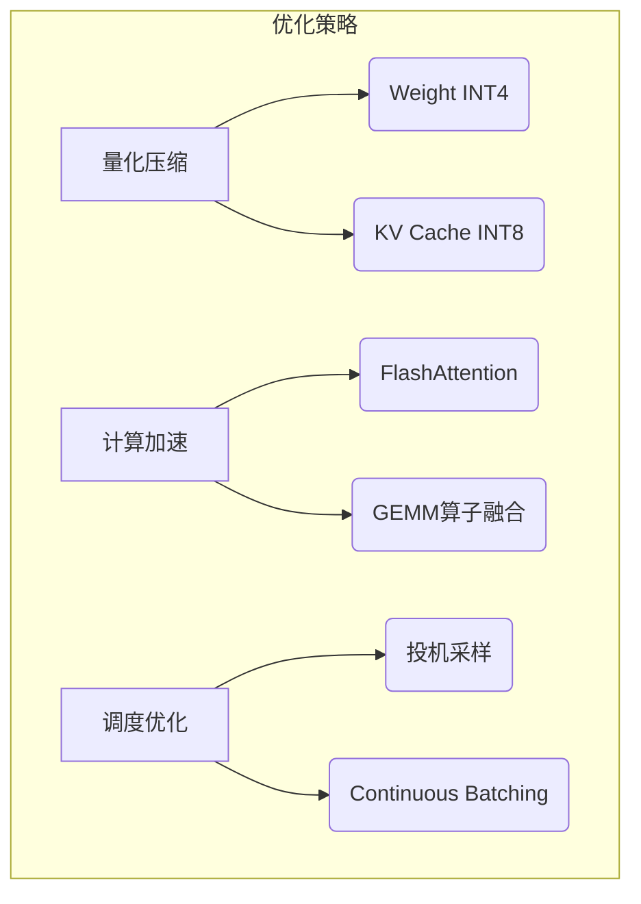
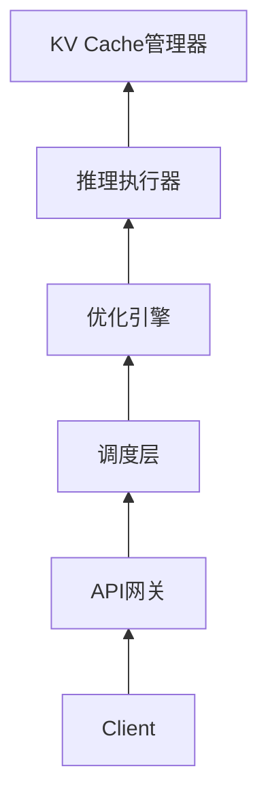

# 通用大EP xx特性调优

`v1.0 | 最后更新: 2025-07-31|小巧灵算力突击队`  

---

## 一、特性概述
### 1.1 特性概述
### 1.2 优化场景与目标
针对qwen3-235B场景，服务化推理， 4K+1.5K,  性能持平xx; RL 场景， 2K+20K/2K+32K，性能持平xx

### 1.3 关键量化指标
|  **指标**  | **定义**              | **优化目标** | 测量工具         |
| :--------: | --------------------- | ------------ | ---------------- |
|   `TTFT`   | 首Token响应时间       | ≤200ms       | PyTorch Profiler |
|   `TPOT`   | 单Token生成时间       | ≤50ms/token  | vLLM Benchmark   |
| `显存占用` | KV Cache+模型权重峰值 | 降低40%+     | NVIDIA SMI       |
|  `吞吐量`  | Tokens/秒             | 提升2倍      | Locust压测工具   |

---

## 二、方案设计
### 2.1 方案逻辑流程

*注：策略优先级按ROI排序<sup>1</sup><sup>4</sup>*

### 2.2 核心优化点
---

## 三、工程模块设计
### 3.1 系统架构

*图2：优化引擎分层架构*

### 3.2 关键模块
#### 模块1：投机采样引擎（Clover2）
**功能**：  
```mermaid
sequenceDiagram
   用户->>+草稿模型： 生成候选Token树
   草稿模型->>+主模型： 并行验证
   主模型-->>-用户： 返回有效Token序列
```
*动态宽度控制：每层Token预算≤4<sup>1</sup>*

**接口**：
```python
def speculative_decode(
    draft_model: nn.Module, 
    target_model: nn.Module,
    max_width: int = 4  # 树宽度约束
) -> List[Token]:
    """ 返回验证通过的Token序列 """
```

---

## 四、测试方案
### 4.1 测试策略说明
| **测试类型** | 工具                                 | 验证指标      | 通过标准        |
| ------------ | ------------------------------------ | ------------- | --------------- |
| 静态基准测试 | `benchmark_parallel.py`<sup>10</sup> | TTFT/TPOT     | 达标率≥95%      |
| 动态压力测试 | `benchmark_serving.py`<sup>10</sup>  | 吞吐量/错误率 | QPS波动<10%     |
| 精度回归测试 | Eval Gauntlet<sup>7</sup>            | 任务准确率    | 损失≤优化目标值 |

### 4.2 测试数据集与测试结果


## 五、附录
### 关联PR
| PR链接 | 日期       | 修改内容 | 提交人   |
| ---- | ---------- | -------- | -------- |
| | 2025-07-31 |     |  |

### 参考文档
1. [vLLM架构设计解析](search_result#4)  