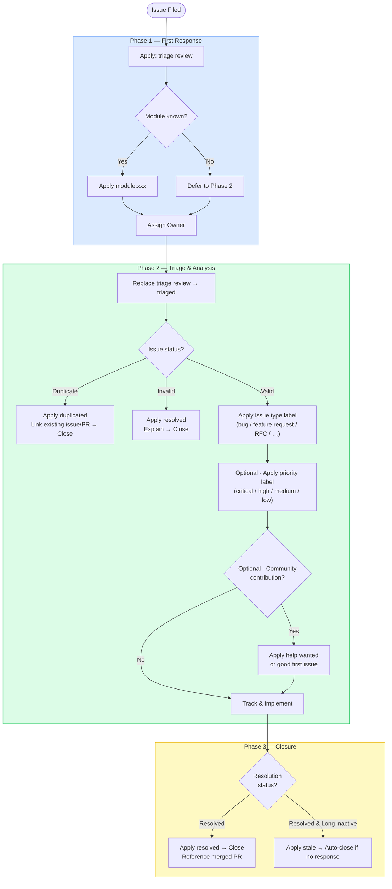

# Issue Workflow Guidelines

This document defines the standard lifecycle for Issues in the vLLM Ascend project — from creation through triage, active handling, and final closure. It establishes consistent label usage, owner assignment, and communication expectations to ensure smooth collaboration between contributors and maintainers.

## 1. Label Categories

### 1.1 Status Labels

These labels track where an issue stands in the workflow.

| Label | Description |
| --- | --- |
| `triage review` | Newly filed or unseen issue awaiting initial assessment by a maintainer |
| `triaged` | Assessment complete; type, priority, and module have been determined |
| `pending` | Blocked on an external dependency or awaiting a response before work can proceed |
| `resolved` | Issue has been closed — either via a merged PR, or through non-code resolution (e.g., answered question, configuration guidance) |
| `stale` | No activity for an extended period; parties have been notified and the issue will be auto-closed if there is no response |
| `duplicated` | A duplicate of an existing open issue or merged PR |

### 1.2 Issue Type Labels

These labels describe the nature of the issue.

| Label | Description |
| --- | --- |
| `bug` | Something is not working correctly or behaves unexpectedly |
| `enhancement` | Incremental improvement to an existing feature |
| `feature request` | Request for new functionality |
| `RFC` | Request for Comments — significant architectural or design change requiring community discussion |
| `question` | A usage or design question; no code change may be required |
| `documentation` | Improvements or corrections to documentation |
| `installation` | Issues related to setup and deployment |
| `performance` | Performance regression, bottleneck, or optimization request |
| `new model` | Request to add support for a new model on Ascend NPU |

### 1.3 Module Labels

These labels identify the subsystem or area of the codebase responsible for the issue.

| Label | Description |
| --- | --- |
| `module:core` | Core vLLM Ascend platform and model runner logic |
| `module:ops` | NPU custom operators and kernel implementations |
| `module:quantization` | Quantization support (W8A8, W4A16, etc.) |
| `module:multimodal` | Multimodal model support |
| `module:dp` | Data parallelism |
| `module:ep` | Expert parallelism (MoE routing and dispatch) |
| `module:graph` | ACL graph / graph compilation support |
| `module:lora` | LoRA adapter support |
| `module:rl` | Reinforcement learning (RLHF, GRPO, etc.) |
| `module:tests` | Test infrastructure, CI, and test coverage |
| `module:tools` | Developer tooling, scripts, and utilities |
| `module:mindie-turbo` | MindIE Turbo integration |

### 1.4 Priority Labels (Optional)

| Label | Description |
| --- | --- |
| `high` | High priority; should be resolved in the current or next cycle |
| `medium` | Normal priority; handled in the regular development flow |
| `low` | Low priority; edge case or minor issue that can be deferred |

### 1.5 Community Labels (Optional)

| Label | Description |
| --- | --- |
| `good first issue` | A well-scoped, low-complexity task suitable for new contributors |
| `help wanted` | Community contributions are welcome and encouraged |

## 2. Workflow

### Phase 1 — First Response

When an issue is first seen by a maintainer or contributor:

- Apply `triage review` to signal that the issue has been picked up and is under initial review.
- Apply the relevant `module:xxx` label if the responsible subsystem is already clear. If it cannot be determined at this stage, the module label should be added during Phase 2 after deeper analysis.
- Assign an owner who will track the issue through to resolution.

### Phase 2 — Triage and Analysis

After a thorough review of the issue content:

- Replace `triage review` with `triaged` to indicate that assessment is complete.
- Apply an **issue type** label (`bug`, `feature request`, `RFC`, `question`, `documentation`, `installation`, `performance`, `new model`, etc.).
- Apply a **priority** label (`critical`, `high`, `medium`, or `low`).
- Handle terminal states:
  - For duplicates, apply `duplicated`, link to the existing issue or PR, then close.
  - For invalid reports, apply `invalid`, provide a brief explanation, then close.
  - For issues that will not be addressed, apply `wontfix`, explain the reasoning, then close.
- If community contributions are welcome, apply `help wanted`. For well-scoped beginner-friendly tasks, also apply `good first issue`.

### Phase 3 — Closure

Once the issue has been resolved:

- Apply `resolved` and close the issue, or close it directly with a comment describing how the problem was addressed (e.g., a reference to the merged PR).
- For issues that have been inactive for an extended period with no response, apply `stale` as a final notice before auto-closure.
