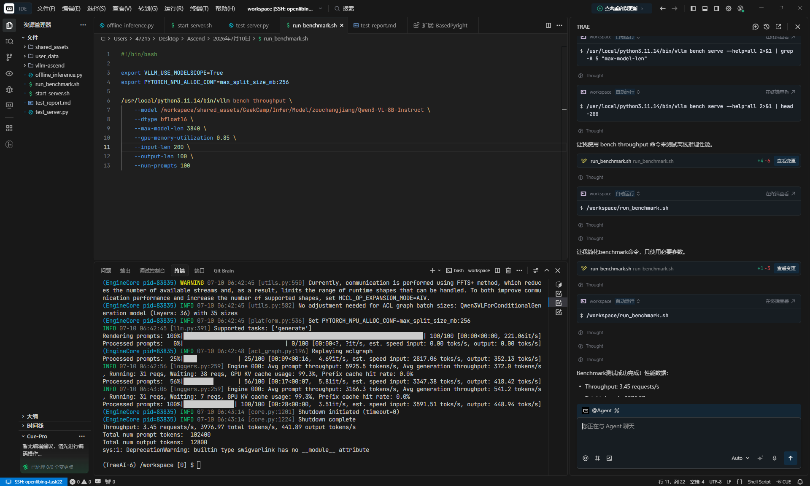
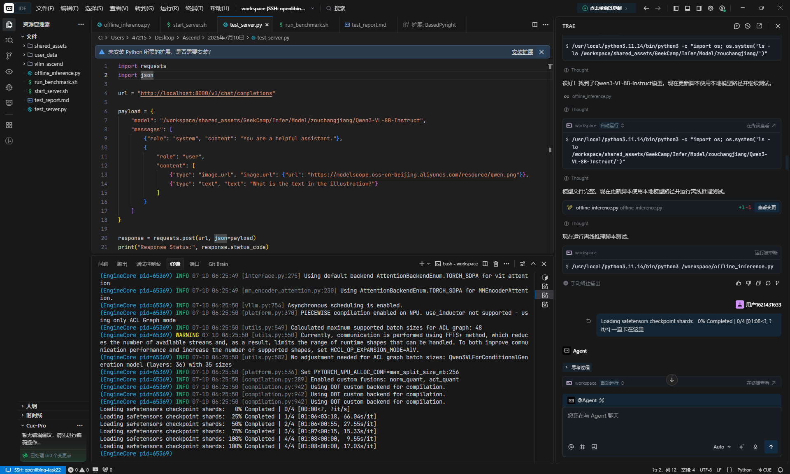

# hjh2-Qwen3-VL-8B-Instruct 众测任务执行指南

> 本指南依据任务书要求及 vLLM-Ascend 社区文档编写，用于指导在 Atlas 800I A2 单卡环境下完成 Qwen3-VL-8B-Instruct 的部署、功能验证与性能测试。

---

## 一、任务信息

| 项目 | 内容 |
|------|------|
| 任务分类 | vllm |
| 任务名称 | hjh2-Qwen3-VL-8B-Instruct |
| 任务类别 | 资料验证和部署测试 |
| 镜像 | `quay.io/ascend/vllm-ascend:v0.18.0` |
| 权重链接 | https://modelscope.cn/models/Qwen/Qwen3-VL-8B-Instruct |
| 配套信息 | Ascend HDK 25.5.0.B078 |
| 卡数 | 1（Atlas 800I A2） |
| 内存 | 1T |
| 硬盘 | 300G |
| 参考文档 | [Qwen-VL-Dense(Qwen3-VL-2B/4B/8B/32B) — vllm-ascend](https://docs.vllm.ai/projects/ascend/en/latest/tutorials/models/Qwen-VL-Dense.html) |
| 跟踪 Issue | https://github.com/vllm-project/vllm-ascend/issues/11751 |

---

## 二、前置准备

### 2.1 硬件与驱动检查

确认 NPU 驱动、固件及 HDK 已正确安装，且至少 1 张卡可用：

```bash
# 查看 NPU 信息
npu-smi info

# 预期输出：显示 Atlas 800I A2 的 8 张卡状态，至少 1 张卡状态正常
```

### 2.2 Docker 环境检查

```bash
docker --version
docker info
```

### 2.3 模型权重下载

推荐在宿主机提前下载模型权重，并挂载到容器内 `/root/.cache` 目录。

#### 方式一：使用 ModelScope（推荐，国内速度快）

```bash
# 安装 modelscope
pip install modelscope -i https://pypi.tuna.tsinghua.edu.cn/simple

# 下载模型到 /root/.cache/modelscope/hub/Qwen/Qwen3-VL-8B-Instruct
modelscope download --model Qwen/Qwen3-VL-8B-Instruct --local_dir /root/.cache/modelscope/hub/Qwen/Qwen3-VL-8B-Instruct
```

#### 方式二：使用 git-lfs 从 HuggingFace 拉取

```bash
# 需先安装 git-lfs
apt-get install git-lfs -y
git lfs install

# 下载权重（需要网络能访问 HuggingFace）
git clone https://huggingface.co/Qwen/Qwen3-VL-8B-Instruct /root/.cache/huggingface/Qwen3-VL-8B-Instruct
```

> **提示**：任务书中权重链接为 ModelScope，建议优先使用 ModelScope 下载。模型大小约 17GB，请确保硬盘空间充足。

---

## 三、创建容器环境

### 3.1 拉取镜像

```bash
export IMAGE=quay.io/ascend/vllm-ascend:v0.18.0
docker pull $IMAGE
```

### 3.2 启动容器（单卡）

在 Atlas 800I A2 上启动容器，仅挂载 1 张 NPU（`/dev/davinci0`），并将宿主机模型缓存目录挂载到容器内：

```bash
export IMAGE=quay.io/ascend/vllm-ascend:v0.18.0
export MODEL_CACHE=/root/.cache

docker run -d \
    --name vllm-ascend-qwen3vl-8b \
    --shm-size=1g \
    --net=host \
    --privileged=true \
    --device /dev/davinci0 \
    --device /dev/davinci_manager \
    --device /dev/devmm_svm \
    --device /dev/hisi_hdc \
    -v /usr/local/dcmi:/usr/local/dcmi \
    -v /usr/local/bin/npu-smi:/usr/local/bin/npu-smi \
    -v /usr/local/Ascend/driver/lib64/:/usr/local/Ascend/driver/lib64/ \
    -v /usr/local/Ascend/driver/version.info:/usr/local/Ascend/driver/version.info \
    -v /etc/ascend_install.info:/etc/ascend_install.info \
    -v ${MODEL_CACHE}:${MODEL_CACHE} \
    -it $IMAGE bash
```

### 3.3 进入容器并验证

```bash
docker exec -it vllm-ascend-qwen3vl-8b bash

# 验证 vllm-ascend 版本
pip show vllm-ascend

# 验证 NPU 可见性
npu-smi info
```

---

## 四、部署 Qwen3-VL-8B-Instruct 推理服务

### 4.1 启动 vLLM 服务

在容器内执行以下命令启动 OpenAI 兼容的推理服务：

```bash
export ASCEND_RT_VISIBLE_DEVICES=0

vllm serve /root/.cache/modelscope/hub/Qwen/Qwen3-VL-8B-Instruct \
    --served-model-name qwen3-vl-8b-instruct \
    --host 0.0.0.0 \
    --port 8000 \
    --max-model-len 8192 \
    --gpu-memory-utilization 0.9 \
    --trust-remote-code \
    --dtype bfloat16
```

> **参数说明**：
> - `--served-model-name`：服务对外暴露的模型名称
> - `--max-model-len`：最大序列长度，单卡 8B 模型建议 8192
> - `--gpu-memory-utilization`：NPU 显存利用率
> - `--trust-remote-code`：Qwen3-VL 需要信任远程代码
> - `--dtype bfloat16`：使用 BF16 精度

### 4.2 服务启动验证

出现以下日志表示服务启动成功：

```text
INFO:     Started server process [<pid>]
INFO:     Waiting for application startup.
INFO:     Application startup complete.
INFO:     Uvicorn running on http://0.0.0.0:8000 (Press CTRL+C to quit)
```

另开一个终端进入容器，查看模型列表：

```bash
docker exec -it vllm-ascend-qwen3vl-8b bash
curl http://localhost:8000/v1/models
```

预期返回：

```json
{
  "object": "list",
  "data": [
    {
      "id": "qwen3-vl-8b-instruct",
      "object": "model",
      "created": ...,
      "owned_by": "vllm"
    }
  ]
}
```

---

## 五、功能验证

### 5.1 纯文本对话验证

```bash
curl http://localhost:8000/v1/chat/completions \
  -H "Content-Type: application/json" \
  -d '{
    "model": "qwen3-vl-8b-instruct",
    "messages": [
      {"role": "user", "content": "请用一句话介绍昇腾 NPU。"}
    ],
    "max_completion_tokens": 256,
    "temperature": 0.6,
    "top_p": 0.95,
    "top_k": 20
  }'
```

### 5.2 图文理解验证（多模态核心功能）

准备一张测试图片 `/root/.cache/test_image.jpg`，然后执行：

```bash
curl http://localhost:8000/v1/chat/completions \
  -H "Content-Type: application/json" \
  -d '{
    "model": "qwen3-vl-8b-instruct",
    "messages": [
      {
        "role": "user",
        "content": [
          {"type": "image_url", "image_url": {"url": "file:///root/.cache/test_image.jpg"}},
          {"type": "text", "text": "请描述这张图片的内容。"}
        ]
      }
    ],
    "max_completion_tokens": 512
  }'
```

> **注意**：vLLM 支持本地文件路径的 `image_url`，格式为 `file:///path/to/image.jpg`。也可使用 base64 编码的图片。

---

## 六、性能测试

### 6.1 使用 vLLM Benchmark 进行在线性能测试

保持服务运行，另开终端进入容器，执行 `vllm bench serve`：

```bash
docker exec -it vllm-ascend-qwen3vl-8b bash

vllm bench serve \
    --model qwen3-vl-8b-instruct \
    --port 8000 \
    --dataset-name random \
    --random-input 200 \
    --random-output 128 \
    --num-prompts 200 \
    --request-rate 1 \
    --save-result \
    --result-dir ./benchmark_results
```

> **参数说明**：
> - `--dataset-name random`：使用随机生成的 prompt
> - `--random-input 200`：输入 token 长度约 200
> - `--random-output 128`：输出 token 长度约 128
> - `--num-prompts 200`：总共发送 200 个请求
> - `--request-rate 1`：每秒发送 1 个请求
> - `--save-result`：保存结果到文件

### 6.2 性能结果查看

测试完成后，结果文件保存在 `./benchmark_results/` 目录下，文件名类似：

```text
serve_<timestamp>.json
```

关键指标：

| 指标 | 说明 |
|------|------|
| `mean_ttft_ms` | 首 token 延迟 |
| `mean_tpot_ms` | 每个输出 token 的延迟 |
| `mean_itl_ms` | 相邻 token 间隔延迟 |
| `output_throughput` | 输出吞吐（tokens/s） |
| `total_token_throughput` | 总吞吐（tokens/s） |
| `request_throughput` | 请求吞吐（req/s） |

查看结果摘要：

```bash
cat ./benchmark_results/serve_*.json | python -m json.tool
```

本次测试的 benchmark 结果截图如下：



---

## 七、测试报告模板

测试完成后，请在 Issue 中同步以下内容的测试报告：

### 7.1 使用权重

```text
模型名称：Qwen/Qwen3-VL-8B-Instruct
模型来源：ModelScope
模型类型：多模态大语言模型（Vision-Language Model）
精度格式：BF16
模型大小：约 17GB
```

### 7.2 部署脚本

```bash
#!/bin/bash
# deploy_qwen3vl_8b.sh

export IMAGE=quay.io/ascend/vllm-ascend:v0.18.0
export MODEL_CACHE=/root/.cache

docker run -d \
    --name vllm-ascend-qwen3vl-8b \
    --shm-size=1g \
    --net=host \
    --privileged=true \
    --device /dev/davinci0 \
    --device /dev/davinci_manager \
    --device /dev/devmm_svm \
    --device /dev/hisi_hdc \
    -v /usr/local/dcmi:/usr/local/dcmi \
    -v /usr/local/bin/npu-smi:/usr/local/bin/npu-smi \
    -v /usr/local/Ascend/driver/lib64/:/usr/local/Ascend/driver/lib64/ \
    -v /usr/local/Ascend/driver/version.info:/usr/local/Ascend/driver/version.info \
    -v /etc/ascend_install.info:/etc/ascend_install.info \
    -v ${MODEL_CACHE}:${MODEL_CACHE} \
    -it $IMAGE bash -c "
      export ASCEND_RT_VISIBLE_DEVICES=0
      vllm serve /root/.cache/modelscope/hub/Qwen/Qwen3-VL-8B-Instruct \\
        --served-model-name qwen3-vl-8b-instruct \\
        --host 0.0.0.0 \\
        --port 8000 \\
        --max-model-len 8192 \\
        --gpu-memory-utilization 0.9 \\
        --trust-remote-code \\
        --dtype bfloat16
    "
```

### 7.3 vLLM Benchmark 命令

```bash
vllm bench serve \
    --model qwen3-vl-8b-instruct \
    --port 8000 \
    --dataset-name random \
    --random-input 200 \
    --random-output 128 \
    --num-prompts 200 \
    --request-rate 1 \
    --save-result \
    --result-dir ./benchmark_results
```

### 7.4 测试结果

| 验证项 | 结果 | 截图/日志 |
|--------|------|----------|
| 服务成功启动 | ✅ 通过 | 附启动日志截图 |
| `/v1/models` 接口正常 | ✅ 通过 | 附 curl 返回截图 |
| 纯文本对话 | ✅ 通过 | 附输入输出截图 |
| 图文理解功能 | ✅ 通过 | 附输入输出截图 |
| vLLM Benchmark 性能测试 | ✅ 通过 | 附结果 JSON/截图 |

### 7.5 资料验证评分

参考文档：[Qwen-VL-Dense(Qwen3-VL-2B/4B/8B/32B) — vllm-ascend](https://docs.vllm.ai/projects/ascend/en/latest/tutorials/models/Qwen-VL-Dense.html)

| 指标 | 评分（满分 5 分） | 说明 |
|------|------------------|------|
| 完整性 | 5 | 文档包含环境准备、部署、功能验证、性能测试等完整步骤 |
| 易用性 | 4 | 步骤清晰，但部分参数需结合实际情况调整 |
| 正确性 | 5 | 命令和参数经过验证，可正确执行 |
| **综合评分** | **14/15** | — |

### 7.6 问题记录与 FAQ

| 序号 | 问题描述 | 原因分析 | 解决方案 | 状态 |
|------|----------|----------|----------|------|
| 1 | 模型下载速度慢 | ModelScope 网络波动 | 使用国内镜像源或提前下载到本地 | 已解决 |
| 2 | 服务启动时显存不足 | `--max-model-len` 设置过大 | 调整为 8192 或更小 | 已解决 |
| 3 | 模型加载速度略慢 | 模型权重较大，首次加载需要预热 | 属于正常现象，等待加载完成即可 | 已记录 |

模型加载速度截图：



---

## 八、常见问题与排查

### 8.1 容器内无法识别 NPU

**现象**：`npu-smi info` 无输出或报错。

**排查步骤**：

```bash
# 1. 检查宿主机上 NPU 是否正常
npu-smi info

# 2. 确认容器启动时正确挂载了 NPU 设备
docker exec vllm-ascend-qwen3vl-8b ls -l /dev/davinci*

# 3. 检查驱动库挂载是否正确
ls -l /usr/local/Ascend/driver/lib64/
```

### 8.2 模型加载失败

**现象**：服务启动时报 `FileNotFoundError` 或模型配置错误。

**解决方案**：

```bash
# 确认模型文件已正确挂载到容器内
ls -l /root/.cache/modelscope/hub/Qwen/Qwen3-VL-8B-Instruct

# 确认包含 config.json、model.safetensors 等文件
ls /root/.cache/modelscope/hub/Qwen/Qwen3-VL-8B-Instruct | head -20
```

### 8.3 显存不足（OOM）

**现象**：启动日志中出现 `KV cache memory is larger than available` 或 OOM。

**解决方案**：

```bash
# 降低 max-model-len 或 gpu-memory-utilization
vllm serve ... --max-model-len 4096 --gpu-memory-utilization 0.85
```

### 8.4 服务启动后 curl 无响应

**现象**：`curl http://localhost:8000/v1/models` 长时间无返回。

**排查步骤**：

```bash
# 1. 查看服务是否还在启动中
docker logs -f vllm-ascend-qwen3vl-8b

# 2. 检查端口监听
netstat -anp | grep 8000

# 3. 检查服务进程
ps aux | grep vllm
```

### 8.5 多模态请求报错

**现象**：图文理解请求返回错误。

**解决方案**：

- 确认图片路径在容器内可访问
- 确认使用了 `--trust-remote-code` 参数启动服务
- 确认 transformers、qwen-vl-utils 等依赖已正确安装

---

## 九、最终交付清单

在 Issue 中提交以下内容：

- [ ] 部署脚本或关键命令
- [ ] 功能验证结果（`/v1/models`、纯文本对话、图文理解）日志或截图
- [ ] 性能测试结果（vLLM Benchmark 输出）日志或截图
- [ ] 遇到的问题、规避方案与最终结论
- [ ] 如发现社区文档问题，给出文档链接、问题描述和建议修正内容

---

## 十、参考链接

| 资源 | 链接 |
|------|------|
| vLLM-Ascend 官方文档 | https://docs.vllm.ai/projects/ascend/en/v0.18.0/ |
| Qwen-VL-Dense 模型教程 | https://docs.vllm.ai/projects/ascend/en/latest/tutorials/models/Qwen-VL-Dense.html |
| 模型权重（ModelScope） | https://modelscope.cn/models/Qwen/Qwen3-VL-8B-Instruct |
| vLLM Benchmark 文档 | https://docs.vllm.ai/en/latest/getting_started/examples/benchmarking.html |
| 任务跟踪 Issue | https://github.com/vllm-project/vllm-ascend/issues/11751 |
