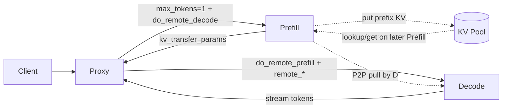
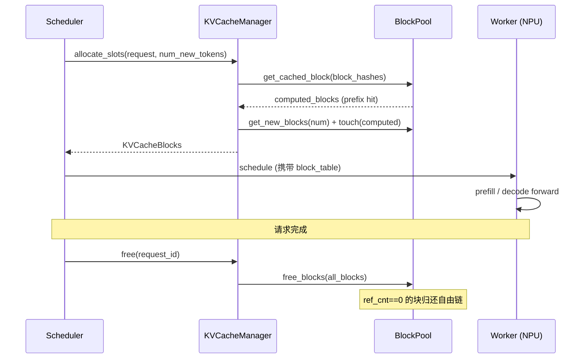
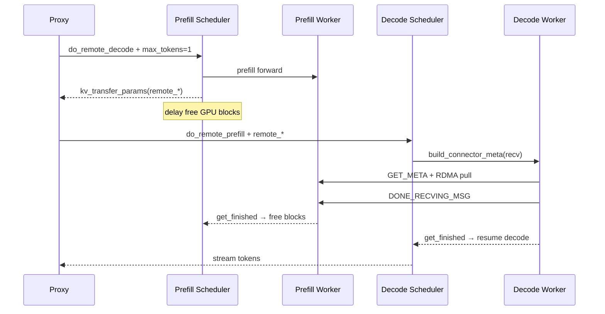
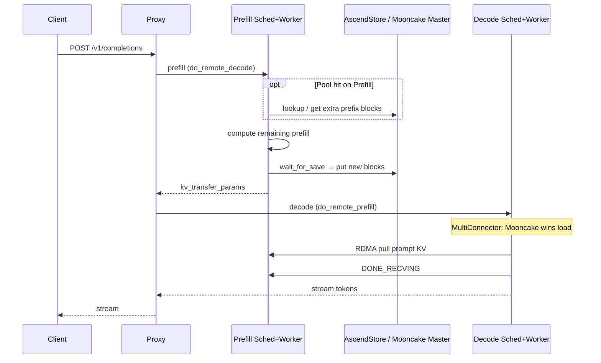

# vLLM-Ascend：PD 分离与 KV 池化代码运行流程

> 本文从 **vllm-ascend** 视角梳理 Prefill/Decode（PD）分离与 KV Cache Pool 的概念、配置、插件注册与一次请求的完整调用链。  
> 文中路径均可点击跳转到本地仓库文件（相对本 Markdown 所在目录）。

**配套画布：** 旁路聊天打开  
[`pd-kv-pool-runtime-flow.canvas.tsx`](file:///C:/Users/l00848175/.cursor/projects/d-workspace-codes/canvases/pd-kv-pool-runtime-flow.canvas.tsx)

**相关文档：**

- 部署指南：[KV Pool User Guide](file:///d:/workspace/codes/vllm-ascend/docs/source/user_guide/feature_guide/kv_pool.md)
- 设计背景：[KV Cache Pool Guide](file:///d:/workspace/codes/vllm-ascend/docs/source/developer_guide/Design_Documents/KV_Cache_Pool_Guide.md)
- 样例操作：[scripts-ascend DESIGN_AND_OPS](file:///d:/workspace/codes/scripts-ascend/example/pd_multi_nodes/DESIGN_AND_OPS.md)

---

## 1. 先建立两个正交概念

| 概念 | 解决什么问题 | 数据路径 | 典型 Connector |
|------|--------------|----------|----------------|
| **PD 分离** | Prefill / Decode 异构算力拆分；P 算完后把 KV 交给 D 继续生成 | **P↔D 设备间直传**（RDMA / Ascend Direct / HCCL one-sided） | 注册名 `MooncakeConnectorV1` → 类 [`MooncakeConnector`](file:///d:/workspace/codes/vllm-ascend/vllm_ascend/distributed/kv_transfer/kv_p2p/mooncake_connector.py#L1452) |
| **KV 池化** | 跨请求、跨节点复用 prefix KV；扩展到 DRAM/SSD 等外存 | **Lookup + Get/Put** 到共享 Store（Mooncake / Memcache / Yuanrong） | [`AscendStoreConnector`](file:///d:/workspace/codes/vllm-ascend/vllm_ascend/distributed/kv_transfer/kv_pool/ascend_store/ascend_store_connector.py#L73) |

二者可单独开启，也可通过 `MultiConnector` **同时开启**：

- PD：保证当前请求从 P 到 D 的低延迟 KV 交接
- Pool：让历史请求的 prefix 对后续 Prefill 可见，抬高命中率



---

## 2. 源码地图（可点击）

### 2.1 契约层（上游 vLLM）

| 文件 | 作用 |
|------|------|
| [`vllm/.../kv_connector/v1/base.py`](file:///d:/workspace/codes/vllm/vllm/distributed/kv_transfer/kv_connector/v1/base.py#L171) | `KVConnectorBase_V1`：Scheduler / Worker 双端 API |
| [`vllm/.../multi_connector.py`](file:///d:/workspace/codes/vllm/vllm/distributed/kv_transfer/kv_connector/v1/multi_connector.py#L128) | `MultiConnector`：**Load 选第一个命中者；Save 写全部** |
| [`vllm/.../factory.py`](file:///d:/workspace/codes/vllm/vllm/distributed/kv_transfer/kv_connector/factory.py#L27) | `KVConnectorFactory` 注册与创建 |
| [`vllm/.../kv_connector_model_runner_mixin.py`](file:///d:/workspace/codes/vllm/vllm/v1/worker/kv_connector_model_runner_mixin.py) | Worker 前向中的 KV 生命周期上下文 |

### 2.2 Ascend 实现层

| 文件 | 作用 |
|------|------|
| [`vllm_ascend/.../kv_transfer/__init__.py`](file:///d:/workspace/codes/vllm-ascend/vllm_ascend/distributed/kv_transfer/__init__.py#L21) | 插件注册：覆盖 `MultiConnector`、注册 PD/Pool connectors |
| [`ascend_multi_connector.py`](file:///d:/workspace/codes/vllm-ascend/vllm_ascend/distributed/kv_transfer/ascend_multi_connector.py#L19) | Ascend 版 Multi：Layerwise / HMA / preempt 特化 |
| [`mooncake_connector.py`](file:///d:/workspace/codes/vllm-ascend/vllm_ascend/distributed/kv_transfer/kv_p2p/mooncake_connector.py#L1452) | PD P2P：Sending/Recving Thread、握手参数 |
| [`ascend_store_connector.py`](file:///d:/workspace/codes/vllm-ascend/vllm_ascend/distributed/kv_transfer/kv_pool/ascend_store/ascend_store_connector.py#L73) | Pool 门面：`KVPoolScheduler` + `KVPoolWorker` + Lookup RPC |
| [`model_runner_v1.py`](file:///d:/workspace/codes/vllm-ascend/vllm_ascend/worker/model_runner_v1.py#L3930) | Ascend Worker：`register_kv_caches`、preemption、forward 挂钩 |

### 2.3 部署与代理

| 文件 | 作用 |
|------|------|
| [`load_balance_proxy_server_example.py`](file:///d:/workspace/codes/vllm-ascend/examples/disaggregated_prefill_v1/load_balance_proxy_server_example.py) | Proxy：先 P 后 D，透传 `kv_transfer_params` |
| [`kv_transfer_config.sh`](file:///d:/workspace/codes/scripts-ascend/example/common/kv_transfer_config.sh#L11) | 样例工程按开关拼 `--kv-transfer-config` |
| [`DESIGN_AND_OPS.md`](file:///d:/workspace/codes/scripts-ascend/example/pd_multi_nodes/DESIGN_AND_OPS.md) | 单/多节点启动顺序与开关说明 |

---

## 3. 核心原理：KV Connector V1 双进程模型

每个 connector 在 **Scheduler 进程** 与 **Worker 进程** 各有一份逻辑（同一类，按 `KVConnectorRole` 分支）：

```text
Scheduler 进程                          Worker 进程
─────────────────                       ─────────────────
get_num_new_matched_tokens              register_kv_caches
update_state_after_alloc                start_load_kv
build_connector_meta  ──metadata──►     wait_for_save / save_kv_layer
request_finished                        get_finished
                                        （返回后调度侧再 update_connector_output）
```

契约说明见 [`base.py` 文件头注释](file:///d:/workspace/codes/vllm/vllm/distributed/kv_transfer/kv_connector/v1/base.py#L171)：

- Scheduler：决定「能从外部拿多少 token」「块何时释放」「给客户端什么握手参数」
- Worker：真正做 RDMA pull / Store get-put，并汇报异步完成

Worker 每个 step 的固定顺序（上游 mixin）：

```78:112:../../../../../vllm/vllm/v1/worker/kv_connector_model_runner_mixin.py
    def _get_kv_connector_output(
        scheduler_output: "SchedulerOutput",
        wait_for_save: bool = True,
        defer_finalize: bool = False,
    ) -> Generator[KVConnectorOutput, None, None]:
        ...
        kv_connector.bind_connector_metadata(scheduler_output.kv_connector_metadata)
        kv_connector.start_load_kv(get_forward_context())
        try:
            yield output
        finally:
            if wait_for_save and not defer_finalize:
                kv_connector.wait_for_save()
            output.finished_sending, output.finished_recving = (
                kv_connector.get_finished(scheduler_output.finished_req_ids)
            )
            ...
```

Ascend [`NPUModelRunner`](file:///d:/workspace/codes/vllm-ascend/vllm_ascend/worker/model_runner_v1.py#L3930) 在 KV cache 初始化后调用 `register_kv_caches`，并在空 batch / 抢占等路径上仍驱动 connector（见文件内 `has_kv_transfer_group()` 分支）。

---

## 4. KV Cache 管理：块分配与生命周期

KV Cache 是 LLM 推理中最核心的显存资源。vLLM v1 采用**分页式块管理**（PagedAttention 思想），以 block 为单位动态分配/释放。

### 4.1 核心数据结构

```text
KVCacheManager (调度入口)
  ├── KVCacheCoordinator (多组协调: Hybrid / Unitary / NoPrefixCache)
  │     └── SingleTypeKVCacheManager[] (按 attention 类型分: Full / Sliding / MLA...)
  │           └── BlockPool (块池: 空闲链 + 哈希索引)
  │                 └── BlockHashToBlockMap (hash → block_id 映射)
  └── KVCacheBlocks (分配结果 DTO: computed + new blocks)
```

| 类 | 文件 | 行号 | 职责 |
|------|------|------|------|
| [`KVCacheManager`](file:///d:/workspace/codes/vllm/vllm/v1/core/kv_cache_manager.py#L114) | `vllm/v1/core/kv_cache_manager.py` | L114 | 对 Scheduler 的统一入口 |
| [`KVCacheCoordinator`](file:///d:/workspace/codes/vllm/vllm/v1/core/kv_cache_coordinator.py#L61) | `vllm/v1/core/kv_cache_coordinator.py` | L61 | 多 KV cache 组协调（抽象基类） |
| [`HybridKVCacheCoordinator`](file:///d:/workspace/codes/vllm/vllm/v1/core/kv_cache_coordinator.py#L514) | 同上 | L514 | 混合 attention 类型协调（主流路径） |
| [`SingleTypeKVCacheManager`](file:///d:/workspace/codes/vllm/vllm/v1/core/single_type_kv_cache_manager.py#L33) | `vllm/v1/core/single_type_kv_cache_manager.py` | L33 | 单一 attention 类型管理（抽象基类） |
| [`FullAttentionManager`](file:///d:/workspace/codes/vllm/vllm/v1/core/single_type_kv_cache_manager.py#L564) | 同上 | L564 | 标准 Full Attention 管理 |
| [`BlockPool`](file:///d:/workspace/codes/vllm/vllm/v1/core/block_pool.py#L144) | `vllm/v1/core/block_pool.py` | L144 | 块池：分配/释放/淘汰/缓存查找 |
| [`KVCacheBlock`](file:///d:/workspace/codes/vllm/vllm/v1/core/kv_cache_utils.py#L118) | `vllm/v1/core/kv_cache_utils.py` | L118 | 单个块的元数据（ref_cnt, hash, 空闲链前后指针） |
| [`FreeKVCacheBlockQueue`](file:///d:/workspace/codes/vllm/vllm/v1/core/kv_cache_utils.py#L179) | 同上 | L179 | 空闲块双向链表队列 |

### 4.2 Ascend 扩展

| 类 | 文件 | 行号 | 职责 |
|------|------|------|------|
| [`CompressAttentionManager`](file:///d:/workspace/codes/vllm-ascend/vllm_ascend/core/single_type_kv_cache_manager.py#L32) | `vllm_ascend/core/single_type_kv_cache_manager.py` | L32 | DeepSeek MLA 压缩注意力的块管理 |
| [`AscendHybridKVCacheCoordinator`](file:///d:/workspace/codes/vllm-ascend/vllm_ascend/patch/platform/patch_kv_cache_coordinator.py#L71) | `vllm_ascend/patch/platform/patch_kv_cache_coordinator.py` | L71 | 昇腾版混合协调：部分哈希命中、多 group 对齐 |
| [`BlockTable`](file:///d:/workspace/codes/vllm-ascend/vllm_ascend/worker/block_table.py#L14) | `vllm_ascend/worker/block_table.py` | L14 | NPU 侧 block table（`append_row`/`clear_row`/`compute_slot_mapping`） |

### 4.3 `allocate_slots` 核心流程

[`KVCacheManager.allocate_slots`](file:///d:/workspace/codes/vllm/vllm/v1/core/kv_cache_manager.py#L248) 是每次调度 step 中分配 KV cache 的总入口：

```text
allocate_slots(request, num_new_tokens)
  │
  ├─ 1. get_computed_blocks(request)          [Prefix Cache 命中]
  │     └─ coordinator.find_longest_cache_hit(request)
  │
  ├─ 2. 计算需要多少新 block
  │     └─ coordinator.get_num_blocks_to_allocate(request, num_tokens)
  │
  ├─ 3. 分配新 block（可能触发 eviction）
  │     ├─ coordinator.allocate_new_blocks(request, num_new_blocks)
  │     │     └─ block_pool.get_new_blocks(num)      [可能淘汰旧块]
  │     └─ block_pool.touch(computed_blocks)         [命中的块 ref_cnt++]
  │
  └─ 4. 返回 KVCacheBlocks {computed_blocks, new_blocks}
```

**BlockPool 空闲链：** 双向链表 [`FreeKVCacheBlockQueue`](file:///d:/workspace/codes/vllm/vllm/v1/core/kv_cache_utils.py#L179)，`popleft_n` 从头分配，`append` 表示释放。有 hash 的块在释放时排到队尾（优先留存），无 hash 的排到队头（优先回收）。

### 4.4 释放流程

[`KVCacheManager.free`](file:///d:/workspace/codes/vllm/vllm/v1/core/kv_cache_manager.py#L466)：

```text
free(request_id)
  └─ coordinator.free(request_id)
        └─ SingleTypeKVCacheManager.free(request_id)
              └─ block_pool.free_blocks(blocks)
                    ├─ ref_cnt -= 1
                    └─ ref_cnt == 0 → 归还 FreeKVCacheBlockQueue
                          ├─ 有 hash → append（队尾，低优先级回收）
                          └─ 无 hash → prepend（队首，立即可用）
```

### 4.5 生命周期时序（与 Scheduler 的关系）



---

## 5. Prefix Cache：哈希生成与命中检测

Prefix Cache 基于**链式块哈希**，将已计算的 KV block 与 token 序列的内容精确绑定。下一请求若有相同前缀，可直接复用已缓存的 KV block，跳过计算。

### 5.1 哈希生成链

核心函数：[`hash_block_tokens`](file:///d:/workspace/codes/vllm/vllm/v1/core/kv_cache_utils.py#L577)

```text
H(i) = hash(H(i-1), tokens[i], extra_keys)
```

其中 `extra_keys` 由 [`generate_block_hash_extra_keys`](file:///d:/workspace/codes/vllm/vllm/v1/core/kv_cache_utils.py#L539) 生成，包含：MM 特征（multimodal）、LoRA 名称、cache_salt、prompt 嵌入等。这些 key 确保不同模型/LoRA/多模态数据的缓存不会互相污染。

```text
Request 创建时:
  Request.__init__()
    → Request.update_block_hashes()             [request.py#L237]
        → get_request_block_hasher()            [kv_cache_utils.py#L673]
            → hash_block_tokens()               逐块计算
        → Request.block_hashes = [H(0), H(1), ...]

每次追加新 token 后:
  Request.update_block_hashes()
    → 增量更新 block_hashes 列表
```

### 5.2 写入缓存（Put）

当请求完成一组 token 的计算后，[`BlockPool.cache_full_blocks`](file:///d:/workspace/codes/vllm/vllm/v1/core/block_pool.py#L226) 将满块注册到前缀缓存：

```text
cache_full_blocks(request, blocks, num_computed_tokens, block_hashes)
  │
  ├─ 为每个 block 调用 KVCacheBlock.set_block_hash(hash, num_tokens)
  ├─ 将 (hash, block) 写入 BlockHashToBlockMap
  └─ 部分场景可能有多个具有相同 hash 的候选块
       → BlockHashToBlockMap 维护 list[block_id]
```

### 5.3 缓存命中检测（Get）

[`FullAttentionManager.find_longest_cache_hit`](file:///d:/workspace/codes/vllm/vllm/v1/core/single_type_kv_cache_manager.py#L566) — 标准 Full Attention 的左到右线性扫描：

```text
find_longest_cache_hit(request)
  │
  └─ for each block_hash in request.block_hashes:
        block = block_pool.get_cached_block(block_hash, group_ids)
        if block exists AND block is free AND no eviction:
            hit_blocks.append(block)
        else:
            break   ← 链式哈希: 前面断了, 后面全断

  → 返回 (hit_blocks, num_hit_tokens)
```

**HybridKVCacheCoordinator（多 attention 类型）：** 使用**迭代不动点算法**找出所有 KV cache 组的公共前缀。各组的 cache 命中可能不同（如 MLA 和 Full Attention 有不同的 block size），需找最大公约数。

昇腾版 [`AscendHybridKVCacheCoordinator.find_longest_cache_hit`](file:///d:/workspace/codes/vllm-ascend/vllm_ascend/patch/platform/patch_kv_cache_coordinator.py#L273) 额外支持**部分哈希命中**（`_cache_hit_alignment_tokens`），适应 Ascend 硬件的对齐要求。

### 5.4 不同 Attention 类型的匹配策略

| Attention 类型 | 查找方向 | 类/文件 | 关键差异 |
|------|------|------|------|
| Full Attention | 左→右 线性 | [`FullAttentionManager`](file:///d:/workspace/codes/vllm/vllm/v1/core/single_type_kv_cache_manager.py#L566) | 标准链式匹配，断了就停 |
| Sliding Window | 右→左 搜索 | [`SlidingWindowManager`](file:///d:/workspace/codes/vllm/vllm/v1/core/single_type_kv_cache_manager.py#L688) | 需在窗口内找到连续命中 |
| MLA (Compress) | 左→右（block size × ratio） | [`CompressAttentionManager`](file:///d:/workspace/codes/vllm-ascend/vllm_ascend/core/single_type_kv_cache_manager.py#L214) | 逻辑块大小 = 物理块大小 × 压缩比 |

### 5.5 与片上 Prefix Cache 的关系（PD + Pool 之外的第三维度）

在 PD 分离 + KV Pool 场景下，Prefix Cache 仍然生效：

```text
请求到达 P 节点:
  1. 查片上 Prefix Cache → hit_blocks (零拷贝复用)
  2. 查 KV Pool → extra_blocks (外存加载)
  3. 计算剩余新 token
  4. 将新 KV 写入片上 Prefix Cache
  5. 将新 KV put 到 KV Pool (可选)

请求到达 D 节点:
  1. 从 P2P 拉取所有 prompt KV (不查 Prefix)
  2. decode 过程的新 KV 写入片上 Prefix Cache
```

片上 Prefix Cache 和 KV Pool 的关键区别：

| | 片上 Prefix Cache | KV Pool |
|------|------|------|
| 存储位置 | GPU/NPU 显存 | DRAM/SSD (Mooncake/Memcache) |
| 生命周期 | 跟随实例，重启清零 | 跨实例、跨节点持久 |
| 查找开销 | ~微秒级 (hash map) | ~毫秒级 (RPC/ZMQ) |
| 容量 | 受 batch/显存限制 | 可扩展至 TB 级 |
| 控制开关 | `--enable-prefix-caching` | `--kv-transfer-config` + Pool connector |

---

## 6. 启动：插件注册与配置拼装

### 6.1 注册入口

Ascend 通过 entry point 调用 [`register_connector()`](file:///d:/workspace/codes/vllm-ascend/vllm_ascend/distributed/kv_transfer/__init__.py#L21)：

```21:49:../../../../vllm_ascend/distributed/kv_transfer/__init__.py
def register_connector():
    # override multi_connector as ascend_multi_connector
    if "MultiConnector" in KVConnectorFactory._registry:
        KVConnectorFactory._registry.pop("MultiConnector")
    KVConnectorFactory.register_connector(
        "MultiConnector", "vllm_ascend.distributed.kv_transfer.ascend_multi_connector", "AscendMultiConnector"
    )

    KVConnectorFactory.register_connector(
        "MooncakeConnectorV1", "vllm_ascend.distributed.kv_transfer.kv_p2p.mooncake_connector", "MooncakeConnector"
    )
    ...
    KVConnectorFactory.register_connector(
        "AscendStoreConnector",
        "vllm_ascend.distributed.kv_transfer.kv_pool.ascend_store.ascend_store_connector",
        "AscendStoreConnector",
    )
```

要点：

1. 配置里写的名字是 **`MooncakeConnectorV1`**，实现类是 **`MooncakeConnector`**
2. 上游 `MultiConnector` 被替换为 [`AscendMultiConnector`](file:///d:/workspace/codes/vllm-ascend/vllm_ascend/distributed/kv_transfer/ascend_multi_connector.py#L19)（Layerwise 分配态转发、HMA、抢占优先）

### 6.2 配置生成（样例工程）

[`build_kv_transfer_config`](file:///d:/workspace/codes/scripts-ascend/example/common/kv_transfer_config.sh#L11)：

| `ENABLE_KV_POOL` | 顶层 `kv_connector` | 行为 |
|------------------|---------------------|------|
| `0` | `MooncakeConnectorV1`（或 Layerwise） | 仅 PD |
| `1` | `MultiConnector` | `connectors[0]=PD`，`connectors[1]=AscendStoreConnector` |

```40:60:../../../../../scripts-ascend/example/common/kv_transfer_config.sh
    if [[ "${enable_pool}" == "1" || ... ]]; then
        cat <<EOF
{
  "kv_connector": "MultiConnector",
  "kv_role": "${kv_role}",
  "kv_load_failure_policy": "${load_policy}",
  "kv_connector_extra_config": {
    "connectors": [
      ${pd_block},
      {
        "kv_connector": "AscendStoreConnector",
        ...
      }
    ]
  }
}
EOF
```

**`kv_role` 语义**（与 PD 角色绑定）：

| 角色 | `kv_role` | Prefill 节点 | Decode 节点 |
|------|-----------|--------------|-------------|
| 生产者 | `kv_producer` | 计算 +（可选）Put Pool；延迟释放块直到 D 拉完 | — |
| 消费者 | `kv_consumer` | — | Pull P2P；默认不 Put Pool |
| 混部 | `kv_both` | 单实例自包含 Pool（非 PD 拆分场景） | 同左 |

---

## 7. PD 分离运行时流程

### 7.1 Proxy：把一次生成拆成「P 一下 → D 流式」

关键实现：[`build_prefill_request`](file:///d:/workspace/codes/vllm-ascend/examples/disaggregated_prefill_v1/load_balance_proxy_server_example.py#L818) / [`assign_instances`](file:///d:/workspace/codes/vllm-ascend/examples/disaggregated_prefill_v1/load_balance_proxy_server_example.py#L924)

```818:834:../../../../examples/disaggregated_prefill_v1/load_balance_proxy_server_example.py
def build_prefill_request(req_data: dict) -> dict:
    payload = req_data.copy()
    payload["kv_transfer_params"] = {
        "do_remote_decode": True,
        "do_remote_prefill": False,
        "remote_engine_id": None,
        "remote_block_ids": None,
        "remote_host": None,
        "remote_port": None,
    }
    payload["stream"] = False
    payload["max_tokens"] = 1
    payload["min_tokens"] = 1
    ...
```

流程：

1. 选 Prefiller → POST（`max_tokens=1`，强制 `FINISHED_LENGTH_CAPPED`）
2. 从 Prefill 响应取出 `kv_transfer_params`
3. 选 Decoder → 带同一 `request_id` 与握手字段流式 decode
4. Decode 首包后可 `release_prefill_kv`（负载评分）；失败策略可触发 reassign

### 7.2 MooncakeConnector 结构

[`MooncakeConnector`](file:///d:/workspace/codes/vllm-ascend/vllm_ascend/distributed/kv_transfer/kv_p2p/mooncake_connector.py#L1452) 按 role 挂载 Scheduler / Worker：

```1452:1536:../../../../vllm_ascend/distributed/kv_transfer/kv_p2p/mooncake_connector.py
class MooncakeConnector(KVConnectorBase_V1, SupportsHMA):
    def __init__(...):
        if role == KVConnectorRole.SCHEDULER:
            self.connector_scheduler = MooncakeConnectorScheduler(...)
        elif role == KVConnectorRole.WORKER:
            self.connector_worker = MooncakeConnectorWorker(...)
    # Scheduler: get_num_new_matched_tokens / update_state_after_alloc /
    #            build_connector_meta / request_finished*
    # Worker: register_kv_caches / start_load_kv / get_finished
    # wait_for_save / save_kv_layer: no-op  ← P2P 是 pull 模型，P 不主动 push
```

**设计要点：Decode pull，Prefill 不主动 save。**  
所以 `wait_for_save` / `save_kv_layer` 为空实现；真正传输在 D 侧 `KVCacheRecvingThread`。

### 7.3 Prefill 结束：生成握手参数并延迟释放块

[`MooncakeConnectorScheduler.request_finished`](file:///d:/workspace/codes/vllm-ascend/vllm_ascend/distributed/kv_transfer/kv_p2p/mooncake_connector.py#L1826)：

```1857:1872:../../../../vllm_ascend/distributed/kv_transfer/kv_p2p/mooncake_connector.py
        return delay_free_blocks, dict(
            do_remote_prefill=True,
            do_remote_decode=False,
            remote_block_ids=computed_block_ids,
            remote_engine_id=self.engine_id,
            remote_request_id=request.request_id,
            remote_host=self.side_channel_host,
            remote_port=self.side_channel_port,
            remote_pcp_size=self.pcp_size,
            remote_dcp_size=self.dcp_size,
            remote_ptp_size=self.tp_size,
            last_token_id=request.output_token_ids[-1],
            remote_multi_nodes_meta_mapping=self.multi_nodes_meta_mapping,
            num_prompt_blocks=num_prompt_blocks,
            remote_block_size=self.block_size,
        )
```

触发条件（同函数前文）：

- 请求带 `do_remote_decode=True`（Proxy 注入）
- 状态为 `FINISHED_LENGTH_CAPPED`（`max_tokens=1` 的结果）
- 有可传输的 prompt blocks → `delay_free_blocks=True`，等 D 发 `DONE_RECVING_MSG` 后再释放

### 7.4 Decode：Scheduler 认领外部 token → Worker RDMA 拉取

**Scheduler（D）大致顺序：**

1. `get_num_new_matched_tokens`：根据 `do_remote_prefill` + `remote_*` 计算需从远端加载的 token 数（可 async）
2. 分配本地 block → `update_state_after_alloc` 记入待收队列
3. `build_connector_meta` 打包 `MooncakeConnectorMetadata`

**Worker（D）：**

1. `start_load_kv` → [`KVCacheRecvingThread`](file:///d:/workspace/codes/vllm-ascend/vllm_ascend/distributed/kv_transfer/kv_p2p/mooncake_connector.py#L409).add_request
2. 侧信道 `GET_META_MSG` 换取 P 的 buffer 地址 / 端口
3. TransferEngine 拉取 KV blocks
4. `_send_done_recv_signal` → P 侧 `get_finished` → 释放 delayed blocks
5. D 侧 `get_finished` → Scheduler 允许该请求进入真正 decode 步进



---

## 8. KV 池化运行时流程

### 8.1 为什么需要 Pool？

本地 GPU/NPU 上的 Prefix Cache 容量有限、且通常不跨节点共享。  
[`KV_Cache_Pool_Guide`](file:///d:/workspace/codes/vllm-ascend/docs/source/developer_guide/Design_Documents/KV_Cache_Pool_Guide.md) 的核心思想：用外存池把 prefix 变成**集群可见**，提升命中率；与片上 Prefix Cache **叠加**：

1. 先查片上命中
2. 再查 Pool，只加载「额外命中」的 blocks
3. 加载进设备后，后续与普通 Prefix Cache 相同

### 8.2 AscendStoreConnector 角色拆分

[`AscendStoreConnector.__init__`](file:///d:/workspace/codes/vllm-ascend/vllm_ascend/distributed/kv_transfer/kv_pool/ascend_store/ascend_store_connector.py#L82)：

| Role | 对象 | 职责 |
|------|------|------|
| SCHEDULER | [`KVPoolScheduler`](file:///d:/workspace/codes/vllm-ascend/vllm_ascend/distributed/kv_transfer/kv_pool/ascend_store/pool_scheduler.py#L49) | Lookup 命中长度、`LoadSpec`、`build_connector_meta`、`request_finished` 延迟释放 |
| WORKER | [`KVPoolWorker`](file:///d:/workspace/codes/vllm-ascend/vllm_ascend/distributed/kv_transfer/kv_pool/ascend_store/pool_worker.py#L80) | `m_store.get/put`、异步收发线程 |
| WORKER rank0 | [`LookupKeyServer`](file:///d:/workspace/codes/vllm-ascend/vllm_ascend/distributed/kv_transfer/kv_pool/ascend_store/ascend_store_connector.py#L283) | ZMQ REP：Scheduler 无 store client，通过 `lookup_rpc_port` 问 Worker「key 是否存在」 |

Worker 侧关键钩子：

```200:243:../../../../vllm_ascend/distributed/kv_transfer/kv_pool/ascend_store/ascend_store_connector.py
    def start_load_kv(...):
        ...
        self.connector_worker.start_load_kv(metadata)

    def wait_for_save(self):
        if self.kv_role == "kv_consumer" and not self.consumer_is_to_put:
            return
        ...
        self.connector_worker.wait_for_save(self._get_connector_metadata())
```

默认：**只有 Prefill（producer）向 Pool put**；Decode 通过 PD P2P 拿 KV，不重复走 Pool（可用 `consumer_is_to_put` 打开 D→Pool，见 [kv_pool.md](file:///d:/workspace/codes/vllm-ascend/docs/source/user_guide/feature_guide/kv_pool.md)）。

### 8.3 Lookup → Load → Put 调用链

```text
【Lookup】
KVPoolScheduler.get_num_new_matched_tokens
  → LookupKeyClient.lookup  (ZMQ REQ)
      → LookupKeyServer → KVPoolWorker.lookup_scheduler
          → m_store.exists(keys)   # keys 来自 request.block_hashes / token DB

【Load】
AscendStoreConnector.start_load_kv
  → KVPoolWorker.start_load_kv
      → sync: m_store.get(...)
      → async: kv_recv_thread.add_request

【Put】
AscendStoreConnector.wait_for_save
  → KVPoolWorker.wait_for_save
      → KVCacheStoreSendingThread → m_store.put(keys, addrs, sizes)
```

实现文件：

- Scheduler / Worker / Lookup：[`ascend_store_connector.py`](file:///d:/workspace/codes/vllm-ascend/vllm_ascend/distributed/kv_transfer/kv_pool/ascend_store/ascend_store_connector.py#L73) 同目录下 [`pool_scheduler.py`](file:///d:/workspace/codes/vllm-ascend/vllm_ascend/distributed/kv_transfer/kv_pool/ascend_store/pool_scheduler.py#L49) / [`pool_worker.py`](file:///d:/workspace/codes/vllm-ascend/vllm_ascend/distributed/kv_transfer/kv_pool/ascend_store/pool_worker.py#L80)
- Put 线程：[`kv_transfer.py`](file:///d:/workspace/codes/vllm-ascend/vllm_ascend/distributed/kv_transfer/kv_pool/ascend_store/kv_transfer.py#L645)
- Backend：[`mooncake_backend.py`](file:///d:/workspace/codes/vllm-ascend/vllm_ascend/distributed/kv_transfer/kv_pool/ascend_store/backend/mooncake_backend.py) 等

### 8.4 与片上 Prefix Cache 的关系（PD + Pool）

官方推荐 PD+Pool 时仍常配合 `--no-enable-prefix-caching` 的部署脚本，是为了简化路径、强制走 connector；设计上 V1 允许 **片上 Prefix + Pool** 叠加（见 [KV_Cache_Pool_Guide §1](file:///d:/workspace/codes/vllm-ascend/docs/source/developer_guide/Design_Documents/KV_Cache_Pool_Guide.md)）。

失败策略：`kv_load_failure_policy`

- `recompute`：加载失败回滚到有效前缀再算（样例默认）
- `fail`：直接失败（上游默认）

MultiConnector 场景下该字段配在**顶层** `kv-transfer-config`，不要只配在子 connector。

---

## 9. MultiConnector：PD + Pool 如何共存

上游规则（[`multi_connector.py`](file:///d:/workspace/codes/vllm/vllm/distributed/kv_transfer/kv_connector/v1/multi_connector.py)）：

```128:136:../../../../../vllm/vllm/distributed/kv_transfer/kv_connector/v1/multi_connector.py
class MultiConnector(KVConnectorBase_V1, SupportsHMA):
    """
    ...
    - Load KV from the first connector that advertises available tokens from
      get_num_new_matched_tokens(), based on the order in the config.
    - Save to all connectors.
    """
```

样例顺序：**PD 在前，Pool 在后** —— 原因：

| 阶段 | 发生什么 |
|------|----------|
| Decode 拉当前请求 KV | Mooncake 先对 `do_remote_prefill` 返回命中 → **选中 P2P**，不走 Pool |
| Prefill 冷启动 / 后续共享 prefix | Mooncake 返回 0 → AscendStore 可声明 Pool 命中 |
| Save | Mooncake `wait_for_save` 空操作；AscendStore **真正 put** |
| `request_finished` | 仅 Mooncake 产出 `kv_transfer_params`；Pool 可 `delay_free` 等 put 完成（两者异步释放计数由 Multi 聚合） |

Ascend 覆盖见 [`AscendMultiConnector`](file:///d:/workspace/codes/vllm-ascend/vllm_ascend/distributed/kv_transfer/ascend_multi_connector.py#L19)：

- Layerwise connector 即使未被选为 load 源，也要收到真实 `blocks`（否则无法按层传输）
- 抢占后的 recompute-offload 可优先于配置顺序
- HMA：`request_finished_all_groups` 聚合多 group 的 delay_free / 握手参数

---

## 10. 端到端：一次请求在 PD+Pool 下的时序



对照组件启动顺序（运维侧，见 [DESIGN_AND_OPS](file:///d:/workspace/codes/scripts-ascend/example/pd_multi_nodes/DESIGN_AND_OPS.md)）：

1. （可选）`mooncake_master` —— 仅 `ENABLE_KV_POOL=1`
2. Prefill 实例（`kv_producer`）
3. Decode 实例（`kv_consumer`）
4. Proxy
5. 压测 / AISBench

---

## 11. 关键概念速查

| 术语 | 含义 |
|------|------|
| `kv_transfer_params` | 经 OpenAI API 透传的 P→D 握手字典（Proxy 桥接） |
| `do_remote_decode` / `do_remote_prefill` | 标记「我算完要给远端 Decode」/「我要从远端 Prefill 拉 KV」 |
| `remote_block_ids` / `remote_host` / `remote_port` | D 侧 pull 所需的块 ID 与侧信道地址 |
| `block_hashes` | Prefix 感知哈希；Pool 的 key 空间基础 |
| `lookup_rpc_port` | Scheduler↔Worker(rank0) 的 Lookup ZMQ 端口，多实例勿冲突 |
| `delay free` | 异步 send/put 未完成前不释放 GPU KV 块 |
| `kv_port` | Mooncake 握手端口基址；通常按 device 偏移 |
| `PYTHONHASHSEED` | Pool 开启时各节点必须一致，否则 hash key 对不齐 |
| `backend` | Pool 存储：`mooncake` / `memcache` / `yuanrong` |
| Layerwise | 按层传输的 PD connector + 对应 Proxy；与整段 pull 不同路径 |

---

## 12. 建议的阅读顺序（跟代码）

1. 契约：[`base.py`](file:///d:/workspace/codes/vllm/vllm/distributed/kv_transfer/kv_connector/v1/base.py#L171) → mixin [`_get_kv_connector_output`](file:///d:/workspace/codes/vllm/vllm/v1/worker/kv_connector_model_runner_mixin.py#L78)
2. KV Cache 管理：[`KVCacheManager`](file:///d:/workspace/codes/vllm/vllm/v1/core/kv_cache_manager.py#L114) → [`BlockPool`](file:///d:/workspace/codes/vllm/vllm/v1/core/block_pool.py#L144) → [`FullAttentionManager.find_longest_cache_hit`](file:///d:/workspace/codes/vllm/vllm/v1/core/single_type_kv_cache_manager.py#L566)
3. Prefix Cache：[`hash_block_tokens`](file:///d:/workspace/codes/vllm/vllm/v1/core/kv_cache_utils.py#L577) → [`BlockPool.cache_full_blocks`](file:///d:/workspace/codes/vllm/vllm/v1/core/block_pool.py#L226) → [`find_longest_cache_hit`](file:///d:/workspace/codes/vllm/vllm/v1/core/single_type_kv_cache_manager.py#L566)
4. 注册：[`kv_transfer/__init__.py`](file:///d:/workspace/codes/vllm-ascend/vllm_ascend/distributed/kv_transfer/__init__.py#L21)
5. 配置：[`kv_transfer_config.sh`](file:///d:/workspace/codes/scripts-ascend/example/common/kv_transfer_config.sh#L11)
6. Proxy：[`build_prefill_request`](file:///d:/workspace/codes/vllm-ascend/examples/disaggregated_prefill_v1/load_balance_proxy_server_example.py#L818)
7. PD：[`MooncakeConnector`](file:///d:/workspace/codes/vllm-ascend/vllm_ascend/distributed/kv_transfer/kv_p2p/mooncake_connector.py#L1452) → [`request_finished`](file:///d:/workspace/codes/vllm-ascend/vllm_ascend/distributed/kv_transfer/kv_p2p/mooncake_connector.py#L1826) → Worker `start_load_kv` / RecvingThread
8. Pool：[`AscendStoreConnector`](file:///d:/workspace/codes/vllm-ascend/vllm_ascend/distributed/kv_transfer/kv_pool/ascend_store/ascend_store_connector.py#L73) → [`KVPoolScheduler`](file:///d:/workspace/codes/vllm-ascend/vllm_ascend/distributed/kv_transfer/kv_pool/ascend_store/pool_scheduler.py#L49) / [`KVPoolWorker`](file:///d:/workspace/codes/vllm-ascend/vllm_ascend/distributed/kv_transfer/kv_pool/ascend_store/pool_worker.py#L80)
9. 组合：[`multi_connector.py`](file:///d:/workspace/codes/vllm/vllm/distributed/kv_transfer/kv_connector/v1/multi_connector.py#L128) + [`AscendMultiConnector`](file:///d:/workspace/codes/vllm-ascend/vllm_ascend/distributed/kv_transfer/ascend_multi_connector.py#L19)

---

## 13. 绝对路径索引（IDE 复制跳转）

若相对链接在预览中不可点，可直接用绝对路径打开：

```text
d:\workspace\codes\vllm\vllm\distributed\kv_transfer\kv_connector\v1\base.py
d:\workspace\codes\vllm\vllm\distributed\kv_transfer\kv_connector\v1\multi_connector.py
d:\workspace\codes\vllm\vllm\v1\worker\kv_connector_model_runner_mixin.py
d:\workspace\codes\vllm-ascend\vllm_ascend\distributed\kv_transfer\__init__.py
d:\workspace\codes\vllm-ascend\vllm_ascend\distributed\kv_transfer\ascend_multi_connector.py
d:\workspace\codes\vllm-ascend\vllm_ascend\distributed\kv_transfer\kv_p2p\mooncake_connector.py
d:\workspace\codes\vllm-ascend\vllm_ascend\distributed\kv_transfer\kv_pool\ascend_store\ascend_store_connector.py
d:\workspace\codes\vllm-ascend\vllm_ascend\worker\model_runner_v1.py
d:\workspace\codes\vllm-ascend\examples\disaggregated_prefill_v1\load_balance_proxy_server_example.py
d:\workspace\codes\scripts-ascend\example\common\kv_transfer_config.sh
```
