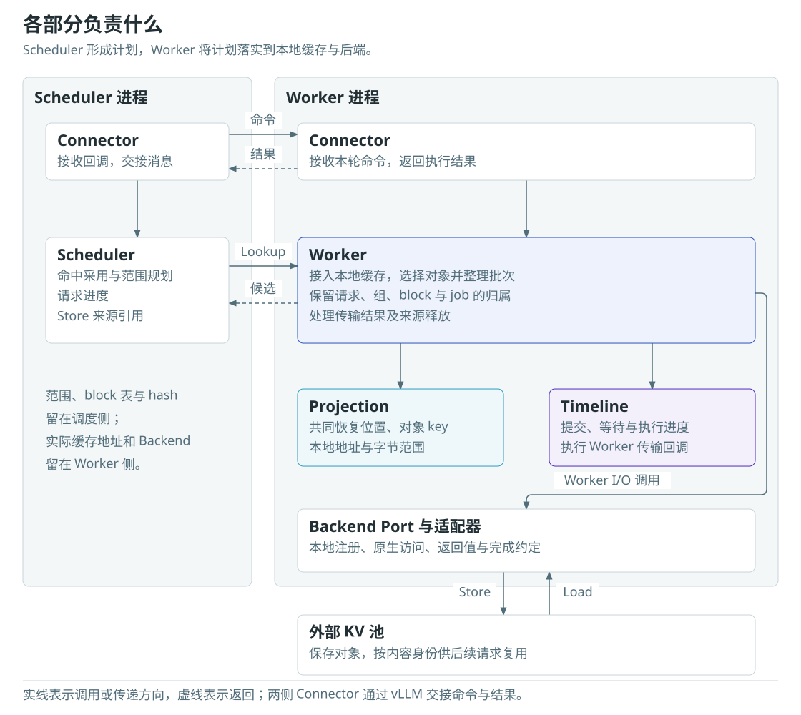
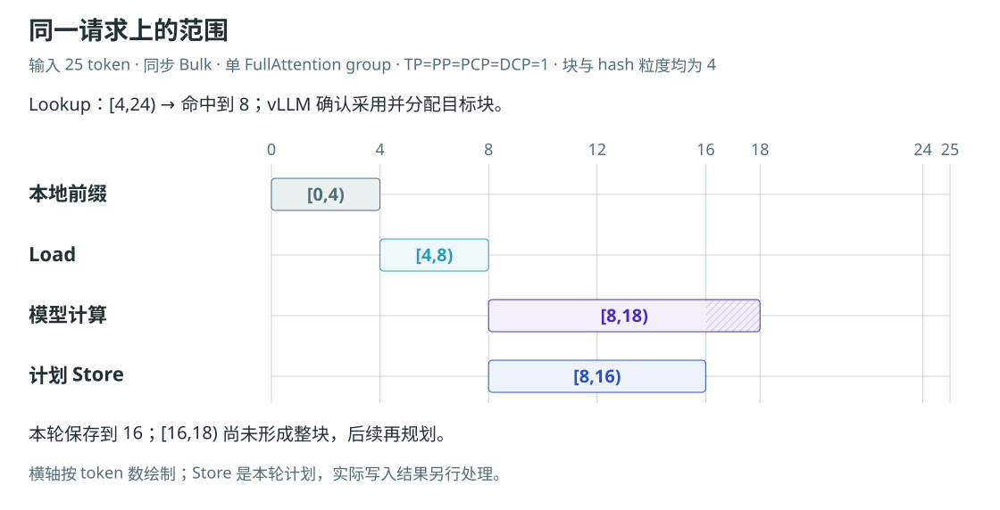
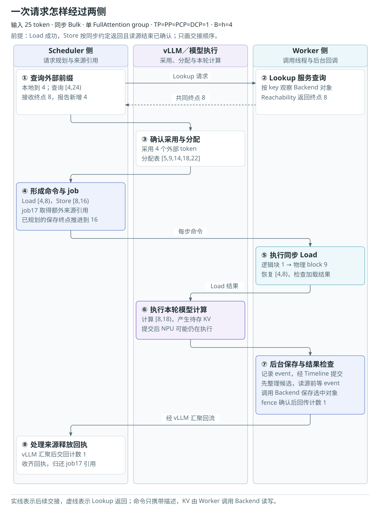
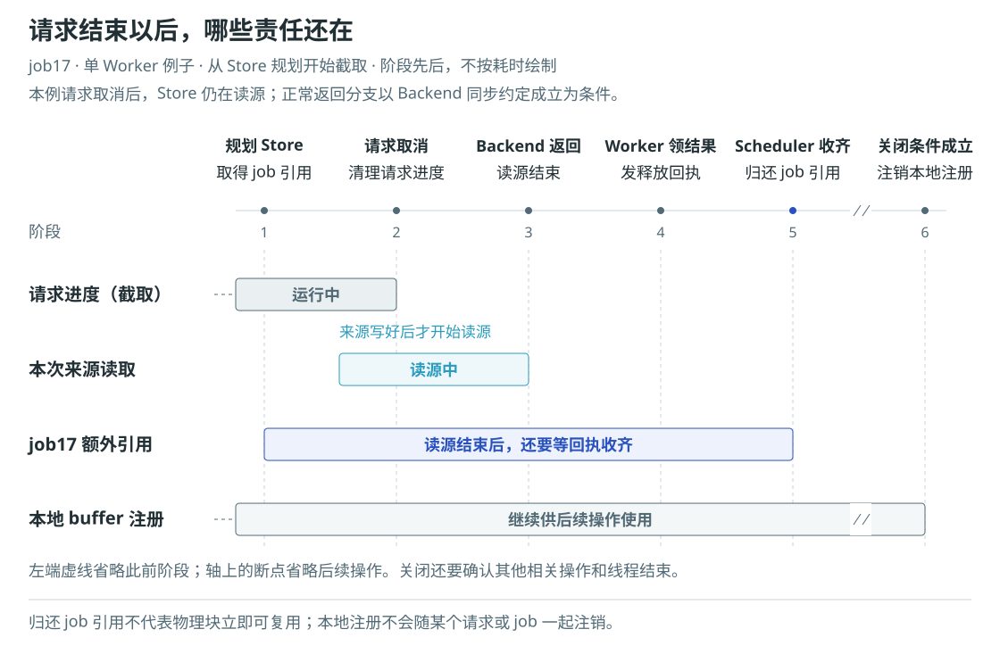

# AscendStore v1 架构设计概览

AscendStore 把已经计算过的 KV 缓存保存到外部存储，让后续请求复用相同前缀。请求先查询可用对象，再把需要的数据读回自己的缓存；模型计算出新的 KV 后，也可以将它保存到池中。

本文介绍 AscendStore v1 的总体架构、主要流程和关键设计。内容以 `ascendstore-v1` 分支中的实现为基础，只展开影响组件职责、数据关系和资源寿命的选择。具体组合和实现细节会随代码演进更新，本文不列完整支持矩阵，也不承担性能评测或原生后端验证报告的职责。

## 1. 背景与设计目标

vLLM 的本地前缀缓存受当前实例的缓存容量限制。外部 KV 池可以保留更多历史，并让不同请求按内容查找可复用的数据。命中以后，请求就能少计算一段已有前缀。

接入外部存储时，查询、传输和模型计算各有自己的进度。远端存在一个 key，不表示数据已经恢复到本地；模型已经写出 KV，也不表示后台保存已读完来源。请求结束时，仍可能有 Store 正在使用它的缓存。

因此，设计需要处理三个问题：

- **选对数据。** 找到各缓存组共同需要的前缀，保持对象身份、分片和本地布局一致。
- **排好顺序。** 加载完成后才能使用目标；来源写好后才能保存；读源结束后才能修改来源。
- **管住寿命。** 为尚未结束的操作保留缓存和注册资源，取得相应完成结果后再释放。

重构以生产实现的业务逻辑为参照。结构调整保留请求规划和传输语义；发现确定的错误时，再依据具体路径修正。可以复用的布局计算提前准备，本次请求的选择和状态仍沿显式主线处理。

## 2. 总体架构

vLLM 负责请求调度、缓存分配和模型执行。AscendStore 通过 Connector 接收这些阶段的回调，在 Scheduler 侧形成计划，在 Worker 侧执行传输。两侧通过消息交接，实际 KV 字节由 Worker 调用 Backend 读写。

| 组件 | 主要负责什么 |
| --- | --- |
| Connector | 转交 vLLM 回调，传递命令和返回结果 |
| Scheduler | 查询并采用远端命中，规划 Load／Store，维护请求进度和 Store 来源引用 |
| Worker | 接入本地缓存，选择传输对象，保留请求与 job 归属，处理执行结果 |
| Projection | 根据内容身份和缓存布局，计算恢复位置、对象 key 及字节范围 |
| Timeline | 安排提交、等待和执行顺序，管理队列与逐层执行进度 |
| Backend Port 与适配器 | 约定访问和完成语义，将操作交给 Mooncake、Memcache 等原生后端 |

这里的 Scheduler 是 AscendStore 在调度进程中的规划组件。它使用 vLLM 提供的请求与分配信息，不接管模型调度。Worker 也使用 ModelRunner 已经分配的缓存，不另建一份模型 KV。

Scheduler 持有 token 范围、block 表和内容 hash。Worker 持有实际 Tensor/view、地址布局和 Backend 实例。同一命令到达不同 Worker 后，由各自的本地布局转换成地址。

构建阶段还有三份辅助信息。vLLM Adapter 解析上层配置并创建实例；Topology 记录缓存组、物理层和分片身份；RouteSpec 保存启动时的路径选择。它们让运行阶段沿已选好的结构推进。

## 3. 主要工作流程

### 3.1 初始化与缓存注册

启动配置先确定 Bulk、Layerwise 以及相应的执行路径。此时已经知道缓存规格，但还没有实际缓存地址。

ModelRunner 分配缓存后，Worker 接收 Tensor/view，提取基址、块长度、块步长和层区间，并绑定 Projection。所选 Backend 若要求预先登记本地内存，Worker 同时完成注册，随后启动 Timeline。

布局参数用于计算传输位置，注册范围用于满足传输库的内存访问要求。多个 view 可以共享底层 storage；Worker 按这份分配组织覆盖范围，同时保留各 view 自己的起点和步长。注册本地内存不会创建远端对象。

### 3.2 查询、采用与加载

Lookup 使用前缀 hash 和缓存身份查询远端对象。Worker 收集各组的可用性，再由 Reachability 计算共同恢复位置。FullAttention 需要相应历史 KV，Mamba 需要准确位置的状态；共同终点必须同时满足这些需求。

稀疏保留仅控制 Store。Lookup 不按写入间隔过滤候选，避免漏掉输入末端和其他请求留下的恢复数据；哪些对象能支持恢复，仍由上游 manager 根据缓存类型和实际可用对象判断。

Lookup 返回的是恢复候选。vLLM 确认采用并分配目标块后，Scheduler 才能将它交接成 Load 命令。命令携带范围、完整分组 block 表和内容身份，Worker 据此选择目标位置。

下面用一个普通 Prefill 例子串起范围。Prefill 是为已有输入计算缓存的阶段。本例输入长 25 token，采用同步 Bulk、单 FullAttention group，TP、PP、PCP、DCP 均为 1，块和 hash 粒度均为 4；普通保存丢弃不足整块的尾部。

查询从本地终点 4 到对齐后的输入终点 24，得到远端命中到 8。采用后，Load 范围为 `[4,8)`。若完整 block 表为 `[5,9,14,18,22]`，这个范围对应逻辑块 1，Worker 从表中取出物理 block 9，再计算它在各 entry 中的地址。

entry 表示用于传输的一个实际 Tensor/view。一个对象可以收集多个 entry 的内存段；读取时按约定顺序填回这些段。命令描述位置和身份，KV 字节仍留在缓存或后端中。

### 3.3 计算与后台保存

把前面的范围放回两侧交接，可以看到计划、执行和回执各自在什么时候形成。下图沿用同一例子，Load 成功，Store 按同步约定正常返回并确认读源结束。

Scheduler 在规划时就为 Store job 取得来源引用，并推进已规划的保存终点。引用让来源保持分配，保存终点用来避免重复规划；写入是否成功仍由执行结果决定。

普通 Bulk Store 在后台执行。候选 key 和批次可以先准备，读源前再等 NPU event 完成。后续 fence 领取结果并检查来源安全；回传的释放计数只确认本次读源责任结束，保存结果另行处理。

### 3.4 同一主线上的执行变化

同步 Load 在调用线程内等待结果；异步 Load 提交后保留 pending 请求，后续收集完成结果；Layerwise 则在当前层使用前恢复数据，并可提前加载后续层。

这些路径仍要保持对象身份、字节范围和请求归属一致。变化也可能影响候选准备与命令下发时点，Timeline 则集中处理各路径的等待和执行顺序。

Layerwise Store 逐层写入同一个完整对象。最终收尾检查所需层和复制结果，再对符合条件的对象 commit，确认发布。Layerwise Load 读取已有对象，完成后结束读 session。

### 3.5 投机解码

v1 接受 vLLM 提供的投机解码配置，已有的后端、并行拓扑、私有状态和部分对象限制仍然适用。与生产路径一致，Scheduler 和 Worker 都通过上游 `speculative_config.use_eagle()` 判断是否需要 EAGLE 类处理，不另设方法名白名单。外部命中进入请求的最后一个传输粒度块时，Scheduler 留出重算范围；停在内部块边界的命中保持不变。这个外部缓存策略也不会跟随上游关闭本地尾块丢弃的开关。

Store 继续使用上游确认的 token 范围和 block hash，并按传输粒度对齐。调度中包含但尚未有确认 hash 的草稿位置不进入保存范围；草稿被拒绝后，后续计划使用 vLLM 回退后的计算进度。Key 格式和去重规则不因草稿器改变：已存在的 key 跳过，缺失的 key 才写入，Decode 保存仍受 `save_decode_cache` 控制。Bulk 使用现有收尾流程，在 Drafter 执行完成后记录来源就绪事件，再读取已注册的目标模型与草稿模型缓存。

## 4. 关键设计选择

### 4.1 分开空间计算与执行顺序

Projection 回答“哪个对象、哪些字节”，Timeline 回答“什么时候可以访问”。Worker 准备本次对象和选择结果，Projection 根据已绑定的布局计算 key、地址和长度；Timeline 安排执行，Worker 回调在需要的时点等待并访问这些位置。

PP 改变本地层集合，TP 改变块内 head 分片，多组缓存使用各组自己的布局。它们通过选择 entry 或块内片段形成传输段。Bulk 按对象组织这些段，Layerwise 另加对象内偏移，取出当前层的数据。

位置确定以后，还要满足访问条件。Store 读取来源前要等模型写好，模型使用 Load 目标前要等恢复完成，逐层写入的对象还要完成发布。拆分后，空间规则集中在 Projection，等待与执行推进集中在 Timeline，Worker 保留两者之间的对象和结果归属。

### 4.2 固定布局供批量计算复用

Projection 中有些量随请求变化，有些量在同一份缓存和配置下保持不变。启动配置先确定层区间和分片规则；缓存绑定后，再取得真实基址、shape 和 stride，准备可以复用的数值数组。

先在一个缓存组内看地址计算。用 $i$ 给本次输入的 block 行编号，$b_i$ 是该行的物理 block ID；用 $j$ 给候选传输段编号。段 $j$ 来自 entry $e_j$，相对块起点的偏移为 $\delta_j$，地址为：

$$
a_{i,j}=A_{e_j}+b_iS_{e_j}+\delta_j.
$$

$A_{e_j}$ 是 Tensor/view 的基址，$S_{e_j}$ 是相邻块起点的步长，$\delta_j$ 是块内偏移，三者都以字节计。分片规则和实际布局固定后，每个候选段对应的 entry 与块内偏移也随之确定。换一个请求的 block，只改变这里的 $b_i$。

因此，绑定布局时可以先保存：

$$
\beta_j=A_{e_j}+\delta_j,\qquad
\sigma_j=S_{e_j}.
$$

$\beta_j$ 是这段在物理 block 0 中的起点，$\sigma_j$ 是移到下一块时增加的字节数。本次请求到来后，地址式就变为：

$$
a_{i,j}=\beta_j+b_i\sigma_j.
$$

以一个 token 内 heads 连续排列的 Attention 布局为例：Tensor 基址为 4096，块步长为 64 字节，每块 4 token，每 token 占 8 字节。将 heads 分成两份后，每份在一个 token 中占 4 字节。

令 $t$ 为块内 token 下标，$q\in\{0,1\}$ 为切片下标，这一段的块内偏移为 $\delta=8t+4q$。token 2 的切片 1 因而位于偏移 20，绑定时就能保存段起点 $\beta=4096+20=4116$、步长 $\sigma=64$ 和段长 4 字节。

| 本次物理 block | 已保存的段起点与步长 | 最终地址 |
| --- | --- | --- |
| 3 | $\beta=4116,\ \sigma=64$ | $4116+3\times64=4308$ |
| 7 | 同上 | $4116+7\times64=4564$ |

普通连续片段的块内偏移为 0，直接保存 entry 的基址和步长。PP 选择相应层的 entry 区间；TP 切片则像上例一样，将 token 与 head 的固定偏移合入段起点。两者在本次调用中都可以按 block 行和候选段组成地址矩阵，用 NumPy 广播批量计算。

长度和段选择仍要结合本次输入。连续 token 片段的长度可以随有效 token 数变化；按 token 展开的 TP 片段可以先保存每段长度，再根据本次 token 数筛选有效段。对象掩码决定哪些对象参与，段的排列顺序决定对象字节怎样拼接。

| 时点 | 已知信息 | 可以准备什么 |
| --- | --- | --- |
| 解析启动配置 | 缓存组、层归属与分片规则 | 确定投影路径和对象身份规则 |
| 绑定实际缓存 | 基址、shape、stride 与层区间 | 保存 key 前缀、固定段起点、步长和长度所需参数 |
| 本次请求到来 | block IDs、token 数、选择掩码与内容 hash | 选择对象和段，生成最终地址、长度及完整 key |

布局数组只保存位置描述，不包含 KV 数值。绑定时保留固定模板，地址矩阵在请求到来后按所选 block 生成。key 也保留模型、组和分片等固定前缀，再拼接本次内容 hash。实现使用数组、元组和必要的状态记录，让固定信息反复使用，本次操作的变化继续沿请求主线处理。

### 4.3 Scheduler 和 Worker 各保留一条显式主线

Scheduler 从请求状态出发，经过 Lookup、采用与分配确认，再形成传输命令。新请求、持续运行和抢占恢复分别更新进度，随后回到共同的命令规划和来源保护过程。

Worker 从命令出发，经过对象行、key 选择、批次整理和地址计算，最后调用 Backend 并处理结果。分支只在需要不同处理的地方展开，后续仍保持同一套对象和结果归属。

筛选或合并批次时，Worker 同时保留请求、原始缓存组、物理 block 和 Store job 的对应关系。内部数组可以使用紧凑下标，key 和失败记录继续使用原始组身份。

### 4.4 后端差异留在访问边界

Backend Port 约定本地注册、对象查询、读写和完成结果。适配器负责原生参数、返回值及资源接口，Worker I/O 将本次调用的结果对应回传输来源。

整对象接口按 key 读写完整对象。逐层访问可以使用 KeyRange，以 key 和对象内偏移定位；也可以使用 GVA，在受保护的访问期间取得远端地址，再按地址复制。当前 Layerwise 的 Mooncake 路径使用 KeyRange，Memcache 路径使用 GVA。

这些接口各有自己的容量、保护和发布要求。后端提供什么能力，就按相应的访问方式组织调用；上层保留统一的请求、来源和结果处理主线。

## 5. 状态与资源的生命周期

### 5.1 每份状态按自己的寿命结束

一次模型 Step 结束后，当前命令上下文可以清理，后台操作可能仍在执行。下面以请求取消为例：请求进度已经清理，Store 仍在读源。图中比较请求进度、来源读取、额外引用和本地注册各自的结束时点。

其他状态也按自己的管理者和完成条件清理：

| 状态或资源 | 由谁管理 | 什么时候结束 |
| --- | --- | --- |
| 请求进度 | Scheduler | 请求结束或抢占时清理，恢复时重建 |
| 异步 Load 的 pending 请求 | Worker | 对应 completion 被接收 |
| Store job 的额外来源引用 | Scheduler | 收齐预期 Worker 的来源释放回执 |
| 逐层作业与 session 状态 | Timeline | 作业结果已处理，相应 session 完成收尾 |
| 后台队列与线程 | Timeline | 停止接收提交，处理收尾并确认线程退出 |
| 远端读写保护 | Backend 与对应 session 流程 | 相应访问结束，取得所需结束结果 |
| 本地缓存持有与注册 | Worker 资源所有者 | 满足操作和线程关闭条件，并确认注销、客户端关闭 |

### 5.2 防回收与防覆盖分别处理

source lease 为 Store 使用的块增加引用，防止它们被回收。模型后续原地改写的顺序仍需单独控制。

Timeline 因此还要建立写入、读源和后续修改的顺序：

$$
\text{来源写好}\preceq\text{开始读源}\preceq\text{读源结束}\preceq\text{允许后续修改}.
$$

$\preceq$ 表示先决条件关系。来源 event 连接写入与读源；Store fence 等待后台结果，确认读源结束后才允许后续修改。

### 5.3 保存结果与来源安全分别判断

保存失败时，来源可能已经读完；对象已经发布时，也不能据此推断本次来源读取结束。Worker 分别处理写入结果和来源释放，Backend 则提供相应接口的完成保证。

下面讨论源地址已交给后端的同步 Store。正常返回以 Backend 履行同步读源约定为前提：

| 本次保存结果 | 来源读取状态 | Worker 的处理 |
| --- | --- | --- |
| 保存成功 | 已确认结束 | 回传释放计数，允许继续 |
| 正常返回写入失败码 | 已确认结束 | 记录失败，回传释放计数，允许继续 |
| 异常或结果无法解释 | UNKNOWN | 保留未确认的 pending Store，阻止正常继续 |

后台任务发出完成通知后，Worker 还要检查这些结果。队列处理完毕、线程退出或 Future 销毁，都不能单独证明原生读源已结束。若原生调用只确认提交，适配器还需要对应的完成等待，才能兑现 Port 的约定。

### 5.4 关闭前确认操作和线程结束

Worker 先处理未收尾的 Store，再关闭 Load／Store Timeline，确认后台线程退出。Store 来源仍未确认时，本地缓存与注册资源继续保留。条件成立后，才注销 buffer、关闭 Backend，最后清除缓存持有。

注册回滚或注销失败时，资源所有者保留尚未释放的区域，供显式重试。关闭入口已经封闭，只说明不再接收新提交；资源能否交还，仍由操作结果、线程退出和注销结果共同决定。
