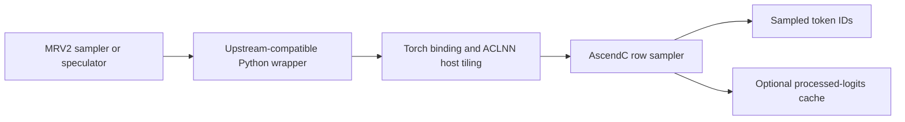

# MRV2 categorical sampling on Ascend

NPU Model Runner V2 uses an AscendC categorical operator for ordinary random sampling. The operator preserves the sampler's request-level seed and position model while avoiding a full-vocabulary random tensor, host synchronization, and a hidden runtime fallback.

This page describes the first integration stage and its contributor-facing contracts. The broader design in [RFC #14130](https://github.com/vllm-project/vllm-ascend/issues/14130) also proposes routing speculative rejection resampling through this operator in a follow-up change.

The integration targets the vLLM v0.26 sampler contract used by the matching vLLM Ascend release. A newer vLLM main revision renamed the processed-logits outputs to a logits cache and changed both its dtype and temperature ordering. That main2main migration is a semantic change rather than a keyword-only rename and must update the producer and native cache contract together.

## Mental model

The sampling path has four layers with distinct ownership:

1. The MRV2 sampler and speculators own processed logits, request mappings, temperatures, seeds, positions, and optional processed-logits cache storage.
2. The Python wrapper preserves the upstream release contract, normalizes only non-strided metadata, and dispatches the native operator.
3. The Torch binding and host tiling validate static tensor and platform properties and create the launch description.
4. AscendC validates row data, performs greedy or categorical selection, writes the optional cache, and returns sampled token IDs.

The operator samples a categorical distribution directly from stable exponential weights. It does not materialize Gumbel noise for every vocabulary entry, and its random state is derived only from the mapped request seed and the row's logical position.

## Sampling flow

Each logits row maps to request state through `expanded_idx_mapping`. A mapping value of `-1` denotes an ACLGraph padding row: it returns token `0` and does not read request metadata, consume random state, or write the cache. Every other mapping must address valid temperature and seed state.

Temperature zero is the greedy sentinel and selects the first maximum. For a nonzero temperature, the operator optionally applies temperature scaling, finds the row maximum, computes stable weights `exp(logit - max)`, and selects the first token whose cumulative weight crosses a stateless uniform draw. Logits may be FP16, BF16, or FP32; reductions and the optional cache use FP32.

The default path uses a 32-bit random draw and FP32 weight accumulation. `use_fp64=True` selects a higher-precision path based on a 64-bit Philox-derived draw and 64-bit fixed-point masses. It does not change input or output dtypes and does not imply FP64 vector arithmetic on the NPU. The purpose of this mode is to preserve tail resolution for precision-sensitive categorical distributions.

Ordinary MRV2 sampling invokes the wrapper after logits processing. Speculators use the same wrapper when producing draft tokens and may write request-indexed processed logits into a two-dimensional cache or into a selected scalar/per-token column of a three-dimensional cache. Rejection and bonus-token resampling remain in the existing Ascend rejection-sampler implementation and do not call this operator in this integration stage.

## Validation and exceptional values

Validation is split according to where information is available:

- The Torch binding checks devices, dtypes, ranks, shapes, contiguous vocabulary dimensions, supported strides, and cache layout.
- Host tiling independently validates static shapes, attributes, dtype selection, vocabulary bounds, and available vector cores.
- AscendC checks data-dependent request mappings, cache columns, NaNs, and rows containing only negative infinity before externally visible row writes.

Positive infinity is valid. A categorical row containing positive infinities samples uniformly among those positions; a greedy row selects the first positive infinity. Its log-sum-exp result is positive infinity. Padding rows are not inspected, so padding storage may contain otherwise invalid logits.

Device-side failures use a static diagnostic followed by a trap. This keeps eager and ACLGraph behavior aligned and avoids diagnostic output tensors or a normal-path device-to-host synchronization.

## Layout and size constraints

The implementation preserves these layout rules:

- The vocabulary dimension is contiguous.
- A normal row stride is at least the vocabulary size; a zero row stride is accepted for broadcast logits.
- Arbitrary overlapping nonzero row layouts are rejected.
- Mapping and position tensors contain one value per logits row.
- Optional cache columns are selected by one scalar `int32` value or one `int32` value per row.
- The processed-logits cache is FP32 and has shape `[requests, vocab]` or `[requests, columns, vocab]`.
- The supported vocabulary range is from 1 through 1,048,576 entries.

The Python wrapper makes the expanded mapping, logical positions, and optional cache-column metadata contiguous. It does not silently copy or cast logits, temperature, seed, or cache tensors.

## Hardware registration

A2 and A3 register the operator through the general custom-operator initialization path. A5 keeps the global custom-operator gate disabled because unrelated operator coverage is incomplete, but loads this ACLNN operator from the packaged custom OPP library and registers the same Torch schema. Absence or registration failure is reported as an error; sampling does not silently fall back to CPU or the former Triton implementation.

All three device generations share the operator schema, kernel behavior, and mandatory correctness suite. Their build and loading paths remain localized so platform-specific initialization does not leak into the sampling algorithm.

## Invariants and current limits

Changes to this path must preserve these invariants:

1. A request's sample depends on its logits, mapped temperature and seed, and logical position, not unrelated batch rows or ACLGraph padding.
2. Greedy and padding rows do not advance mutable random state.
3. Invalid row data fails before sampled-token, LSE, or cache writes for that row.
4. The production path contains no host `.item()`, full-vocabulary random tensor, or silent algorithm fallback.
5. A2, A3, and A5 expose the same public behavior despite different registration paths.

FP64 speculative rejection resampling is outside this integration stage and remains unsupported by the existing Ascend rejection sampler. Non-FP64 rejection resampling continues to use its existing Triton implementation.

## Extension and debugging anchors

When changing the upstream sampler contract, update the Python wrapper, cache semantics, native schema, and cross-version tests together. In particular, the post-v0.26 logits-cache migration changes whether values are stored before or after temperature and which dtype owns the cache; treating it as a keyword-only migration is unsafe.

For registration failures, first distinguish the A2/A3 general initializer from the A5 packaged custom OPP path, then verify that the native extension, operator package, and Torch schema come from the same build. For numerical errors, separate logits processing, request mapping, random key construction, and categorical selection before comparing distributions.

Repository test placement and CI registration rules are documented in the [testing guide](../contribution/testing.md). General ACLNN operator construction is documented in [Adding a custom aclnn operation](add_custom_aclnn_op.md).
