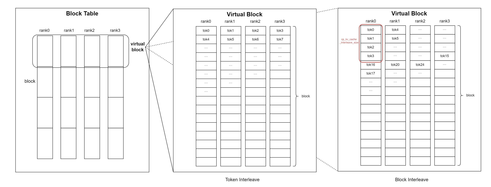
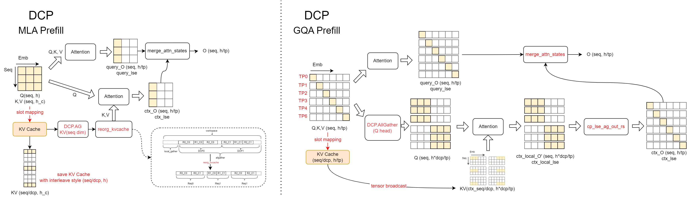
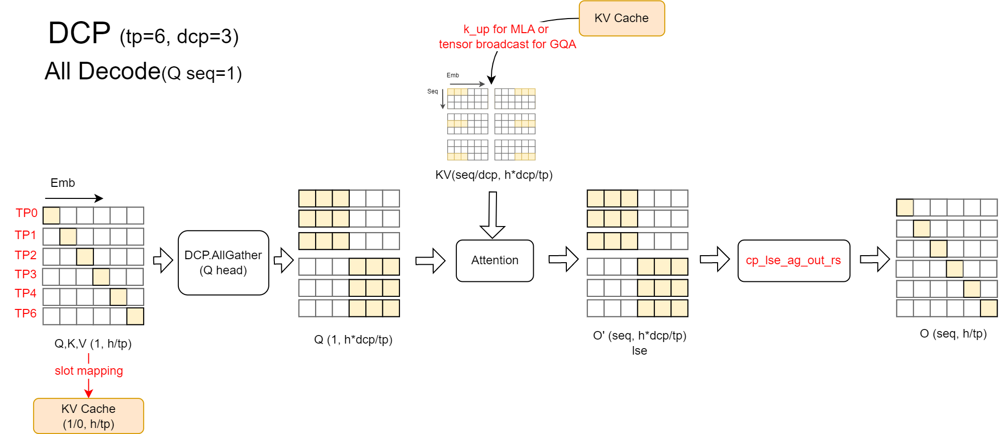

# Decode Context Parallel (DCP)

Decode Context Parallel shards the KV cache along the sequence dimension across devices in a Tensor Parallel (TP) group. It eliminates redundant KV-cache storage without adding devices to the process world.

Prefill Context Parallel is not supported by vLLM Ascend. This document describes only DCP and the separate DSA-CP sparse-attention path.

## KV-cache layout

DCP stores tokens in an interleaved layout across ranks. The interleaving granularity is controlled by `cp_kv_cache_interleave_size`, whose default value is `1`.

For a DCP size of `dcp_size`, a virtual block contains `block_size * dcp_size` tokens. For token `x`:

- `virtual_block_index = x // (block_size * dcp_size)`
- `offset_in_virtual_block = x % (block_size * dcp_size)`
- `local_block_index = offset_in_virtual_block // cp_kv_cache_interleave_size`
- `target_rank = local_block_index % dcp_size`

The slot-mapping calculation uses this layout so each DCP rank stores only its local sequence shard. The current implementation requires `block_size % cp_kv_cache_interleave_size == 0`.



## Attention execution

### Backend structure

DCP is implemented as a specialization of the corresponding v1 attention
backend rather than as a parallel copy of it:

- `DCPMetadataBuilderMixin` owns DCP group/rank discovery and access to the
  per-rank context-length matrix.
- `DCPImplMixin` owns DCP collectives and the common partial-output/LSE merge.
- GQA, MLA, and SFA DCP builders inherit their v1 metadata builders. They only
  add DCP metadata fields or temporarily expose the DCP-specific cache view.
- GQA, MLA, and SFA DCP implementations inherit their v1 implementations and
  override only the kernel stages whose communication or cache layout differs.

The normal v1 builders remain the source of truth for request classification,
padding, masks, graph metadata, and common KV-cache metadata. DCP-specific
metadata is kept out of the normal v1 metadata schemas.

### Prefill and chunked prefill

During chunked or cached prefill, the local query must attend to KV-cache shards distributed across the DCP group.

- MLA gathers the context KV cache, restores request-contiguous order, and computes attention for the current query chunk.
- GQA gathers query heads across the DCP group, computes attention against each local KV shard, and combines partial outputs and LSE values.



### Decode

Decode gathers the query heads required by each DCP rank, computes attention against the local KV-cache shard, and combines partial outputs and LSE values across the DCP group.



### GLM-5.2 SFA DCP replicated indexer

GLM-5.2 uses Sparse Flash Attention (SFA) with a LightningIndexer. For DCP,
the indexer needs a full-sequence view to select the same sparse top-k blocks
as non-DCP SFA, while the much larger SFA KV cache should remain sharded to
retain DCP's memory benefit:

- The LightningIndexer cache is replicated on every DCP rank, so index
  selection uses the complete sequence.
- The SFA KV cache remains DCP-local. Global indices from the replicated
  indexer view are remapped to local KV indices before SFA runs.
- During prefill or a mixed batch, only KV blocks referenced by the sparse
  block table are compacted and all-gathered after the current layer writes its
  KV cache.
- Decode-only batches retain the DCP SFA Q-gather and result-merge path.

This mode is selected automatically for SFA sparse models when
`prefill_context_parallel_size=1` and `decode_context_parallel_size>1`. It
requires `decode_context_parallel_size == tensor_parallel_size`.

For a GLM-5.2 DSA-CP deployment, enable FlashComm1 and DSA-CP and keep the CP
interleave size equal to the KV-cache block size:

```bash
export VLLM_ASCEND_ENABLE_FLASHCOMM1=1

vllm serve <glm-5.2-model> \
  --tensor-parallel-size <N> \
  --prefill-context-parallel-size 1 \
  --decode-context-parallel-size <N> \
  --block-size <B> \
  --cp-kv-cache-interleave-size <B> \
  --additional-config '{"enable_dsa_cp": true}'
```

The replicated indexer increases indexer-cache memory in proportion to the
DCP world size; the SFA KV cache itself remains sharded.

## SFA DSA-CP mixed `o_proj` path

SFA DSA-CP mixed execution reuses the normal TP-sharded `o_proj`. DSA-CP is controlled independently through `additional_config.enable_dsa_cp`; it is not Prefill Context Parallel.

- Decode-only batches keep the decode TP path. SFA outputs are exchanged with an all-to-all in the TP group, then the TP-sharded `o_proj` runs normally.
- Prefill or mixed batches all-gather the TP-sharded `o_proj` weight and input-sharded quantization parameters into reusable temporary full-weight buffers before the projection.

The original TP-sharded parameter remains the only persistent source of truth. Temporary full-weight buffers must not become a second persistent parameter copy.

## Related files

- Slot mapping: `vllm_ascend/worker/block_table.py`
- Input and attention metadata: `vllm_ascend/worker/model_runner_v1.py`
- Shared DCP backend capabilities: `vllm_ascend/attention/context_parallel/common_cp.py`
- GQA DCP backend: `vllm_ascend/attention/context_parallel/attention_cp.py`
- MLA DCP backend: `vllm_ascend/attention/context_parallel/mla_cp.py`
- SFA DCP backend: `vllm_ascend/attention/context_parallel/sfa_cp.py`
- DSA-CP backend: `vllm_ascend/attention/context_parallel/dsa_cp.py`
