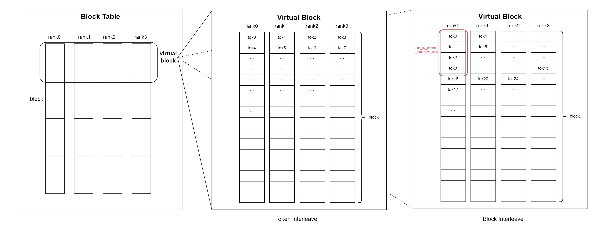
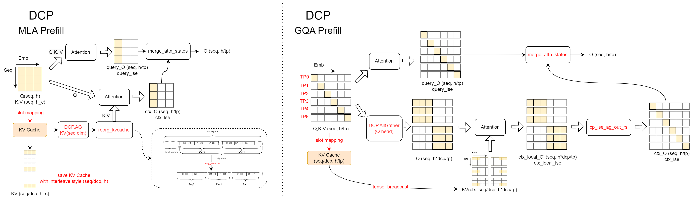
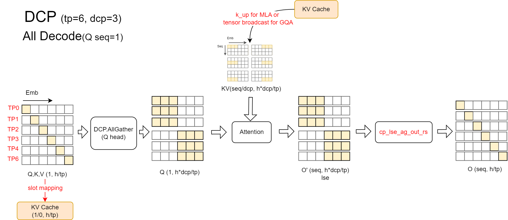

# Context Parallel

Decode Context Parallel shards the KV cache along the sequence dimension across devices in a Tensor Parallel (TP) group. It eliminates redundant KV-cache storage without adding devices to the process world.

This document also describes MRV2 Prefill Context Parallelism (PCP) for
Sparse Flash Attention (SFA), and the separate DSA-CP sparse-attention path.
These are related because they all affect attention metadata and cache layouts,
but they solve different parallelization problems and have independent
configuration switches.

## MRV2 SFA Prefill Context Parallelism (PCP)

### Scope and invariants

MRV2 PCP is selected by `prefill_context_parallel_size > 1`. It partitions a
prefill batch by tokens across a PCP group, while preserving a cache view that
is complete on every PCP rank. Its SFA implementation is deliberately small:
it reuses the normal SFA implementation and overrides only the points at which
PCP changes data ownership.

The key invariants are:

- Prefill tokens are partitioned between PCP ranks by the upstream PCP batch
  manager. Decode tokens are replicated, because every rank participates in a
  decode step.
- SFA latent KV, RoPE `cos`/`sin`, and indexer keys are gathered before a cache
  write. `PCPManager` has already built the corresponding gathered slot-mapping
  layout from the global batch. Thus every PCP rank writes the same complete
  SFA and indexer cache.
- Prefill attention output is already the local token slice with the full head
  set. Decode query heads can be split by PCP by upstream metadata, so the
  output is restored with `finalize_mla_pcp_decode`.
- PCP does not use the DSA-CP/FlashComm1 data protocol. The current supported
  graph mode is eager prefill plus `FULL_DECODE_ONLY` graph replay.

### Execution path

1. `AscendPCPManager` derives the PCP-local `AscendInputBatch` from the global
   MRV2 batch. It refreshes `seq_lens_np`, attention state, and the padded
   decode-only layout required by graph replay.
2. `AscendSFABackend` selects `AscendSFACPMetadataBuilder` and
   `AscendSFACPImpl` when PCP is enabled. The builder intentionally remains
   thin: upstream PCP owns token partitioning and the normal SFA builder still
   owns SFA metadata construction.
3. `AscendSFACPImpl.exec_kv` gathers the prefill portion of latent KV, `cos`,
   and `sin` before native RMSNorm/RoPE/cache write. It directly consumes the
   gathered slot mapping produced by `PCPManager`; SFA performs no additional
   slot-mapping handling or collective. The `cos`/`sin`
   gather is essential: the gathered KV must be rotated with the positions from
   which it was produced.
4. `AscendSFACPImpl._write_indexer_cache` applies the same key/scale gather
   protocol to the LightningIndexer cache and uses the matching gathered slot
   mapping. This keeps sparse top-k selection deterministic across PCP ranks.
5. `AscendSFACPImpl._execute_sparse_flash_attention_process` calls
   `finalize_mla_pcp_decode` after SFA. The call is a no-op for prefill and
   reconstructs the full decode head layout when PCP split decode heads.

### Graph capture

A normal MRV2 capture builds a global dummy batch, but PCP replay consumes a
PCP-local batch and PCP-local slot mappings. `_prepare_pcp_inputs_to_capture`
therefore passes the dummy batch through `AscendPCPManager.partition_batch` and
`prepare_attn` before building capture metadata. Dummy attention metadata is
marked `DecodeOnly`, so capture never enters prefill-only PCP cache gathers.
`AscendPCPManager.prepare_dummy_attn` also returns the same block-table and
slot-mapping buffers used by replay, preserving graph input addresses.

### Last three commits of PR #13038

| Commit | Responsibility |
| --- | --- |
| `a1710d0` (`stash for cherry-pick 1`) | Adds the SFA PCP implementation: backend dispatch, native preprocessing, replicated SFA/indexer cache writes, and PCP decode-output restoration. |
| `2617cbb` (`stash for cherry-pick 2`) | Connects PCP to MRV2 worker execution: PCP-local batch metadata, graph capture inputs, split SFA indexer cache allocation/reshape/bind, and cache-only backend handling during graph parameter updates. |
| `7e7d837` (`fix rebase bug`) | Removes a residual V1 model-runner change, keeping this feature scoped to MRV2. |

The split indexer cache is intentionally represented by a cache-only backend:
the indexer owns physical cache storage but never executes an attention kernel.
During graph parameter updates the runtime must therefore select the real SFA
backend, rather than the first cache-only indexer backend.

### PCP and DSA-CP are different features

| Aspect | MRV2 SFA PCP | DSA-CP |
| --- | --- | --- |
| Primary goal | Scale prefill by partitioning batch tokens across a PCP group. | Optimize DSA sparse attention for indexer models by changing its attention parallel layout. |
| Enablement | `prefill_context_parallel_size > 1`. | `additional_config.enable_dsa_cp=true` and FlashComm/SP enabled. |
| Applicability | Current implementation is MRV2, MLA/SFA focused. | Only models with a DSA indexer, such as DeepSeek V3.2/V4-family compatible models. |
| Data ownership | Prefill tokens are PCP-local; SFA and indexer caches are replicated after gather. | DSA-CP keeps heads replicated and shards tokens in its CP layout; it also has a distinct output and `o_proj` protocol. |
| Output reconciliation | Decode-only head shards are restored by `finalize_mla_pcp_decode`. | DSA-CP uses its own all-to-all/partial-output merge and may temporarily gather a full `o_proj` weight for prefill or mixed batches. |
| Graph boundary | PCP supports eager prefill and `FULL_DECODE_ONLY` capture. | Its behavior is controlled by the existing DSA-CP/FlashComm path, not by the PCP manager. |

`enable_dsa_cp` must therefore not be treated as the PCP switch. PCP can use
the normal SFA path with `enable_dsa_cp=False`; DSA-CP changes the semantics of
that SFA path even when no MRV2 PCP group is present. This PR does not make the
combined PCP + DSA-CP mode a separately validated feature contract.

### Sparse-C8 and DSA-CP cache-write ownership

The original native SFA flow already centralizes this distinction in
`_maybe_store_kvcache_for_c8_n_dsacp`:

- For ordinary SFA C8, it packs `k_nope`, `k_pe`, and `k_nope_scale` and
  scatters them with `slot_mapping_sfa`.
- For DSA-CP, it waits for the DSA-CP gather path and uses the DSA-CP-specific
  representation and slot-mapping protocol instead.

The PR's `2617cbb` also added an earlier inline branch,
`if self.use_sparse_c8_sfa and not self.enable_dsa_cp`, immediately after
`exec_kv`. That branch duplicates the ordinary-C8 scatter, because the original
helper is still called later in the same forward. Therefore it is **not** a PCP
requirement and should be removed; it causes two equivalent scatter writes for
the `(C8=true, DSA-CP=false)` case. Its `not self.enable_dsa_cp` predicate only
avoids applying that duplicate ordinary-SFA write to the DSA-CP layout. The
correct design is to retain the existing centralized helper. The native path
therefore calls `_maybe_gather_kv_for_dsacp` rather than maintaining a second
inline DSA-CP gather implementation.

## KV-cache layout

DCP stores tokens in an interleaved layout across ranks. The interleaving granularity is controlled by `cp_kv_cache_interleave_size`, whose default value is `1`.

For a DCP size of `dcp_size`, a virtual block contains `block_size * dcp_size` tokens. For token `x`:

- `virtual_block_index = x // (block_size * dcp_size)`
- `offset_in_virtual_block = x % (block_size * dcp_size)`
- `local_block_index = offset_in_virtual_block // cp_kv_cache_interleave_size`
- `target_rank = local_block_index % dcp_size`

The slot-mapping calculation uses this layout so each DCP rank stores only its local sequence shard. The current implementation requires `block_size % cp_kv_cache_interleave_size == 0`.



## Attention execution

### Backend structure

DCP is implemented as a specialization of the corresponding v1 attention
backend rather than as a parallel copy of it:

- `DCPMetadataBuilderMixin` owns DCP group/rank discovery and access to the
  per-rank context-length matrix.
- `DCPImplMixin` owns DCP collectives and the common partial-output/LSE merge.
- GQA, MLA, and SFA DCP builders inherit their v1 metadata builders. They only
  add DCP metadata fields or temporarily expose the DCP-specific cache view.
- GQA, MLA, and SFA DCP implementations inherit their v1 implementations and
  override only the kernel stages whose communication or cache layout differs.

The normal v1 builders remain the source of truth for request classification,
padding, masks, graph metadata, and common KV-cache metadata. DCP-specific
metadata is kept out of the normal v1 metadata schemas.

### Prefill and chunked prefill

During chunked or cached prefill, the local query must attend to KV-cache shards distributed across the DCP group.

- MLA gathers the context KV cache, restores request-contiguous order, and computes attention for the current query chunk.
- GQA gathers query heads across the DCP group, computes attention against each local KV shard, and combines partial outputs and LSE values.



### Decode

Decode gathers the query heads required by each DCP rank, computes attention against the local KV-cache shard, and combines partial outputs and LSE values across the DCP group.



### GLM-5.2 SFA DCP replicated indexer

GLM-5.2 uses Sparse Flash Attention (SFA) with a LightningIndexer. For DCP,
the indexer needs a full-sequence view to select the same sparse top-k blocks
as non-DCP SFA, while the much larger SFA KV cache should remain sharded to
retain DCP's memory benefit:

- The LightningIndexer cache is replicated on every DCP rank, so index
  selection uses the complete sequence.
- The SFA KV cache remains DCP-local. Global indices from the replicated
  indexer view are remapped to local KV indices before SFA runs.
- During prefill or a mixed batch, only KV blocks referenced by the sparse
  block table are compacted and all-gathered after the current layer writes its
  KV cache.
- Decode-only batches retain the DCP SFA Q-gather and result-merge path.

This mode is selected automatically for SFA sparse models when
`prefill_context_parallel_size=1` and `decode_context_parallel_size>1`. It
requires `decode_context_parallel_size == tensor_parallel_size`.

For a GLM-5.2 DSA-CP deployment, enable FlashComm1 and DSA-CP and keep the CP
interleave size equal to the KV-cache block size:

```bash
export VLLM_ASCEND_ENABLE_FLASHCOMM1=1

vllm serve <glm-5.2-model> \
  --tensor-parallel-size <N> \
  --prefill-context-parallel-size 1 \
  --decode-context-parallel-size <N> \
  --block-size <B> \
  --cp-kv-cache-interleave-size <B> \
  --additional-config '{"enable_dsa_cp": true}'
```

The replicated indexer increases indexer-cache memory in proportion to the
DCP world size; the SFA KV cache itself remains sharded.

### SFA DSA-CP `o_proj` Path

SFA DSA-CP execution intentionally reuses the normal TP-sharded `o_proj`.
This applies both to a mixed-role instance and to a PD-disaggregated P node; it is not a standalone user-facing `o_proj` TP switch.
The runtime path supports two layouts:

- **Decode-only batches** keep the decode TP path.
  SFA outputs are exchanged with an all-to-all in the TP group, then the original TP-sharded `o_proj` runs normally.
- **Prefill or mixed batches**, including batches on a PD-disaggregated P node, produce SFA outputs that are not directly compatible with the TP-sharded `o_proj` input layout.
  Before `o_proj` forward, each rank all-gathers the TP-sharded `o_proj` weight and all input-sharded quantization parameters into temporary full-weight buffers.
  The full-weight `o_proj` forward runs once for that batch, and the module is then restored to the TP parameter aliases.

The storage invariant is that the original TP-sharded `o_proj` parameter remains the only persistent source of truth.
`o_proj_tp_*` tensors are aliases of the original parameter storage.
`o_proj_full_*` tensors are reusable communication buffers for prefill/mixed full-gather execution only.
They must not become a second persistent copy of the TP weight.

This coupling preserves the existing decode TP behavior, supports prefill/mixed DSA-CP batches on both mixed-role and P-only instances, and avoids a persistent full-weight copy on every TP rank.

## Related Files

- Slot mapping: `vllm_ascend/worker/block_table.py`
- Input and attention metadata: `vllm_ascend/worker/model_runner_v1.py`
- Shared DCP backend capabilities: `vllm_ascend/attention/context_parallel/common_cp.py`
- GQA DCP backend: `vllm_ascend/attention/context_parallel/attention_cp.py`
- MLA DCP backend: `vllm_ascend/attention/context_parallel/mla_cp.py`
- SFA DCP backend: `vllm_ascend/attention/context_parallel/sfa_cp.py`
- DSA-CP backend: `vllm_ascend/attention/context_parallel/dsa_cp.py`
