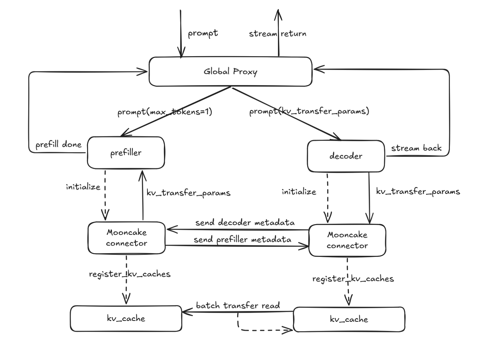
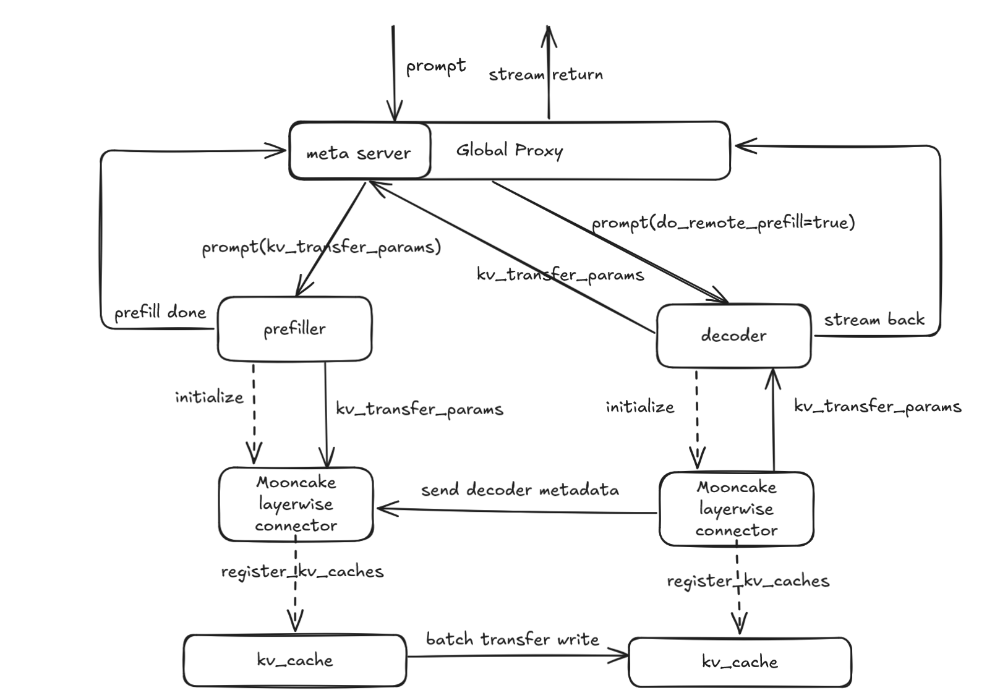

# Disaggregated-prefill

## Why disaggregated-prefill?

This feature addresses the need to optimize the **Time Per Output Token (TPOT)** and **Time To First Token (TTFT)** in large-scale inference tasks. The motivation is two-fold:

1. **Adjusting Parallel Strategy and Instance Count for P and D Nodes**  
   Using the disaggregated-prefill strategy, this feature allows the system to flexibly adjust the parallelization strategy (e.g., data parallelism (dp), tensor parallelism (tp), and expert parallelism (ep)) and the instance count for both P (Prefiller) and D (Decoder) nodes. This leads to better system performance tuning, particularly for **TTFT** and **TPOT**.

2. **Optimizing TPOT**
   Without the disaggregated-prefill strategy, prefill tasks are inserted during decoding, which results in inefficiencies and delays. Disaggregated-prefill solves this by allowing for better control over the system's **TPOT**. By managing chunked prefill tasks effectively, the system avoids the challenge of determining the optimal chunk size and provides more reliable control over the time taken for generating output tokens.

---

## Usage

vLLM Ascend currently supports two types of connectors for handling KV cache management:  

- **MooncakeConnector**: D nodes pull KV cache from P nodes.
- **MooncakeLayerwiseConnector**: P nodes push KV cache to D nodes in a layered manner.  

For step-by-step deployment and configuration, refer to the following guide:  
[PD disaggregation multi-node deployment guide](https://docs.vllm.ai/projects/ascend/en/latest/tutorials/features/pd_disaggregation_mooncake_multi_node.html)

---

## How It Works

### 1. Design Approach

Under the disaggregated-prefill, a global proxy receives external requests, forwarding prefill to P nodes and decode to D nodes; the KV cache (key-value cache) is exchanged between P and D nodes via peer-to-peer (P2P) communication.

### 2. Implementation Design

Our design diagram is shown below, illustrating the pull and push schemes respectively.



#### Mooncake Connector

1. The request is sent to the Proxy's `_handle_completions` endpoint.
2. The Proxy calls `select_prefiller` to choose a P node and forwards the request, configuring `kv_transfer_params` with `do_remote_decode=True`, `max_completion_tokens=1`, and `min_tokens=1`.
3. After the P node's scheduler finishes prefill, `update_from_output` invokes the schedule connector's `request_finished` to defer KV cache release, constructs `kv_transfer_params` with `do_remote_prefill=True`, and returns to the Proxy.
4. The Proxy calls `select_decoder` to choose a D node and forwards the request.
5. On the D node, the scheduler marks the request as `RequestStatus.WAITING_FOR_REMOTE_KVS`, pre-allocates KV cache, calls `kv_connector_no_forward` to pull the remote KV cache, then notifies the P node to release KV cache and proceeds with decoding to return the result.

#### Mooncake Layerwise Connector

1. The request is sent to the Proxy's `_handle_completions` endpoint.
2. The Proxy calls `select_decoder` to choose a D node and forwards the request, configuring `kv_transfer_params` with `do_remote_prefill=True` and setting the `metaserver` endpoint.
3. On the D node, the scheduler uses `kv_transfer_params` to mark the request as `RequestStatus.WAITING_FOR_REMOTE_KVS`, pre-allocates KV cache, then calls `kv_connector_no_forward` to send a request to the metaserver and waits for the KV cache transfer to complete.
4. The Proxy's `metaserver` endpoint receives the request, calls `select_prefiller` to choose a P node, and forwards it with `kv_transfer_params` set to `do_remote_decode=True`, `max_completion_tokens=1`, and `min_tokens=1`.
5. During processing, the P node's scheduler pushes KV cache layer-wise; once all layers pushing is complete, it releases the request and notifies the D node to begin decoding.
6. The D node performs decoding and returns the result.

### 3. Interface Design

Taking MooncakeConnector as an example, the system is organized into three primary classes:

- **MooncakeConnector**: Base class that provides core interfaces.
- **MooncakeConnectorScheduler**: Interface for scheduling the connectors within the engine core, responsible for managing KV cache transfer requirements and completion.
- **MooncakeConnectorWorker**: Interface for managing KV cache registration and transfer in worker processes.

### 4. Specifications Design

This feature is flexible and supports various configurations, including setups with MLA and GQA models. It is compatible with A2 and A3 hardware configurations and facilitates scenarios involving equal TP setups and certain unequal TP setups across multiple P and D nodes.

| Feature                       |      Status    |
|-------------------------------|----------------|
| A2                            | 🟢 Functional  |
| A3                            | 🟢 Functional  |
| equal TP configuration        | 🟢 Functional  |
| unequal TP configuration      | 🟢 Functional  |
| MLA                           | 🟢 Functional  |
| GQA                           | 🟢 Functional  |

- 🟢 Functional: Fully operational, with ongoing optimizations.
- 🔵 Experimental: Experimental support, interfaces and functions may change.
- 🚧 WIP: Under active development, will be supported soon.
- 🟡 Planned: Scheduled for future implementation (some may have open PRs/RFCs).
- 🔴 NO plan/Deprecated: No plan or deprecated by vLLM.

---

## DFX Analysis

### 1. Config Parameter Validation

Validate KV transfer config by checking whether the kv_connector type is supported. On transfer failures, emit clear error logs for diagnostics.

### 2. Port Conflict Detection

Before startup, perform a port-usage check on configured ports (e.g., rpc_port, metrics_port, http_port/metaserver) by attempting to bind. If a port is already in use, fail fast and log an error.

### 3. PD Ratio Validation

Under non-symmetric PD scenarios, validate the P-to-D tp ratio against expected and scheduling constraints to ensure correct and reliable operation.

---

## Limitations

- Heterogeneous P and D nodes are not supported, for example, running P nodes on A2 and D nodes on A3.

- In non-symmetric TP configurations, only cases where the P nodes have a higher TP degree than the D nodes and the P TP count is an integer multiple of the D TP count are supported (i.e., P_tp > D_tp and P_tp % D_tp = 0).

## Mooncake Connector V2 KV leases

Renewable producer KV retention is enabled by default with a 480-second lease.
Override it on P through `kv_connector_extra_config`:

```json
{"kv_lease_duration": 480}
```

The value must be a finite number of at least 6 seconds. Omission selects 480
seconds; `null` is rejected. V2 always uses this lease for retention and no
longer reads `VLLM_MOONCAKE_ABORT_REQUEST_TIMEOUT`. Upgrade P and D
together when using renewal. The proxy must preserve `kv_lease_version` and
`kv_lease_duration` along with the other transfer parameters. D uses P's duration.

With the default lease, each P engine receives a heartbeat every 80 seconds
after the initial heartbeat. Each renewal extends its deadline to at least
320 seconds after receipt, without shortening the existing deadline. Socket
I/O timeouts remain 1000 ms by default; they are separate from the lease.

D uses two independent scheduler child threads:

- `MooncakeHeartbeatThread` registers requests on arrival, including requests
  waiting for local blocks, and renews them every `duration / 6` seconds. It uses
  a locked request table and an Event for wakeup, with network I/O outside the
  lock. New requests and removals wake the thread without depending on model
  forward calls or scheduler steps.
- `MooncakeSchedulerRecvingThread` consumes `(host, port, P request ID)` tuples
  from its DONE queue. Send and receive helpers attempt at most `done_max_attempts` times (default 3);
  exhausted tasks are logged and dropped. ACK retries do not block heartbeats.

The threads own separate sockets. Heartbeats use one send/receive attempt with
`lease_io_timeout_ms` timeouts (default 1000 ms). A failed snapshot is discarded; the next interval uses the
current active requests. After `heartbeat_max_attempts` consecutive failed
heartbeat rounds (default 3: the initial attempt plus two retries at the regular
interval), D stops renewing the
affected requests. A successful ACK resets their failure counts. Requests added
during an in-flight heartbeat do not inherit its failures. This only stops
renewal; it does not fail D requests or send DONE. P eventually reclaims KV when
the lease expires. An inaccessible P can still delay other P heartbeats.

P uses monotonic deadlines and renews only existing, unexpired requests to
`max(old_deadline, now + duration * 2 / 3)`. Expired, missing and completed
requests are never resurrected. Expiration scans all leases, and actual block
release follows the scheduler's `finished_sending` path.

D stops heartbeats when reception completes, no remote read is needed, or the
request finishes or aborts. Aggregate receive completion and zero-read paths
send DONE; cancellation alone does not imply that outstanding reads have ended.
A heartbeat already in flight may finish after removal, but P ignores renewals
for completed requests. D's local request ID is used for membership; P's request
ID and engine ID are used on the wire.

This change only adds renewal. It does not add `failed_recving` reporting,
completion-time lease validation, or automatic request failure on heartbeat
errors. Existing transfer-error handling remains unchanged. A permanently hung
read can continue renewing until cancellation. If a lease expires and P reuses
its blocks, transfer success alone does not prove the KV still belongs to the
request; lease-expiry failure handling remains follow-up work.

D accepts these optional `kv_connector_extra_config` settings; omitted values
preserve the defaults. All four values must be positive integers (not booleans).

| Field | Default | Meaning |
| --- | --- | --- |
| `control_io_timeout_ms` | 1000 | Each DONE socket send and receive timeout, in milliseconds |
| `done_max_attempts` | 3 | Maximum attempts per DONE send/receive helper, including the first attempt |
| `lease_io_timeout_ms` | 1000 | Each heartbeat socket send and receive timeout, in milliseconds |
| `heartbeat_max_attempts` | 3 | Consecutive failed heartbeat rounds before stopping renewal, including the first attempt; a successful ACK resets the count |

For example, configure the consumer with:

```json
{
  "kv_connector": "MooncakeConnectorV2",
  "kv_role": "kv_consumer",
  "kv_connector_extra_config": {
    "control_io_timeout_ms": 2000,
    "done_max_attempts": 3,
    "lease_io_timeout_ms": 1000,
    "heartbeat_max_attempts": 3
  }
}
```

These settings apply to D's scheduler control threads, not worker KV transfer
or metadata-fetch timeouts. `done_max_attempts` counts helper attempts rather
than whole DONE/ACK round trips; receive retries do not resend DONE. Heartbeats
still attempt once per interval. Configure `kv_lease_duration` on P separately.
