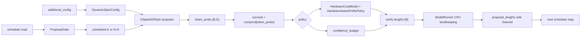

# 硬件感知动态投机解码设计与实现

## 概述

本文描述 vLLM Ascend 中硬件感知动态投机解码的当前实现。该功能建立在 DSpark/DFlash 动态投机解码基础上：离线采集目标模型验证阶段的硬件代价，运行时结合 draft token 置信度、硬件延迟曲线和调度负载，动态决定是否启动投机解码以及每个请求实际验证的 draft token 数量。

本文覆盖以下内容：

- 硬件 profile 的生成、加载和 shape 查找；
- DSpark/DFlash 置信度到 per-request 验证长度的转换；
- Hardware-aware prefix policy 的 goodput 优化逻辑；
- ProposalGate 的调度负载保护；
- ModelRunner、scheduler 和旧版本 vLLM 的兼容接入；
- 当前版本的性能优化、测试结果和已知限制。

基础动态投机解码能力来自 vLLM Ascend 已有的置信头和动态长度实现（对应 PR [#13216](https://github.com/vllm-project/vllm-ascend/pull/13216) 和 [#13819](https://github.com/vllm-project/vllm-ascend/pull/13819)）。硬件感知逻辑全部位于 vllm-ascend，未修改 vLLM 源码。

## 支持范围与边界

### 目标

硬件感知模块需要解决三个问题：

1. 固定 K 无法适应 Ascend 不同验证 shape 的阶梯式延迟；
2. 只依赖置信度会在硬件 shape 切换处选择不经济的验证长度；
3. 高负载或 prefill 场景下启动 draft model 可能增加整体延迟。

因此，方案将决策拆成两层：

- ProposalGate：基于 scheduler CPU 计数器决定当前 batch 是否允许启动投机解码；
- HardwareAwarePrefixPolicy：在允许投机后，根据置信度和硬件 profile 选择总预算及 per-request prefix 长度。

### 非目标

- 不在服务运行时自动重新采集硬件 latency profile；
- 不改变目标模型验证算子的实现；
- 不修改 vLLM 仓库文件；
- 不在设备侧动态修改 graph 的最大 proposal width。

## 适配目标与范围

支持的动态方法和策略由 [ascend_config.py](../../../../vllm_ascend/ascend_config.py#L468) 定义：

| 项目 | 当前范围 |
| --- | --- |
| 动态方法 | `dspark`、`dflash` |
| 动态策略 | `confidence_budget`、`hardware_aware` |
| 目标执行路径 | vLLM Ascend model runner v1 |
| 硬件 profile | `latency_ms`、`sps` 或离线 tuner 生成的 `hardware_profile` |
| 调度保护 | 可选 `ProposalGate`，只使用 scheduler CPU 计数器 |
| graph 策略 | 设备 tensor 保持最大宽度，CPU 侧维护逻辑 proposal 长度 |

## 上游组件分析

### 动态投机解码已有能力

动态调度器的公共流程位于 [utils.py](../../../../vllm_ascend/spec_decode/utils.py#L233)：

```text
方法相关置信度
    -> token_probs [B, D]
    -> cumulative survival [B, D]
    -> batch 级 verify budget
    -> per-request verify lengths [B]
```

DSpark 使用 confidence head 输出的 logits，经 sigmoid 得到条件接受概率。DFlash 没有 confidence head，使用 drafted token 的最大 softmax 概率作为置信度代理。两种方法在得到 `token_probs` 后复用同一套预算分配逻辑。

### 上游边界

vLLM 负责通用 scheduler、request 状态和 model runner 接口。vllm-ascend 负责：

- Ascend 硬件 profile 和代价模型；
- per-request 动态 proposal length；
- Ascend scheduler 中的 ProposalGate 调用；
- 老版本 vLLM 缺少 `proposal_lengths` 字段时的运行时兼容。

## 方案总览



核心约束是：ProposalGate 控制“是否启动 draft model”，HardwareAwarePrefixPolicy 控制“启动后每个请求保留多少 draft token”。两者不是互相替代的两个策略。

## 离线硬件 profile

### 采集方法

离线 profile 由 [offline_DSD_k_tuner/manager.py](../../../../examples/offline_DSD_k_tuner/manager.py#L98) 生成。tuner 对不同 `batch_size` 和 draft `K` 进行 sweep，记录 ITL 和接受率，然后将观测转换成运行时可查找的目标验证 latency。

对每个采样点，profile key 为：

```text
token_batch_size = batch_size * (1 + K)
```

其中 `1` 是每个请求的 bonus token。ITL 会乘以该 K 下的期望接受长度，得到目标模型完成一次验证步骤的近似 latency。多个采样点映射到相同 token batch size 时取中位数。

### Profile 格式

最小 profile：

```json
{
  "schema_version": 1,
  "fingerprint": {
    "device": "Ascend910",
    "graph_mode": "FULL_DECODE_ONLY",
    "tp": 4
  },
  "latency_ms": {
    "8": 1.2,
    "16": 1.8,
    "32": 3.0,
    "64": 5.5
  }
}
```

也可以使用 SPS：

```json
{
  "sps": {
    "16": 520.0,
    "32": 333.0
  }
}
```

当前测试中使用过的 profile 是手工估计的 inline profile，不是真实离线采样结果。因此测试结论主要用于验证策略逻辑和相对回归，生产部署应使用目标模型、draft 模型、dtype、TP 和 graph mode 完全匹配的真实 profile。

### `HardwareCostModel`

实现位于 [cost_model.py](../../../../vllm_ascend/spec_decode/dynamic/cost_model.py#L30)。主要行为：

- `from_dict()` 读取 inline profile；
- `from_json()` 读取 `profile_path`；
- `sps` 自动转换为 `latency_ms`；
- 支持 `hardware_profile` 嵌套结构；
- 支持 fingerprint 严格校验；
- 对稀疏 latency key 采用“向上取最近 shape”；
- 对超过最大 profile shape 的查询使用最大 profile shape。

加载完成后，`HardwareAwarePrefixPolicy` 将小型 latency 表拷贝到 device tensor，避免每个候选预算都进行 Python 字典查找。

## 在线硬件感知策略

### 置信度和 survival

给定条件接受概率 `q[b, i]`，调度器计算：

```text
survival[b, i] = q[b, 0] * q[b, 1] * ... * q[b, i]
```

`survival[b, i]` 表示请求 `b` 能够完整通过第 `i` 个 draft token 的估计概率。

可选的 per-position temperature calibration 位于 [calibration.py](../../../../vllm_ascend/spec_decode/dynamic/calibration.py)。temperature 可以直接配置，也可以从 profile 的 `confidence_temperatures` 读取。

### Goodput 目标

设：

- `B`：当前请求数；
- `m`：全 batch 选中的 draft token 总数；
- `mandatory_accepts`：所有请求的 mandatory prefix survival 之和；
- `P(m)`：按 survival 排序后选中的额外 prefix survival 之和；
- `L(x)`：硬件 profile 对验证宽度 `x` 的 latency。

实际验证宽度必须包括每个请求的 bonus token：

```text
verify_width = B + m
```

候选 goodput 为：

```text
expected_accepts = B + mandatory_accepts + P(m)
goodput(m) = expected_accepts / L(B + m)
```

`HardwareAwarePrefixPolicy.allocate()` 枚举候选总预算，选择 goodput 最大的预算，再将额外 token 分配给全 batch 中 survival 最大的位置。

### Prefix 合法性

每个请求的 survival 在位置维度上单调递减。因此，如果选中了同一请求的第 `i` 个位置，那么它之前的位置具有不低于它的 survival，也会优先被选中。全局 top-k 选择后仍然能形成每个请求的合法 prefix。

### 预算缓存

策略缓存 `_best_total_tokens`，只有以下情况触发全局预算重算：

- batch size 变化；
- 实际 draft width 变化；
- 最小预算变化；
- 达到 `decision_interval`；
- 第一次调用。

全局预算不重算时，策略仍然会根据最新 survival 为每个请求分配 prefix 长度。

## ProposalGate

实现位于 [proposal_gate.py](../../../../vllm_ascend/spec_decode/dynamic/proposal_gate.py#L20)。Gate 是 scheduler-side、CPU-only 的滞回控制器。

### 进入低负载 profile

需要同时满足：

- 没有等待请求；
- 当前没有 prefill；
- `num_running / max_num_seqs <= enter_ratio`；
- 平均 scheduled token 不超过 `max_avg_scheduled_tokens`。

连续满足 `enter_steps` 次后，允许使用配置的 K。

### 退出低负载 profile

出现以下任意条件时进入高负载状态：

- 存在等待请求；
- 存在 prefill；
- `num_running / max_num_seqs >= exit_ratio`；
- 平均 scheduled token 超过上限。

连续满足 `exit_steps` 次后返回 `K=0`。`exit_ratio` 默认不低于 `enter_ratio`，用于防止阈值抖动。

### Scheduler 接入

三个 vllm-ascend scheduler 在原有动态 K 计算之后调用 gate：

- [dyntra_lb_scheduler.py](../../../../vllm_ascend/core/dyntra_lb_scheduler.py#L1139)；
- [recompute_scheduler.py](../../../../vllm_ascend/core/recompute_scheduler.py#L922)；
- [patch_balance_schedule.py](../../../../vllm_ascend/patch/platform/patch_balance_schedule.py#L792)。

调用顺序为：

```text
原有 batch-size 动态 K
    -> ProposalGate
    -> K 或 0
    -> draft model
```

## 动态长度运行时接入

### Proposer 创建调度器

DSpark 和 DFlash proposer 根据 `DynamicSpecConfig` 创建 `DynamicSpecScheduler`：

- [dspark_proposer.py](../../../../vllm_ascend/spec_decode/dspark_proposer.py#L72)；
- [dflash_proposer.py](../../../../vllm_ascend/spec_decode/dflash_proposer.py#L69)。

### ModelRunner 传递逻辑长度

设备侧 draft graph 仍然可以按最大 K padding 执行，但每个请求实际保留的长度由 `_capture_dynamic_proposal_lengths()` 复制到 CPU：

[model_runner_v1.py](../../../../vllm_ascend/worker/model_runner_v1.py#L1681)

保存形式为：

```python
{
    "request-a": 3,
    "request-b": 5,
    "request-c": 1,
}
```

随后：

1. `take_draft_token_ids()` 按 request id 截断 draft token；
2. `_get_draft_token_ids_cpu()` 处理异步调度的 CPU token；
3. `ModelRunnerOutput.proposal_lengths` 将长度送回 scheduler；
4. scheduler 在下一轮设置请求的逻辑 `spec_token_ids` 长度。

当前实现没有通过动态改变设备 graph shape 来实现 per-request K，避免了 graph 重新捕获和设备 shape 变化。

### 物理 Draft K 自适应

仅截断 `proposal_lengths` 只能减少 target verify 计算，不能减少已经完成的
draft 计算。为此增加了可选的 `adaptive_draft_k`：scheduler 在下一步读取上一
步的最大逻辑 verify 长度，将物理 Draft K 限制为该长度加一个安全 slack。

控制器位于
[draft_k_controller.py](../../../../vllm_ascend/spec_decode/dynamic/draft_k_controller.py)，
特点是：

- 只在 CPU 侧运行，不读取 NPU tensor；
- ProposalGate 返回 `K=0` 时优先服从 gate，但不清除历史推荐值；
- 逻辑长度达到当前物理 K 时逐步增长，避免突然扩大 draft shape；
- 逻辑长度明显低于当前物理 K 时缩短，默认保留一个 token 的 slack；
- 默认关闭，需要在硬件 profile 已校准后显式开启。

配置示例：

```json
"adaptive_draft_k": true,
"adaptive_draft_k_min": 1,
"adaptive_draft_k_slack": 1
```

该控制器通过
[patch_pp_mtp.py](../../../../vllm_ascend/patch/platform/patch_pp_mtp.py)
读取 `ModelRunnerOutput.proposal_lengths` 并回写下一轮 scheduler 的物理 K，
不修改 vLLM 源码。

## vLLM 兼容策略

用户要求不能修改 vLLM，因此兼容代码集中在 [patch_pp_mtp.py](../../../../vllm_ascend/patch/platform/patch_pp_mtp.py)。

### 输出字段兼容

如果当前 vLLM 版本不存在以下字段，vllm-ascend 在运行时补充：

- `ModelRunnerOutput.spec_token_ids`；
- `ModelRunnerOutput.proposal_lengths`；
- `DraftTokenIds.proposal_lengths`。

如果 upstream 已经提供字段，则不重复 patch。

### Scheduler helper 兼容

如果 upstream scheduler 没有 `_apply_ascend_proposal_gate()`，vllm-ascend 动态安装同名 helper，并在 scheduler 初始化时创建 `ProposalGate`。

`update_from_output()` 在 upstream bookkeeping 之后更新下一轮 request 的 proposal length，避免当前输出和下一轮调度使用错位的长度。

该策略使硬件感知模块可以运行在旧版 vLLM 上，同时保持 vLLM 工作树不变。

## 关键性能优化

### 限制硬件全局预算重算同步

实现位于 [utils.py](../../../../vllm_ascend/spec_decode/utils.py#L433)。硬件全局重算包含 device sort 和 `torch.argmax(...).item()`。每个 decode step 执行会引入频繁的 NPU 到 CPU 同步。

当前策略使用：

```python
configured_interval = int(method_params.get("decision_interval", 16))
minimum_interval = int(method_params.get("min_decision_interval", 8))
interval = max(configured_interval, minimum_interval)
```

默认将重算频率限制为至少每 8 步一次。需要严格每步重算时必须显式设置 `min_decision_interval=1`，只建议用于已校准 profile 的对比实验。

### 保留 confidence budget 下限

实现位于 [utils.py](../../../../vllm_ascend/spec_decode/utils.py#L380) 和 [policy.py](../../../../vllm_ascend/spec_decode/dynamic/policy.py#L63)。

硬件 profile 稀疏或不匹配时，纯硬件策略可能选择过小 proposal budget。当前默认：

```text
hardware_total_budget >= ceil(B * confidence_budget_k * 0.8)
```

对应参数为：

```json
"hardware_min_budget_ratio": 0.8
```

profile 经过完整校准后可以设置为 `0`，关闭预算保护。

### 修正 profile 验证宽度

硬件 profile 的 key 是真实目标验证宽度，而不是 proposal token 总数。当前实现使用：

```python
token_counts = candidate_totals + num_reqs
```

这与离线 tuner 的 `batch_size * (1 + K)` 定义保持一致，修复了 bonus token 未计入 latency lookup 的问题。

## 配置示例

### Hardware-aware DSpark

```json
{
  "dynamic_spec_config": {
    "method": "dspark",
    "policy": "hardware_aware",
    "proposal_gate_enabled": true,
    "proposal_gate_params": {
      "enter_ratio": 0.5,
      "exit_ratio": 0.8,
      "enter_steps": 2,
      "exit_steps": 1,
      "max_avg_scheduled_tokens": 32
    },
    "method_params": {
      "profile_path": "/home/vllm/profiles/qwen3-4b-dspark-a3.json",
      "min_verify_tokens": 0,
      "budget_update_interval": 16,
      "budget_threshold": 0.3,
      "decision_interval": 16,
      "hardware_min_budget_ratio": 0.8,
      "adaptive_draft_k": true,
      "adaptive_draft_k_min": 1,
      "adaptive_draft_k_slack": 1,
      "strict_profile_fingerprint": true
    }
  }
}
```

对应的 `speculative_config` 仍然需要配置 DSpark draft model，例如：

```json
{
  "method": "dspark",
  "model": "/home/vllm/weights/Qwen3-4b-dspark",
  "num_speculative_tokens": 5
}
```

### 当前远端测试配置

之前的验证使用 Qwen3-4B、TP=4、设备 3/4/5/6：

```text
HCCL_BUFFSIZE=3072
max_model_len=256
max_num_seqs=16
FULL_DECODE_ONLY
async_scheduling
num_speculative_tokens=5
```

硬件策略使用过的 inline profile 为：

```json
{
  "latency_ms": {
    "1": 0.8,
    "8": 1.2,
    "16": 1.8,
    "32": 3.0,
    "64": 5.5,
    "96": 8.0
  }
}
```

该 profile 是手工估计值，不能替代真实硬件 profile。

## 回退和错误处理

如果 profile 不存在、格式非法、fingerprint 不匹配或 profile 参数不合法，`DynamicSpecScheduler` 会记录 warning 并回退到 `confidence_budget`。

回退规则：

```text
hardware_aware 初始化失败
    -> policy_name = confidence_budget
    -> 清空 cost_model/hardware_policy
    -> 保持原有置信度动态长度路径
```

这样 profile 问题不会阻塞服务启动，也不会影响已有 DSpark/DFlash 动态长度功能。

## 代码模块映射

| 模块 | 主要职责 | 当前实现要点 |
| --- | --- | --- |
| `vllm_ascend/ascend_config.py` | 配置解析 | 校验 method、policy、method_params、gate 参数 |
| `examples/offline_DSD_k_tuner/manager.py` | 离线 profile | sweep latency/接受率，生成 `latency_ms` |
| `spec_decode/dynamic/cost_model.py` | 硬件代价模型 | profile 解析、fingerprint、shape lookup |
| `spec_decode/dynamic/calibration.py` | 置信度校准 | per-position temperature scaling |
| `spec_decode/dynamic/policy.py` | 硬件预算和 prefix | goodput 枚举、全局 top-k、预算缓存、预算下限 |
| `spec_decode/dynamic/draft_k_controller.py` | 物理 Draft K 控制 | 根据上一轮逻辑 verify 长度进行 CPU-only 滞后控制 |
| `spec_decode/dynamic/proposal_gate.py` | 调度负载门控 | CPU-only 滞回控制，输出 K 或 0 |
| `spec_decode/utils.py` | 公共动态调度 | token_probs、survival、confidence budget、硬件策略选择 |
| `spec_decode/dspark_proposer.py` | DSpark 接入 | 创建并调用 `DynamicSpecScheduler` |
| `spec_decode/dflash_proposer.py` | DFlash 接入 | 创建并调用 `DynamicSpecScheduler` |
| `spec_decode/llm_base_proposer.py` | 统一 proposer 调用 | 将 DSpark/DFlash 置信度送入调度器 |
| `worker/model_runner_v1.py` | 动态长度执行 | 读取 per-request 长度、截断 token、输出 side channel |
| `core/dyntra_lb_scheduler.py` | Dyntra scheduler | 调用 ProposalGate |
| `core/recompute_scheduler.py` | Recompute scheduler | 调用 ProposalGate |
| `patch/platform/patch_balance_schedule.py` | Balance scheduler | 调用 ProposalGate |
| `patch/platform/patch_pp_mtp.py` | vLLM 兼容 | 动态补字段、helper、proposal length 和物理 K 更新逻辑 |
| `tests/ut/spec_decode/test_hardware_aware_scheduler.py` | 单测 | cost model、policy、gate、预算下限和物理 K 控制器 |

## 适配实现与验证

### 单元测试

远端容器 `wxx-vllm-022` 中运行：

```bash
cd /home/w00664509/dspark-vllm/hardware-vllm-ascend/vllm-ascend
python -m pytest tests/ut/spec_decode/test_hardware_aware_scheduler.py -q
```

结果：

```text
14 passed
```

### 性能结果

同一组 Qwen3-4B、TP=4、设备 3/4/5/6、并发 4、16 prompts 的历史结果如下：

| 配置 | 输出吞吐 |
| --- | ---: |
| 原硬件感知策略 | 211.50 tok/s |
| 仅加入决策间隔保护 | 227.74 tok/s |
| 当前优化后硬件感知 | 252.16 tok/s |
| 原 confidence baseline | 250.99 tok/s |

当前优化后相比原硬件感知策略提升约 19.2%，相比只加入决策间隔保护的版本提升约 10.7%。当前结果说明优化消除了硬件感知策略的明显性能劣化，并基本恢复到 confidence baseline 水平。

上述硬件测试使用手工估计 profile，且每个配置的正式样本数量有限，不能据此证明稳定的额外收益。正式发布前应使用真实 profile，并对 confidence、hardware-aware、hardware-aware + gate 做交替、多轮、相同服务生命周期的 A/B 测试。

## 已知限制与后续建议

### 已知限制

- profile 当前是启动时加载的静态表，服务运行中不会根据实际 latency 自动更新；
- 当前测试 profile 是手工估计值，不能代表特定 Ascend 型号的真实曲线；
- 稀疏 profile 使用向上取 shape，profile key 过少时可能保守或不够精确；
- 硬件策略的全局重算仍然包含 device sort 和一个标量同步，只是通过 interval 摊销；
- ProposalGate 只感知 scheduler 负载，不感知实时 NPU 利用率、HCCL 拥塞或 kernel 排队；
- `hardware_min_budget_ratio` 过高可能限制硬件策略降 K，过低则可能重新出现 profile 误判导致的性能劣化。
- `adaptive_draft_k` 是实验性优化；如果 profile 不准确，物理 K 可能收缩过快，因此默认关闭并要求显式 A/B 验证。

### 后续建议

1. 为目标硬件、目标模型、draft 模型、TP、dtype 和 graph mode 生成真实 profile；
2. 将 profile fingerprint 与运行时硬件信息绑定，避免跨设备复用；
3. 收集不同并发和输入输出长度下的 profile，而不是只使用单一 batch；
4. 在 `hardware_min_budget_ratio` 为 0.8、0.5、0 三个点上做敏感性测试；
5. 增加运行时统计日志，例如选择的总预算、实际接受长度、profile shape 和 gate 状态；
6. 使用多轮交替 A/B benchmark，分别评估吞吐、TPOT、TTFT、接受率和调度开销。

## 相关提交

硬件感知初始实现：

- `bd09f195f feat: add hardware-aware dynamic speculative decoding`

旧版本 vLLM 兼容实现：

- `c17ff3031 fix: backport dynamic proposal compatibility in ascend`

当前性能和正确性优化：

- `d5801ec3a perf: avoid per-step hardware policy synchronization`
- `a0a7b0b8e perf: keep hardware proposal budget from collapsing`
- `8a2ce794c fix: account for bonus tokens in hardware cost`
- `aad99c4b6 test: align hardware profile fixture with verify width`
