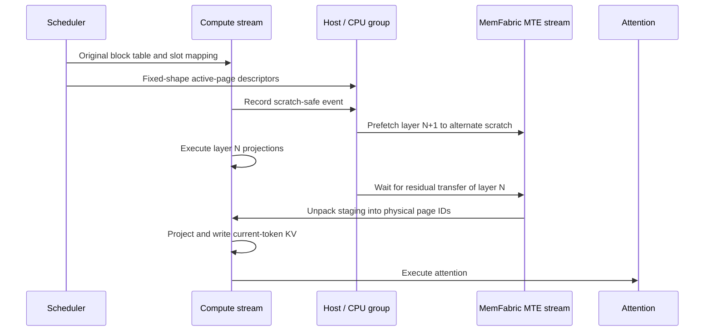

# KV Layer Parallelism

KV Layer Parallelism (KVPP) partitions persistent KV-cache ownership by
transformer layer. Each KVPP rank owns a contiguous bundle of layers and keeps
two alternating scratch caches for layers owned by another rank. Before attention
executes, the owner pushes only the physical KV pages used by the current batch
into the corresponding page IDs of each peer's scratch cache.

KVPP is not limited to decode. The same ownership and transfer rules apply to
prefill, decode, and mixed batches.

This document describes Ascend-owned configuration, worker-local cache
planning, Model Runner V1 and V2 execution, and active-page transport.

## Goals

KVPP is designed to:

- Reduce per-rank KV-cache memory by distributing persistent layer ownership.
- Reuse the existing TP/PCP rank layout without expanding the process world.
- Keep the scheduler's physical block-table and slot-mapping semantics intact.
- Transfer only pages that the current batch can read.
- Avoid whole-layer KV broadcasts and whole-layer staging allocations.
- Keep upstream vLLM unchanged and contain configuration, placement, and
  transport policy in vLLM Ascend.

The implementation uses exactly two alternating scratch buffers and one fixed
schedule: while layer N executes, layer N+1 is transferred into the other
scratch buffer. There is no blocking baseline or runtime overlap-mode switch.

## KVPP, DCP, and PP

KVPP reuses the rank-construction rule used by Decode Context Parallelism
(DCP), but it has different semantics.

| Property | DCP | KVPP |
| --- | --- | --- |
| Partition axis | Token sequence | Transformer layer |
| Persistent KV ownership | Sequence shard | Contiguous layer bundle |
| Process world expansion | No | No |
| Block-table behavior | Sequence-local layout | Original physical page IDs |
| Limited to decode | No | No |

The Ascend parallel-state module constructs a separate `kvpp`
`GroupCoordinator`. DCP and KVPP cannot both have a world size greater than
one. This prevents the KV cache from being partitioned along both layer and
sequence dimensions by independent paths.

KVPP's contiguous layer assignment resembles Pipeline Parallelism (PP), but
it partitions cache ownership only within the layers local to each PP stage.
KVPP does not change activation pipelining. MTP caches that appear in a
worker's local layer list remain unpartitioned by KVPP and are allocated in
full on every KVPP rank on that stage. KVPP does not assume those layers live
only on the last PP rank.

## Configuration and process groups

KVPP is configured with:

```text
--additional-config '{"enable_kvpp": true}'
```

`KVPPConfig` is owned by vLLM Ascend. When enabled, the KVPP size is always
equal to the tensor-parallel size; when disabled, its internal size is one.

`init_ascend_model_parallel()` creates the group and exposes it through
`vllm_ascend.distributed.parallel_state.get_kvpp_group()`. Ascend destroys it
together with its other platform-owned communication groups.

The generic vLLM rank layout allows a KVPP group to be disabled, span the PCP
axis, or span the complete TP x PCP block. PCP plus KVPP is not enabled in the
initial vLLM Ascend implementation.

## Layer ownership

The vLLM cache planner extracts the layer index from each logical cache name
and groups cache entries with the same index into one layer bundle. Bundles are
sorted by layer index and divided into contiguous partitions. If the layer
count is not divisible by the KVPP size, lower ranks receive one additional
bundle.

For eight local layers and `TP=KVPP=2`, the ownership is:

```text
rank 0: layers 0-3
rank 1: layers 4-7
```

It is deliberately not interleaved. Contiguous ownership reduces owner
switches during forward execution and provides a natural basis for future
next-layer prefetching.

Ownership is deterministic. Each Ascend worker computes its physical cache
specification from the same model configuration and logical cache names. The
worker restores the complete logical cache groups before runtime
initialization, so no KVPP fields are added to upstream `KVCacheConfig`.

The number of layer bundles must be at least the KVPP world size.

## KV-cache allocation

Each rank physically allocates:

- Persistent caches for all layers owned by that rank.
- Two alternating scratch caches for all non-owned layers in each KV-cache
  group.

The logical names of non-owned layers are assigned alternately to the two
scratch tensors through their `shared_by` lists. Consequently, the existing
cache binding mechanism presents the correct scratch storage without changing
the model's logical layer names.

All non-owned layers sharing a scratch cache must have identical cache specs.
The planner rejects a group containing incompatible shapes, dtypes, or cache
layouts. The initial Ascend implementation further requires exactly one
KV-cache group and a non-hybrid MLA model.

For `L` uniform layers and a KVPP world size `K`, a rank uses approximately:

```text
L / K persistent layer caches + 2 scratch layer caches + 1 staging layer bundle
```

The final block count is reduced to the minimum block count calculated for any
worker so that all ranks expose the same physical page address space.

Staging is included in the post-profile memory budget, not allocated outside
`gpu_memory_utilization`. The Ascend worker obtains the physical KV bytes per
block from the existing allocator (including scratch, MTP and layout padding),
and reserves one complete largest managed layer bundle per block for staging.
The bundle includes both MLA KV and indexer caches when applicable. Layers
reuse the same staging allocation; MTP caches are not transferred.
Scratch allocation still uses each corresponding layer's original KV spec.
Different owners may therefore have different scratch layouts or counts.
The equal-sized MemFabric SHM contribution covers the largest transferable
bundle in the KVPP group, not the sum of a rank's persistent or scratch caches.

For an available budget `B`, physical KV bytes per block `C`, and staging
bytes per block `S`, choose the largest integer `N` satisfying
`N * C + align_up(N * S, 2 MiB) <= B`. Only `N * C` is returned to the upstream
KV planner. After upstream reduces the block count across workers, the Ascend
worker derives the aligned staging size from that final count and passes it
to the transport. No upstream configuration fields or
scheduler changes are needed. An explicit `kv_cache_memory_bytes` budget also
includes staging when KVPP is enabled; an oversized block-count override is
rejected at the worker's budget entry point, before the engine applies it.
Elastic EP scale-up launches skip this memory-planning entry point and are
therefore rejected when KVPP is enabled; ordinary EP remains supported.

The transport checks the real cache tensors against this reservation and
requires identical staging capacities and per-bundle wire layouts within each
KVPP group before creating shared memory. This is a MemFabric/transfer
requirement, not a requirement that rank-local scratch allocations match.
Local tensor addresses and strides may differ. Staging covers all physical pages like one scratch bundle,
but each transfer still copies only active pages.

## Metadata invariants

KVPP preserves the scheduler's original physical block table and slot mapping.
The batch metadata order is:

1. Gather the original block table.
2. Derive the batch's active physical pages from the CPU block-table mirror.
3. Pass the original device block table to attention.
4. Compute slot mapping from the original table and positions.
5. Pass the original slot mapping to the cache-write operators.

The initial implementation therefore has identity views:

```python
block_table_view(default) is default
slot_mapping_view(physical) is physical
```

An owner page with physical ID `P` is written directly to page `P` of each
peer's scratch cache. There is no compact block table, page renumbering, or
KVPP-specific slot-mapping rewrite. This keeps model-specific slot-mapping
logic isolated from KVPP.

## Active-page selection

KVPP combines the device block table with host-resident sequence lengths to
build fixed-shape MTE descriptors without a device-to-host synchronization.

For every request:

```text
pages_in_request = ceil(sequence_length / block_size)
```

Only block-table entries covered by this range are selected. Invalid page IDs
are discarded, and the remaining IDs are deduplicated and sorted. Transfers
therefore exclude unreferenced capacity and do not copy an entire cache layer.

## Architecture boundaries

The implementation has four one-way layers:

1. The common Ascend worker owns `KVPPConfig`, the KVPP process group, owner
   calculation, physical cache planning, and scratch aliases. It returns the
   worker-local physical spec to the unmodified vLLM allocator and restores the
   logical view before model-runner initialization.
2. The Ascend model runner is the composition root. It discovers executable
   attention layers, creates the MTE transport, injects it into
   `KVPPScheduler`, and binds the scheduler through the attention
   implementation's layerwise cache hook.
3. `KVPPScheduler` owns active-page selection, forward lifecycle,
   one-layer-ahead prefetch, scratch lifetime, and cross-rank notifications.
4. `MemFabricMTEKVPPTransport` owns registration, cache metadata, staging,
   MTE copies, unpack, and transport completion.

Attention implementations use one layerwise operation: `wait_for_layer`.
They do not
import or understand KVPP, MemFabric, ownership, scratch buffers, or MTE. This
is the stable extension boundary for future layerwise cache services.

The scheduler depends directly on `MemFabricMTEKVPPTransport`; there is no
unused transport protocol or backend-selection layer. MemFabric MTE is the
only data plane. Owners
copy selected persistent pages into each consumer's bounded symmetric staging
segment; consumers then unpack those pages into the original physical IDs of
their current scratch buffer.

KVPP-specific placement algorithms are isolated in
`vllm_ascend/core/kv_cache_placement.py` and invoked by the common Ascend
worker. Transport and runtime lifecycle code never enter vLLM core.

Before vLLM starts, make the installed MemFabric Hybrid package available and
configure its store:

```bash
export MEMFABRIC_HYBRID_HOME_PATH=<installed-memfabric-hybrid-path>
export MF_CONFIG_STORE_URL=<store-url>
```

Staging capacity is planned automatically; `ASCEND_KVPP_MTE_STAGING_BYTES`
has been removed and no longer controls allocation. The MTE core count remains
configurable. There is no transport-backend selection variable.

## Execution flow

The batch and layer execution flow is:



The first layer starts its transfer in `begin_forward`. Once a
layer's transfer is remotely visible, KVPP immediately starts the next layer's
transfer into the alternate scratch buffer. Current-token KV writes and
attention wait only for the residual part of the current transfer.

All ranks compute the current token's KV values. On the owner, those writes
land in the layer's persistent cache. On non-owners, they land in the shared
scratch cache and may be overwritten after the layer completes. Thus only the
owner retains the layer's long-term KV state.

### SFA cache bundles

Main SFA and Lightning Indexer caches form one transport bundle. MTE assigns
non-overlapping staging ranges to every tensor in that bundle and uses the
same layout for owner push and consumer unpack. This prevents the indexer push
from overwriting Main KV before the consumer receives it.

DSA-CP compatibility is intentionally deferred. Its KVPP lifecycle integration
cannot be accepted until the prerequisite GLM sequence-parallel path is
functionally validated. DCP remains unsupported with KVPP.

## Correctness invariants

The implementation maintains the following invariants:

1. Every logical layer has exactly one KVPP owner.
2. Only the owner's cache is persistent state for that layer.
3. A non-owner scratch cache is valid only for the current layer execution.
4. A scratch cache cannot be overwritten until all ranks finish the preceding
   layer's attention.
5. Current-token KV writes cannot race with the owner's historical-page push.
6. Owner and destination use the same physical page ID.
7. Only pages referenced by the current batch are transferred.
8. KVPP does not change scheduler block allocation or slot-mapping semantics.
9. Main and Indexer cache tensors use disjoint ranges in bundle staging.

## Supported configuration

The initial vLLM Ascend implementation requires:

| Capability | Requirement |
| --- | --- |
| Model runner | Ascend Model Runner V2 |
| Attention | Non-hybrid MLA |
| KV-cache groups | One KVPP-managed Target group; MTP groups are allocated in full on each KVPP rank |
| Execution mode | Eager |
| Pipeline parallelism | Disabled |
| PCP | Disabled |
| DCP | Disabled when KVPP is enabled |
| DSA-CP | Deferred pending SP validation |
| Speculative decoding | Fixed-step MTP in eager mode |
| KV connectors and offload | Disabled |
| MemFabric protocol | MTE |

Unsupported combinations fail during configuration or cache initialization
rather than silently selecting a different cache layout.

## Fixed overlap schedule

Two scratch buffers alternate by transformer-layer index. A compute-stream
event prevents reuse until the earlier attention consumer has been submitted.
The communication worker exchanges per-layer ready/done notifications and
runs MTE staging copy and unpack away from the model execution thread. The
only supported schedule prefetches exactly one layer ahead.

## Validation coverage

The commits add tests for:

- KVPP and DCP mutual exclusion.
- KVPP overlay-group construction.
- Contiguous layer ownership.
- Owned caches plus two alternating scratch allocations.
- Rejection of incompatible scratch specs.
- CPU block-table access.
- Active-page filtering, deduplication, and ordering.
- MTE device descriptors for masked pages and multiple cache tensors.
- Non-overlapping Main/Indexer bundle staging for SFA models.
- Owner staging and consumer unpack into original physical page IDs.
- Identity block-table and slot-mapping views.

The supported target is a non-hybrid MLA model with `KVPP=TP`. Model Runner V1
and V2, pipeline parallelism, fixed-length MTP, chunked prefill, prefix cache,
expert parallelism, and sparse MLA/SFA cache layouts share the same placement
model. DCP and PCP remain mutually exclusive with KVPP.

## Related files

vLLM Ascend:

- Configuration: `KVPPConfig` in `vllm_ascend/ascend_config.py`
- KVPP process group: `vllm_ascend/distributed/parallel_state.py`
- Placement policy: `vllm_ascend/core/kv_cache_placement.py`
- Worker integration: `vllm_ascend/worker/worker.py`
- Feature validation: `vllm_ascend/platform.py`
- Model Runner V1 integration: `vllm_ascend/worker/model_runner_v1.py`
- Model Runner V1 KVPP adapter: `vllm_ascend/worker/kvpp_v1.py`
- Model Runner V2 integration: `vllm_ascend/worker/v2/model_runner.py`
- KVPP execution plan, batch lifecycle, and scheduler:
  `vllm_ascend/worker/v2/kvpp.py`
- MemFabric MTE transport:
  `vllm_ascend/distributed/kv_transfer/kv_pool/memfabric_mte_transport.py`
- MLA attention integration: `vllm_ascend/attention/mla_v1.py`
