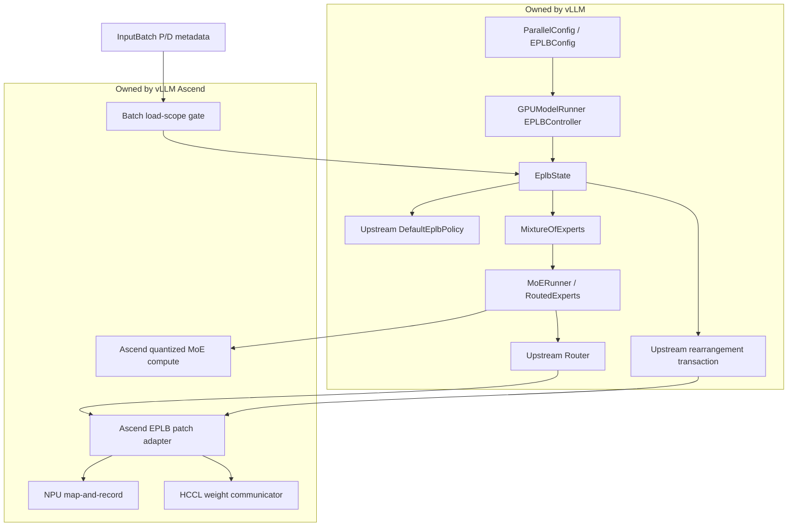
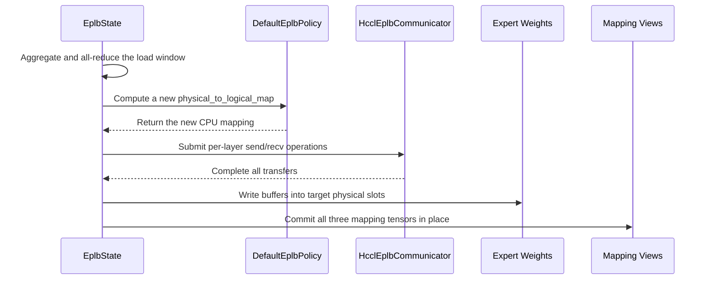

# Model Runner V2 EPLB Upstream Integration Design Specification

## 1. Overview and Goals

### 1.1 Document Information

| Item | Description |
| --- | --- |
| Status | Design frozen; Phase 1 implementation in progress |
| Date | 2026-07-22 |
| vLLM Ascend baseline | `upstream/main`, commit `885b6aa90` |
| vLLM release baseline | `v0.25.1`, as pinned by `.github/vllm-release-tag.commit` |
| vLLM main verification baseline | `54503ecec0f3ac31e5ecfc5f28652e4cc42307b5`, as pinned by `.github/vllm-main-verified.commit` |
| Scope | Ascend NPU Model Runner V2, hereafter referred to as MRV2 |
| Delivery constraint | At most two phases, with a total schedule of no more than two months |

In this document, "upstream EPLB" specifically refers to the vLLM
`EPLBController`, `EplbState`, `EplbLayerState`, upstream Router, default
balancing policy, and weight rearrangement flow. "Legacy EPLB" refers to
`vllm_ascend/eplb/` and its call chain in Model Runner V1.

### 1.2 Decision

MRV2 EPLB adopts a single architecture consisting of an upstream control plane,
Ascend device implementations, and focused patch-based integration.
Configuration, lifecycle management, model registration, state, load windows,
balancing policy, rearrangement transactions, and coordination between the main
and draft models all use upstream implementations. vLLM Ascend provides only the
NPU mapping and load-recording operator, the P/D batch collection switch, NPU
stream/event adaptation, HCCL weight communication, and quantized weight views.
For current delivery, downstream patches guarantee compatibility with two fixed
upstream baselines. In the long term, the same hardware boundary will be
consolidated into an upstream device-backend interface.

Implementation is divided into two phases, both using the same interfaces and
state model. Phase 1 disables asynchronous rearrangement and delivers a complete
synchronous EPLB path. Phase 2 only adds asynchronous execution, ACL Graph,
speculative decoding, pipeline parallelism, and the remaining quantization
combinations; it does not replace the Phase 1 architecture.

### 1.3 Background and Problem Statement

#### 1.3.1 Current Implementation

Model Runner V1 directly manages `EplbProcess`, `EplbUpdator`,
`D2DExpertWeightLoader`, and `VllmEplbAdaptor` in
`vllm_ascend/worker/model_runner_v1.py`, and inserts independent counters, policy
calculation, and layer-by-layer weight replacement before and after forward
execution.

The legacy implementation also maintains its own:

- `additional_config.eplb_config` and `DYNAMIC_EPLB`;
- `global_expert_map`, `_expert_map`, `log2phy`, and `moe_load`;
- downstream policies such as Swift, FlashLB, and Random;
- independent EPLB process groups, subprocesses, and a device-to-device weight
  movement state machine;
- hard-coded expert-weight name tables for each quantization type.

MRV2 already inherits from the upstream
`vllm.v1.worker.gpu.model_runner.GPUModelRunner`, but two explicit blockers
remain:

- `vllm_ascend/worker/v2/model_runner.py` rejects `dynamic_eplb` during
  initialization;
- the same file retains an empty `eplb_warmup()` and does not connect any
  effective state.

MoE layers already use the upstream `FusedMoE -> MoERunner -> RoutedExperts`
factory structure. However, `AscendMoERunner` still initializes legacy EPLB
state, and Ascend quantization methods still repeat expert selection inside
their respective `apply()` methods instead of consuming the physical expert IDs
produced by the upstream Router.

#### 1.3.2 Capabilities Already Available Upstream

vLLM `v0.25.1` already provides:

- `ParallelConfig.enable_eplb` and `EPLBConfig`;
- `EPLBController` management of model loading, main/draft model registration,
  forward preparation, and steps;
- `EplbState` management of the expert-load window, default policy,
  synchronous/asynchronous rearrangement, and stable tensor views for graph
  mode;
- `EplbLayerState` references to per-layer load, logical-to-physical mapping,
  and replica counts;
- a unified Router location for logical expert selection, physical expert
  mapping, and load recording;
- model and weight interfaces including `MixtureOfExperts`, `MoERunner`, and
  `RoutedExperts.get_expert_weights()`;
- `get_eplb_group()`, independent of EP forward communication;
- synchronous and asynchronous expert-weight rearrangement flows.

#### 1.3.3 Gaps in Upstream Support for Ascend

All remaining gaps are at device-specific boundaries:

1. `ParallelConfig` uses `current_platform.is_cuda_alike()` to determine EPLB
   capability, so the current OOT NPU platform is rejected.
2. The Router's `eplb_map_to_physical_and_record()` registers a Triton
   implementation only for CUDA/ROCm; non-CUDA-like platforms return the
   original logical expert IDs.
3. The EPLB asynchronous thread, event, and communication implementations still
   assume `torch.cuda.Stream/Event` and CUDA device indices.
4. Built-in communicators cannot express HCCL capability or declare whether a
   backend supports asynchronous multi-stream execution.
5. Ascend quantization methods do not follow the modular MoE contract of routing
   first and computing afterward.
6. The actual layouts of NZ weights, quantized weights, and scale/offset tensors
   cannot be inferred directly from generic upstream `named_parameters()`.

These gaps do not require copying upstream EPLB control logic. They require only
a stable device-backend interface.

### 1.4 Design Goals and Boundaries

#### 1.4.1 Goals

"Full integration with upstream EPLB" must satisfy all of the following:

1. MRV2 EPLB behavior reads only `parallel_config.enable_eplb`, upstream
   `parallel_config.eplb_config`, and the single downstream field `load_scope`.
   It must not read any other legacy EPLB configuration.
2. MRV2 directly uses upstream `EPLBController` and `EplbState` and adds no EPLB
   scheduling logic before or after forward execution.
3. The model and every MoE layer register through upstream
   `MixtureOfExperts`, `MoERunner`, and `EplbLayerState`.
4. Logical expert selection executes exactly once in the upstream Router; NPU
   computation only consumes the Router output.
5. The upstream implementation determines the load window, policy calculation,
   mapping commit, and rearrangement timing.
6. MRV2 does not import `vllm_ascend/eplb/` or access legacy `dynamic_eplb`
   state.
7. When EPLB is disabled, no additional device tensors, communication groups,
   weight buffers, or synchronization are introduced.
8. The P/D collection scope changes only whether load enters the upstream
   window. It does not change expert mapping, the rearrangement period, or the
   order of cross-rank communication.
9. Current patches cover only the functions listed in this document and use
   signature and behavioral contract tests to detect upstream drift. They do
   not copy the bodies of `EplbState`, policies, or rearrangement functions.

#### 1.4.2 Final Functional Scope

The final state supports the following stable upstream EPLB capabilities:

- redundant physical experts;
- expert-load windows and periodic rearrangement;
- the upstream default balancing policy;
- synchronous and asynchronous rearrangement;
- balancedness logging;
- three load-collection scopes, `all | prefill | decode`, including mixed P/D
  batches;
- independent statistics with unified scheduling for the main model and MoE
  draft model;
- eager execution, ACL Graph piecewise mode, and full decode graphs;
- TP/DP/EP, PP, and multi-node EP;
- mainstream unquantized and quantized MoE weight layouts currently supported
  by Ascend.

#### 1.4.3 Treatment of Legacy Capabilities

The following capabilities do not have a corresponding stable upstream
interface and are not reimplemented privately in MRV2:

| Legacy capability | MRV2 decision | Rationale |
| --- | --- | --- |
| `eplb_policy_type=2/3`, Swift, FlashLB | Do not migrate | Policies are hardware-independent; if still required, they should first be contributed through the upstream policy interface |
| `expert_map_path` | Do not migrate | Upstream does not provide a static mapping-file interface for ordinary service startup |
| `expert_map_record_path` | Do not migrate | Upstream has no corresponding export protocol |
| `eplb_heat_collection_stage` | Migrate and rename | MRV2 uses `additional_config.eplb_config.load_scope`; a batch containing any prefill request is classified entirely as prefill, otherwise as decode |
| `DYNAMIC_EPLB`, `EXPERT_MAP_RECORD` | Not read by MRV2 | Upstream uses `enable_eplb` as the only switch |
| Elastic EP | Outside project scope | This is a separate feature; the design does not prevent later reuse of upstream `setup_from_mapping()` |
| Ascend 310P | Outside MRV2 scope | 310P uses an independent model runner and MoE implementation |

Legacy capabilities remain available in Model Runner V1 until V1 is retired
separately. This project does not delete `vllm_ascend/eplb/`, but it must sever
MRV2's dependency on that package.

#### 1.4.4 Selected Approach

| Option | Decision | Basis |
| --- | --- | --- |
| Migrate V1 EPLB into MRV2 | Rejected | Retains two configuration systems, policies, and rearrangement state machines |
| Copy upstream EPLB into the downstream repository | Rejected | Still requires line-by-line alignment whenever upstream changes |
| Apply focused downstream patches at hardware boundaries | Selected for current delivery | Does not wait for upstream acceptance; the change surface is bounded and can be protected by dual-baseline contract tests |
| Add a single device-backend interface upstream | Long-term target | Replaces patches at the same hardware boundary without changing downstream device implementations |

## 2. Architecture and Integration Strategy

### 2.1 Overall Architecture



#### 2.1.1 Ownership

| Capability | Owner | May downstream override it? |
| --- | --- | --- |
| Switches, window, interval, redundant expert count, async switch | vLLM | No |
| Model registration and step lifecycle | vLLM | No |
| Load window, mapping tensors, commit order | vLLM | No |
| Balancing policy | vLLM | No |
| Logical expert selection semantics | vLLM Router | No |
| P/D load-collection scope | vLLM Ascend extension; upstream in the long term | Yes |
| Logical-to-physical mapping and load-accumulation operator | Currently forwarded by a patch to the Ascend implementation | Yes |
| Stream/event | Currently uses the MRV2 NPU compatibility layer; upstream interface in the long term | Yes |
| Weight send/receive | vLLM `EplbCommunicator` interface with an Ascend HCCL implementation | Yes |
| Expert-weight views | vLLM `get_expert_weights()` interface with Ascend quantized-layout implementations | Yes |
| MoE GEMM, dispatch/combine, MC2 | vLLM Ascend | Yes |

### 2.2 Current Patch-Based Integration

#### 2.2.1 Current Implementation

Add `vllm_ascend/patch/platform/patch_eplb.py`, imported by
`NPUPlatform.pre_register_and_update()` before configuration construction. The
file performs only function forwarding and capability adaptation; concrete NPU
implementations reside in ordinary downstream modules.

Current patches are limited to the following five categories:

1. Configuration construction: relax the CUDA-like restriction in
   `ParallelConfig._validate_parallel_config()` while preserving all other EP,
   TP/DP, and redundancy validation.
2. Communication construction: wrap `ParallelConfig.__post_init__()` and
   `create_eplb_communicator()` to set HCCL as the Ascend default backend.
3. Router: replace `BaseRouter._apply_eplb_mapping()` and forward to the NPU
   map-and-record operator.
4. State boundary: wrap `EplbState.step()` and `EplbState.__init__()` to keep
   non-target batches out of the window and provide the NPU async device index.
5. Asynchronous errors: wrap `start_async_worker()` to propagate child-thread
   exceptions to the main thread without rewriting the upstream transfer loop.

#### 2.2.2 Patch Constraints

- Patches must be idempotent. Repeated imports of platform/worker patches must
  not wrap a target more than once.
- Target classes, function names, and key parameters are validated at startup.
  Contract mismatches fail immediately and must not be ignored with
  `try/except`.
- Patches must not replace or copy Pydantic validators. They only proxy the
  `current_platform` object held by `vllm.config.parallel`, allowing the
  original validator to pass the EPLB capability check on NPU while continuing
  to run all native validation. After the `ParallelConfig.__post_init__()`
  wrapper takes effect, only `ParallelConfig` is rebuilt; the implementation
  must not rely on rebuilding the nested `VllmConfig` schema.
- Patches must not copy the bodies of `EplbState.step()`, `rearrange()`,
  `transfer_layer()`, or any policy.
- Patch import, signature, and behavioral contract tests run independently
  against the `v0.25.1` release baseline and the main-verified baseline.
- Every patch records its rationale, upstream replacement point, and removal
  condition in `vllm_ascend/patch/__init__.py`.

### 2.3 Long-Term `EplbDeviceBackend`

Add a device-backend protocol to vLLM. The implementation class path is returned
by `Platform.get_eplb_device_backend_cls()`. CUDA/ROCm retain their current
implementation, while Ascend returns `AscendEplbBackend`.

The interface is limited to the following responsibilities:

- `map_and_record(...)`: logical expert mapping and load accumulation;
- `create_stream(device)` and `stream_context(stream)`: the asynchronous
  rearrangement stream;
- `create_event(enable_timing=False)`: main-thread/async-thread synchronization
  and timing;
- `current_device_index(device)`: device binding for the asynchronous thread;
- `create_communicator(...)`: construction of a device communication object
  implementing upstream `EplbCommunicator`;
- `supports_async`: declaration of whether the current device backend supports
  asynchronous rearrangement.

`ParallelConfig` EPLB validation changes to check
`current_platform.get_eplb_device_backend_cls()` instead of inferring capability
from `is_cuda_alike()`.

After this interface enters the dependency baseline, `patch_eplb.py` is removed
incrementally according to the corresponding capability check, Router,
communicator, and stream/event entry points. Batch-scope evaluation, the NPU
operator, `HcclEplbCommunicator`, and quantized weight views remain unchanged;
only their construction is redirected through the upstream interface.

## 3. Detailed Design

### 3.1 Configuration

MRV2 uses the following upstream parameters:

- `--enable-expert-parallel`;
- `--enable-eplb`;
- `--eplb-config.window_size`;
- `--eplb-config.step_interval`;
- `--eplb-config.num_redundant_experts`;
- `--eplb-config.use_async`;
- `--eplb-config.log_balancedness`;
- `--eplb-config.log_balancedness_interval`;
- `--eplb-config.policy default`;
- `--eplb-config.communicator`.

These fields can also be passed together as JSON through `--eplb-config`. Their
names and semantics are identical to upstream `EPLBConfig`.

MRV2 additionally provides one transitional configuration:

```text
--additional-config '{"eplb_config":{"load_scope":"prefill"}}'
```

`load_scope` accepts `all`, `prefill`, or `decode` and defaults to `all`. It
determines, at batch granularity, whether load from the current batch enters the
upstream expert-load window. Mapping and MoE computation always process the
entire batch. In the long term, this field should move into upstream
`EPLBConfig`; the current implementation does not change the upstream Pydantic
schema in order to keep the patch scope bounded.

Add `load_scope="all"` directly to the existing `EplbConfig._defaults` and add
`all/prefill/decode` enum validation to `_validate_config()`; do not introduce
another configuration class. Only MRV2 may set and read `load_scope`. V1
continues to use `eplb_heat_collection_stage` and fails at startup if
`load_scope` is explicitly configured.

Configuration rules:

1. When `vllm_config.use_v2_model_runner=True`,
   `additional_config.eplb_config` accepts only `load_scope`. The service fails
   at startup if it contains `dynamic_eplb`, `expert_map_path`, legacy
   intervals, policies, or record paths.
2. MRV2 fails at startup if the legacy `DYNAMIC_EPLB` or
   `EXPERT_MAP_RECORD` environment variable is enabled. The legacy platform
   patch and the new state machine must never be active together.
3. Phase 1 requires `use_async=false` to be configured explicitly. Setting it
   to `true` fails at startup.
4. After Phase 2 is complete, `use_async` fully follows the upstream default or
   the user-provided value.
5. `policy` accepts only policies registered upstream. Legacy numeric policy
   values are not mapped to `default`.
6. On Ascend, when `communicator` is omitted or `null`, `patch_eplb.py` writes
   the upstream-valid value `torch_nccl` before upstream
   `ParallelConfig.__post_init__()` executes. On NPU, this value means
   `torch.distributed` communication over the device process group and is
   mapped to HCCL by the communicator factory. This prevents upstream from
   rewriting it to Gloo, NIXL, or PyNCCL.
7. Explicit configuration of a CUDA-only communicator on Ascend fails at
   startup and instructs the user to remove the field to use the platform
   default HCCL backend. There is no implicit runtime fallback.
8. `load_scope != all` requires `enable_eplb=True`; otherwise startup fails.
9. If MRV2 detects the legacy `eplb_heat_collection_stage` field, startup
   fails. Values `prefill/decode` produce an equivalent `load_scope`
   configuration hint; value `all` instructs the user to remove the field.
10. If V1 detects explicitly configured `load_scope`, startup fails and
    instructs the user to continue using `eplb_heat_collection_stage`. The
    generated default `load_scope=all` does not affect V1 behavior.

Legacy parameters are not converted automatically:

| Legacy parameter | Closest upstream parameter | Automatically converted? | Rationale |
| --- | --- | --- | --- |
| `dynamic_eplb` | `enable_eplb` | No | The switches control two different lifecycles |
| `expert_heat_collection_interval` | `window_size` | No | The statistical-window semantics differ |
| `algorithm_execution_interval` | `step_interval` | No | The legacy interval also includes layer-by-layer weight replacement |
| `num_redundant_experts` | Same name | No | It must take effect together with upstream physical-expert initialization |
| `eplb_policy_type` | `policy` | No | The policy implementations and results are not equivalent |
| `eplb_heat_collection_stage` | `load_scope` | No | Both the name and batch-classification semantics change, so explicit migration is required |

### 3.2 Model Runner Lifecycle

Make the following changes in `vllm_ascend/worker/v2/model_runner.py`:

1. Remove the `NotImplementedError` for dynamic EPLB.
2. Remove the empty `eplb_warmup()`; upstream constructs EPLB state and
   registers the model inside `load_model()`.
3. `__init__()` only stores `load_scope`; it does not create extra tensors or
   runtime-state classes.
4. After `prepare_inputs()` generates `is_prefilling_np`, classify the batch
   phase and write the match result to `EplbState._ascend_scope_matched`.
5. Do not override the upstream EPLB logic in `load_model()`,
   `execute_model()`, `sample_tokens()`, or `_dummy_run()`.
6. Pass `skip_eplb=True` to the extra `_dummy_run()` used by Ascend to reserve
   MC2 communication buffers, preventing the profile phase from executing the
   EPLB dummy rearrangement twice.
7. The normal profile path still uses upstream `_dummy_run(is_profile=True)` to
   reserve communicator buffers exactly once.

MRV2 does not add a `forward_before()`, `forward_end()`, `load_model()`
override, or an independent iteration counter.

### 3.3 Model and Layer Registration

The main model must satisfy the upstream `MixtureOfExperts` protocol:

- `moe_layers` contains only `MoERunner` instances that actually exist on the
  current PP rank;
- `num_moe_layers == len(moe_layers)`;
- `num_logical_experts`, `num_physical_experts`,
  `num_local_physical_experts`, and `num_redundant_experts` come from the
  upstream `FusedMoE` initialization result;
- `set_eplb_state()` uses the default protocol implementation to inject each
  layer view into `MoERunner.set_eplb_state()`;
- `expert_weights` is collected by `set_eplb_state()` only after weight loading
  and quantization.

Ascend-owned models, such as DeepSeek V4 and its MTP variants, must use the same
protocol as upstream models. They must not introduce model-name checks or an
EPLB adapter.

The upstream `EPLBController.maybe_register_speculator()` registers MoE draft
models. The Ascend speculator continues to inherit upstream
`set_eplb_state()` and `_prepare_eplb_forward()` and does not create a second
EPLB controller.

### 3.4 P/D Load-Collection Scope

Add `vllm_ascend/worker/v2/eplb.py:is_eplb_load_scope_matched()`. This stateless
function determines from CPU batch metadata whether the entire batch belongs to
the configured collection phase.

Semantic rules:

1. `all` always matches and behaves identically to upstream.
2. If `is_prefilling_np` contains any `True`, classify the entire batch as
   `prefill`; classify it as `decode` only when all entries are `False`.
3. If the batch phase matches `load_scope`, load from the entire batch enters
   the window; otherwise, discard load from the entire batch.
4. A batch containing chunked prefill is classified as prefill. All DBO
   ubatches and the main/draft models in speculative decoding reuse the same
   classification for the current main batch.
5. Dummy/profile tokens never enter the load window and are not affected by
   `load_scope`.

The check performs one CPU `np.any()` only. It creates no mask, adds no H2D
copy, and does not change the Router or map-and-record operator interface.

`patch_eplb.py` wraps `EplbState.step()`. When
`_ascend_scope_matched=False` outside dummy/profile execution, the wrapper calls
the original function with `is_dummy=True, log_stats=False`. This clears the
pass load of the main and draft models for the current batch and does not
advance this rank's `expert_load_window_step`, but it still advances
`expert_rearrangement_step`. Cross-rank collective communication order
therefore remains unchanged. Upstream already permits different window steps
on different ranks.

### 3.5 Routing and Load Recording

Each layer executes routing exactly once:

1. The upstream Router produces logical `topk_ids` and `topk_weights` from the
   logits.
2. The patched `BaseRouter._apply_eplb_mapping()` calls
   `vllm_ascend.ops.fused_moe.eplb.map_and_record()`.
3. The NPU operator converts logical IDs into global physical IDs using
   `logical_to_physical_map` and `logical_replica_count`.
4. The operator selects a replica of the same logical expert using the upstream
   Knuth hash rule, preserving CUDA semantics.
5. When `should_record_tensor=True`, the operator atomically accumulates
   non-padding tokens into `expert_load_view`. Batch-phase filtering occurs
   uniformly at the step boundary.
6. The Router outputs physical `topk_ids`; subsequent dispatch, MoE computation,
   and combine operations no longer access the logical expert mapping.

The NPU operator interface must preserve the following upstream tensor
semantics:

| Tensor | Shape | Owner | Update |
| --- | --- | --- | --- |
| `topk_ids` | `[num_tokens, top_k]` | Router | Logical IDs as input, physical IDs as output |
| `logical_to_physical_map` | `[num_logical_experts, max_replica_slots]` | `EplbState` | Updated in place after rearrangement |
| `logical_replica_count` | `[num_logical_experts]` | `EplbState` | Updated in place after rearrangement |
| `expert_load_view` | `[num_physical_experts]` | `EplbState` | Atomically accumulated on NPU |
| `should_record_tensor` | Scalar bool | `EplbState` | Updated in place at every step |
| `num_unpadded_tokens` | Scalar int32 | `EplbState` | Filled for every forward pass |

Hot-path constraints:

- do not call `.item()`, `.cpu()`, or `synchronize()`;
- do not create copies of logical/physical mappings;
- do not allocate large temporary tensors other than the physical `topk_ids`
  output;
- when EPLB is disabled, return the original `topk_ids` directly;
- the operator must support ACL Graph capture, and all state must be read
  through tensor views with stable addresses.

### 3.6 Ascend MoE Compute Interface

Each current quantization method calls `select_experts()` inside `apply()`. The
MRV2 execution path must bypass this legacy entry point, while V1 retains it.
After routing is complete, both paths converge on `apply_routed()`, which
consumes only `topk_weights/topk_ids`.

The final call relationship is:

```text
AscendMoERunner.no_shared_forward_impl()
  -> moe_comm_method.prepare(hidden_states, router_logits)
  -> self.router.select_experts()
  -> AscendFusedMoEMethod.apply_routed(topk_weights, topk_ids)
  -> Ascend dispatch / GMM / combine
  -> moe_comm_method.finalize()
```

Refactoring requirements:

- In `AscendMoERunner.__init__()`, branch on
  `vllm_config.use_v2_model_runner`: V1 retains `init_eplb_config()` and
  `VllmEplbAdaptor.register_layer()`, while MRV2 does not create
  `global_expert_map`, `log2phy`, `moe_load`, `load_counter`, or private
  redundancy data.
- Extract the V1 initialization above from `__init__()` into
  `_init_v1_eplb()`, and move the imports of `init_eplb_config` and
  `VllmEplbAdaptor` into that function. Importing MRV2 MoE modules must not load
  `vllm_ascend/eplb/`. `mix_placement` is independent of EPLB; MRV2 must not
  create the legacy map merely to preserve mix placement.
- Add `AscendFusedMoEMethod.apply_routed()` and
  `AscendMoEScheme.apply_routed()`, which accept only precomputed
  `topk_weights/topk_ids`. The existing `apply()` remains the V1 compatibility
  entry point and calls `apply_routed()` after legacy `select_experts()`.
- Apply this split to `AscendUnquantizedFusedMoEMethod`,
  `AscendW8A8DynamicFusedMoEMethod`, `AscendW4A8DynamicFusedMoEMethod`,
  `AscendW4A16FusedMoEMethod`, `AscendW4A16MXFP4FusedMoEMethod`,
  `AscendW4A8MXFPDynamicFusedMoEMethod`,
  `AscendW4A4MXFP4DynamicFusedMoEMethod`, and
  `AscendW8A8MXFP8DynamicFusedMoEMethod`. FP8/PDMix subclasses inherit the base
  implementation and do not duplicate routing.
- Consolidate force-load-balance during profiling into
  `AscendMoERunner._select_routing()`. Normal requests must call the upstream
  Router; quantization schemes must not overwrite `topk_ids`.
- `vllm_ascend/ops/fused_moe/experts_selector.py` retains only interfaces still
  used by V1 or standalone operator tests. The MRV2 EPLB path does not call it.
- `AscendMoERunner` may retain NPU dispatch/combine and shared-expert
  multi-stream orchestration, but must not retain EPLB mapping, load, or
  iteration state.

The NPU token dispatcher accepts global physical expert IDs. Mapping from a
physical slot to a local slot uses upstream `ExpertMapManager.expert_map`.
Ownership of physical slots does not change during EPLB rearrangement, so the
mapping does not need to be rebuilt after every rearrangement.

### 3.7 Expert-Weight Views

Upstream rearrangement requires every per-layer weight group to expose the
number of local physical experts through `shape[0]` and to return a single
expert tensor through integer indexing. Ordinary ND weights return
expert-first tensors directly. Persistent tensor lists satisfy the same
contract through a lightweight list adapter.

Add `AscendRoutedExperts.get_expert_weights()` and return weight views according
to the following rules:

1. Call the quantization method's `get_eplb_weight_views(layer)`. If the
   interface is absent or returns an empty collection, fail immediately; do not
   fall back to enumerating upstream parameter names.
2. Create views after `process_weights_after_loading()` completes.
   `set_eplb_state()` reads only the storage used by actual computation.
3. Every view must reference actual compute-weight storage. Do not retain a
   long-lived mirror exclusively for EPLB.
4. Per-expert weights, scales, offsets, and biases must move together.
5. Exclude activation scales shared by all experts, global constants, routing
   biases, and hash tables.
6. If an NZ or compressed layout cannot express an expert slice along
   dimension 0, the quantization method must provide a layout-aware movement
   view or movement operator. It must not use an implicit reshape that produces
   an invalid view.
7. Validate the count, dtype, shape, and stride of all layer views at startup;
   fail startup when a constraint is not satisfied.

Code locations:

- Add
  `vllm_ascend/ops/fused_moe/routed_experts.py:AscendRoutedExperts`, overriding
  `get_expert_weights()`.
- `patch_fused_moe._ascend_FusedMoE()` passes
  `routed_experts_cls=AscendRoutedExperts` by default on non-310P paths and
  preserves an explicitly supplied class.
- `AscendFusedMoEMethod.get_eplb_weight_views()` delegates to the concrete
  `AscendMoEScheme`. Schemes that do not implement it report unsupported
  behavior rather than guessing from parameter names.
- BF16/FP16 return `w13_weight` and `w2_weight`.
- After NZ conversion, W8A8 Dynamic copies weights, scales, and optional
  FUSED_MC2 scales into persistent per-expert tensor lists and deletes the
  corresponding batched tensors. Computation and EPLB rearrangement read the
  same lists.
- After NZ conversion, W4A8 copies weights, scales, and scale biases into
  persistent per-expert tensor lists and deletes the corresponding batched
  tensors. ModelSlim and compressed-tensors weights converge to the same final
  layout.
- W4A4 MXFP and W8A8 MXFP retain native ND batched tensors and perform neither
  NZ conversion nor list splitting. Their EPLB views represent internal
  dimension transposition in reverse without copying and keep every
  single-expert slice contiguous.
- W4A16, W4A16 MXFP, and W4A8 MXFP explicitly declare
  `supports_eplb=False` for now. EPLB is rejected at startup until the
  corresponding weight layouts and operators complete independent validation.
- `dynamic_eplb` continues to control only legacy V1 EPLB. In MRV2,
  construction of persistent tensor lists is controlled only by upstream
  `enable_eplb`.

The quantization-specific `EPLB_EXPERT_WEIGHT_NAMES` maintained by
`VllmEplbAdaptor` is not used by MRV2.

### 3.8 Weight-Rearrangement Transaction

Policy calculation, send/receive planning, and mapping calculation continue to
use upstream implementations. Ascend implements only `EplbCommunicator`.

The synchronous rearrangement order is:



Transaction invariants:

- complete weight reception and local copies before committing mappings;
- commit mappings with `copy_()` without changing addresses captured by a
  graph;
- if communication fails on any rank, the service must not continue.
  Automatically disabling EPLB at runtime is not a valid fallback because it
  would leave weights and mappings inconsistent across ranks;
- profiling reserves buffers only and does not modify weights or mappings;
- EPLB uses the independent upstream `get_eplb_group()` and must not reuse the
  communication sequence currently executing MoE all-to-all.

### 3.9 HCCL Communicator

`HcclEplbCommunicator` implements the upstream interface:

- `add_send(tensors, dst_rank, expert_id)`;
- `add_recv(tensors, src_rank, expert_id)`;
- `execute()`;
- `set_stream(stream)`;
- `needs_profile_buffer_reservation`.

Implementation requirements:

- The class resides in `vllm_ascend/distributed/eplb_communicator.py`, maintains
  a queue of `torch.distributed.P2POp` objects for the current round, and uses
  `batch_isend_irecv()` in `execute()` before waiting for every request.
- Use `get_eplb_group().device_group`, not legacy
  `get_dynamic_eplb_group()`.
- Send and receive all weight views for an expert in the same order.
- Single-expert tensors passed by W8A8/W4A8 have independent storage and
  `storage_offset()==0`; HCCL sends and receives them directly without clone or
  copy-back operations in the rearrangement hot path.
- Return immediately for an empty task.
- Clear the current P2P queue after `execute()`, whether it succeeds or fails.
- Use the current compute stream in synchronous mode.
- Use a dedicated NPU stream in asynchronous mode, with events enforcing
  buffer production, consumption, and reuse order.
- Do not create a process group in the hot path.
- Use HCCL for multi-node operation. Moving complete expert weights through
  Gloo is not an accepted production design.
- `patch_eplb.py` replaces both
  `eplb_communicator.create_eplb_communicator` and the same imported binding
  retained in `eplb_state`, avoiding stale references created by Python
  `from ... import ...`.

### 3.10 Asynchronous Rearrangement

Phase 2 enables the upstream async worker. The Ascend backend supplies device
runtime objects without rewriting the worker state machine.

The asynchronous flow must preserve the upstream double-buffering semantics:

1. The main thread creates a load snapshot and wakes the asynchronous thread.
2. The asynchronous thread computes a new mapping and writes one layer of new
   weights into `expert_buffer`.
3. At the step boundary, the main thread writes the buffer into the actual
   weights.
4. The main thread commits the mapping for that layer and records
   `consumed_event`.
5. After receiving the event, the asynchronous thread reuses the buffer for the
   next layer.

Additional requirements:

- the async worker must bind to the current NPU device index;
- the HCCL EPLB group must be isolated from the EP forward group;
- the `start_async_worker()` wrapper in `patch_eplb.py` writes exceptions into
  `EplbState._ascend_async_error`; before entering the upstream step, the
  `EplbState.step()` wrapper aggregates failure flags through the EPLB CPU
  group, and a failure on any rank terminates all ranks;
- do not copy `transfer_run_periodically()`, `transfer_layer()`, or
  `_move_to_workspace()`; thread start/stop semantics remain upstream behavior,
  and the implementation directly inherits an explicit stop interface once
  upstream provides one.

### 3.11 ACL Graph

ACL Graph captures only the Router and MoE forward path, not rearrangement
communication.

Conditions for graph reuse:

- addresses of `logical_to_physical_map`, `logical_replica_count`,
  `expert_load_view`, `should_record_tensor`, and `num_unpadded_tokens` remain
  stable;
- rearrangement changes only tensor contents;
- expert-weight Parameter storage addresses remain stable and rearrangement
  uses in-place copies;
- the NPU map-and-record operator has no host branch or host synchronization;
- the profiling dummy rearrangement executes exactly once.

If Elastic EP changes the total number of physical experts or a tensor shape,
the graph must be recaptured. This combination is outside the project scope.

### 3.12 Speculative Decoding and PP

The main model and MoE draft model are stored as independent `EplbModelState`
objects in the same `EplbState`, keyed by `ModelConfig.compute_hash()`. They
maintain separate load windows, weight buffers, and mappings.

Every draft-model forward pass continues to call
`_prepare_eplb_forward()` inherited from the upstream speculator, and upstream
maintains the valid token count. P/D classification is based on the current
main batch. Within the same scheduling step, the main and draft models use the
same `_ascend_scope_matched` result; no draft-specific phase state is added.

In PP scenarios, register only real MoE layers on the current rank.
`PPMissingLayer` is not included in `moe_layers`. Layer indices use local MoE
order rather than absolute layer IDs in the full model.

### 3.13 Compatibility with MoE Communication Optimizations

| Feature | EPLB behavior |
| --- | --- |
| Standard all-to-all / all-gather | Directly use physical expert IDs |
| Non-fused MC2 | Use the upstream physical-to-local mapping |
| FUSED_MC2 | Pass the global physical expert IDs produced by the Router directly to `dispatch_ffn_combine`; rearrange weights and fused scales using the same physical slots |
| Multi-stream shared experts | Preserve the feature; its stream must wait for the routed-expert weight-commit event |
| RFork weight transfer | Keep disabled because expert weights change after service startup |
| LoRA MoE | Declare support only after LoRA expert-related weights are included in rearrangement views; otherwise fail startup |

FUSED_MC2 does not use a separate EPLB mapping. If a quantized layout cannot
provide complete per-expert weight/scale views, startup fails and reports the
missing tensors. It must not globally disable FUSED_MC2 or silently switch the
communication implementation.

## 4. State, Interfaces, and Code Changes

### 4.1 Data and State Management

#### 4.1.1 Initialization-Time Allocation

Only the following may be created during model registration:

- `physical_to_logical_map`;
- `logical_to_physical_map`;
- `logical_replica_count`;
- `expert_load_pass` and `expert_load_window`;
- `should_record_tensor` and per-ubatch `num_unpadded_tokens`;
- one `expert_buffer` for every expert-weight type;
- cached expert-weight views.

#### 4.1.2 Per-Forward Operations

Each forward pass may only:

- fill `num_unpadded_tokens`;
- update the batch-scope match result from CPU batch metadata;
- read mapping views;
- produce physical `topk_ids`;
- atomically accumulate the current layer's load.

A forward pass must not create a CPU mapping, copy expert weights, or initiate
EPLB communication.

#### 4.1.3 Per-Step Operations

Upstream `step_eplb_after` is responsible for:

- writing the current load into the window;
- clearing pass load;
- updating the record switch;
- triggering synchronous or asynchronous rearrangement at the configured
  interval.

The Ascend patch only marks the current step as a dummy-load step when
`_ascend_scope_matched=False`. The upstream implementation still owns
rearrangement-step counting, trigger timing, and collective communication.

### 4.2 Interfaces and Naming

| Name | Action | Description |
| --- | --- | --- |
| `EPLBController` | Keep | Upstream lifecycle entry point |
| `EplbState` / `EplbLayerState` | Keep | The sole upstream state source |
| `patch_eplb.py` | Add for current delivery | Focused adaptation entry point for fixed upstream baselines |
| `EplbDeviceBackend` | Add upstream in the long term | EPLB extension interface for OOT devices |
| `AscendEplbBackend` | Add downstream in the long term | Composes the existing NPU operator and communicator to replace patches |
| `HcclEplbCommunicator` | Add downstream | HCCL transport for expert weights |
| `AscendRoutedExperts` | Add downstream | Provides expert-weight views for quantized/NZ layouts |
| `load_scope` | Add downstream | Load-collection scope inside EPLB configuration: `all/prefill/decode` |
| `is_eplb_load_scope_matched()` | Add downstream | Determines whether the batch belongs to the target phase using the "any prefill makes the entire batch prefill" rule |
| `_ascend_scope_matched` | Add downstream | CPU bool indicating whether the current main batch belongs to the target collection phase |
| `get_eplb_weight_views()` | Add downstream | Layout-adaptation interface for quantization methods |
| `apply_routed()` | Add downstream | MRV2 consumes precomputed routing results; `apply()` remains for V1 |
| `dynamic_eplb` | Disable in MRV2 | Retained only for V1 |
| `eplb_heat_collection_stage` | Replace in MRV2 | Avoids the ambiguous terms `heat` and `stage` |
| `log2phy`, `global_expert_map`, `moe_load` | Remove from MRV2 | Replaced by upstream mapping/load tensors |
| `VllmEplbAdaptor`, `EplbUpdator` | Disable in MRV2 | Excluded from the V2 import graph |

### 4.3 File-Level Change Scope

#### 4.3.1 Current Upstream Patch Targets

| Upstream file and symbol | Patch behavior |
| --- | --- |
| `vllm/config/parallel.py:current_platform` | Proxy the platform object only in this module; report `is_cuda_alike()` as true for NPU while preserving the original validator and all other platform methods |
| `vllm/config/parallel.py:ParallelConfig.__post_init__` | Convert `communicator=None` to `torch_nccl` before invoking the original function; on NPU, this upstream-valid value means torch.distributed/HCCL |
| `vllm/distributed/eplb/eplb_communicator.py:create_eplb_communicator` | Construct `HcclEplbCommunicator` when the platform is NPU and `backend == "torch_nccl"`; otherwise call the upstream factory unchanged |
| `vllm/model_executor/layers/fused_moe/router/base_router.py:BaseRouter._apply_eplb_mapping` | Preserve the original state checks, call the NPU operator, and continue passing the upstream valid-token count for the current ubatch |
| `vllm/distributed/eplb/eplb_state.py:EplbState.__init__` | After the original function returns, write the NPU `device.index` into the compatibility field `cuda_device_index` |
| `vllm/distributed/eplb/eplb_state.py:EplbState.step` | Invoke the original function with dummy-load semantics for non-target phases; first check for async-worker failure |
| `vllm/distributed/eplb/async_worker.py:start_async_worker` | Preserve the original transfer loop and add exception propagation |

The long-term upstream change adds `EplbDeviceBackend` to
`vllm/platforms/interface.py` and redirects the construction points above
through that interface. It is not a prerequisite for the two delivery phases.

#### 4.3.2 vLLM Ascend

| File | Change |
| --- | --- |
| `vllm_ascend/patch/platform/patch_eplb.py` | Add an idempotent patch assembler, structural checks, and upstream function wrappers |
| `vllm_ascend/patch/platform/__init__.py` | Import `patch_eplb` before `patch_fused_moe` |
| `vllm_ascend/patch/__init__.py` | Record the reason, upstream target, and removal condition for every EPLB patch |
| `vllm_ascend/ascend_config.py:EplbConfig` | Add `load_scope` to the existing `_defaults` and validate the enum in `_validate_config()`; do not introduce another configuration class |
| `vllm_ascend/platform.py:NPUPlatform._fix_incompatible_config` | Validate raw fields by runner before constructing `AscendConfig`: MRV2 permits only `load_scope`, V1 rejects explicit `load_scope`, and MRV2 also rejects legacy environment variables |
| `vllm_ascend/worker/v2/eplb.py` | Add the stateless batch-scope classification function |
| `vllm_ascend/worker/v2/model_runner.py` | Remove the blocker and empty warmup; update the batch-scope match result in `prepare_inputs()`; fix the extra profiling dummy run |
| `vllm_ascend/ops/fused_moe/eplb.py` | Add the NPU map-and-record operator |
| `vllm_ascend/distributed/eplb_communicator.py` | Add the HCCL communicator |
| `vllm_ascend/ops/fused_moe/fused_moe.py:AscendMoERunner` | Split V1/V2 EPLB initialization and lazily import V1 dependencies; MRV2 calls the upstream Router and consumes `apply_routed()` |
| `vllm_ascend/ops/fused_moe/routed_experts.py` | Add `AscendRoutedExperts.get_expert_weights()` |
| `vllm_ascend/quantization/method_adapters.py:AscendFusedMoEMethod` | Add delegation for `apply_routed()` and `get_eplb_weight_views()` |
| `vllm_ascend/quantization/methods/base.py:AscendMoEScheme` | Define `apply_routed()` and a default unsupported weight-view interface |
| `vllm_ascend/quantization/methods/*.py` | Retain routing in V1 `apply()`; MRV2 `apply_routed()` performs computation only; return weight views according to layout |
| `vllm_ascend/patch/platform/patch_fused_moe.py` | Inject `AscendRoutedExperts` by default while preserving an explicitly provided `routed_experts_cls` |
| `vllm_ascend/distributed/parallel_state.py` | MRV2 does not create `_DYNAMIC_EPLB`; the upstream EPLB group is the only communication group |
| `vllm_ascend/eplb/**` | Do not change V1 behavior; use dependency tests to ensure MRV2 does not import it |

#### 4.3.3 Critical Modification Order

1. `patch_eplb.py` takes effect before `EngineArgs/VllmConfig` construction and
   installs the platform capability proxy in the `vllm.config.parallel` module.
   The original Pydantic validator remains unchanged, and the cached nested
   `VllmConfig` schema reads the same module-global object.
2. The `ParallelConfig.__post_init__()` wrapper sets `torch_nccl` and then calls
   the original function. `EPLBController.prepare_load()` still creates a
   native `EplbState`.
3. `patch_fused_moe._ascend_FusedMoE()` creates the upstream Router,
   `AscendRoutedExperts`, and `AscendMoERunner`. The MRV2 branch does not
   initialize legacy EPLB fields.
4. After weight processing is complete, upstream
   `MixtureOfExperts.set_eplb_state()` calls
   `AscendRoutedExperts.get_expert_weights()` to collect actual compute
   storage.
5. Every `NPUModelRunner.prepare_inputs()` updates the batch-scope match result
   from `is_prefilling_np`. Upstream `execute_model()` calls
   `EPLBController.prepare_forward()` unchanged and then enters the model.
6. `AscendMoERunner.no_shared_forward_impl()` runs the Router exactly once
   after Ascend communication preparation. The Router patch maps IDs and
   accumulates load; quantized `apply_routed()` no longer reads logits.
7. Upstream `step_eplb_after` calls the thinly wrapped `EplbState.step()`.
   Except for converting a non-target phase into dummy-load semantics, the
   window, policy, transfer, and mapping commit all execute in the original
   upstream function.

## 5. Implementation and Validation Plan

### 5.1 Two-Phase Implementation Plan

#### 5.1.1 Phase 1: Complete Synchronous EPLB Path (Weeks 1-4)

Deliverables:

1. Complete `patch_eplb.py` and dual-baseline contract tests for release and
   main-verified revisions.
2. Switch MRV2 to upstream configuration, `EPLBController/EplbState`, and
   `get_eplb_group()`.
3. Complete the NPU map-and-record operator and synchronous HCCL communicator.
4. Complete the batch-level `load_scope=all/prefill/decode` collection switch,
   covering pure P, pure D, and mixed batches.
5. Correct the Ascend MoE call chain and introduce `apply_routed()`, ensuring
   MRV2 routes exactly once.
6. Support the main model, eager mode, standard all-to-all/non-fused MC2,
   BF16/FP16, W8A8, W4A8, W4A4 MXFP, and W8A8 MXFP.
7. Preserve legacy V1 EPLB behavior.

Exit criteria:

- the MRV2 import graph does not contain `vllm_ascend/eplb`;
- at least one real expert-weight transfer and mapping commit occurs on 2-card
  and 4-card NPU runs;
- generated results are identical with EPLB enabled and disabled;
- disabling EPLB adds no measurable performance or memory overhead;
- synchronous rearrangement does not deadlock, and mapping checksums are
  consistent across all ranks after rearrangement;
- a mixed batch containing any prefill request is processed entirely as
  prefill, and non-matching batches do not advance the load window;
- `use_async=true` is explicitly rejected at startup.

#### 5.1.2 Phase 2: Complete the Final Feature Set (Weeks 5-8)

Deliverables:

1. Enable the upstream async worker and complete NPU stream/event and
   asynchronous HCCL validation.
2. Support ACL Graph piecewise mode, full decode graphs, and multiple
   post-graph rearrangements.
3. Support applicable combinations of MoE draft models, MTP, Eagle, and DFlash,
   and verify that the main and draft models share the same batch-scope
   classification.
4. Support PP and multi-node EP.
5. Evaluate and complete currently disabled W4A16, W4A16 MXFP, W4A8 MXFP, and
   other quantization formats. Formats that have not passed independent layout
   and operator validation remain rejected at startup.
6. Complete support for standard MC2, multi-stream shared experts, and LoRA
   MoE, or reject unsupported combinations precisely at startup.
7. Complete combined validation of `load_scope != all` with DBO, speculative
   decoding, and graph replay.
8. If the corresponding upstream interface has entered the dependency
   baseline, remove patches that the interface directly replaces. Otherwise,
   retain the validated patches.

Exit criteria:

- NPU evidence covers upstream `EPLBConfig` behavior for sync/async, window,
  interval, redundancy, and logging;
- eager and ACL Graph results remain identical after at least two real
  rearrangement rounds;
- continuous requests during asynchronous weight replacement produce no
  errors, cross-rank mapping divergence, or buffer overwrite;
- the main model and MoE draft model collect statistics and rearrange
  independently;
- P/D scope produces results consistent with eager mode for draft models, DBO,
  and graph replay;
- single-node and multi-node test cases pass;
- the support matrix, user configuration, and limitation documentation are
  updated.

Phase 1 must not introduce state classes, configuration fields, or weight
loaders that Phase 2 will replace. Phase 2 only extends the same patch boundary
and quantized-view support matrix.

If the upstream interface has not entered the dependency baseline by the end of
Phase 2, deliver the patches defined in this document after dual-baseline
validation. Replacing the patches with the upstream interface later is
dependency-upgrade maintenance and does not constitute a third implementation
phase.

### 5.2 Test Design

#### 5.2.1 Unit Tests

| Test target | Required coverage |
| --- | --- |
| Patches | `tests/ut/patch/platform/test_patch_eplb.py`: idempotent repeated import, module-local platform proxy, nested `ParallelConfig`/`VllmConfig` validation, failure on target-signature drift, and exactly one invocation of the original function |
| Configuration | V1/V2 field boundaries, rejection of legacy fields and environment variables, V1 rejection of explicit `load_scope`, enum validation, EP prerequisites, Phase 1 async behavior, and communicator selection |
| Load scope | `tests/ut/worker/v2/test_eplb_load_scope.py`: `all`, pure P, pure D, and mixed batches containing any prefill request |
| Map-and-record | `tests/ut/ops/test_eplb.py`: single/multiple replicas, invalid IDs, padding, record switch, hash result, dtype, and empty input |
| Weight views | View count, shape, stride, storage, and exclusions for every quantization format |
| Communicator | `tests/ut/distributed/test_eplb_communicator.py`: local copy, cross-rank plan, empty task, multiple tensors, and queue cleanup after exceptions |
| Mapping commit | Stable `data_ptr`, weights before mappings, and consistency among all three mapping types |
| Lifecycle | Profiling does not record load, the extra MC2 dummy run does not trigger EPLB, and a normal step executes exactly once |
| Dependency boundary | `vllm_ascend.eplb` is absent from `sys.modules` after importing MRV2 modules |

The CPU reference for the NPU operator must reproduce upstream CUDA
map-and-record semantics element by element. Final model-accuracy testing cannot
replace operator-semantic testing.

Convert `tests/e2e/pull_request/two_card/test_qwen3_moe_eplb.py` into an MRV2
case using upstream parameters, and remove the skip and `DYNAMIC_EPLB`. Do not
add a new branch to the legacy V1 case.

#### 5.2.2 NPU Functional Tests

Minimum test matrix:

| Dimension | Phase 1 | Phase 2 |
| --- | --- | --- |
| Models | Qwen3 MoE | Qwen3 MoE, DeepSeek family, and one MoE draft model |
| Device count | 2, 4 | 2, 4, 8, with at least one multi-node case |
| Dtype/quantization | BF16/FP16, W8A8, W4A8, W4A4 MXFP, W8A8 MXFP | Final support matrix; enable other formats only after validation |
| MoE communication | all-to-all/all-gather, MC2, FUSED_MC2 | Phase 1 combinations plus multi-node communication |
| Execution mode | eager | eager, piecewise, full decode graph |
| Rearrangement | sync, two rounds | sync/async, at least three rounds |
| Parallelism | TP/EP | TP/DP/EP, PP |
| Collection scope | `all/prefill/decode`, including mixed P/D | Main model, draft model, DBO, graph replay |

Every dynamic-rearrangement test must verify:

1. Outputs or token sequences remain identical before and after rearrangement.
2. Per-layer mapping checksums match across all ranks.
3. Every weight tensor of each new physical replica matches its source logical
   expert.
4. At least one expert moves across ranks, preventing the test from covering
   only a no-op plan.
5. Load recording continues to write to the new physical expert IDs after
   rearrangement.

#### 5.2.3 Performance and Resource Tests

The release report must include:

- throughput and TPOT with EPLB disabled, enabled without rearrangement,
  synchronous rearrangement, and asynchronous rearrangement;
- steady-state throughput, target-batch ratio, and batch-classification cost
  for `load_scope=all/prefill/decode`;
- map-and-record operator latency and invocation count;
- communication bytes, total latency, and maximum per-layer latency for each
  rearrangement round;
- device-memory consumption of `expert_load_window`, mappings, and weight
  buffers;
- main-stream wait time and p99 request latency in asynchronous mode.

Hard gates:

- with EPLB disabled, do not execute the map-and-record operator or allocate
  EPLB buffers;
- `load_scope` allocates no device buffer and adds no H2D/D2H copy;
- when `load_scope != all`, execute exactly one CPU batch-phase classification
  per main batch;
- steady-state forward execution has no host/device synchronization;
- graph mode does not recapture because mapping contents change;
- asynchronous mode does not make the main stream wait for a complete layer's
  HCCL transfer.

## 6. Operations, Compatibility, and Acceptance

### 6.1 Observability and Failure Handling

#### 6.1.1 Logs and Metrics

Log once at startup:

- the vLLM baseline, patch-target contract-check result, and current integration
  mechanism;
- policy, window, interval, redundant expert count, sync/async, communicator,
  and `load_scope`;
- model count, number of MoE layers per model, and logical/physical/local
  expert counts;
- a summary of count, dtype, and shape for every layer's weight views.

Log for every rearrangement round:

- round ID, trigger step, and rearrangement mode;
- mapping checksum;
- number of experts and bytes transferred across ranks;
- policy-computation, communication, and commit latency;
- target-phase batch/token counts since the previous rearrangement, filtered
  batch count, and valid load-window step count;
- balancedness, only when enabled by upstream configuration.

P/D batch and token counts are accumulated directly from CPU scheduling
metadata for the main batch and do not read NPU tensors. By default, do not
print complete expert mappings, per-expert load arrays, or per-request phases.

#### 6.1.2 Failure Policy

| Failure | Handling |
| --- | --- |
| Patch target missing or signature/behavioral contract mismatch | Fail before configuration construction and print the incompatible upstream commit |
| Unsupported configuration or weight layout | Fail startup |
| NPU mapping operator unavailable | Fail startup |
| Batch-phase metadata missing or invalid | Stop before forward execution; do not guess the collection phase |
| HCCL transfer failure on any rank | Coordinate service termination |
| Async worker exception | Set shared failure state and coordinate termination at the next step |
| Mapping checksum mismatch | Terminate immediately and do not continue generation |
| FUSED_MC2 expert-ID or weight/scale-view contract violation | Fail startup without changing the communication implementation |
| Balancedness logging failure | Log a warning without affecting inference |

### 6.2 Compatibility and Rollback

- Model Runner V1 continues to use the legacy configuration and EPLB
  implementation and is unaffected by this project.
- MRV2 uses `--enable-eplb` as the only EPLB entry point and does not provide a
  runtime switch.
- `load_scope` defaults to `all`. Setting it back to `all` disables P/D
  filtering but does not disable EPLB.
- When MRV2 encounters `eplb_heat_collection_stage`, it prints a migration hint
  and rejects startup. It does not read the legacy value as a runtime alias.
- Release rollback is performed by disabling `--enable-eplb`. A process that
  has already rearranged experts cannot disable EPLB at runtime and continue
  serving.
- If Phase 2 asynchronous functionality has an issue, users may explicitly set
  `use_async=false` to return to the synchronous path under the same
  architecture; the system does not fall back to legacy EPLB.
- On upstream dependency upgrades, determine patch compatibility through
  release/main-verified dual-baseline contract tests rather than maintaining
  multiple implementations selected by version strings.
- Once upstream `EplbDeviceBackend` is available, replace only construction and
  forwarding entry points. User configuration, batch-scope classification, the
  NPU operator, communicator, and weight views remain unchanged.

### 6.3 Risks and Mitigations

| Risk | Impact | Mitigation |
| --- | --- | --- |
| Upstream private symbols or Pydantic construction changes | Patches silently fail or bypass validation | Pin two baselines, assert structure at import time, run behavioral contract tests, and block release on incompatibility |
| Incorrect P/D phase or token-range classification | The load window contains samples from the wrong phase | Use `is_prefilling_np/query_start_loc_np` directly and cover pure P, pure D, mixed, chunked, padding, draft, and DBO slices |
| Quantized weight view omits a scale/offset | Incorrect results after rearrangement | Validate per-tensor checksums for every quantization format and run post-rearrangement accuracy tests |
| Incorrect HCCL multi-stream ordering | Deadlock or buffer overwrite | Use an independent EPLB group, event-based transactions, unit tests for empty/error paths, and multi-round stress tests |
| Graph captures stale addresses | Rearrangement has no effect or causes invalid access | Update all mappings/weights in place and test `data_ptr` stability across multiple replays |
| PP layer indices are misaligned | Mapping updates target the wrong layer | Use local `moe_layers` order only and do not register `PPMissingLayer` |
| Main and draft models share incorrect state | Load and weights interfere | Maintain independent `EplbModelState` objects keyed by `ModelConfig.compute_hash()` |
| Legacy configuration is mistaken for compatible configuration | Behavior changes silently | Reject it during MRV2 startup and perform no automatic parameter conversion |
| Too many supported combinations delay delivery | The project does not close within two months | Fix Phase 1 to BF16/W8A8 plus sync; in Phase 2, reuse the unified view interface by quantization family and do not introduce a third phase |

### 6.4 Final Acceptance Criteria

The project is complete only when all of the following are satisfied:

1. The MRV2 EPLB control path has no dependency on `vllm_ascend/eplb`.
2. Downstream contains no duplicate EPLB policy, load window, iterator, or
   mapping state.
3. Each layer performs expert selection exactly once; Ascend quantization
   methods do not read Router logits to route again.
4. Both synchronous and asynchronous paths use the upstream `EplbState`
   rearrangement transaction.
5. Eager mode, ACL Graph, the main model, and MoE draft models pass multi-round
   real weight-replacement tests.
6. Every declared supported quantization format provides complete and
   verifiable expert-weight views.
7. The EPLB-disabled path adds no communication, buffer, or device
   synchronization.
8. Documentation, examples, and the support matrix present only upstream EPLB
   configuration plus the `load_scope` extension and no longer describe legacy
   configuration as an MRV2 capability.
9. For pure P, pure D, mixed batches, chunked prefill, draft models, DBO, and
   graph replay, `load_scope=all/prefill/decode` follows the rule that any
   prefill request classifies the entire batch as prefill, without changing
   routing or rearrangement communication order.
10. Every patch passes idempotency, signature, schema, and behavioral contract
    tests against the release and main-verified baselines. Target drift must
    fail during startup or CI.
