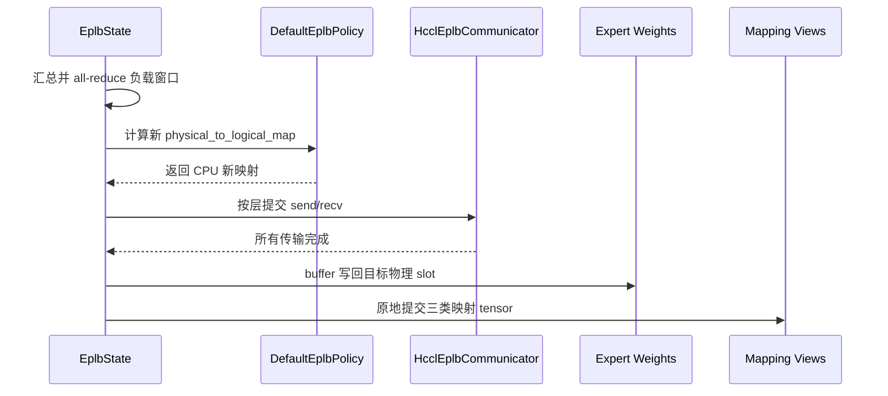

# Model Runner V2 EPLB 上游化功能设计说明书

## 1. 文档信息

| 项目 | 内容 |
|---|---|
| 状态 | 设计已冻结，第一期实现中 |
| 编写日期 | 2026-07-22 |
| vLLM Ascend 基线 | `upstream/main`，提交 `885b6aa90` |
| vLLM 发布基线 | `.github/vllm-release-tag.commit` 指定的 `v0.25.1` |
| vLLM 主线验证基线 | `.github/vllm-main-verified.commit` 指定的 `54503ecec0f3ac31e5ecfc5f28652e4cc42307b5` |
| 适用范围 | Ascend NPU Model Runner V2（以下简称 MRV2） |
| 交付约束 | 最多两期，总周期不超过两个月 |

本文中的“上游 EPLB”特指 vLLM `EPLBController`、`EplbState`、`EplbLayerState`、上游 Router、默认均衡策略和权重重排流程；“旧 EPLB”特指 `vllm_ascend/eplb/` 及其在 Model Runner V1 中的调用链。

## 2. 结论

MRV2 EPLB 采用“上游控制面、Ascend 设备实现、定点 patch 接入”的单一架构：配置、生命周期、模型注册、状态、负载窗口、均衡策略、重排事务和主/草稿模型协同全部使用上游实现；vLLM Ascend 只提供 NPU 映射与负载统计算子、P/D batch 采集开关、NPU stream/event 适配、HCCL 权重通信和量化权重视图。当前以下游 patch 保证两个固定上游基线可交付，长期再将同样的硬件边界收敛为上游设备后端接口。

实现分两期，但两期使用同一套接口和状态模型：第一期关闭异步重排，交付同步 EPLB 的完整闭环；第二期只补齐异步、ACL Graph、推测解码、流水并行和剩余量化组合，不更换第一期架构。

## 3. 背景与问题

### 3.1 当前实现

Model Runner V1 在 `vllm_ascend/worker/model_runner_v1.py` 中直接管理 `EplbProcess`、`EplbUpdator`、`D2DExpertWeightLoader` 和 `VllmEplbAdaptor`，并在前向前后插入独立计数、策略计算和逐层换权逻辑。

旧实现还维护独立的：

- `additional_config.eplb_config` 和 `DYNAMIC_EPLB`；
- `global_expert_map`、`_expert_map`、`log2phy` 和 `moe_load`；
- Swift、FlashLB、Random 等下游策略；
- 独立 EPLB 进程组、子进程和设备间权重搬运状态机；
- 按量化类型硬编码的专家权重名称表。

MRV2 已继承上游 `vllm.v1.worker.gpu.model_runner.GPUModelRunner`，但当前存在两个显式阻断：

- `vllm_ascend/worker/v2/model_runner.py` 在初始化时拒绝 `dynamic_eplb`；
- 同一文件保留空的 `eplb_warmup()`，没有接入任何有效状态。

MoE 层已经使用上游 `FusedMoE → MoERunner → RoutedExperts` 工厂结构，但 `AscendMoERunner` 仍初始化旧 EPLB 状态，Ascend quant method 仍在各自 `apply()` 内重复执行专家选择，未消费上游 Router 产生的物理专家 ID。

### 3.2 上游已具备的能力

vLLM `v0.25.1` 已提供：

- `ParallelConfig.enable_eplb` 和 `EPLBConfig`；
- `EPLBController` 对模型加载、主模型/草稿模型注册、前向准备和 step 的管理；
- `EplbState` 对专家负载窗口、默认策略、同步/异步重排和图模式稳定 tensor view 的管理；
- `EplbLayerState` 对单层负载、逻辑到物理映射及副本数量的引用；
- Router 内统一的逻辑专家选择、物理专家映射和负载统计位置；
- `MixtureOfExperts`、`MoERunner`、`RoutedExperts.get_expert_weights()` 等模型和权重接口；
- 独立于 EP 前向通信的 `get_eplb_group()`；
- 同步及异步专家权重重排流程。

### 3.3 上游在 Ascend 上的缺口

缺口均属于设备相关边界：

1. `ParallelConfig` 以 `current_platform.is_cuda_alike()` 判断 EPLB 能力，当前 OOT NPU 平台会被拒绝。
2. Router 的 `eplb_map_to_physical_and_record()` 仅为 CUDA/ROCm 注册 Triton 实现，非 CUDA-like 平台返回原始逻辑专家 ID。
3. EPLB 异步线程、事件和通信实现中仍存在 `torch.cuda.Stream/Event` 及 CUDA 设备索引假设。
4. 内置 communicator 不表达 HCCL 能力，也不能声明该后端是否支持异步多流。
5. Ascend quant method 没有遵循上游 modular MoE 的“先路由、后计算”接口。
6. NZ、量化权重和 scale/offset 的实际布局不能直接由上游通用 `named_parameters()` 推导。

这些缺口不要求复制上游 EPLB 控制逻辑，只需要稳定的设备后端接口。

## 4. 设计目标与边界

### 4.1 目标

“完整接入上游 EPLB”必须同时满足以下条件：

1. MRV2 的 EPLB 行为只读取 `parallel_config.enable_eplb`、上游 `parallel_config.eplb_config` 和下游单字段 `load_scope`；不得读取其他旧 EPLB 配置。
2. MRV2 直接使用上游 `EPLBController` 和 `EplbState`，不新增前向前后 EPLB 调度逻辑。
3. 模型和每个 MoE 层通过上游 `MixtureOfExperts`、`MoERunner` 和 `EplbLayerState` 注册。
4. 逻辑专家选择只执行一次，发生在上游 Router；NPU 计算只消费 Router 输出。
5. 负载窗口、策略计算、映射提交和重排时机由上游决定。
6. MRV2 不导入 `vllm_ascend/eplb/`，也不访问旧 `dynamic_eplb` 状态。
7. EPLB 关闭时，不增加设备 tensor、通信组、权重 buffer 或额外同步。
8. P/D 采集范围只改变负载是否进入上游 window，不改变专家映射、重排周期或跨 rank 通信顺序。
9. 当前 patch 只覆盖本文列出的函数，通过签名和行为契约测试阻止上游漂移；不复制 `EplbState`、policy 或重排函数主体。

### 4.2 最终功能范围

最终态支持上游 EPLB 的以下稳定能力：

- 冗余物理专家；
- 专家负载窗口与周期重排；
- 上游默认均衡策略；
- 同步和异步重排；
- balancedness 日志；
- `all | prefill | decode` 三种负载采集范围，支持混合 P/D 批次；
- 主模型和 MoE 草稿模型分别统计、统一调度；
- eager、ACL Graph piecewise 和 full decode graph；
- TP/DP/EP、PP 及多节点 EP；
- Ascend 当前支持的主流非量化及量化 MoE 权重布局。

### 4.3 旧能力处理

以下能力没有对应的上游稳定接口，不进入 MRV2 私有实现：

| 旧能力 | MRV2 决策 | 原因 |
|---|---|---|
| `eplb_policy_type=2/3`、Swift、FlashLB | 不迁移 | 策略与硬件无关；如仍需要，应先贡献到上游策略接口 |
| `expert_map_path` | 不迁移 | 上游没有面向普通服务启动的静态映射文件接口 |
| `expert_map_record_path` | 不迁移 | 上游没有对应导出协议 |
| `eplb_heat_collection_stage` | 迁移并更名 | MRV2 使用 `additional_config.eplb_config.load_scope`；batch 中存在任一 prefill 请求即将整批判定为 prefill，否则判定为 decode |
| `DYNAMIC_EPLB`、`EXPERT_MAP_RECORD` | MRV2 不读取 | 上游以 `enable_eplb` 为唯一开关 |
| Elastic EP | 不在本项目交付范围 | 属于独立功能；设计不阻断后续复用上游 `setup_from_mapping()` |
| Ascend 310P | 不在 MRV2 范围 | 310P 使用独立 model runner 和 MoE 实现 |

旧能力继续由 Model Runner V1 承载，直到 V1 单独退场；本项目不删除 `vllm_ascend/eplb/`，但必须切断其与 MRV2 的依赖。

### 4.4 方案选择

| 方案 | 决策 | 判定依据 |
|---|---|---|
| 把 V1 EPLB 迁入 MRV2 | 拒绝 | 仍保留两套配置、策略和重排状态机 |
| 把上游 EPLB 代码复制到下游 | 拒绝 | 上游修改时仍需要逐段对齐 |
| 在下游对硬件边界做定点 patch | 当前采用 | 不等待上游合入；改动面可限定、可做双基线契约测试 |
| 上游增加单一设备后端接口 | 长期目标 | 以同样的硬件边界替换 patch，不改变下游设备实现 |

## 5. 总体架构


### 5.1 所有权

| 能力 | 所有者 | 下游是否允许重写 |
|---|---|---|
| 开关、窗口、周期、冗余专家数、异步开关 | vLLM | 否 |
| 模型注册和 step 生命周期 | vLLM | 否 |
| 负载窗口、映射 tensor、提交顺序 | vLLM | 否 |
| 均衡策略 | vLLM | 否 |
| 逻辑专家选择语义 | vLLM Router | 否 |
| P/D 负载采集范围 | vLLM Ascend 扩展；长期上游化 | 是 |
| 逻辑到物理映射及负载累加算子 | 当前由 patch 转发到 Ascend 实现 | 是 |
| stream/event | 当前使用 MRV2 NPU 兼容层；长期上游接口 | 是 |
| 权重发送/接收 | vLLM `EplbCommunicator` 接口，Ascend HCCL 实现 | 是 |
| 专家权重视图 | vLLM `get_expert_weights()` 接口，Ascend 量化布局实现 | 是 |
| MoE GEMM、dispatch/combine、MC2 | vLLM Ascend | 是 |

## 6. 当前 patch 与长期接口

### 6.1 当前实施方式

新增 `vllm_ascend/patch/platform/patch_eplb.py`，由 `NPUPlatform.pre_register_and_update()` 在配置构造前导入。该文件只做函数转发和能力适配，具体 NPU 实现位于普通下游模块。

当前 patch 限定为以下五类：

1. 配置构造：放开 `ParallelConfig._validate_parallel_config()` 中的 CUDA-like 限制，保留其余 EP、TP/DP 和 redundancy 校验。
2. 通信构造：包装 `ParallelConfig.__post_init__()` 和 `create_eplb_communicator()`，把 Ascend 默认后端设为 HCCL。
3. Router：替换 `BaseRouter._apply_eplb_mapping()`，转发到 NPU map-and-record 算子。
4. 状态边界：包装 `EplbState.step()` 和 `EplbState.__init__()`，分别实现非目标 batch 不入 window 和 NPU async device index。
5. 异步错误：包装 `start_async_worker()`，把子线程异常传回主线程，不改写上游 transfer loop。

### 6.2 patch 约束

- patch 必须幂等，重复导入 platform/worker patch 不得重复包装。
- 启动时校验目标类、函数名和关键参数；契约不匹配时立即失败，不以 `try/except` 忽略。
- 不替换或复制 Pydantic validator；只代理 `vllm.config.parallel` 模块持有的 `current_platform`，使原 validator 在 NPU 上通过 EPLB 能力检查，并继续执行全部原生校验。`ParallelConfig.__post_init__()` wrapper 生效后只 rebuild `ParallelConfig`；不得依赖重建 `VllmConfig` 的嵌套 schema。
- patch 不得复制 `EplbState.step()`、`rearrange()`、`transfer_layer()` 或 policy 主体。
- 发布基线 `v0.25.1` 和 main-verified 基线分别运行 patch 导入、签名和行为契约测试。
- 每个 patch 在 `vllm_ascend/patch/__init__.py` 记录原因、上游替代点和删除条件。

### 6.3 长期 `EplbDeviceBackend`

在 vLLM 增加设备后端协议，由 `Platform.get_eplb_device_backend_cls()` 返回实现类路径；CUDA/ROCm 保持现有实现，Ascend 返回 `AscendEplbBackend`。

接口职责限定为：

- `map_and_record(...)`：逻辑专家映射和负载累加；
- `create_stream(device)`、`stream_context(stream)`：异步重排流；
- `create_event(enable_timing=False)`：主线程与异步线程同步及耗时统计；
- `current_device_index(device)`：异步线程绑定设备；
- `create_communicator(...)`：构造实现上游 `EplbCommunicator` 的设备通信对象；
- `supports_async`：声明当前设备后端是否允许异步重排。

`ParallelConfig` 的 EPLB 校验改为检查 `current_platform.get_eplb_device_backend_cls()`，不再使用 `is_cuda_alike()` 推断能力。

该接口进入依赖基线后，`patch_eplb.py` 按能力校验、Router、communicator、stream/event 的对应关系逐项删除；batch scope 判定、NPU 算子、`HcclEplbCommunicator` 和 quant weight view 原样保留，仅改为由上游接口构造。

## 7. 详细设计

### 7.1 配置

MRV2 使用以下上游参数：

- `--enable-expert-parallel`；
- `--enable-eplb`；
- `--eplb-config.window_size`；
- `--eplb-config.step_interval`；
- `--eplb-config.num_redundant_experts`；
- `--eplb-config.use_async`；
- `--eplb-config.log_balancedness`；
- `--eplb-config.log_balancedness_interval`；
- `--eplb-config.policy default`；
- `--eplb-config.communicator`。

上述字段也可以通过 `--eplb-config` JSON 一次传入；字段名和语义与上游 `EPLBConfig` 一致。

MRV2 额外提供一个过渡期配置：

```text
--additional-config '{"eplb_config":{"load_scope":"prefill"}}'
```

`load_scope` 可取 `all`、`prefill` 或 `decode`，默认为 `all`。它以 batch 为单位决定本次负载是否进入上游 expert-load window，映射和 MoE 计算始终对整批 token 执行。该字段长期迁入上游 `EPLBConfig`；当前不修改上游 Pydantic schema，避免扩大 patch 范围。

现有 `EplbConfig._defaults` 直接增加 `load_scope="all"`，`_validate_config()` 增加 `all/prefill/decode` 枚举校验，不新增配置类。`load_scope` 只允许 MRV2 设置和读取；V1 继续使用 `eplb_heat_collection_stage`，显式设置 `load_scope` 时启动失败。

配置规则：

1. `vllm_config.use_v2_model_runner=True` 时，`additional_config.eplb_config` 只允许 `load_scope`；出现 `dynamic_eplb`、`expert_map_path`、旧 interval、policy 或 record path 时启动失败。
2. MRV2 检测到旧 `DYNAMIC_EPLB` 或 `EXPERT_MAP_RECORD` 环境变量启用时启动失败；不得让旧 platform patch 和新状态机同时生效。
3. 第一期要求显式配置 `use_async=false`；设置为 `true` 时启动失败。
4. 第二期完成后，`use_async` 完全遵循上游默认值和用户值。
5. `policy` 只接受上游已注册策略；不把旧数字策略值映射为 `default`。
6. Ascend 上 `communicator` 省略或为 `null` 时，`patch_eplb.py` 在上游 `ParallelConfig.__post_init__()` 执行前写入上游合法值 `torch_nccl`；该值在 NPU 上表示基于设备进程组的 `torch.distributed` 通信，并由 communicator factory 映射为 HCCL，阻止上游改写为 Gloo、NIXL 或 PyNCCL。
7. Ascend 上显式配置 CUDA 专用 communicator 时启动失败，并提示删除该字段以使用平台默认 HCCL；不做运行时隐式回退。
8. `load_scope != all` 要求 `enable_eplb=True`；否则启动失败。
9. MRV2 检测到旧 `eplb_heat_collection_stage` 字段时启动失败；值为 `prefill/decode` 时给出 `load_scope` 的等价配置，值为 `all` 时提示删除该字段。
10. V1 检测到用户显式设置 `load_scope` 时启动失败，并提示继续使用 `eplb_heat_collection_stage`；默认生成的 `load_scope=all` 不参与 V1 行为。

旧参数不能自动换算，原因如下：

| 旧参数 | 上游近似参数 | 是否自动换算 | 原因 |
|---|---|---|---|
| `dynamic_eplb` | `enable_eplb` | 否 | 开关涉及两套生命周期 |
| `expert_heat_collection_interval` | `window_size` | 否 | 统计窗口语义不同 |
| `algorithm_execution_interval` | `step_interval` | 否 | 旧周期还包含逐层换权阶段 |
| `num_redundant_experts` | 同名参数 | 否 | 必须与上游物理专家初始化同时生效 |
| `eplb_policy_type` | `policy` | 否 | 策略实现和结果不等价 |
| `eplb_heat_collection_stage` | `load_scope` | 否 | 名称和批次判断语义均改变，需要用户显式迁移 |

### 7.2 Model Runner 生命周期

`vllm_ascend/worker/v2/model_runner.py` 执行以下修改：

1. 删除 dynamic EPLB 的 `NotImplementedError`。
2. 删除空的 `eplb_warmup()`；上游在 `load_model()` 内完成 EPLB 状态构造和模型注册。
3. `__init__()` 只保存 `load_scope`，不创建额外 tensor 或运行时状态类。
4. `prepare_inputs()` 生成 `is_prefilling_np` 后判断 batch 阶段，并把匹配结果写入 `EplbState._ascend_scope_matched`。
5. 不覆盖上游 `load_model()`、`execute_model()`、`sample_tokens()` 和 `_dummy_run()` 的 EPLB 逻辑。
6. Ascend 为 MC2 预留通信 buffer 的额外 `_dummy_run()` 传入 `skip_eplb=True`，避免 profile 阶段执行两次 EPLB dummy rearrange。
7. 正常 profile 仍由上游 `_dummy_run(is_profile=True)` 触发一次 communicator buffer 预留。

MRV2 不增加 `forward_before()`、`forward_end()`、`load_model()` override 或独立 iteration counter。

### 7.3 模型与层注册

主模型必须满足上游 `MixtureOfExperts` 协议：

- `moe_layers` 只包含当前 PP rank 上实际存在的 `MoERunner`；
- `num_moe_layers == len(moe_layers)`；
- `num_logical_experts`、`num_physical_experts`、`num_local_physical_experts` 和 `num_redundant_experts` 来自上游 `FusedMoE` 初始化结果；
- `set_eplb_state()` 使用协议默认实现，将每层 view 注入 `MoERunner.set_eplb_state()`；
- `expert_weights` 只在权重加载及量化后由 `set_eplb_state()` 收集。

Ascend 自有模型（例如 DeepSeek V4 及其 MTP 变体）必须与上游模型使用相同协议，不新增模型名判断和 EPLB adaptor。

MoE 草稿模型由上游 `EPLBController.maybe_register_speculator()` 注册；Ascend speculator 继续继承上游 `set_eplb_state()` 和 `_prepare_eplb_forward()`，不创建第二个 EPLB 控制器。

### 7.4 P/D 负载采集范围

新增 `vllm_ascend/worker/v2/eplb.py:is_eplb_load_scope_matched()`，只负责根据 CPU 批次元数据判断整个 batch 是否属于配置的采集阶段。

语义规则：

1. `all` 始终匹配，行为与上游一致。
2. `is_prefilling_np` 中存在任一 `True` 时，整个 batch 判定为 `prefill`；只有全部为 `False` 时才判定为 `decode`。
3. batch 阶段与 `load_scope` 匹配时，整批负载进入 window；不匹配时，整批负载丢弃。
4. Chunked prefill 所在 batch 判定为 prefill；DBO 的所有 ubatch 和 speculative decoding 的主/草稿模型沿用本次主 batch 的同一判定。
5. dummy/profile token 不进入负载 window，不受 `load_scope` 影响。

该判断只执行一次 CPU `np.any()`，不创建 mask、不增加 H2D copy，也不修改 Router 或 map-and-record 算子接口。

`patch_eplb.py` 包装 `EplbState.step()`：当 `_ascend_scope_matched=False` 且非 dummy/profile 时，以 `is_dummy=True, log_stats=False` 调用原函数。这会清空本批主模型和草稿模型的 pass load，且不推进本 rank 的 `expert_load_window_step`，但仍推进 `expert_rearrangement_step`，因此不改变跨 rank 集合通信时序。上游本就允许各 rank 的 window step 不同。

### 7.5 路由与负载统计

每层前向只执行一次路由：

1. 上游 Router 根据 logits 产生逻辑 `topk_ids` 和 `topk_weights`。
2. patch 后的 `BaseRouter._apply_eplb_mapping()` 调用 `vllm_ascend.ops.fused_moe.eplb.map_and_record()`。
3. NPU 算子根据 `logical_to_physical_map` 和 `logical_replica_count` 将逻辑 ID 转为全局物理 ID。
4. 算子按上游 Knuth hash 规则选择同一逻辑专家的副本，保证与 CUDA 语义一致。
5. 当 `should_record_tensor=True` 时，算子把非 padding token 原子累加到 `expert_load_view`；batch 阶段过滤在 step 边界统一完成。
6. Router 输出物理 `topk_ids`，后续 dispatch、MoE 计算和 combine 不再访问逻辑专家映射。

NPU 算子接口必须与上游保持以下 tensor 语义：

| Tensor | 形状 | 所有者 | 更新方式 |
|---|---|---|---|
| `topk_ids` | `[num_tokens, top_k]` | Router | 输入为逻辑 ID，输出为物理 ID |
| `logical_to_physical_map` | `[num_logical_experts, max_replica_slots]` | `EplbState` | 重排后原地更新 |
| `logical_replica_count` | `[num_logical_experts]` | `EplbState` | 重排后原地更新 |
| `expert_load_view` | `[num_physical_experts]` | `EplbState` | NPU 原子累加 |
| `should_record_tensor` | 标量 bool | `EplbState` | 每 step 原地更新 |
| `num_unpadded_tokens` | 标量 int32 | `EplbState` | 每次前向填充 |

热路径约束：

- 不调用 `.item()`、`.cpu()` 或 `synchronize()`；
- 不新建逻辑/物理映射副本；
- 除物理 `topk_ids` 输出外不分配临时大 tensor；
- EPLB 关闭时直接返回原始 `topk_ids`；
- 算子必须支持 ACL Graph capture，且所有状态通过稳定地址的 tensor view 读取。

### 7.6 Ascend MoE 计算接口

当前各 quant method 在 `apply()` 内调用 `select_experts()`。MRV2 执行路径必须绕过该 legacy 入口，V1
仍保留该入口；两条路径在选路完成后统一进入只消费 `topk_weights/topk_ids` 的 `apply_routed()`。

最终调用关系为：

```text
AscendMoERunner.no_shared_forward_impl()
  -> moe_comm_method.prepare(hidden_states, router_logits)
  -> self.router.select_experts()
  -> AscendFusedMoEMethod.apply_routed(topk_weights, topk_ids)
  -> Ascend dispatch / GMM / combine
  -> moe_comm_method.finalize()
```

改造要求：

- `AscendMoERunner.__init__()` 按 `vllm_config.use_v2_model_runner` 分流：V1 保留 `init_eplb_config()` 和 `VllmEplbAdaptor.register_layer()`；MRV2 不创建 `global_expert_map`、`log2phy`、`moe_load`、`load_counter` 或私有 redundancy 数据。
- 将上述 V1 初始化从 `__init__()` 抽到 `_init_v1_eplb()`，并把 `init_eplb_config`、`VllmEplbAdaptor` 的 import 移入该函数，确保导入 MRV2 MoE 模块不会加载 `vllm_ascend/eplb/`。`mix_placement` 与 EPLB 解耦，不得为保留 mix placement 而在 MRV2 创建旧 map。
- 新增 `AscendFusedMoEMethod.apply_routed()` 和 `AscendMoEScheme.apply_routed()`，只接收预计算的 `topk_weights/topk_ids`；现有 `apply()` 作为 V1 兼容入口，完成旧 `select_experts()` 后调用 `apply_routed()`。
- `AscendUnquantizedFusedMoEMethod`、`AscendW8A8DynamicFusedMoEMethod`、`AscendW4A8DynamicFusedMoEMethod`、`AscendW4A16FusedMoEMethod`、`AscendW4A16MXFP4FusedMoEMethod`、`AscendW4A8MXFPDynamicFusedMoEMethod`、`AscendW4A4MXFP4DynamicFusedMoEMethod` 和 `AscendW8A8MXFP8DynamicFusedMoEMethod` 都按该模板拆分；FP8/PDMix 派生类继承基类实现，不复制路由。
- profile 阶段的 force-load-balance 收敛到 `AscendMoERunner._select_routing()`；正常请求必须调用上游 Router，不得在 quant scheme 覆盖 `topk_ids`。
- `vllm_ascend/ops/fused_moe/experts_selector.py` 只保留仍被 V1 或独立算子测试使用的接口，MRV2 EPLB 路径不调用它；
- `AscendMoERunner` 可以保留 NPU dispatch/combine 和 shared expert 多流编排，但不得保留 EPLB map、load 或 iteration 状态。

NPU token dispatcher 接收全局物理专家 ID。物理 slot 到本地 slot 的映射使用上游 `ExpertMapManager.expert_map`；物理 slot 的归属不随 EPLB 重排变化，因此映射不需要在每次重排后重建。

### 7.7 专家权重视图

上游重排要求每层权重组可通过 `shape[0]` 获取本地物理专家数，并可通过整数下标取得单个专家 tensor。普通 ND 权重直接返回 expert-first tensor；常驻 tensor list 通过轻量 list 适配器满足同一契约。

新增 `AscendRoutedExperts.get_expert_weights()`，按以下规则返回权重 view：

1. 调用 quant method 的 `get_eplb_weight_views(layer)`；接口缺失或返回空集合时立即报错，不回退上游参数名枚举。
2. view 在 `process_weights_after_loading()` 完成后创建；`set_eplb_state()` 只读取实际计算存储。
3. 每个 view 必须引用实际计算权重存储；不得为 EPLB 保留长期镜像。
4. 每专家 weight、scale、offset、bias 必须同时迁移。
5. 全专家共享的 activation scale、全局常量、路由 bias 和 hash table 必须排除。
6. NZ 或压缩布局无法表达第 0 维专家切片时，quant method 必须提供布局感知的搬运 view 或搬运算子；不得用隐式 reshape 产生错误视图。
7. 所有层的 view 数量、dtype、shape 和 stride 在启动时校验；不满足条件时启动失败。

代码落点：

- 新增 `vllm_ascend/ops/fused_moe/routed_experts.py:AscendRoutedExperts`，覆盖 `get_expert_weights()`。
- `patch_fused_moe._ascend_FusedMoE()` 在非 310P 路径默认传入 `routed_experts_cls=AscendRoutedExperts`；用户显式传入时不覆盖。
- `AscendFusedMoEMethod.get_eplb_weight_views()` 转发到实际 `AscendMoEScheme`；未实现的 scheme 返回不支持，不以参数名猜测。
- BF16/FP16 返回 `w13_weight` 和 `w2_weight`。
- W8A8 Dynamic 在 NZ 转换后，将 weight、scale 以及可选 FUSED_MC2 scale 按专家复制为常驻 tensor list，并删除对应 batched tensor；计算与 EPLB 重排读取同一组 list。
- W4A8 在 NZ 转换后，将 weight、scale 和 scale bias 按专家复制为常驻 tensor list，并删除对应 batched tensor；ModelSlim 和 compressed-tensors 权重执行相同的最终布局收敛。
- W4A4 MXFP 和 W8A8 MXFP 保持原生 ND batched tensor，不做 NZ 转换和 list 切分；其 EPLB view 以零拷贝方式反向表达内部维转置，并保证单专家切片连续。
- W4A16、W4A16 MXFP 和 W4A8 MXFP 当前显式声明 `supports_eplb=False`；在对应权重布局和算子完成独立验证前，启动阶段拒绝 EPLB。
- `dynamic_eplb` 仍只控制 V1 旧 EPLB；MRV2 是否构造常驻 tensor list 仅由上游 `enable_eplb` 决定。

`VllmEplbAdaptor` 中按量化类型维护的 `EPLB_EXPERT_WEIGHT_NAMES` 不用于 MRV2。

### 7.8 权重重排事务

策略计算、发送/接收计划和 map 计算继续使用上游实现；Ascend 只实现 `EplbCommunicator`。

同步重排顺序：



事务不变量：

- 先完成权重接收和本地复制，再提交映射；
- map 提交使用 `copy_()`，不更换已被 graph 捕获的地址；
- 任一 rank 通信失败时不允许继续服务；运行中自动关闭 EPLB 会导致跨 rank 权重和映射不一致，因此不是合法降级方式；
- profile 只预留 buffer，不修改权重和 map；
- EPLB 使用上游独立 `get_eplb_group()`，不得复用正在执行 MoE all-to-all 的通信序列。

### 7.9 HCCL communicator

`HcclEplbCommunicator` 实现上游接口：

- `add_send(tensors, dst_rank, expert_id)`；
- `add_recv(tensors, src_rank, expert_id)`；
- `execute()`；
- `set_stream(stream)`；
- `needs_profile_buffer_reservation`。

实现要求：

- 类位于 `vllm_ascend/distributed/eplb_communicator.py`，内部维护当轮 `torch.distributed.P2POp` 队列，`execute()` 使用 `batch_isend_irecv()` 并等待所有 request。
- 使用 `get_eplb_group().device_group`，不使用旧 `get_dynamic_eplb_group()`；
- 每个专家的所有 weight view 使用相同顺序发送和接收；
- W8A8/W4A8 传入的单专家 tensor 均为独立存储且 `storage_offset()==0`，HCCL 直接收发，不在重排热路径 clone 或 copy-back；
- 空任务直接返回；
- `execute()` 无论成功或失败都清空本轮 P2P 队列；
- 同步模式使用当前计算流；
- 异步模式使用独立 NPU stream，并通过 event 保证 buffer 生产、消费和复用顺序；
- 不在热路径创建新的 process group；
- 多节点使用 HCCL，不采用 Gloo 搬运完整专家权重作为正式方案。
- `patch_eplb.py` 同时替换 `eplb_communicator.create_eplb_communicator` 和 `eplb_state` 中已 import 的同名绑定，避免因 Python `from ... import ...` 保留旧引用。

### 7.10 异步重排

第二期启用上游 async worker，Ascend 后端负责设备运行时对象，不改写 worker 状态机。

异步流程必须保持上游双缓冲语义：

1. 主线程生成负载快照并触发异步线程。
2. 异步线程计算新映射，把一层新权重写入 `expert_buffer`。
3. 主线程在 step 边界把 buffer 写入真实权重。
4. 主线程提交该层 map，记录 `consumed_event`。
5. 异步线程收到 event 后复用 buffer，处理下一层。

额外要求：

- async worker 必须绑定当前 NPU device index；
- HCCL EPLB group 必须与 EP 前向 group 隔离；
- `patch_eplb.py` 的 `start_async_worker()` wrapper 把异常写入 `EplbState._ascend_async_error`；`EplbState.step()` wrapper 在进入上游 step 前通过 EPLB CPU group 汇总失败标志，任一 rank 失败则所有 rank 终止。
- 不复制 `transfer_run_periodically()`、`transfer_layer()` 和 `_move_to_workspace()`；线程启停语义保持上游行为，上游增加显式 stop 接口后直接继承。

### 7.11 ACL Graph

ACL Graph 不捕获重排通信，只捕获 Router 和 MoE 前向。

保证 graph 可复用的条件：

- `logical_to_physical_map`、`logical_replica_count`、`expert_load_view`、`should_record_tensor` 和 `num_unpadded_tokens` 地址固定；
- 重排只修改 tensor 内容；
- 专家权重 Parameter 的 storage 地址固定，重排使用原地 copy；
- NPU map-and-record 算子没有 host 分支和 host 同步；
- profile dummy rearrange 只执行一次。

若启用 Elastic EP 导致物理专家总数或 tensor shape 改变，必须重新构图；该组合不在本项目范围内。

### 7.12 推测解码与 PP

主模型和 MoE 草稿模型在同一个 `EplbState` 中按 `ModelConfig.compute_hash()` 保存独立 `EplbModelState`，两者分别维护负载窗口、权重 buffer 和映射。

草稿模型每次前向继续调用继承自上游 speculator 的 `_prepare_eplb_forward()`，由上游维护有效 token 数。P/D 判断以本次主 batch 为准，同一调度 step 内的主模型和草稿模型使用同一个 `_ascend_scope_matched` 结果，不增加草稿模型专用 phase 状态。

PP 场景只注册本 rank 的真实 MoE 层，`PPMissingLayer` 不进入 `moe_layers`；层序号使用本地 MoE 顺序，不使用全模型绝对 layer ID。

### 7.13 MoE 通信优化的兼容策略

| 功能 | EPLB 行为 |
|---|---|
| 标准 all-to-all / all-gather | 直接使用物理专家 ID |
| 非融合 MC2 | 使用上游 physical-to-local map |
| FUSED_MC2 | Router 产出的全局物理专家 ID直接传入 `dispatch_ffn_combine`；weight 和融合 scale 使用同一组物理 slot 完成重排 |
| shared expert 多流 | 保留；其 stream 必须等待 routed expert 权重提交 event |
| RFork weight transfer | 保持禁用；服务启动后专家权重会变化 |
| LoRA MoE | 只有 LoRA 专家相关权重进入重排 view 后才声明支持，否则启动失败 |

FUSED_MC2 不使用独立 EPLB 映射。若量化布局不能提供完整的 per-expert weight/scale view，启动失败并指出缺失 tensor；不得全局关闭 FUSED_MC2 或静默切换通信实现。

## 8. 数据与状态管理

### 8.1 初始化期分配

允许且只允许在模型注册时创建：

- `physical_to_logical_map`；
- `logical_to_physical_map`；
- `logical_replica_count`；
- `expert_load_pass` 和 `expert_load_window`；
- `should_record_tensor` 和每个 ubatch 的 `num_unpadded_tokens`；
- 每种专家权重对应的一个 `expert_buffer`；
- 缓存后的专家权重 view。

### 8.2 每次前向

每次前向只允许：

- 填充 `num_unpadded_tokens`；
- 根据 CPU 批次元数据更新 batch scope 匹配结果；
- 读取 mapping view；
- 生成物理 `topk_ids`；
- 原子累加当前层负载。

不得在每次前向创建 CPU map、复制专家权重或发起 EPLB 通信。

### 8.3 每个 step

上游 `step_eplb_after` 负责：

- 把本次负载写入 window；
- 清零 pass load；
- 更新 record 开关；
- 到达周期时触发同步或异步重排。

Ascend patch 只在 `_ascend_scope_matched=False` 时把当次 step 标记为 dummy-load step；重排 step 计数、触发时机和集合通信仍由上游执行。

## 9. 接口与命名

| 名称 | 操作 | 说明 |
|---|---|---|
| `EPLBController` | 保留 | 上游生命周期入口 |
| `EplbState` / `EplbLayerState` | 保留 | 上游唯一状态源 |
| `patch_eplb.py` | 当前新增 | 固定上游基线的定点适配入口 |
| `EplbDeviceBackend` | 长期上游新增 | OOT 设备 EPLB 扩展接口 |
| `AscendEplbBackend` | 长期下游新增 | 组合现有 NPU 算子和 communicator，替换 patch |
| `HcclEplbCommunicator` | 下游新增 | 专家权重 HCCL 搬运 |
| `AscendRoutedExperts` | 下游新增 | 提供量化/NZ 专家权重 view |
| `load_scope` | 下游新增 | EPLB 配置内的负载采集范围；`all/prefill/decode` |
| `is_eplb_load_scope_matched()` | 下游新增 | 以“任一 prefill 即整批 prefill”规则判断 batch 是否属于目标阶段 |
| `_ascend_scope_matched` | 下游新增 | 当前主 batch 是否属于目标采集阶段的 CPU bool |
| `get_eplb_weight_views()` | 下游新增 | quant method 的布局适配接口 |
| `apply_routed()` | 下游新增 | MRV2 消费预计算路由结果；`apply()` 保留给 V1 |
| `dynamic_eplb` | MRV2 禁用 | 仅保留给 V1 |
| `eplb_heat_collection_stage` | MRV2 替换 | 避免 `heat` 和 `stage` 的模糊表达 |
| `log2phy`、`global_expert_map`、`moe_load` | MRV2 删除 | 由上游 mapping/load tensor 替代 |
| `VllmEplbAdaptor`、`EplbUpdator` | MRV2 禁用 | 不进入 v2 import graph |

## 10. 文件改动范围

### 10.1 当前 patch 的上游目标

| 上游文件与符号 | patch 行为 |
|---|---|
| `vllm/config/parallel.py:current_platform` | 在该模块内代理平台对象；仅把 NPU 的 `is_cuda_alike()` 能力结果改为 true，原 validator 及其他平台方法不变 |
| `vllm/config/parallel.py:ParallelConfig.__post_init__` | 在原函数前将 `communicator=None` 转为 `torch_nccl`；该上游合法值在 NPU 上表示 torch.distributed/HCCL |
| `vllm/distributed/eplb/eplb_communicator.py:create_eplb_communicator` | NPU 且 `backend == "torch_nccl"` 时构造 `HcclEplbCommunicator`，其余情况原样调用上游 factory |
| `vllm/model_executor/layers/fused_moe/router/base_router.py:BaseRouter._apply_eplb_mapping` | 保留原状态校验，改为调用 NPU 算子，并继续按当前 ubatch 传入上游有效 token 数 |
| `vllm/distributed/eplb/eplb_state.py:EplbState.__init__` | 原函数返回后，将 NPU `device.index` 写入 `cuda_device_index` 兼容字段 |
| `vllm/distributed/eplb/eplb_state.py:EplbState.step` | 非目标阶段以 dummy-load 语义调用原函数；事前检查异步 worker 失败 |
| `vllm/distributed/eplb/async_worker.py:start_async_worker` | 保留原 transfer loop，增加异常回传 |

长期上游改动为 `vllm/platforms/interface.py` 增加 `EplbDeviceBackend`，并将上表构造点改为接口调用；它不是两期交付的前置条件。

### 10.2 vLLM Ascend

| 文件 | 改动 |
|---|---|
| `vllm_ascend/patch/platform/patch_eplb.py` | 新增幂等 patch 组装器、结构校验和上游函数包装 |
| `vllm_ascend/patch/platform/__init__.py` | 在 `patch_fused_moe` 前导入 `patch_eplb` |
| `vllm_ascend/patch/__init__.py` | 记录每个 EPLB patch 的原因、上游目标和删除条件 |
| `vllm_ascend/ascend_config.py:EplbConfig` | 在现有 `_defaults` 增加 `load_scope`，并在 `_validate_config()` 校验枚举；不新增配置类 |
| `vllm_ascend/platform.py:NPUPlatform._fix_incompatible_config` | 在 `AscendConfig` 构造前按 runner 校验原始字段：MRV2 只允许 `load_scope`，V1 禁止显式设置 `load_scope`；同时拒绝 MRV2 旧环境变量 |
| `vllm_ascend/worker/v2/eplb.py` | 新增无状态 batch scope 判定函数 |
| `vllm_ascend/worker/v2/model_runner.py` | 删除禁用和空 warmup；在 `prepare_inputs()` 更新 batch scope 匹配结果；修正额外 profile dummy run |
| `vllm_ascend/ops/fused_moe/eplb.py` | 新增 NPU map-and-record 算子 |
| `vllm_ascend/distributed/eplb_communicator.py` | 新增 HCCL communicator |
| `vllm_ascend/ops/fused_moe/fused_moe.py:AscendMoERunner` | V1/V2 EPLB 初始化分流和 V1 import 延迟加载；MRV2 调用上游 Router 并消费 `apply_routed()` |
| `vllm_ascend/ops/fused_moe/routed_experts.py` | 新增 `AscendRoutedExperts.get_expert_weights()` |
| `vllm_ascend/quantization/method_adapters.py:AscendFusedMoEMethod` | 增加 `apply_routed()` 和 `get_eplb_weight_views()` 委托 |
| `vllm_ascend/quantization/methods/base.py:AscendMoEScheme` | 定义 `apply_routed()` 和默认不支持的 weight-view 接口 |
| `vllm_ascend/quantization/methods/*.py` | V1 `apply()` 保留路由；MRV2 `apply_routed()` 只做计算；按布局返回权重 view |
| `vllm_ascend/patch/platform/patch_fused_moe.py` | 默认注入 `AscendRoutedExperts`；保留用户显式 `routed_experts_cls` |
| `vllm_ascend/distributed/parallel_state.py` | MRV2 不创建 `_DYNAMIC_EPLB`；上游 EPLB group 为唯一通信组 |
| `vllm_ascend/eplb/**` | 不修改其 V1 行为；通过依赖测试保证 MRV2 不导入 |

### 10.3 关键修改顺序

1. `patch_eplb.py` 先于 EngineArgs/VllmConfig 构造生效，在 `vllm.config.parallel` 模块内安装平台能力代理；原 Pydantic validator 保持不变，已缓存的 `VllmConfig` 嵌套 schema 也读取同一模块全局对象。
2. `ParallelConfig.__post_init__()` wrapper 设置 `torch_nccl` 后调用原函数；`EPLBController.prepare_load()` 仍创建原生 `EplbState`。
3. `patch_fused_moe._ascend_FusedMoE()` 创建上游 Router、`AscendRoutedExperts` 和 `AscendMoERunner`；MRV2 分支不初始化旧 EPLB 字段。
4. 权重处理完成后，上游 `MixtureOfExperts.set_eplb_state()` 调用 `AscendRoutedExperts.get_expert_weights()` 收集真实计算存储。
5. 每次 `NPUModelRunner.prepare_inputs()` 根据 `is_prefilling_np` 更新 batch scope 匹配结果；上游 `execute_model()` 原样调用 `EPLBController.prepare_forward()` 并进入模型。
6. `AscendMoERunner.no_shared_forward_impl()` 在 Ascend communication prepare 后执行一次 Router；Router patch 完成映射和负载累加；quant `apply_routed()` 不再查看 logits。
7. 上游 `step_eplb_after` 调用被薄包装的 `EplbState.step()`；除了非目标阶段转为 dummy-load 语义，window、policy、transfer 和 map commit 全部走上游原函数。

## 11. 两期实施计划

### 11.1 第一期：同步 EPLB 闭环（第 1—4 周）

交付内容：

1. 完成 `patch_eplb.py` 及发布/main-verified 双基线契约测试。
2. MRV2 切换到上游配置、`EPLBController/EplbState` 和 `get_eplb_group()`。
3. 完成 NPU map-and-record 算子和同步 HCCL communicator。
4. 完成 `load_scope=all/prefill/decode` 的 batch 级采集开关，覆盖纯 P、纯 D 和混合批次。
5. 修正 Ascend MoE 调用链，引入 `apply_routed()`，保证 MRV2 只路由一次。
6. 支持主模型、eager、标准 all-to-all/非融合 MC2、BF16/FP16、W8A8、W4A8、W4A4 MXFP 和 W8A8 MXFP。
7. 保持 V1 旧 EPLB 行为不变。

退出条件：

- MRV2 import graph 不包含 `vllm_ascend/eplb`；
- 2 卡和 4 卡 NPU 上至少发生一次真实专家换权和 map 提交；
- EPLB 开关前后生成结果一致；
- 关闭 EPLB 时性能和内存无可测新增；
- 同步重排无死锁，重排后所有 rank 的 map checksum 一致；
- 含任一 prefill 请求的混合批次整体按 prefill 处理；非匹配批次不推进 load window；
- `use_async=true` 在启动阶段明确拒绝。

### 11.2 第二期：最终功能闭合（第 5—8 周）

交付内容：

1. 启用上游 async worker，完成 NPU stream/event 和异步 HCCL 验证。
2. 支持 ACL Graph piecewise、full decode graph 和 graph 后多轮重排。
3. 支持 MoE 草稿模型、MTP/Eagle/DFlash 中适用的组合，并验证主/草稿模型共享 batch scope 判定。
4. 支持 PP 和多节点 EP。
5. 评估并补齐当前显式关闭的 W4A16、W4A16 MXFP、W4A8 MXFP 和其余量化格式；未通过布局与算子验证的格式继续保持启动期拒绝。
6. 完成标准 MC2、shared expert 多流及 LoRA MoE 的支持或启动期精确拒绝。
7. 完成 `load_scope != all` 与 DBO、speculative decoding、graph replay 的组合验证。
8. 若对应上游接口已进入依赖基线，删除可被接口直接替代的 patch；未合入时保留已验证 patch。

退出条件：

- 上游 `EPLBConfig` 的 sync/async、window、step、redundancy 和日志行为均有 NPU 证据；
- eager 与 ACL Graph 在至少两轮真实重排后结果一致；
- 异步换权过程中连续请求无错误、无跨 rank map 分歧、无 buffer 覆盖；
- 主模型和 MoE 草稿模型分别统计并完成重排；
- P/D scope 在草稿模型、DBO 和 graph replay 下与 eager 结果一致；
- 单节点和多节点用例通过；
- 支持矩阵、用户配置和限制文档完成更新。

第一期不得引入将在第二期替换的状态类、配置项或 weight loader；第二期只扩展同一 patch 边界和 quant view 支持矩阵。

上游接口若未在第二期结束前合入依赖基线，继续交付本文定义并通过双基线验证的 patch；后续用上游接口替换 patch 属于依赖升级维护，不构成第三期功能实现。

## 12. 测试设计

### 12.1 单元测试

| 测试对象 | 必测内容 |
|---|---|
| patch | `tests/ut/patch/platform/test_patch_eplb.py`：重复导入幂等、模块内平台代理、`ParallelConfig`/`VllmConfig` 嵌套校验、目标签名漂移失败、原函数仅调用一次 |
| 配置 | V1/V2 字段使用边界、旧字段和环境变量拒绝、V1 显式 `load_scope` 拒绝、枚举、EP 前置条件、第一期 async、communicator 选择 |
| load scope | `tests/ut/worker/v2/test_eplb_load_scope.py`：`all`、纯 P、纯 D、任一 prefill 的混合批次 |
| map-and-record | `tests/ut/ops/test_eplb.py`：单/多副本、非法 ID、padding、record 开关、hash 结果、dtype、空输入 |
| 权重 view | 每种量化的 view 数量、shape、stride、storage、排除项 |
| communicator | `tests/ut/distributed/test_eplb_communicator.py`：本地复制、跨 rank 计划、空任务、多 tensor、异常后队列清理 |
| map 提交 | `data_ptr` 不变、权重先于 map、三类 map 一致 |
| lifecycle | profile 不记负载、额外 MC2 dummy 不触发 EPLB、正常 step 只执行一次 |
| 依赖边界 | MRV2 模块导入后 `sys.modules` 不出现 `vllm_ascend.eplb` |

NPU 算子的 CPU reference 必须逐元素复现上游 CUDA map-and-record 语义，不能以最终模型精度测试代替算子语义测试。

`tests/e2e/pull_request/two_card/test_qwen3_moe_eplb.py` 改为 MRV2 上游参数用例，删除 skip 和 `DYNAMIC_EPLB`；不在旧 V1 用例上叠加新分支。

### 12.2 NPU 功能测试

最低测试矩阵：

| 维度 | 第一期 | 第二期 |
|---|---|---|
| 模型 | Qwen3 MoE | Qwen3 MoE、DeepSeek 系列、一个 MoE 草稿模型 |
| 卡数 | 2、4 | 2、4、8，多节点至少一组 |
| dtype/量化 | BF16/FP16、W8A8、W4A8、W4A4 MXFP、W8A8 MXFP | 最终支持矩阵；其余格式验证后再开启 |
| MoE 通信 | all-to-all/all-gather、MC2、FUSED_MC2 | 第一期组合及多节点通信 |
| 执行模式 | eager | eager、piecewise、full decode graph |
| 重排 | sync，两轮 | sync/async，至少三轮 |
| 并行 | TP/EP | TP/DP/EP、PP |
| 采集范围 | `all/prefill/decode`，含混合 P/D | 主模型、草稿模型、DBO、graph replay |

每个动态重排测试必须验证：

1. 重排前后输出或 token 序列一致。
2. 每层每个 rank 的 map checksum 一致。
3. 新增物理副本的全部权重 tensor 与源逻辑专家一致。
4. 至少一个专家发生跨 rank 搬运，避免测试只覆盖 no-op 方案。
5. 重排后负载统计继续写入新物理专家 ID。

### 12.3 性能与资源测试

发布报告至少包含：

- EPLB 关闭、开启但未重排、同步重排和异步重排四种状态的吞吐与 TPOT；
- `load_scope=all/prefill/decode` 的稳态吞吐、目标 batch 比例及 batch 判定耗时；
- map-and-record 算子耗时及调用次数；
- 每轮重排的通信字节数、总耗时和最大单层耗时；
- `expert_load_window`、mapping、weight buffer 的设备内存占用；
- 异步模式主流等待时间和 p99 请求延迟。

硬性门禁：

- EPLB 关闭时不执行 map-and-record 算子，不分配 EPLB buffer；
- `load_scope` 不分配设备 buffer，不增加 H2D/D2H copy；
- `load_scope != all` 时每个主 batch 只执行一次 CPU batch 阶段判断；
- 稳态前向无 host/device 同步；
- graph 模式不因 map 内容变化重新 capture；
- 异步模式不在主流等待完整层的 HCCL 传输。

## 13. 可观测性与故障处理

### 13.1 日志和指标

启动时记录一次：

- vLLM 基线、patch 目标契约检查结果和当前接入方式；
- policy、window、step、冗余专家数、sync/async、communicator、`load_scope`；
- 模型数、每模型 MoE 层数、逻辑/物理/本地专家数；
- 每层 weight view 的数量、dtype 和 shape 摘要。

每轮重排记录：

- round ID、触发 step、重排模式；
- map checksum；
- 跨 rank 搬运专家数和字节数；
- 策略计算、通信、提交耗时；
- 自上一轮重排后的目标阶段 batch/token 数、被过滤 batch 数和有效 load-window step 数；
- balancedness，仅在上游配置启用时采集。

P/D batch 和 token 数直接由主 batch 的 CPU 调度元数据累计，不读取 NPU tensor。不得默认打印完整 expert map、逐专家负载数组或逐请求 phase。

### 13.2 故障策略

| 故障 | 处理 |
|---|---|
| patch 目标缺失、签名或行为契约不匹配 | 配置构造前启动失败，并打印不兼容的上游提交 |
| 配置或权重布局不支持 | 启动失败 |
| NPU map 算子不可用 | 启动失败 |
| batch phase 元数据缺失或非法 | 前向前终止，不允许猜测采集阶段 |
| 任一 rank HCCL 传输失败 | 协调终止服务 |
| async worker 异常 | 设置共享失败状态，下一 step 协调终止 |
| map checksum 不一致 | 立即终止，不继续生成 |
| FUSED_MC2 的 expert ID 或 weight/scale view 契约不满足 | 启动失败，不切换通信实现 |
| balancedness 日志失败 | 记录 warning，不影响推理 |

## 14. 兼容与回滚

- Model Runner V1 继续使用旧配置和旧 EPLB，不受本项目改动影响。
- MRV2 EPLB 以 `--enable-eplb` 为唯一入口，不提供运行时切换。
- `load_scope` 默认为 `all`；将其改回 `all` 可关闭 P/D 过滤，但不关闭 EPLB。
- MRV2 遇到 `eplb_heat_collection_stage` 时只输出迁移提示并拒绝启动，不读取旧值作为运行时别名。
- 发布回滚通过关闭 `--enable-eplb` 完成；已经发生重排的进程不能在运行中关闭 EPLB后继续服务。
- 若第二期异步功能出现问题，允许用户显式设置 `use_async=false` 回到同一架构下的同步路径，不回退到旧 EPLB。
- 上游依赖升级时，以发布/main-verified 双基线契约测试判断 patch 是否兼容，不根据版本字符串维护多套实现。
- 上游 `EplbDeviceBackend` 可用后，只替换构造与转发入口；用户配置、batch scope 判定、NPU 算子、communicator 和 weight view 不变。

## 15. 风险与控制

| 风险 | 影响 | 控制措施 |
|---|---|---|
| 上游私有符号或 Pydantic 构造方式变化 | patch 静默失效或绕过校验 | 固定双基线、导入期结构断言、行为契约测试；不兼容时阻止发版 |
| P/D phase 或 token 区间判断错误 | 负载窗口混入错误阶段 | 直接使用 `is_prefilling_np/query_start_loc_np`，覆盖纯 P、纯 D、混合、chunked、padding、draft 和 DBO slice |
| quant 权重 view 漏掉 scale/offset | 重排后精度错误 | 每种量化做逐 tensor checksum 和重排后精度测试 |
| HCCL 多流顺序错误 | 死锁或 buffer 覆盖 | 独立 EPLB group、event 事务、空/异常路径 UT、多轮压力测试 |
| graph 捕获了旧地址 | 重排不生效或非法访问 | 所有 map/weight 原地更新，测试 `data_ptr` 和多轮 replay |
| PP 层编号错位 | map 更新到错误层 | 只使用本地 `moe_layers` 顺序，PPMissingLayer 不注册 |
| 主/草稿模型共用错误状态 | 负载和权重串扰 | 按 `ModelConfig.compute_hash()` 独立 `EplbModelState` |
| 旧配置被误认为兼容 | 行为静默变化 | MRV2 启动期拒绝，不做自动参数换算 |
| 支持组合过多拖延周期 | 两个月无法闭合 | 第一期固定 BF16/W8A8+sync；第二期按量化族复用统一 view 接口，不新增第三期 |

## 16. 最终验收标准

项目完成必须同时满足：

1. MRV2 EPLB 控制链不存在 `vllm_ascend/eplb` 依赖。
2. 下游不存在 EPLB policy、负载窗口、迭代器或 map 状态副本。
3. 每层只执行一次专家选择，Ascend quant method 不读取 router logits 进行二次路由。
4. 同步和异步均使用上游 `EplbState` 重排事务。
5. eager、ACL Graph、主模型和 MoE 草稿模型通过多轮真实换权测试。
6. 所有声明支持的量化格式提供完整、可验证的专家权重 view。
7. EPLB 关闭路径无新增通信、buffer 和设备同步。
8. 文档、示例和支持矩阵只展示上游 EPLB 配置及 `load_scope` 扩展，不再把旧配置描述为 MRV2 能力。
9. `load_scope=all/prefill/decode` 在纯 P、纯 D、混合批次、chunked prefill、草稿模型、DBO 和 graph replay 中遵循“任一 prefill 即整批 prefill”的语义，且不改变路由和重排通信顺序。
10. 所有 patch 均通过发布/main-verified 双基线的幂等、签名、schema 和行为契约测试；目标漂移时必须在启动或 CI 阶段失败。
