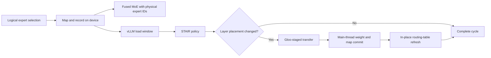

# Model Runner V2 EPLB Architecture

Model Runner V2 (MRv2) on Ascend uses the vLLM Expert Parallel Load Balancer (EPLB) controller and placement transaction with an Ascend-specific policy, routing path, load recorder, expert-weight views, and asynchronous movement adapter. This page describes the current contributor-facing architecture. See the [EPLB user guide](../../user_guide/feature_guide/expert_parallelism_load_balancer.md) for configuration and supported formats.

The ownership boundary was established in [RFC #13410](https://github.com/vllm-project/vllm-ascend/issues/13410). The asynchronous implementation keeps the upstream controller and placement state as the control plane, while STAIR plugs into the upstream policy contract instead of introducing another controller.

## Mental model

MRv2 EPLB is split into four cooperating parts:

- The **vLLM control plane** owns the step clock, load windows, committed placement, and rearrangement transaction.
- The **STAIR policy** proposes a complete placement from aggregate load, evaluates changed layers against the full temporal window, and returns a transfer-feasible map.
- The **Ascend data plane** maps logical expert IDs to physical replicas and records the load of the experts that execute.
- The **asynchronous movement plane** stages changed expert tensors through Gloo and lets the main thread commit completed layers between model forwards.

The committed vLLM placement is the source of truth. Policy history, expert weights, placement maps, and routing tables become visible in that order; none of the derived states may advance independently.

```mermaid
flowchart LR
    A["Logical expert selection"] --> B["Map and record on device"]
    B --> C["Fused MoE with physical expert IDs"]
    B --> D["vLLM load window"]
    D --> E["STAIR policy"]
    E --> F{"Layer placement changed?"}
    F -->|"No"| J["Complete cycle"]
    F -->|"Yes"| G["Gloo-staged transfer"]
    G --> H["Main-thread weight and map commit"]
    H --> I["In-place routing-table refresh"]
    I --> J
```

## Component boundaries

| Component | Responsibility |
| --- | --- |
| vLLM `EPLBController` and `EplbState` | Step clock, load-window lifecycle, distributed reduction, placement state, and commit ordering |
| `AscendEPLBController` | Batch-phase filtering and propagation of graph-safe recording inputs |
| `AscendEplbState` | STAIR ownership, temporal-window preservation, fresh-load gating, committed policy history, and routing refresh |
| STAIR policy adapter | Swift placement generation followed by FlashLB-inspired temporal acceptance |
| Ascend asynchronous worker | Policy execution, changed-layer selection, Gloo-staged transfer, and explicit cycle completion |
| Router and fused MoE adapter | Device-side logical-to-physical mapping and executed-load recording |
| Quantization method | View of the expert tensors and coupled metadata consumed by its compute kernel |
| Gloo-staged communicator | CPU-staged expert movement on the worker stream without issuing HCCL operations from the worker thread |
| Platform patch | Narrow adaptation of vLLM construction and asynchronous commit extension points |

Model Runner V1 retains its legacy controller, policy selection, and expert-map formats. MRv1 configuration does not participate in this architecture.

## Routing and load collection

The router selects logical experts once. Each MoE layer owns a fixed-shape device routing table that maps those logical IDs to physical replicas. Placement commits copy new values into the existing table instead of replacing the tensor, so compiled graphs and long-lived router instances retain a stable reference.

On NPU, one graph-safe operation performs the mapping and conditionally records physical-expert counts. Device scalars control whether the current step contributes load and how many scheduled tokens are real. This removes a Python recording branch from non-sampling windows and excludes padding from the load window. When sequence parallelism shards scheduled tokens across TP ranks, the runner supplies the rank-local unpadded-token count.

`load_collection_phase` classifies each batch as prefill or decode. A mixed batch containing any prefill work is classified as prefill. A non-matching rank clears its local load for that step, but it still advances the EPLB clock and collective sequence. This is required because different data-parallel ranks can observe different phases at the same time.

EPLB rearrangement is skipped when no rank has recorded fresh load since the preceding cycle. This prevents an old or empty window from repeatedly triggering policy and movement work.

## STAIR placement

STAIR combines two existing balancing ideas without requiring an offline transfer-cost profile:

1. Swift generates a complete placement candidate from the aggregate logical-expert load over the current window.
2. A FlashLB-inspired temporal stage evaluates every changed layer over the full `[window, layer, expert]` series.
3. A layer is accepted only when the candidate improves its mean peak-to-average rank-load score and its imbalance passes the temporal hysteresis gate.
4. Placements that cannot be executed by the current per-rank transfer layout are rejected for that layer.

The objective is load balance only; STAIR has no user-provided transfer-cost parameter. Each `AscendEplbState` owns its own policy history. History is recorded only after the main thread commits the corresponding layer, and it is discarded if the next cycle observes a placement different from the expected committed map.

The upstream asynchronous configuration accepts only the `default` policy name. Ascend keeps that public configuration contract and installs STAIR behind the policy interface, so MRv2 does not expose a second policy-selection option.

## Asynchronous movement lifecycle

When the rearrangement interval expires, vLLM reduces the recorded window and snapshots it for the asynchronous worker. The worker copies the placement snapshot to CPU, runs STAIR, and compares the proposed and committed maps before moving weights.

Only changed layers enter the movement loop. For each such layer, the worker stages the required expert tensors through Gloo, publishes one pending result, and waits until the main thread consumes the shared workspace. On a later EPLB step, the main thread installs the staged tensors, commits the vLLM maps, refreshes that layer's routing table, commits STAIR history, and acknowledges the result. The worker cannot overwrite the workspace before this acknowledgement.

The last changed layer is not necessarily the model's final MoE layer. After all changed layers are consumed, the worker therefore publishes an explicit cycle-complete marker. A fully unchanged plan uses the same marker without calling the transfer path. This keeps the upstream `rebalanced` lifecycle correct while ensuring unchanged layers perform no D2H, Gloo, H2D, or workspace-copy work.

Gloo CPU staging is the only supported asynchronous communicator on Ascend MRv2. Foreground MoE communication remains on its normal device path; the worker does not issue HCCL communication from a separate stream.

## Commit invariants and constraints

Changes to this integration must preserve these rules:

1. The committed vLLM placement is the only source of truth.
2. A routing table is refreshed only after its expert weights and placement maps commit.
3. STAIR history changes only after the corresponding layer commit.
4. A changed layer is published only after its staging writes complete.
5. The shared staging workspace is not reused until the main thread acknowledges consumption.
6. An unchanged layer performs no expert movement, and every cycle still reaches an explicit completed state.
7. Load is recorded in physical-expert space, is device-gated, and excludes padded tokens.
8. Phase filtering never changes the cross-rank ordering of EPLB collectives.
9. Movement updates the exact tensors and metadata read by the active quantized kernel.
10. EPLB-disabled execution and the MRv1 path remain isolated.

MRv2 EPLB on Ascend requires asynchronous mode, a fixed EP topology, and the `torch_gloo` communicator. Synchronous movement and elastic EP are rejected during initialization. A quantization format is supported only when it exposes a complete movable view of the storage used by compute; the current matrix is maintained in the [EPLB user guide](../../user_guide/feature_guide/expert_parallelism_load_balancer.md).

## Extension and debugging points

When adding a quantization format, begin with the expert-weight view and verify that every moved tensor and coupled metadata field is the storage consumed by fused MoE. Do not add layout knowledge to the controller or policy.

For stale routing after a transfer, compare the committed vLLM map with the layer's device routing table and verify the weight/map/refresh ordering. For a worker that remains active, inspect the pending result, workspace acknowledgement, and cycle-complete marker. For unexpected movement volume, compare Swift's candidate-layer count with STAIR's accepted-layer count. For missing or shifted load, inspect the phase gate and rank-local unpadded-token scalar before the distributed reduction.

Changes to the vLLM communicator factory or `_move_to_workspace` signature are explicit compatibility boundaries: the Ascend patch validates these signatures during registration and should fail early when the upstream contract changes.

## Related references

- Decision and ownership boundary: [RFC #13410](https://github.com/vllm-project/vllm-ascend/issues/13410)
- User configuration and support matrix: [Expert Parallelism Load Balancer](../../user_guide/feature_guide/expert_parallelism_load_balancer.md)
- Ascend configuration reference: [Additional Configuration](../../user_guide/configuration/additional_config.md)
- Test placement and execution: [Testing](../contribution/testing.md)
