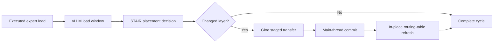

# Model Runner V2 EPLB Architecture

Model Runner V2 on Ascend uses the vLLM EPLB control plane with an Ascend-specific asynchronous execution layer. vLLM owns the load-window clock, placement state, and commit transaction. vLLM Ascend owns the STAIR placement decision, graph-stable routing, executed-load recording, quantized expert-weight views, and Gloo-staged movement.

The architectural decision is tracked in [RFC #13410](https://github.com/vllm-project/vllm-ascend/issues/13410). User configuration and the supported execution matrix are documented in the [EPLB user guide](../../user_guide/feature_guide/expert_parallelism_load_balancer.md).

## Component boundaries

| Component | Responsibility |
| --- | --- |
| vLLM `EplbState` | Window clock, distributed load reduction, placement state, and commit ordering |
| `AscendEplbState` | STAIR ownership, complete load-time-series preservation, freshness gating, and routing refresh |
| STAIR | Generate a stable candidate and accept only layers with temporal balance improvement |
| Ascend async worker | Transfer changed layers only and explicitly complete no-transfer cycles |
| Router adapter | Map logical expert IDs through a graph-stable device routing table |
| Quantization method | Expose the expert tensors and metadata consumed by its kernel |
| Gloo staged communicator | Move expert tensors on the background stream without using HCCL from the worker thread |

```mermaid
flowchart LR
    A["Executed expert load"] --> B["vLLM load window"]
    B --> C["STAIR placement decision"]
    C --> D{"Changed layer?"}
    D -->|"No"| E["Complete cycle"]
    D -->|"Yes"| F["Gloo staged transfer"]
    F --> G["Main-thread commit"]
    G --> H["In-place routing-table refresh"]
    H --> E
```

## Routing and load collection

The upstream router selects logical experts once. The Ascend router adapter maps those IDs to physical replicas using a fixed-shape device tensor. Placement commits update this tensor in place, so compiled graphs and long-lived router instances retain a stable reference.

Load is recorded in physical-expert space by the same device operation that performs the mapping. A shared device scalar gates recording, and another device scalar limits it to unpadded tokens. Non-sampling windows therefore do not execute a host-side recording branch or introduce device-to-host synchronization.

`load_collection_phase` classifies a batch as `prefill`, `decode`, or `all`. A mixed batch containing prefill work is classified as prefill. Phase filtering controls only whether load enters the window; every rank still advances the EPLB state machine in the same collective order.

## STAIR placement

STAIR is the only Model Runner V2 placement policy exposed by vLLM Ascend. It consumes the complete `[window, layer, expert]` load series. A stable placement planner generates a candidate from aggregate load, then a temporal acceptance stage evaluates each changed layer over the complete window. A candidate is accepted only when it improves peak-to-average rank load and passes hysteresis.

Policy state belongs to one `AscendEplbState` instance. Hysteresis is updated only after the main thread commits the corresponding expert weights and placement. If the next cycle observes a different placement, the stale history for that layer is discarded.

## Asynchronous movement lifecycle

The worker snapshots the committed placement and computes one complete STAIR plan. It compares the new and old maps before movement and schedules only changed layers. For each changed layer it fills the staging buffer, publishes a pending result, and waits until the main thread consumes it.

The main thread installs the staged weights, commits the vLLM maps, refreshes the device routing table, and then acknowledges the result. If no layer changes, or if the final changed layer is not the model's final MoE layer, the worker publishes an explicit cycle-complete marker. This prevents the asynchronous state from remaining permanently active without performing a dummy transfer.

The supported movement path is asynchronous Gloo CPU staging. It avoids HCCL operations from the background thread and leaves foreground MoE collectives on their normal device stream.

## Invariants and limits

Changes to this integration must preserve these invariants:

1. The committed vLLM placement is the source of truth.
2. Routing tables change only after the corresponding weight and map commit.
3. STAIR history changes only after a real layer commit.
4. Unchanged layers perform no weight-transfer work.
5. A cycle with no final-layer transfer still reaches an explicit completed state.
6. Load recording is device-gated and excludes padded tokens.
7. Weight movement updates the exact storage used by the active quantized kernel.
8. Model Runner V1 and EPLB-disabled execution remain isolated.

Model Runner V2 EPLB on Ascend currently requires asynchronous mode, a fixed EP topology, and the Gloo communicator. Elastic EP and synchronous movement are rejected during initialization. Quantization formats without a complete movement view are also rejected.

## Debugging anchors

For stale routing after movement, compare the committed vLLM map with the in-place device routing table. For a worker that remains active, verify that the last changed layer or the no-transfer marker was consumed. For unexpected movement frequency, inspect STAIR's accepted-layer count and committed hysteresis rather than only the candidate count. For missing load, verify the phase gate and unpadded-token scalar before inspecting distributed reduction.
