# Sampling Optimization Detailed Design

## 1. Overview

This document describes the implementation plan for sampling optimization in
the v1 Ascend model runner. The goal is to move the sampling path to the
upstream state-driven sampler architecture, make all logits-row mappings
explicit, and then layer distributed and fused execution on top.

The implementation is split into three phases:

1. **Sampling refactor**: replace the legacy sampler path with the new sampler
   adapter, including speculative decoding and logprobs support in the first
   landing. This phase must remove hidden `num_logits == num_reqs` assumptions.
2. **Batch-parallel sampling**: partition sampling work across data-parallel
   ranks and gather compact sampler outputs.
3. **Fused logits processing**: add fused kernels for the default logits
   processing stages.

The first phase intentionally includes speculative decoding and logprobs. The
adapter changes the contract between model runner outputs, logits rows, and
request state; landing a partial non-spec, no-logprobs path would leave
temporary assumptions that are difficult to audit later.

## 2. Architecture



**Key design decisions**:

- The sampling path is based on logits-row mapping, not request index
  coincidence.
- `SamplerOutput` uses the upstream class name directly; import paths describe
  whether a type comes from v1 outputs or the worker sampler implementation.
- The default logits processing stage delegates orchestration to upstream
  `Sampler.apply_sampling_params` where possible. Ascend-specific kernels are
  used behind the state adapters.
- `gumbel_sample` replaces exponential sampling in the adapter path. It
  samples from the same categorical distribution but does not preserve identical
  random draws.
- Speculative decoding, logprobs, and normal decode share the same
  `V1MappingContext` contract.

## 3. Configuration

Sampling optimization has two design-level knobs:

```python
class SamplingConfig:
    """Configuration for sampling path optimization in v1 model runner."""

    def __init__(self, config: dict | None = None):
        if config is None:
            config = {}
        self.enable_batch_parallel: bool = config.get(
            "enable_batch_parallel", False)
        self.logits_processing_mode: str = config.get(
            "logits_processing_mode", "default")
        self._validate()

    def _validate(self):
        if self.logits_processing_mode not in ("default", "skip", "fused"):
            raise ValueError(
                "logits_processing_mode must be 'default', 'skip', or 'fused', "
                f"got '{self.logits_processing_mode}'")
```

`logits_processing_mode="default"` and `"skip"` belong to Phase 1.
`enable_batch_parallel` belongs to Phase 2. `logits_processing_mode="fused"`
belongs to Phase 3.

## 4. Phase 1: Sampling Refactor

Phase 1 replaces the sampling implementation while preserving the model runner
contract expected by bookkeeping, async scheduling, pipeline parallelism, and
structured outputs.

Phase 1 is complete only when all of the following paths work through the new
adapter:

- normal decode
- speculative decoding / expanded logits
- raw and processed logprobs
- `max_num_logprobs == 0` sampled-token-only logprobs
- default and skip logits processing modes
- mixed batches where different requests have different sampling parameters

### 4.1 Mapping Contract

`V1MappingContext` is the boundary object between v1 model runner state and the
new sampler pipeline.

**File**: `vllm_ascend/worker/v1/sample/context.py`

```python
@dataclass
class V1MappingContext:
    # [num_logits] - maps each logits row to active request index.
    expanded_idx_mapping: torch.Tensor

    # [num_logits] CPU mirror of expanded_idx_mapping for Python-side checks.
    idx_mapping_np: np.ndarray

    # [num_logits] - token position for each logits row.
    pos: torch.Tensor

    # [num_logits] - input token ID for each logits row.
    input_ids: torch.Tensor

    # [num_logits] - local row position inside its request's expanded group.
    expanded_local_pos: torch.Tensor

    # [num_reqs + 1] cumulative logits rows per request, used by logprobs.
    cu_num_logits_np: np.ndarray | None

    # True when logits rows are not identity-mapped to requests.
    expanded_logits: bool

    # Number of active requests.
    num_reqs: int

    # Active request IDs ordered by request index.
    req_ids: tuple[str, ...] | None = None
```

The core invariant is:

```text
idx_mapping_np[row] = request_index_that_owns_logits_row
```

Examples:

```text
normal decode:
  num_reqs = 3
  logits rows = [req0, req1, req2]
  idx_mapping_np = [0, 1, 2]

expanded/speculative decode:
  num_reqs = 2
  logits rows = [req0_base, req0_draft0, req1_base]
  idx_mapping_np = [0, 0, 1]
```

All per-request tensors, such as temperature, top-p, penalties, and seeds, are
indexed through `expanded_idx_mapping` when applied to logits rows.

### 4.2 Building Context From v1 Logits Rows

The model runner already knows which flattened token positions produced logits.
Phase 1 must pass that information explicitly instead of relying on
`[:num_reqs]` slicing.

```python
@staticmethod
def from_v1_logits(
    num_reqs: int,
    positions_at_logits: torch.Tensor,
    input_ids_at_logits: torch.Tensor,
    req_indices_at_logits: torch.Tensor,
    device: torch.device,
    req_ids: tuple[str, ...] | None = None,
    expanded_local_pos: torch.Tensor | None = None,
    cu_num_logits_np: np.ndarray | None = None,
) -> "V1MappingContext":
    ...
```

The caller is responsible for selecting `positions_at_logits` and
`input_ids_at_logits` at exactly the same rows as the logits tensor.

For normal decode, `req_indices_at_logits` is usually
`torch.arange(num_reqs)`. For speculative decoding, the mapping can contain
multiple rows per request. The first implementation may require expanded rows
to be grouped by request; if a future speculative path produces interleaved
rows, it must provide an explicit `expanded_local_pos` and logprobs grouping
that preserves correctness.

### 4.3 Logits Processing

**File**: `vllm_ascend/worker/v1/sample/logits_processor.py`

Phase 1 supports two logits processing modes:

- `default`: full sampling-parameter processing, using upstream sampler
  orchestration and Ascend-compatible state adapters.
- `skip`: bypass logits processing and return an FP32 copy of logits. This is
  useful for workloads that do not use penalties, bad words, logit bias,
  min-p/top-k/top-p, or custom logits processors.

The default pipeline should reuse upstream sampler orchestration:

```python
class LogitsProcessor:

    def _apply_default(
        self,
        logits: torch.Tensor,
        sampling_metadata: SamplingMetadata,
        ctx: V1MappingContext,
        num_speculative_tokens: int,
    ) -> torch.Tensor:
        return self._apply_sampling_params_bridge.apply(
            logits, sampling_metadata, ctx, num_speculative_tokens)
```

The bridge exposes the state methods expected by upstream
`Sampler.apply_sampling_params`:

```text
logit_bias_state.apply_logit_bias
penalties_state.apply_penalties
bad_words_state.apply_bad_words
sampling_states.apply_temperature
sampling_states.apply_min_p
sampling_states.apply_top_k_top_p
```

Each state method adapts v1 `SamplingMetadata` and `V1MappingContext` to the
Ascend implementation. This keeps the stage order aligned with upstream while
still allowing Ascend-specific kernels and mapping-aware fallbacks.

The default stage order is:

1. logit bias stage: allowed token IDs and non-argmax-invariant processors
2. penalties: repetition, frequency, presence
3. bad words
4. temperature
5. argmax-invariant processors, including min-p
6. top-k / top-p

The logits processor must always copy raw logits into a separate FP32 working
tensor before mutation:

```python
processed_logits = torch.empty_like(logits, dtype=torch.float32).copy_(logits)
```

This preserves raw logits for `raw_logprobs` and avoids aliasing bugs caused by
in-place processing.

Skip mode must also return a separate FP32 tensor:

```python
return torch.empty_like(logits, dtype=torch.float32).copy_(logits)
```

Skip mode does not silently claim semantic equivalence. It should warn once per
category when active requests use parameters that would be ignored:

```text
penalties
bad_words
allowed_token_ids / logit_bias / non-argmax-invariant processors
argmax-invariant processors such as min-p
top-k / top-p
```

### 4.4 Sampling

**File**: `vllm_ascend/worker/v1/sample/adapter.py`

The adapter owns:

- mapping context construction
- logits processing
- gumbel sampling
- logprobs computation
- output formatting

```python
class V1SamplerAdapter:

    def __call__(
        self,
        logits: torch.Tensor,
        sampling_metadata: SamplingMetadata,
        num_reqs: int,
        positions: torch.Tensor,
        input_ids: torch.Tensor,
        req_indices: torch.Tensor,
        req_ids: tuple[str, ...] | None = None,
    ) -> SamplerOutput:
        ctx = V1MappingContext.from_v1_logits(
            num_reqs=num_reqs,
            positions_at_logits=positions,
            input_ids_at_logits=input_ids,
            req_indices_at_logits=req_indices,
            device=self._device,
            req_ids=req_ids,
        )
        processed_logits = self._logits_processor.apply(
            logits, sampling_metadata, ctx, self._num_speculative_tokens)
        sampled = self._sample(processed_logits, sampling_metadata, ctx)
        logprobs_tensors = self._compute_logprobs(
            logits, processed_logits, sampled, sampling_metadata, ctx)
        return SamplerOutput(
            sampled_token_ids=self._format_sampled_token_ids(sampled, ctx),
            logprobs_tensors=logprobs_tensors,
        )
```

Sampling uses Ascend gumbel sampling:

```python
sampled = gumbel_sample(
    logits=processed_logits,
    idx_mapping=ctx.expanded_idx_mapping,
    temperature=temperature,
    seed=seeds,
    pos=ctx.pos,
    apply_temperature=False,
)
```

Temperature has two meanings:

- `None` in `SamplingMetadata.temperature`: all requests are greedy. The
  adapter provides a zero temperature tensor to gumbel sampling.
- tensor value `0.0`: the corresponding request is greedy.

Seeds are cached by request ID, not by request slot. When a request moves in
the batch, its seed must move with the request.

### 4.5 Speculative Decoding

Speculative decoding is part of Phase 1. The adapter must not special-case it
as a later enhancement.

For expanded logits:

- `num_logits` can be larger than `num_reqs`
- `sampled_token_ids` can have shape `[num_reqs, max_num_generated]`
- unused cells are filled with a sentinel value consumed by existing
  bookkeeping logic
- `cu_num_logits_np` is passed to logprobs when rows are expanded

The model runner must pass an explicit row-to-request mapping for every logits
row. If the current upstream metadata does not expose such a mapping, Phase 1
must add the mapping at the model-runner boundary rather than inferring it from
row counts.

Request rows should be grouped for the first implementation:

```text
valid:   [0, 0, 0, 1, 1, 2, 2]
invalid: [0, 1, 0, 1, 2, 2, 0]
```

If interleaved speculative rows become necessary, the context must carry enough
information for penalties, bad words, and logprobs to compute per-request
history without relying on contiguous groups.

### 4.6 Logprobs

Logprobs are part of Phase 1 because they depend on the same mapping contract
as speculative decoding.

The adapter supports:

- `max_num_logprobs is None`: no logprobs
- `max_num_logprobs == 0`: sampled-token-only logprobs
- `max_num_logprobs > 0`: sampled token plus top-k logprobs
- `max_num_logprobs == -1`: full vocabulary logprobs when supported by the
  existing v1 output contract

`logprobs_mode` selects the logits source:

```text
raw_logprobs       -> raw model logits
processed_logprobs -> processed logits after sampling parameters
```

For expanded logits, `LogprobsTensors` must include `cu_num_logits` so the
engine can map logprob rows back to requests.

### 4.7 Model Runner Integration

**File**: `vllm_ascend/worker/model_runner_v1.py`

The model runner integration has two responsibilities.

First, cache logits-row inputs after `execute_model_state` is unpacked:

```python
logits_indices_for_positions = logits_indices.to(
    device=positions.device, dtype=torch.long)
logits_indices_for_input_ids = logits_indices.to(
    device=self.input_ids.gpu.device, dtype=torch.long)
self._positions_at_logits = positions.index_select(
    0, logits_indices_for_positions)
self._input_ids_at_logits = self.input_ids.gpu.index_select(
    0, logits_indices_for_input_ids)
self._req_indices_at_logits = explicit_request_mapping
self._req_ids_at_logits = tuple(
    self.input_batch.req_ids[:self.input_batch.num_reqs])
```

Second, route `_sample()` through the adapter for both normal and speculative
decode:

```python
return self._v1_sampler_adapter(
    logits=logits,
    sampling_metadata=sampling_metadata,
    num_reqs=self.input_batch.num_reqs,
    positions=self._positions_at_logits,
    input_ids=self._input_ids_at_logits,
    req_indices=self._req_indices_at_logits,
    req_ids=self._req_ids_at_logits,
)
```

The adapter path must not assume `logits.shape[0] == num_reqs`. If a code path
cannot provide the logits-row mapping yet, it should fail explicitly rather than
silently falling back to request-order assumptions.

### 4.8 Phase 1 Test Plan

| Test | File | Description |
|------|------|-------------|
| SamplingConfig parsing | `tests/ut/sample/test_sampling_config.py` | Validate knobs and modes |
| Mapping context identity | `tests/ut/sample/test_v1_mapping_context.py` | Normal decode mapping |
| Mapping context expanded | `tests/ut/sample/test_v1_mapping_context.py` | Expanded rows and `cu_num_logits_np` |
| Logits processing default | `tests/ut/sample/test_logits_processor.py` | Upstream stage delegation |
| Logits processing skip | `tests/ut/sample/test_logits_processor.py` | Processing bypass and warnings |
| FP32 working copy | `tests/ut/sample/test_logits_processor.py` | Raw logits are not mutated |
| Seed cache | `tests/ut/sample/test_v1_sampler_adapter.py` | Seed follows request ID across steps |
| Temperature None | `tests/ut/sample/test_v1_sampler_adapter.py` | Greedy metadata maps to zero temperature |
| Logprobs | `tests/ut/sample/test_v1_sampler_adapter.py` | None, 0, top-k, and expanded rows |
| Speculative mapping | `tests/ut/sample/test_v1_sampler_adapter.py` | Output formatting for expanded rows |
| E2E normal decode | `tests/e2e/singlecard/test_sampling_optimization.py` | Greedy and stochastic requests |
| E2E speculative decode | `tests/e2e/singlecard/test_sampling_optimization_spec.py` | EAGLE/draft/ngram as applicable |
| E2E logprobs | `tests/e2e/singlecard/test_sampling_optimization_logprobs.py` | Raw and processed logprobs |

## 5. Phase 2: Batch-Parallel Sampling

Phase 2 distributes row-wise sampling work across data-parallel ranks. It is
built on the Phase 1 mapping contract, so it works for normal and expanded
logits.

### 5.1 BatchParallelSampler

**File**: `vllm_ascend/worker/v1/sample/batch_parallel.py`

```python
class BatchParallelSampler:
    """Slice logits rows locally, run sampling, then gather compact outputs."""

    def slice(
        self,
        logits: torch.Tensor,
        ctx: V1MappingContext,
    ) -> tuple[torch.Tensor, V1MappingContext]:
        ...

    def maybe_gather(
        self,
        sampled: torch.Tensor,
        logprobs_tensors: LogprobsTensors | None,
        original_ctx: V1MappingContext,
    ) -> tuple[torch.Tensor, LogprobsTensors | None]:
        ...
```

The local context is a sliced `V1MappingContext`. All fields that are indexed by
logits row must be sliced together:

```text
logits
expanded_idx_mapping
idx_mapping_np
pos
input_ids
expanded_local_pos
```

### 5.2 Partitioning

Normal decode can use contiguous logits-row partitioning:

```python
start = num_logits * dp_rank // dp_world_size
end = num_logits * (dp_rank + 1) // dp_world_size
```

For expanded logits, request groups must remain intact unless the expanded
history logic explicitly supports interleaving. Therefore the initial
batch-parallel implementation partitions by request group, then converts the
request range to logits-row ranges using `cu_num_logits_np`.

```python
start_req = num_reqs * dp_rank // dp_world_size
end_req = num_reqs * (dp_rank + 1) // dp_world_size
start = cu_num_logits_np[start_req]
end = cu_num_logits_np[end_req]
```

This keeps penalties, bad words, sampled output formatting, and logprobs
grouping consistent.

### 5.3 Gather

Batch parallel gathers compact outputs, not full logits.

Gathered tensors include:

- sampled token IDs
- optional logprob token IDs
- optional logprob values
- optional logprob ranks or metadata required by the v1 output contract

For uneven partitions, each rank pads to a common row count before
`all_gather_into_tensor`, then truncates to the global row count after gather.

For expanded logits, gathered sampled rows are formatted back to
`[num_reqs, max_num_generated]` after the full result is available.

### 5.4 Interactions

**Async scheduling**: gather completes inside sampling before bookkeeping
consumes `SamplerOutput`.

**Pipeline parallelism**: PP broadcasts sampled tokens after `sample_tokens()`.
The broadcast therefore sees full-batch sampled outputs.

**Structured outputs**: grammar bitmasks are applied to logits before sampling.
Batch parallel slices already-masked logits.

**Logprobs**: Phase 2 must gather logprobs in the same row order as sampled
tokens. The gather code should treat `LogprobsTensors` as part of the sampling
output, not as a later CPU-side fixup.

### 5.5 Phase 2 Test Plan

| Test | Description |
|------|-------------|
| Row partition | Even and uneven normal decode partitions |
| Request-group partition | Expanded rows for one request stay on the same rank |
| Single-rank no-op | No gather or slicing overhead for world size 1 |
| Gather sampled tokens | Full result matches sequential sampling row order |
| Gather logprobs | Logprob tensors match sequential sampling |
| Multi-rank greedy E2E | Batch-parallel output matches default greedy output |
| Multi-rank stochastic E2E | Fixed-seed stochastic output is valid and deterministic |
| Multi-rank speculative E2E | Expanded logits work with request-group partitioning |

## 6. Phase 3: Fused Logits Processing

Phase 3 optimizes the default logits processing pipeline by reducing kernel
launches and full-vocabulary memory traffic.

### 6.1 Fused Kernel Scope

The fused implementation targets the same semantics as Phase 1 default mode.
It is not allowed to drop parameter combinations supported by default mode.

The intended split is:

```text
Kernel 1: logit bias + allowed tokens + min tokens + penalties + bad words
Kernel 2: temperature + min-p + top-k/top-p
```

The split can be adjusted if profiling shows a better boundary, but the fused
path must remain semantically equivalent to default mode.

### 6.2 FusedLogitsProcessor

**File**: `vllm_ascend/worker/v1/sample/fused_logits.py`

```python
class FusedLogitsProcessor:
    """Fused Ascend kernels for logits processing."""

    def __call__(
        self,
        logits: torch.Tensor,
        sampling_metadata: SamplingMetadata,
        ctx: V1MappingContext,
        num_speculative_tokens: int,
    ) -> torch.Tensor:
        logits = torch.empty_like(logits, dtype=torch.float32).copy_(logits)
        logits = self._fused_preprocessing(
            logits, sampling_metadata, ctx, num_speculative_tokens)
        logits = self._fused_filtering(logits, sampling_metadata, ctx)
        return logits
```

`LogitsProcessor.apply()` selects the fused implementation when
`logits_processing_mode == "fused"`.

### 6.3 Validation Requirements

The fused path must:

- match default mode within float32 tolerance
- preserve raw logits for `raw_logprobs`
- support expanded logits and request mapping
- support mixed parameter batches
- support batch-parallel slicing
- be validated across supported Ascend hardware and CANN versions

### 6.4 Phase 3 Test Plan

| Test | Description |
|------|-------------|
| Fused vs default | Output diff within tolerance for all parameter combinations |
| Raw logits preservation | `raw_logprobs` unaffected by fused processing |
| Expanded logits | Speculative rows produce the same masks and sampled outputs |
| Batch parallel + fused | Fused mode works after row/request-group slicing |
| Mixed batch | Some requests use penalties/bad words/top-p, others do not |
| Performance benchmark | Kernel count and latency vs default mode |

## 7. File Manifest

| Phase | File | Action | Description |
|-------|------|--------|-------------|
| 1 | `vllm_ascend/ascend_config.py` | Modify | Add `SamplingConfig` for batch-parallel and logits processing mode |
| 1 | `vllm_ascend/worker/v1/sample/__init__.py` | Create | Package init |
| 1 | `vllm_ascend/worker/v1/sample/context.py` | Create | `V1MappingContext` |
| 1 | `vllm_ascend/worker/v1/sample/logits_processor.py` | Create | Default and skip logits processing |
| 1 | `vllm_ascend/worker/v1/sample/adapter.py` | Create | `V1SamplerAdapter` |
| 1 | `vllm_ascend/worker/model_runner_v1.py` | Modify | Pass logits-row mapping to adapter and route sampling |
| 1 | `tests/ut/sample/test_sampling_config.py` | Create | Config parsing tests |
| 1 | `tests/ut/sample/test_v1_mapping_context.py` | Create | Mapping context tests |
| 1 | `tests/ut/sample/test_logits_processor.py` | Create | Default and skip logits processing tests |
| 1 | `tests/ut/sample/test_v1_sampler_adapter.py` | Create | Adapter, logprobs, seed, spec tests |
| 1 | `tests/ut/worker/test_model_runner_v1.py` | Modify | Model runner adapter routing tests |
| 1 | `tests/e2e/singlecard/test_sampling_optimization.py` | Create | Normal decode E2E |
| 1 | `tests/e2e/singlecard/test_sampling_optimization_spec.py` | Create | Speculative decode E2E |
| 1 | `tests/e2e/singlecard/test_sampling_optimization_logprobs.py` | Create | Logprobs E2E |
| 2 | `vllm_ascend/worker/v1/sample/batch_parallel.py` | Create | Batch-parallel slicing and gather |
| 2 | `tests/ut/sample/test_batch_parallel.py` | Create | Partition and gather tests |
| 2 | `tests/e2e/multicard/test_batch_parallel_sampling.py` | Create | Multi-rank sampling tests |
| 3 | `vllm_ascend/worker/v1/sample/fused_logits.py` | Create | Fused logits kernels |
| 3 | `vllm_ascend/worker/v1/sample/logits_processor.py` | Modify | Wire fused mode |
| 3 | `tests/ut/sample/test_fused_logits.py` | Create | Fused correctness tests |
| 3 | `tests/e2e/singlecard/test_fused_sampling.py` | Create | Fused E2E and benchmark coverage |

## 8. Risks and Mitigations

### 8.1 Hidden `num_logits == num_reqs` Assumptions

**Risk**: Normal decode hides incorrect request-index assumptions that break as
soon as speculative decoding expands logits rows.

**Mitigation**: Phase 1 requires explicit `req_indices_at_logits` for all
adapter calls. Any code path that cannot provide it must fail explicitly.

### 8.2 Logprobs and Speculative Decoding Coupling

**Risk**: Implementing logprobs later would require revisiting the same mapping
and output-shaping code touched by speculative decoding.

**Mitigation**: Logprobs and speculative decoding are Phase 1 requirements.
Expanded `cu_num_logits` support is included from the beginning.

### 8.3 Raw Logits Mutation

**Risk**: In-place logits processing can corrupt `raw_logprobs`.

**Mitigation**: Default, skip, and fused modes must return a separate FP32
working tensor instead of mutating raw logits.

### 8.4 Gumbel vs Exponential Sampling

**Risk**: Gumbel and exponential sampling generate different concrete token
draws even though they represent the same categorical distribution.

**Mitigation**: Correctness tests should compare deterministic greedy behavior
exactly and stochastic behavior statistically or with fixed adapter seeds where
appropriate.

### 8.5 Upstream State Reuse on Ascend

**Risk**: Upstream state objects may depend on CUDA-specific behavior.

**Mitigation**: Reuse upstream orchestration, not CUDA-only storage. The bridge
implements the state methods with Ascend-compatible tensors and kernels.

### 8.6 Batch-Parallel Communication Overhead

**Risk**: Gather overhead may outweigh sampling savings for small batches.

**Mitigation**: Gather only compact sampler outputs. Keep batch parallel under
its own design knob and validate latency across batch sizes and DP world sizes.

### 8.7 Fused Kernel Coverage

**Risk**: Fused mode may accidentally support fewer parameter combinations than
default mode.

**Mitigation**: Fused mode must be tested against default mode with mixed
parameter batches, expanded logits, logprobs modes, and batch-parallel slicing.
