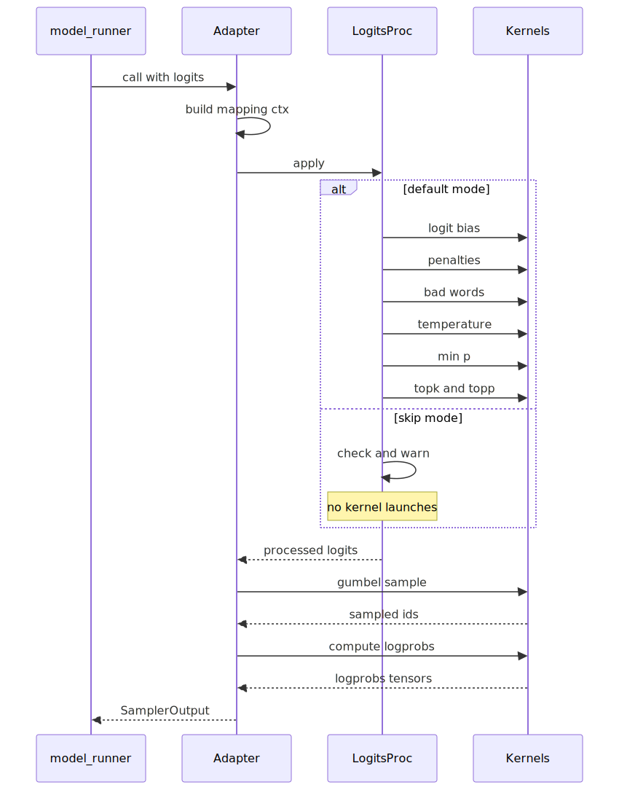
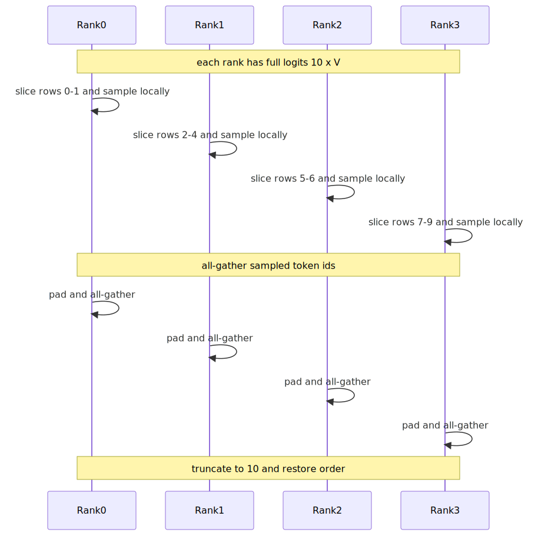

# Sampling Optimization Detailed Design

## 1. Overview

This document provides implementation-level design for the three core changes proposed in [RFC-9269](https://github.com/vllm-project/vllm-ascend/issues/9269):

1. **V1 Sampler Adapter** - Bridge the v1 model runner to the new upstream state-driven sampler architecture
2. **Batch-Parallel Sampling** - Partition sampling work across DP ranks and gather compact results
3. **Logits Processing Mode** - Configurable pipeline for default/skip/fused logits processing

Development is split into 5 phases: adapter -> batch-parallel (base) -> logprobs -> speculative decoding -> fused kernel.

## 2. Architecture


**Key design decisions**:

- Adapter is **opt-in** via `sampling_config.enable_sampling_optimization` in `additional_config`; default path is completely unchanged
- Adapter **directly imports Ascend Triton kernels** from `vllm_ascend/worker/v2/sample/` (not via patching)
- Phase 1 uses `SamplingMetadata` as input per step; persistent `UvaBackedTensor` states can be added later as optimization
- `gumbel_sample` replaces `random_sample` (exponential) in the adapter path; produces the same categorical distribution

## 3. Configuration Layer

### 3.1 SamplingConfig

**File**: `vllm_ascend/ascend_config.py`

```python
class SamplingConfig:
    """Configuration for sampling path optimization in v1 model runner."""

    def __init__(self, config: dict | None = None):
        if config is None:
            config = {}
        self.enable_sampling_optimization: bool = config.get("enable_sampling_optimization", False)
        self.enable_batch_parallel: bool = config.get("enable_batch_parallel", False)
        self.logits_processing_mode: str = config.get("logits_processing_mode", "default")
        self._validate()

    def _validate(self):
        if self.logits_processing_mode not in ("default", "skip", "fused"):
            raise ValueError(
                f"logits_processing_mode must be 'default', 'skip', or 'fused', "
                f"got '{self.logits_processing_mode}'"
            )
```

**Integration into AscendConfig** - add after existing sub-config parsing:

```python
# In AscendConfig.__init__():
sampling_config = additional_config.get("sampling_config", {})
self.sampling_config = SamplingConfig(sampling_config)
```

**User API**:

```python
LLM(
    model=...,
    additional_config={
        "sampling_config": {
            "enable_sampling_optimization": True,
            "enable_batch_parallel": True,
            "logits_processing_mode": "default",
        },
    },
)
```

### 3.2 Adapter Activation Logic

In `NPUModelRunner.__init__()`, the adapter is created when `sampling_config.enable_sampling_optimization` is explicitly enabled by the user. This must happen **after** `self.sampler` is created (line 277) and **after** speculative decoding setup (where `self.num_spec_tokens` is set):

```python
# After speculative decoding setup and self.num_spec_tokens is available
self._v1_sampler_adapter: V1SamplerAdapter | None = None
sc = self.ascend_config.sampling_config
if sc.enable_sampling_optimization:
    self._v1_sampler_adapter = V1SamplerAdapter(
        max_num_reqs=self.max_num_reqs,
        vocab_size=self.model_config.get_vocab_size(),
        device=self.device,
        logprobs_mode="raw_logprobs",   # matches AscendSampler default
        num_speculative_tokens=self.num_spec_tokens,
        sampling_config=sc,
    )
    if self.ascend_config.enable_async_exponential:
        logger.info_once(
            "V1SamplerAdapter does not support async exponential. "
            "Gumbel sampling will be used instead."
        )
```

## 4. Phase 1: V1 Sampler Adapter

### 4.1 V1MappingContext

A lightweight dataclass constructed per-step from v1 data. Encapsulates the mapping tensors that the new sampler pipeline expects.

**File**: `vllm_ascend/worker/v1/sample/context.py`

```python
@dataclass
class V1MappingContext:
    """Per-step mapping context bridging v1 data to new sampler pipeline."""

    # [num_logits] - maps each logits row to its request index
    expanded_idx_mapping: torch.Tensor

    # [num_logits] (numpy) - same mapping on CPU, for numpy-based early-exit checks
    idx_mapping_np: np.ndarray

    # [num_logits] - position of each token in its request's sequence
    pos: torch.Tensor

    # [num_logits] - input token ID at each logits position
    input_ids: torch.Tensor

    # [num_logits] - position within the expanded batch (0 for base path)
    expanded_local_pos: torch.Tensor

    # [num_reqs+1] (numpy) - cumulative logits count per request for logprobs
    cu_num_logits_np: np.ndarray | None

    # Whether logits rows are expanded (speculative decoding)
    expanded_logits: bool

    # Number of active requests
    num_reqs: int
```

**Construction** (for base decode path, non-spec-decode):

```python
@staticmethod
def from_v1_decode(num_reqs: int, positions: torch.Tensor,
                   input_ids: torch.Tensor, device: torch.device) -> "V1MappingContext":
    return V1MappingContext(
        expanded_idx_mapping=torch.arange(num_reqs, device=device, dtype=torch.int32),
        idx_mapping_np=np.arange(num_reqs, dtype=np.int32),
        pos=positions[:num_reqs],
        input_ids=input_ids[:num_reqs],
        expanded_local_pos=torch.zeros(num_reqs, device=device, dtype=torch.int64),
        cu_num_logits_np=None,  # not expanded
        expanded_logits=False,
        num_reqs=num_reqs,
    )
```

**Construction** (for speculative decoding, Phase 4):

```python
@staticmethod
def from_v1_spec_decode(
    spec_decode_metadata, num_reqs, positions, input_ids, device
) -> "V1MappingContext":
    # expanded rows: num_reqs * (1 + num_speculative_tokens)
    num_expanded = len(spec_decode_metadata.logits_indices)
    expanded_idx_mapping = spec_decode_metadata.expanded_idx_mapping  # if available
    # ... details deferred to Phase 4
```

### 4.2 LogitsProcessor

Encapsulates the logits processing pipeline. The `mode` field selects which stages to run.

**File**: `vllm_ascend/worker/v1/sample/logits_processor.py`

```python
class LogitsProcessor:
    """Configurable logits processing pipeline for the v1 sampler adapter."""

    # Parameters that are incompatible with skip mode
    _SKIP_INCOMPATIBLE = {
        "penalties": ("repetition_penalty != 1.0",
                      "frequency_penalty != 0.0",
                      "presence_penalty != 0.0"),
        "bad_words": ("bad_words is not empty",),
        "logit_bias": ("logit_bias is not empty",
                       "allowed_token_ids is not empty"),
        "min_tokens": ("min_tokens > 0 with stop_token_ids",),
        "filtering": ("top_k != -1 (or vocab_size)",
                      "top_p != 1.0",
                      "min_p != 0.0"),
    }

    def __init__(self, mode: str):
        self.mode: str = mode  # "default" | "skip" | "fused"
        self._skip_warnings_issued: set[str] = set()

    def apply(
        self,
        logits: torch.Tensor,                    # [num_logits, vocab_size]
        sampling_metadata: SamplingMetadata,
        ctx: V1MappingContext,
        num_speculative_tokens: int = 1,
    ) -> torch.Tensor:
        """Apply logits processing. Returns processed logits."""
        if self.mode == "default":
            return self._apply_default(logits, sampling_metadata, ctx, num_speculative_tokens)
        elif self.mode == "skip":
            return self._apply_skip(logits, sampling_metadata, ctx)
        elif self.mode == "fused":
            raise NotImplementedError(
                "fused logits_processing_mode is not yet implemented. "
                "This will be available in Phase 5."
            )
        raise ValueError(f"Unknown logits_processing_mode: {self.mode}")

    def _apply_default(
        self,
        logits: torch.Tensor,
        sampling_metadata: SamplingMetadata,
        ctx: V1MappingContext,
        num_speculative_tokens: int,
    ) -> torch.Tensor:
        """Full logits processing pipeline using Ascend Triton kernels."""
        # Copy to FP32 working tensor
        logits = torch.empty_like(logits, dtype=torch.float32).copy_(logits)

        # Stage 1: Logit bias (allowed tokens, logit bias values, min tokens)
        self._apply_logit_bias(logits, sampling_metadata, ctx)

        # Stage 2: Penalties (repetition, frequency, presence)
        self._apply_penalties(logits, sampling_metadata, ctx, num_speculative_tokens)

        # Stage 3: Bad words masking
        self._apply_bad_words(logits, sampling_metadata, ctx)

        # Stage 4: Temperature scaling
        self._apply_temperature(logits, sampling_metadata, ctx)

        # Stage 5: Min-p filtering
        self._apply_min_p(logits, sampling_metadata, ctx)

        # Stage 6: Top-k / Top-p filtering
        logits = self._apply_top_k_top_p(logits, sampling_metadata)

        return logits

    def _apply_skip(
        self,
        logits: torch.Tensor,
        sampling_metadata: SamplingMetadata,
        ctx: V1MappingContext,
    ) -> torch.Tensor:
        """Skip all logits processing. Warn if incompatible params are present."""
        self._check_skip_compatibility(sampling_metadata, ctx)
        return logits.float()

    def _check_skip_compatibility(self, sampling_metadata, ctx):
        """Issue warnings for parameters that skip mode ignores."""
        # Check penalties
        if not sampling_metadata.no_penalties:
            self._warn_once("penalties", self._SKIP_INCOMPATIBLE["penalties"])

        # Check bad words
        bad_words = sampling_metadata.bad_words_token_ids
        if bad_words and any(bool(bw) for bw in bad_words.values()):
            self._warn_once("bad_words", self._SKIP_INCOMPATIBLE["bad_words"])

        # Check logit bias / allowed tokens / min tokens (via LogitsProcessors)
        logitsprocs = sampling_metadata.logitsprocs
        if logitsprocs is not None:
            argmax_inv = list(logitsprocs.argmax_invariant)
            non_argmax_inv = list(logitsprocs.non_argmax_invariant)
            if argmax_inv or non_argmax_inv:
                self._warn_once("logit_bias", self._SKIP_INCOMPATIBLE["logit_bias"])

        # Check allowed_token_ids_mask
        if sampling_metadata.allowed_token_ids_mask is not None:
            self._warn_once("logit_bias", self._SKIP_INCOMPATIBLE["logit_bias"])

        # Check filtering params (top-k, top-p, min-p are skipped in skip mode)
        if sampling_metadata.min_p is not None:
            has_minp = any(m > 0.0 for m in sampling_metadata.min_p[:ctx.num_reqs])
            if has_minp:
                self._warn_once("filtering",
                    ("min_p != 0.0 - min_p filtering is skipped in skip mode",))

    def _warn_once(self, category: str, details: tuple[str, ...]):
        if category not in self._skip_warnings_issued:
            self._skip_warnings_issued.add(category)
            logger.warning_once(
                "logits_processing_mode='skip' but active requests use %s. "
                "Output may differ from default mode. Incompatible: %s",
                category, ", ".join(details),
            )
```

**Individual stage implementations** (using Ascend kernels from v2):

```python
def _apply_logit_bias(self, logits, sampling_metadata, ctx):
    """Apply logit bias, allowed token IDs, and min tokens masking.

    Phase 1 approach: use the v1 Sampler's built-in logit bias processing
    via LogitsProcessors. The v1 InputBatch already builds LogitsProcessors
    from SamplingParams (including allowed_token_ids, logit_bias, min_tokens).
    We apply both argmax_invariant and non_argmax_invariant processors here.
    """
    logitsprocs = sampling_metadata.logitsprocs
    if logitsprocs is None:
        return
    # Apply argmax_invariant processors (e.g., allowed_token_ids masking)
    for processor in logitsprocs.argmax_invariant:
        logits = processor.apply(logits)
    # Apply non_argmax_invariant processors (e.g., logit_bias, min_tokens)
    for processor in logitsprocs.non_argmax_invariant:
        logits = processor.apply(logits)

def _apply_penalties(self, logits, sampling_metadata, ctx, num_speculative_tokens):
    """Apply repetition/frequency/presence penalties using Ascend kernel."""
    if sampling_metadata.no_penalties:
        return
    from vllm_ascend.sample.penalties import apply_all_penalties
    # output_token_ids is maintained by NPUInputBatch and passed through
    # SamplingMetadata
    output_token_ids = sampling_metadata.output_token_ids
    apply_all_penalties(
        logits,
        sampling_metadata.prompt_token_ids,
        sampling_metadata.presence_penalties,
        sampling_metadata.frequency_penalties,
        sampling_metadata.repetition_penalties,
        output_token_ids,
    )

def _apply_bad_words(self, logits, sampling_metadata, ctx):
    """Apply bad words masking.

    Phase 1 approach: bad_words in v1 are handled through LogitsProcessors
    (built by InputBatch from SamplingParams.bad_words_token_ids).
    The LogitsProcessors pipeline already covers this case.

    Full Ascend-optimized bad_words support (using the v2
    bad_words Triton kernel from vllm_ascend/worker/v2/sample/bad_words.py
    with BadWordsState and precomputed tensors) will be added when
    persistent states are introduced.
    """
    # bad_words are already handled by _apply_logit_bias through
    # LogitsProcessors. No separate kernel call needed in Phase 1.
    pass

def _apply_temperature(self, logits, sampling_metadata, ctx):
    """Apply temperature scaling using Ascend Triton kernel."""
    temp = sampling_metadata.temperature[:ctx.num_reqs]
    # Check if any request needs temperature (early exit optimization)
    if isinstance(temp, torch.Tensor):
        temp_cpu = temp.cpu().numpy() if temp.is_cuda or temp.is_npu else temp.numpy()
    else:
        temp_cpu = np.asarray(temp)
    if np.all((temp_cpu == 0.0) | (temp_cpu == 1.0)):
        return  # No temperature needed, skip kernel launch
    # Ensure temperature tensor is on device with correct shape
    if not isinstance(temp, torch.Tensor):
        temp = torch.tensor(temp, dtype=torch.float32, device=logits.device)
    elif temp.device != logits.device:
        temp = temp.to(logits.device)
    from vllm_ascend.worker.v2.sample.gumbel import apply_temperature
    apply_temperature(logits, ctx.expanded_idx_mapping, temp)

def _apply_min_p(self, logits, sampling_metadata, ctx):
    """Apply min-p filtering using Ascend Triton kernel."""
    min_p = sampling_metadata.min_p[:ctx.num_reqs]
    # Early exit if no request uses min_p
    if isinstance(min_p, torch.Tensor):
        min_p_cpu = min_p.cpu().numpy() if min_p.is_cuda or min_p.is_npu else min_p.numpy()
    else:
        min_p_cpu = np.asarray(min_p)
    if np.all(min_p_cpu == 0.0):
        return
    if not isinstance(min_p, torch.Tensor):
        min_p = torch.tensor(min_p, dtype=torch.float32, device=logits.device)
    elif min_p.device != logits.device:
        min_p = min_p.to(logits.device)
    from vllm_ascend.worker.v2.sample.min_p import apply_min_p
    apply_min_p(logits, ctx.expanded_idx_mapping, min_p)

def _apply_top_k_top_p(self, logits, sampling_metadata):
    """Apply top-k and top-p filtering using existing Ascend implementation."""
    from vllm_ascend.sample.sampler import apply_top_k_top_p
    k = sampling_metadata.top_k
    p = sampling_metadata.top_p
    # Convert to tensors on device if needed
    if not isinstance(k, torch.Tensor):
        k = torch.tensor(k, dtype=torch.int32, device=logits.device)
    elif k.device != logits.device:
        k = k.to(logits.device)
    if not isinstance(p, torch.Tensor):
        p = torch.tensor(p, dtype=torch.float32, device=logits.device)
    elif p.device != logits.device:
        p = p.to(logits.device)
    return apply_top_k_top_p(logits, k, p)
```

### 4.3 V1SamplerAdapter

The main adapter class that orchestrates the new sampling pipeline.

**File**: `vllm_ascend/worker/v1/sample/adapter.py`

```python
class V1SamplerAdapter:
    """Bridges v1 model runner's _sample() to the new state-driven sampler
    architecture with Ascend-optimized kernels.

    Usage: Created in NPUModelRunner.__init__() when sampling optimization is enabled.
           Called from NPUModelRunner._sample() instead of self.sampler().
    """

    def __init__(
        self,
        max_num_reqs: int,
        vocab_size: int,
        device: torch.device,
        logprobs_mode: str = "raw_logprobs",    # "raw_logprobs" | "processed_logprobs"
        num_speculative_tokens: int = 1,
        sampling_config: SamplingConfig | None = None,
    ):
        self._max_num_reqs = max_num_reqs
        self._vocab_size = vocab_size
        self._device = device
        self._logprobs_mode = logprobs_mode
        self._num_speculative_tokens = num_speculative_tokens
        self._sampling_config = sampling_config or SamplingConfig()

        # Logits processing pipeline
        self._logits_processor = LogitsProcessor(self._sampling_config.logits_processing_mode)

        # Batch-parallel sampler (Phase 2)
        self._batch_parallel_sampler: BatchParallelSampler | None = None
        if self._sampling_config.enable_batch_parallel:
            self._batch_parallel_sampler = BatchParallelSampler(device)

    def __call__(
        self,
        logits: torch.Tensor,           # [num_logits, vocab_size]
        sampling_metadata: SamplingMetadata,
        num_reqs: int,
        positions: torch.Tensor,         # [num_scheduled_tokens] - all scheduled positions
        input_ids: torch.Tensor,         # [num_scheduled_tokens] - all scheduled input IDs
    ) -> SamplerOutput:
        """Main entry point. Replaces self.sampler(logits, sampling_metadata)."""

        # 1. Build mapping context from v1 data
        ctx = V1MappingContext.from_v1_decode(num_reqs, positions, input_ids, self._device)

        # 2. Logits processing (mode-controlled pipeline)
        with record_function_or_nullcontext("logits_processing"):
            processed_logits = self._logits_processor.apply(
                logits, sampling_metadata, ctx, self._num_speculative_tokens,
            )

        # 3. Sampling (includes batch-parallel slicing)
        with record_function_or_nullcontext("sample"):
            sampled = self._sample(processed_logits, sampling_metadata, ctx)

        # 4. Logprobs (Phase 1: basic support, detailed in Phase 3)
        logprobs_tensors = self._compute_logprobs(
            logits, processed_logits, sampled, sampling_metadata, ctx,
        )

        # 5. Batch-parallel gather (restores full batch from local slices)
        if self._batch_parallel_sampler is not None:
            sampled, logprobs_tensors = self._batch_parallel_sampler.maybe_gather(
                sampled, logprobs_tensors, ctx,  # ctx is the ORIGINAL (pre-slice) context
            )

        # 6. Construct output - use v1's SamplerOutput for compatibility
        #    with _bookkeeping_sync and AsyncGPUModelRunnerOutput
        from vllm.v1.outputs import SamplerOutput as V1SamplerOutput
        return V1SamplerOutput(
            sampled_token_ids=sampled.view(-1, 1),
            logprobs_tensors=logprobs_tensors,
        )

    def _sample(
        self,
        logits: torch.Tensor,           # [num_logits, vocab_size] - after processing
        sampling_metadata: SamplingMetadata,
        ctx: V1MappingContext,           # original context (not modified)
    ) -> torch.Tensor:
        """Sample tokens using Gumbel sampling with Ascend kernel."""
        # Batch-parallel: slice logits and create a LOCAL context
        local_logits = logits
        local_ctx = ctx
        if self._batch_parallel_sampler is not None:
            local_logits, local_ctx = self._batch_parallel_sampler.slice(logits, ctx)

        from vllm_ascend.worker.v2.sample.gumbel import gumbel_sample

        # Prepare temperature tensor on device
        temp = sampling_metadata.temperature[:local_ctx.num_reqs]
        if not isinstance(temp, torch.Tensor):
            temp = torch.tensor(temp, dtype=torch.float32, device=self._device)
        elif temp.device != self._device:
            temp = temp.to(self._device)

        # Prepare seeds tensor
        seeds = self._compute_seeds(sampling_metadata, local_ctx.num_reqs)

        sampled = gumbel_sample(
            logits=local_logits,
            idx_mapping=local_ctx.expanded_idx_mapping,
            temperature=temp,
            seed=seeds,
            pos=local_ctx.pos[:local_logits.shape[0]],
            apply_temperature=False,  # temperature already applied in logits_processor
        )
        return sampled

    def _compute_seeds(
        self,
        sampling_metadata: SamplingMetadata,
        num_reqs: int,
    ) -> torch.Tensor:
        """Compute deterministic seeds for Gumbel sampling.

        If a request has an explicit seed (from SamplingParams.seed), use it.
        Otherwise, generate a random seed that stays consistent within a step.
        """
        seeds = torch.empty(num_reqs, dtype=torch.int64, device=self._device)
        # For requests with explicit generators, extract initial seed
        generators = sampling_metadata.generators
        # For Phase 1: generate seeds per step
        # This means non-seeded requests get different samples each step,
        # which is the expected stochastic behavior.
        seeds.random_(-2**63, 2**63)
        # Override for requests with explicit seeds
        if generators:
            for idx, gen in generators.items():
                if idx < num_reqs:
                    seeds[idx] = gen.initial_seed()
        return seeds

    def _compute_logprobs(
        self,
        raw_logits: torch.Tensor,
        processed_logits: torch.Tensor,
        sampled: torch.Tensor,
        sampling_metadata: SamplingMetadata,
        ctx: V1MappingContext,
    ) -> LogprobsTensors | None:
        """Compute top-k logprobs if requested."""
        max_num_logprobs = sampling_metadata.max_num_logprobs
        if max_num_logprobs is None or max_num_logprobs <= 0:
            return None

        # Select logits source based on logprobs_mode
        if self._logprobs_mode == "processed_logprobs":
            logits_for_logprobs = processed_logits
        else:  # "raw_logprobs"
            logits_for_logprobs = raw_logits

        # cu_num_logits for expanded logits (speculative decode)
        cu_num_logits = ctx.cu_num_logits_np.tolist() if ctx.expanded_logits else None

        from vllm_ascend.worker.v2.sample.logprob import compute_topk_logprobs
        return compute_topk_logprobs(
            logits_for_logprobs, max_num_logprobs, sampled, cu_num_logits,
        )
```

### 4.4 model_runner_v1.py Modifications

**Minimal changes** - only `_sample()` and `sample_tokens()` need modification.

#### 4.4.1 `_sample()` modification

```python
# BEFORE (existing code):
def _sample(self, logits, spec_decode_metadata):
    sampling_metadata = self.input_batch.sampling_metadata
    self.input_batch.update_async_output_token_ids()
    if spec_decode_metadata is None:
        if lmhead_tp_enable() and logits is not None:
            logits = logits[: self.input_batch.num_reqs]
        return self.sampler(
            logits=logits,
            sampling_metadata=sampling_metadata,
        )
    if lmhead_tp_enable() and logits is not None:
        logits = logits[: len(spec_decode_metadata.logits_indices)]
    sampler_output = self.rejection_sampler(
        spec_decode_metadata, None, logits, sampling_metadata,
    )
    return sampler_output

# AFTER (modified code):
def _sample(self, logits, spec_decode_metadata):
    sampling_metadata = self.input_batch.sampling_metadata
    self.input_batch.update_async_output_token_ids()

    # Adapter path (opt-in via sampling_config.enable_sampling_optimization)
    if self._v1_sampler_adapter is not None and spec_decode_metadata is None:
        if lmhead_tp_enable() and logits is not None:
            logits = logits[: self.input_batch.num_reqs]
        return self._v1_sampler_adapter(
            logits=logits,
            sampling_metadata=sampling_metadata,
            num_reqs=self.input_batch.num_reqs,
            positions=self._positions_at_logits,
            input_ids=self._input_ids_at_logits,
        )

    # Default path (unchanged)
    if spec_decode_metadata is None:
        if lmhead_tp_enable() and logits is not None:
            logits = logits[: self.input_batch.num_reqs]
        return self.sampler(
            logits=logits,
            sampling_metadata=sampling_metadata,
        )
    if lmhead_tp_enable() and logits is not None:
        logits = logits[: len(spec_decode_metadata.logits_indices)]
    sampler_output = self.rejection_sampler(
        spec_decode_metadata, None, logits, sampling_metadata,
    )
    return sampler_output
```

#### 4.4.2 Store positions and input_ids for adapter

In `sample_tokens()`, after unpacking `execute_model_state`, store the positions and input_ids at logits indices:

```python
# In sample_tokens(), after unpacking execute_model_state:
if self._v1_sampler_adapter is not None:
    self._positions_at_logits = positions[:self.input_batch.num_reqs]
    # input_ids comes from the input batch
    self._input_ids_at_logits = self.input_batch.input_ids[:self.input_batch.num_reqs]
```

> **Note**: For Phase 1 (non-spec-decode), the first `num_reqs` positions correspond to the decode tokens. This is correct because in the decode-only path, each request schedules exactly 1 token that produces logits. For mixed prefill+decode steps, `logits_indices` from the scheduler output should be used to select the correct positions. This refinement will be added if needed.

#### 4.4.3 New instance variables on NPUModelRunner

```python
# In __init__(), after creating the adapter:
self._v1_sampler_adapter: V1SamplerAdapter | None = None  # set based on enable_sampling_optimization
self._positions_at_logits: torch.Tensor | None = None
self._input_ids_at_logits: torch.Tensor | None = None
```

### 4.5 Sampling Pipeline Data Flow



### 4.6 Phase 1 Test Plan

| Test | File | Description |
|------|------|-------------|
| SamplingConfig parsing | `tests/ut/sample/test_sampling_config.py` | Default values, valid modes, invalid mode raises ValueError |
| V1MappingContext construction | `tests/ut/sample/test_v1_mapping_context.py` | Identity mapping for decode path, correct pos/input_ids slicing |
| LogitsProcessor default mode | `tests/ut/sample/test_logits_processor.py` | Each stage called, no stages skipped |
| LogitsProcessor skip mode | `tests/ut/sample/test_logits_processor.py` | No kernel launches, warnings for incompatible params |
| Adapter output shape | `tests/ut/sample/test_v1_sampler_adapter.py` | sampled_token_ids shape [num_reqs, 1], logprobs_tensors shape |
| E2E: single card default | `tests/e2e/singlecard/test_adapter_default.py` | Output matches existing AscendSampler for greedy decoding |
| E2E: single card skip | `tests/e2e/singlecard/test_adapter_skip.py` | Skip mode produces valid tokens, warnings logged |

## 5. Phase 2: Batch-Parallel Sampling

### 5.1 BatchParallelSampler

**File**: `vllm_ascend/worker/v1/sample/batch_parallel.py`

```python
class BatchParallelSampler:
    """Handles batch-parallel sampling: slice -> local sample -> gather -> restore."""

    def __init__(self, device: torch.device):
        self._device = device
        self._dp_group = None  # cached, populated on first use

    def _get_dp_group(self):
        """Lazily get DP group reference."""
        if self._dp_group is None:
            self._dp_group = get_dp_group()
        return self._dp_group

    def slice(
        self,
        logits: torch.Tensor,           # [num_logits, vocab_size]
        ctx: V1MappingContext,
    ) -> tuple[torch.Tensor, V1MappingContext]:
        """Slice logits and mapping context for the local DP rank.

        Returns the local slice of logits and a correspondingly sliced
        V1MappingContext. No communication is needed before slicing
        because each rank already has the full logits tensor.
        """
        dp = self._get_dp_group()
        if dp.world_size <= 1:
            return logits, ctx  # No slicing needed

        dp_rank = dp.rank
        dp_world_size = dp.world_size
        num_logits = logits.shape[0]

        # Deterministic contiguous row partition
        start = num_logits * dp_rank // dp_world_size
        end = num_logits * (dp_rank + 1) // dp_world_size

        # Slice logits
        local_logits = logits[start:end]

        # Slice mapping context
        local_ctx = V1MappingContext(
            expanded_idx_mapping=ctx.expanded_idx_mapping[start:end],
            idx_mapping_np=ctx.idx_mapping_np[start:end],
            pos=ctx.pos[start:end],
            input_ids=ctx.input_ids[start:end],
            expanded_local_pos=ctx.expanded_local_pos[start:end],
            cu_num_logits_np=None,  # not needed for local slice
            expanded_logits=False,
            num_reqs=end - start,
        )
        return local_logits, local_ctx

    def maybe_gather(
        self,
        sampled: torch.Tensor,                   # [local_num_logits]
        logprobs_tensors: LogprobsTensors | None,  # Phase 3
        original_ctx: V1MappingContext,           # original (pre-slice) context
    ) -> tuple[torch.Tensor, LogprobsTensors | None]:
        """Gather sampling results from all DP ranks and restore order.

        Only performs gather when dp_world_size > 1.
        Returns the full-batch results matching the original num_logits.
        """
        dp = self._get_dp_group()
        if dp.world_size <= 1:
            return sampled, logprobs_tensors

        full_sampled = self._gather_tensor(sampled, original_ctx.num_reqs, dp)
        # Phase 3: gather logprobs_tensors
        full_logprobs = None
        if logprobs_tensors is not None:
            full_logprobs = self._gather_logprobs(logprobs_tensors, original_ctx, dp)

        return full_sampled, full_logprobs

    def _gather_tensor(
        self,
        local_tensor: torch.Tensor,   # [local_size]
        total_size: int,
        dp_group,
    ) -> torch.Tensor:
        """All-gather a 1D tensor from all DP ranks and restore original order."""
        dp_rank = dp_group.rank
        dp_world_size = dp_group.world_size

        # Pad local tensor to uniform size for all-gather
        max_local_size = (total_size + dp_world_size - 1) // dp_world_size
        local_padded = F.pad(
            local_tensor,
            (0, max_local_size - local_tensor.shape[0]),
            value=0,
        )

        # All-gather: result shape [dp_world_size * max_local_size]
        gathered = torch.empty(
            dp_world_size * max_local_size,
            dtype=local_tensor.dtype,
            device=self._device,
        )
        dist.all_gather_into_tensor(gathered, local_padded, group=dp_group.device_group)

        # Restore original row order
        # gathered layout: [rank0_data | rank1_data | rank2_data | ...]
        # Each rank's data corresponds to its contiguous row range
        result = gathered[:total_size]
        return result

    def _gather_logprobs(
        self,
        local_logprobs: LogprobsTensors,
        original_ctx: V1MappingContext,
        dp_group,
    ) -> LogprobsTensors:
        """Gather logprobs tensors from all DP ranks (Phase 3 detail)."""
        # Implementation deferred to Phase 3
        raise NotImplementedError("Phase 3")
```

### 5.2 Row Partition Algorithm

For `dp_world_size = 4`, `num_logits = 10`:

```
rank 0: rows [0, 1]    -> floor(10*0/4)=0, floor(10*1/4)=2
rank 1: rows [2, 4]    -> floor(10*1/4)=2, floor(10*2/4)=5
rank 2: rows [5, 7]    -> floor(10*2/4)=5, floor(10*3/4)=7
rank 3: rows [7, 9]    -> floor(10*3/4)=7, floor(10*4/4)=10
```

Properties:
- Deterministic: all ranks compute the same partition using the same formula
- Contiguous: each rank gets a contiguous range of rows (good for memory access)
- Complete: union of all ranges = [0, num_logits)
- No communication needed before slicing

### 5.3 All-Gather and Order Restoration



**Key details**:

- `all_gather_into_tensor` is used (not `all_gather` with list), for efficiency
- Padding is needed because ranks may have different local sizes (uneven partitions)
- After gather, truncate to `total_size` to remove padding
- The contiguous partition scheme ensures that the gathered result is already in the correct order - no permutation needed

### 5.4 Interaction with Async Scheduling and PP

**Async scheduling**: The gather happens inside `_sample()` (before `_bookkeeping_sync()` consumes the result), so the timing is correct. The `sampler_output.sampled_token_ids` seen by bookkeeping is already the full-batch result.

**Pipeline parallelism**: `_pp_broadcast_prev_sampled_token_ids()` runs after `sample_tokens()` returns. At that point, gather is already complete, so the broadcast sends the correct full-batch data.

**`lmhead_tp_enable()`**: The `logits[:num_reqs]` truncation in `_sample()` happens before the adapter is called. Batch-parallel slicing operates on the already-truncated logits, so no interaction issue.

### 5.5 Phase 2 Test Plan

| Test | Description |
|------|-------------|
| Row partition determinism | Same formula produces same partition across ranks |
| Uneven partition | num_logits=10, dp_world_size=3 -> correct split |
| All-gather + restore | Gathered result matches sequential sampling for greedy |
| Single-rank no-op | dp_world_size=1: no gather, no overhead |
| E2E: multi-rank DP greedy | batch_parallel=True matches default sampling output for greedy |
| E2E: multi-rank DP stochastic | batch_parallel=True with fixed seed produces valid samples |

## 6. Phase 3: Logprobs Support

### 6.1 Gather Logprobs

Extend `BatchParallelSampler._gather_logprobs()`:

```python
def _gather_logprobs(
    self,
    local_logprobs: LogprobsTensors,
    original_ctx: V1MappingContext,
    dp_group,
) -> LogprobsTensors:
    """Gather logprobs tensors from all DP ranks."""
    total_size = original_ctx.num_reqs

    # Gather logprob values: [local_num, max_k] -> [total_num, max_k]
    gathered_values = self._gather_2d_tensor(
        local_logprobs.logprob_values, total_size, dp_group,
    )

    # Gather logprob token IDs: [local_num, max_k] -> [total_num, max_k]
    gathered_ids = self._gather_2d_tensor(
        local_logprobs.logprob_token_ids, total_size, dp_group,
    )

    return LogprobsTensors(
        logprob_values=gathered_values,
        logprob_token_ids=gathered_ids,
    )

def _gather_2d_tensor(
    self,
    local_tensor: torch.Tensor,   # [local_num, K]
    total_rows: int,
    dp_group,
) -> torch.Tensor:
    """All-gather a 2D tensor and restore row order."""
    dp_world_size = dp_group.world_size
    local_rows = local_tensor.shape[0]
    K = local_tensor.shape[1]
    max_local_rows = (total_rows + dp_world_size - 1) // dp_world_size

    # Pad rows
    padded = F.pad(local_tensor, (0, 0, 0, max_local_rows - local_rows))

    # All-gather: [dp_world_size * max_local_rows, K]
    gathered = torch.empty(
        dp_world_size * max_local_rows, K,
        dtype=local_tensor.dtype, device=self._device,
    )
    dist.all_gather_into_tensor(gathered.view(-1), padded.view(-1), group=dp_group.device_group)

    return gathered[:total_rows]
```

### 6.2 cu_num_logits for Expanded Logits

When speculative decoding expands logits rows, the `cu_num_logits_np` array tracks how many logits rows belong to each request. For batch-parallel, each rank needs to know the global `cu_num_logits` to correctly compute logprobs for the expanded case.

This is handled by:
1. All-gather the `cu_num_logits` array along with sampling results
2. Or, since `cu_num_logits` is a small array (num_reqs + 1 elements), broadcast it from rank 0

Phase 3 will address this in detail when implementing the expanded-logits logprobs path.

### 6.3 Phase 3 Test Plan

| Test | Description |
|------|-------------|
| 2D tensor gather | [local_num, K] correctly gathered and restored |
| Logprobs values match | batch_parallel logprobs match default logprobs for greedy |
| Prompt logprobs | Not affected by batch-parallel (computed separately) |
| Async scheduling logprobs | logprobs_tensors in AsyncGPUModelRunnerOutput correct |

## 7. Phase 4: Speculative Decoding Support

### 7.1 Expanded Logits Slicing

For speculative decoding, logits are expanded: each request has `(1 + num_speculative_tokens)` logits rows. The total logits shape becomes `[num_expanded, vocab_size]` where `num_expanded > num_reqs`.

```python
@staticmethod
def from_v1_spec_decode(
    spec_decode_metadata: SpecDecodeMetadata,
    num_reqs: int,
    positions: torch.Tensor,
    input_ids: torch.Tensor,
    device: torch.device,
) -> V1MappingContext:
    """Construct mapping context for speculative decoding path."""
    # The spec_decode_metadata contains logits_indices that tell us
    # which rows in the expanded logits correspond to which requests
    num_expanded = len(spec_decode_metadata.logits_indices)

    # expanded_idx_mapping: maps each expanded row to its request index
    # For example, with num_spec_tokens=2 and 3 requests:
    #   expanded_idx_mapping = [0, 0, 0, 1, 1, 1, 2, 2, 2]
    expanded_idx_mapping = torch.repeat_interleave(
        torch.arange(num_reqs, device=device, dtype=torch.int32),
        1 + spec_decode_metadata.num_speculative_tokens,
    )

    idx_mapping_np = expanded_idx_mapping.cpu().numpy()

    return V1MappingContext(
        expanded_idx_mapping=expanded_idx_mapping,
        idx_mapping_np=idx_mapping_np,
        pos=positions[spec_decode_metadata.logits_indices],
        input_ids=input_ids[spec_decode_metadata.logits_indices],
        expanded_local_pos=spec_decode_metadata.expanded_local_pos,
        cu_num_logits_np=np.arange(1, num_expanded + 1),  # simplified
        expanded_logits=True,
        num_reqs=num_reqs,
    )
```

### 7.2 Rejection Sampling with Batch-Parallel

The rejection sampler takes the full expanded logits and produces accepted/rejected token outputs. With batch-parallel:

1. Slice expanded logits along the row dimension (same formula, but with `num_expanded` instead of `num_reqs`)
2. Run local rejection sampling
3. Gather the rejection sampler output (which has the same shape as non-spec output: `[num_reqs, max_gen_len]`)

The key complexity is that `expanded_idx_mapping` is non-trivial for spec decode (not identity). The slicing needs to preserve the relationship between expanded rows and their parent requests.

**Constraint**: A request's expanded rows must not be split across ranks. This means the partition formula needs to operate at the request level, not the row level:

```python
# Instead of: start = num_expanded * dp_rank // dp_world_size
# Use:        start_req = num_reqs * dp_rank // dp_world_size
#             start = start_req * (1 + num_spec_tokens)
```

### 7.3 Adapter Spec-Decode Path

Extend `_sample()` in the adapter:

```python
def __call__(self, logits, sampling_metadata, num_reqs, positions, input_ids,
             spec_decode_metadata=None):
    if spec_decode_metadata is not None:
        ctx = V1MappingContext.from_v1_spec_decode(
            spec_decode_metadata, num_reqs, positions, input_ids, self._device,
        )
    else:
        ctx = V1MappingContext.from_v1_decode(num_reqs, positions, input_ids, self._device)

    # ... rest of pipeline same as base case
```

And in `model_runner_v1._sample()`:

```python
if self._v1_sampler_adapter is not None:
    if lmhead_tp_enable() and logits is not None:
        if spec_decode_metadata is None:
            logits = logits[:self.input_batch.num_reqs]
        else:
            logits = logits[:len(spec_decode_metadata.logits_indices)]
    return self._v1_sampler_adapter(
        logits=logits,
        sampling_metadata=sampling_metadata,
        num_reqs=self.input_batch.num_reqs,
        positions=self._positions_at_logits,
        input_ids=self._input_ids_at_logits,
        spec_decode_metadata=spec_decode_metadata,
    )
```

### 7.4 Phase 4 Test Plan

| Test | Description |
|------|-------------|
| Spec-decode mapping context | Correct expanded_idx_mapping for EAGLE/draft-model/ngram |
| Request-level partition | Expanded rows for same request stay on same rank |
| Greedy spec-decode | batch_parallel + spec_decode matches default output |
| EAGLE path | End-to-end validation with EAGLE proposer |
| Draft-model path | End-to-end validation with draft model proposer |

## 8. Phase 5: Fused Logits Processing

### 8.1 Fused Kernel Design

The fused kernel combines multiple logits processing stages into 1-2 kernel launches to reduce:
- Kernel launch overhead
- Intermediate memory traffic (reading/writing full [num_logits, vocab_size] tensors multiple times)
- L2 cache thrashing between stages

**Kernel 1** (`fused_logits_preprocessing`): logit_bias + penalties + bad_words

```
Input:  logits [num_logits, vocab_size]
        per-request: penalty values, logit_bias, allowed_token_ids, min_tokens, bad_words
Output: logits [num_logits, vocab_size] (modified in-place)
```

**Kernel 2** (`fused_logits_filtering`): temperature + min_p + top_k_top_p

```
Input:  logits [num_logits, vocab_size]
        per-request: temperature, min_p, top_k, top_p
Output: logits [num_logits, vocab_size] (filtered)
```

### 8.2 FusedLogitsProcessor

**File**: `vllm_ascend/worker/v1/sample/fused_logits.py`

```python
class FusedLogitsProcessor:
    """Fused Triton-Ascend kernel for combined logits processing."""

    def __call__(
        self,
        logits: torch.Tensor,
        sampling_metadata: SamplingMetadata,
        ctx: V1MappingContext,
        num_speculative_tokens: int,
    ) -> torch.Tensor:
        logits = logits.float()

        # Kernel 1: bias + penalties + bad_words
        logits = self._fused_preprocessing(logits, sampling_metadata, ctx, num_speculative_tokens)

        # Kernel 2: temperature + min_p + top_k_top_p
        logits = self._fused_filtering(logits, sampling_metadata, ctx)

        return logits

    def _fused_preprocessing(self, logits, sampling_metadata, ctx, num_spec_tokens):
        """Single-pass: logit_bias + penalties + bad_words."""
        raise NotImplementedError("Phase 5 implementation")

    def _fused_filtering(self, logits, sampling_metadata, ctx):
        """Single-pass: temperature + min_p + top_k_top_p."""
        raise NotImplementedError("Phase 5 implementation")
```

### 8.3 Integration into LogitsProcessor

```python
# In LogitsProcessor.__init__:
def __init__(self, mode: str):
    self.mode = mode
    self._fused_processor: FusedLogitsProcessor | None = None
    if mode == "fused":
        self._fused_processor = FusedLogitsProcessor()

# In LogitsProcessor.apply():
elif self.mode == "fused":
    return self._fused_processor(logits, sampling_metadata, ctx, num_speculative_tokens)
```

### 8.4 Validation Requirements

The fused kernel must:
- Produce outputs matching `default` mode within float32 tolerance (due to operation ordering)
- Support mixed request parameters in a single batch (e.g., some requests with penalties, some without)
- Handle all parameter combinations covered by the default pipeline
- Be validated per CANN version and Ascend hardware generation (910B, 910C, etc.)

### 8.5 Phase 5 Test Plan

| Test | Description |
|------|-------------|
| Fused vs default tolerance | Output diff < 1e-3 for all parameter combinations |
| Mixed batch | Some requests with penalties, some without |
| Performance benchmark | Compare kernel launch count and latency vs default |
| CANN version coverage | Validate on each supported CANN version |

## 9. File Manifest

| Phase | File | Action | Description |
|-------|------|--------|-------------|
| 1 | `vllm_ascend/ascend_config.py` | Modify | Add `SamplingConfig` class, parse in `AscendConfig.__init__` |
| 1 | `vllm_ascend/worker/v1/sample/__init__.py` | Create | Package init |
| 1 | `vllm_ascend/worker/v1/sample/adapter.py` | Create | `V1SamplerAdapter` class |
| 1 | `vllm_ascend/worker/v1/sample/context.py` | Create | `V1MappingContext` dataclass |
| 1 | `vllm_ascend/worker/v1/sample/logits_processor.py` | Create | `LogitsProcessor` class |
| 1 | `vllm_ascend/worker/model_runner_v1.py` | Modify | Add adapter creation, modify `_sample()`, store positions/input_ids |
| 1 | `tests/ut/sample/test_sampling_config.py` | Create | Config parsing and validation tests |
| 1 | `tests/ut/sample/test_v1_mapping_context.py` | Create | Mapping context construction tests |
| 1 | `tests/ut/sample/test_logits_processor.py` | Create | Logits processor mode tests |
| 1 | `tests/ut/sample/test_v1_sampler_adapter.py` | Create | Adapter output shape tests |
| 2 | `vllm_ascend/worker/v1/sample/batch_parallel.py` | Create | `BatchParallelSampler` class |
| 2 | `tests/ut/sample/test_row_partition.py` | Create | Partition algorithm tests |
| 2 | `tests/e2e/multicard/test_batch_parallel.py` | Create | Multi-rank DP tests |
| 3 | `vllm_ascend/worker/v1/sample/batch_parallel.py` | Modify | Add `_gather_logprobs` |
| 3 | `tests/e2e/multicard/test_batch_parallel_logprobs.py` | Create | Logprobs correctness tests |
| 4 | `vllm_ascend/worker/v1/sample/context.py` | Modify | Add `from_v1_spec_decode` |
| 4 | `vllm_ascend/worker/v1/sample/adapter.py` | Modify | Add spec-decode path |
| 4 | `vllm_ascend/worker/model_runner_v1.py` | Modify | Pass spec_decode_metadata to adapter |
| 4 | `tests/e2e/multicard/test_batch_parallel_spec_decode.py` | Create | Spec-decode tests |
| 5 | `vllm_ascend/worker/v1/sample/fused_logits.py` | Create | `FusedLogitsProcessor` class |
| 5 | `vllm_ascend/worker/v1/sample/logits_processor.py` | Modify | Wire fused mode |
| 5 | `tests/ut/sample/test_fused_logits.py` | Create | Fused kernel tolerance tests |

## 10. Risks and Mitigations

### 10.1 Positions and Input IDs Availability

**Risk**: In v1, `positions` and `input_ids` at logits indices may not be directly available in `_sample()`. The model runner computes them during `_prepare_inputs()` but does not pass them to `_sample()`.

**Mitigation**: Store `positions_at_logits` and `input_ids_at_logits` as ephemeral state on the model runner, set during `sample_tokens()` (which has access to the unpacked `execute_model_state`). This is a minimal change that doesn't affect other components.

### 10.2 UvaBackedTensor on Ascend

**Risk**: The upstream `SamplingStates` uses `UvaBackedTensor` which internally uses CUDA APIs. Direct reuse on Ascend may fail.

**Mitigation**: Phase 1 does NOT use `UvaBackedTensor` or persistent `SamplingStates`. Sampling parameters are read from `SamplingMetadata` each step. This avoids the compatibility issue entirely. Persistent states can be added later using Ascend-compatible abstractions.

### 10.3 Gumbel vs Exponential Sampling

**Risk**: The adapter path uses Gumbel sampling (deterministic seeds) while the current v1 path uses exponential sampling (`torch.exponential_` + `argmax`). This produces different specific samples for the same inputs.

**Mitigation**: Both methods sample from the same categorical distribution. The RFC specifies "behavior-compatible" (same distribution), not "output-identical" (same samples). The adapter is opt-in, so existing users are unaffected. Document this difference clearly.

### 10.4 Async Exponential Interaction

**Risk**: When `enable_async_exponential=True`, the current `AscendSampler` pre-computes exponential random values during model forward. The adapter path does not support this.

**Mitigation**: When both `sampling_config.enable_sampling_optimization` and `enable_async_exponential` are enabled, the adapter path takes precedence and does not use async exponential. Log an info message. This is acceptable because the adapter path uses Gumbel sampling which has different (and often better) performance characteristics.

### 10.5 Logit Bias Kernel Compatibility

**Risk**: The upstream `apply_logit_bias` kernel uses standard Triton which may have subtle incompatibilities with Triton-Ascend (e.g., `tl.atomic_or`, `tl.store` ordering).

**Mitigation**: Phase 1 should validate logit_bias kernel compatibility on Ascend. If issues arise, implement an Ascend-specific version in `vllm_ascend/worker/v1/sample/logit_bias.py` following the same pattern as `vllm_ascend/worker/v2/sample/bad_words.py` (which handles Ascend-specific Triton constraints).

### 10.6 All-Gather Overhead

**Risk**: The all-gather in batch-parallel sampling adds communication overhead that may negate the benefit of reduced local sampling work, especially for small batch sizes or large DP groups.

**Mitigation**: The all-gather only communicates compact results (sampled_token_ids: int64, ~8 bytes per request). For typical batch sizes (128-2048 requests), this is negligible (< 16KB). The overhead should be measured separately and reported in performance validation. The feature is opt-in, so users can evaluate the trade-off for their workload.

### 10.7 Grammar/Structured Output Interaction

**Risk**: `apply_grammar_bitmask` modifies logits on CPU before sampling. With batch-parallel, each rank would need to apply the grammar bitmask to its local slice, but the bitmask is computed globally.

**Mitigation**: Grammar bitmask is applied in `sample_tokens()` before `_sample()` is called (line 2018 in model_runner_v1.py). The adapter receives already-modified logits. For batch-parallel, the grammar-modified logits are already on all ranks, so slicing works correctly. No change needed.
