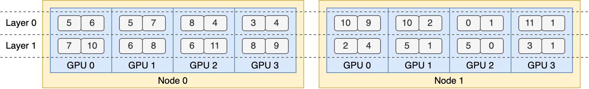

# Expert Parallelism Load Balancer (EPLB)

## Why We Need EPLB?
When using Expert Parallelism (EP), different experts are assigned to different GPUs/NPUs. Given that the load of various experts may vary depending on the current workload, it is crucial to maintain balanced loads across different GPUs/NPUs. We adopt a redundant experts strategy by duplicating heavily-loaded experts. Then, we heuristically pack these duplicated experts onto GPUs to ensure load balancing across them. Moreover, thanks to the group-limited expert routing used in MoE models, we also attempt to place experts of the same group on the same node to reduce inter-node data traffic, whenever possible.

To facilitate reproduction and deployment, we open-source our deployed EP load balancing algorithm in `vllm_ascend/eplb/core/policy`. The algorithm computes a balanced expert replication and placement plan based on the estimated expert loads. Note that the exact method for predicting expert loads is outside the scope of this repository. A common method is to use a moving average of historical statistics.


## How to Use EPLB?
Please refer to the EPLB section of the user guide for detailed information: [How to Use EPLB](../../user_guide/feature_guide/eplb_swift_balancer.md)

## How It Works?
In `vllm_ascend/eplb`, you can see the code structure as follows:

```
vllm_ascend
├── eplb
│   ├── adaptor
│   │   ├── abstrat_adaptor.py
│   │   ├── vllm_adaptor.py
│   ├── core
│   │   ├── policy
│   │   │   ├── policy_abstract.py
│   │   │   ├── policy_dynamic_ep.py
│   │   │   ├── policy_dynamic_ep_v2.py
│   │   │   ├── policy_factory.py
│   │   │   ├── policy_flashlb.py
│   │   │   ├── policy_random.py
│   │   ├── eplb_device_transfer_loader.py
│   │   ├── eplb_utils.py
│   │   ├── eplb_worker.py
│   ├── eplb_updator.py
│   ├── utils.py
└───────────
```

### Default Algorithm
#### Hierarchical Load Balancing
When the number of server nodes evenly divides the number of expert groups, we use the hierarchical load balancing policy to leverage group-limited expert routing. We first pack the expert groups onto nodes evenly, ensuring balanced loads across different nodes. Then, we replicate the experts within each node. Finally, we pack the replicated experts onto individual GPUs to ensure load balancing across them. The hierarchical load balancing policy can be used in the prefilling stage with a smaller expert-parallel size.

#### Global Load Balancing
In other cases, we use the global load balancing policy, which replicates experts globally regardless of expert groups, and packs the replicated experts onto individual GPUs. This policy can be adopted in the decoding stage with a larger expert-parallel size.

### Add a New MoE Model
When adding a new model, inherit or modify `vllm_ascend/eplb/adaptor/vllm_adaptor.py`. Add the processing logic for `num_dense_layers`, `global_expert_num`, and `num_roe_layers`, and synchronize the relevant logic within the `model_register` function.
If you want to add MoE-related processing to the model, add corresponding methods to `vllm_ascend/eplb/utils.py` and add patch logic in the `model_register` function.

## DFX
### Parameter Validation
#### Integer Parameters
All integer input parameters must explicitly specify their maximum and minimum values and be subject to valid value validation. For example, `num_iterations_eplb_update` must be greater than 0.

#### File Path
The file path for EPLB must be checked for legality, such as whether the file path is valid and whether it has appropriate read and write permissions.

### Function Specifications
#### Initialization Function
All EPLB parameters must be initialized by default during initialization, with specified parameter types and default values for proper handling.

#### General Functions
All method arguments must specify parameter types and default values, and functions must include default return value handling for default arguments. It is recommended to use `try-catch` blocks to handle the function body, specifying the type of exception captured and the failure handling (e.g., logging exceptions or returning a failure status).

### Consistency
#### Expert Map
The expert map must be globally unique during initialization and update. In a multi-node scenario during initialization, distributed communication should be used to verify the consistency of expert maps across each rank. If they are inconsistent, the user should be notified which ranks have inconsistent maps.
During the update process, if only a few layers or the expert table of a certain rank has been changed, the updated expert table must be synchronized with the EPLB's context to ensure global consistency.

#### Expert Weight
When updating expert weights, ensure that the memory allocated for the expert weights has been released, or that the expert (referring to the old version) is no longer in use.

## Limitation
Before using EPLB, start the script and add `export DYNAMIC_EPLB="true"`.
Before performing load data collection (or performance data collection), start the script and add `export EXPORT_MAP_RECORD="true"`.
