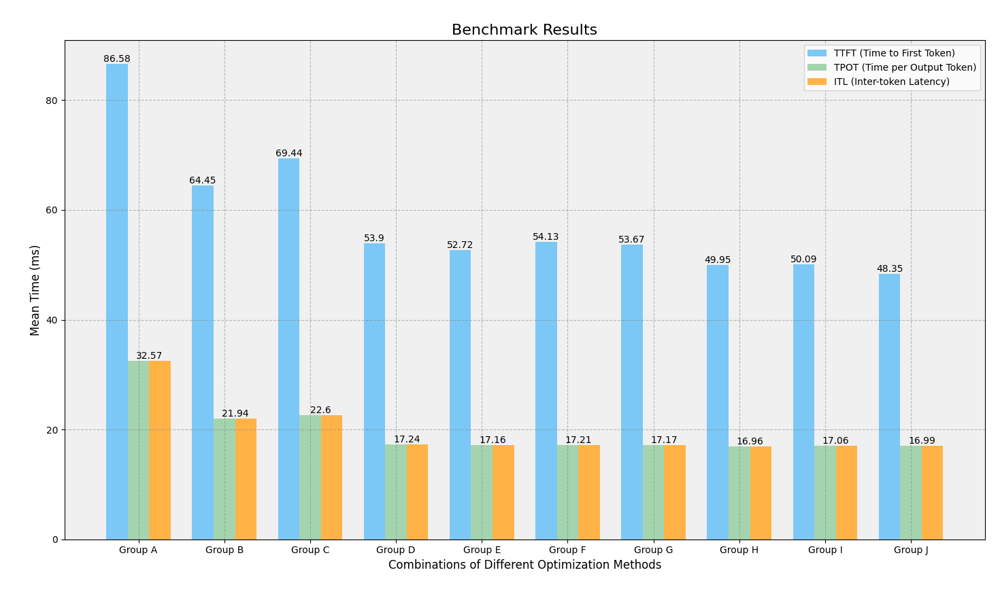

# Optimization and Tuning

This guide aims to help users to improve vllm-ascend performance on system level. It includes OS configuration, library optimization, deploy guide and so on. Any feedback is welcome.

## Preparation

Run the container:

```bash
# Update DEVICE according to your device (/dev/davinci[0-7])
export DEVICE=/dev/davinci0
# Update the cann base image
export IMAGE=m.daocloud.io/quay.io/ascend/cann:8.1.rc1-910b-ubuntu22.04-py3.10
docker run --rm \
--name performance-test \
--device $DEVICE \
--device /dev/davinci_manager \
--device /dev/devmm_svm \
--device /dev/hisi_hdc \
-v /usr/local/dcmi:/usr/local/dcmi \
-v /usr/local/bin/npu-smi:/usr/local/bin/npu-smi \
-v /usr/local/Ascend/driver/lib64/:/usr/local/Ascend/driver/lib64/ \
-v /usr/local/Ascend/driver/version.info:/usr/local/Ascend/driver/version.info \
-v /etc/ascend_install.info:/etc/ascend_install.info \
-v /root/.cache:/root/.cache \
-it $IMAGE bash
```

Configure your environment:

```bash
# Configure the mirror
echo "deb https://mirrors.tuna.tsinghua.edu.cn/ubuntu-ports/ jammy main restricted universe multiverse" > /etc/apt/sources.list && \
echo "deb-src https://mirrors.tuna.tsinghua.edu.cn/ubuntu-ports/ jammy main restricted universe multiverse" >> /etc/apt/sources.list && \
echo "deb https://mirrors.tuna.tsinghua.edu.cn/ubuntu-ports/ jammy-updates main restricted universe multiverse" >> /etc/apt/sources.list && \
echo "deb-src https://mirrors.tuna.tsinghua.edu.cn/ubuntu-ports/ jammy-updates main restricted universe multiverse" >> /etc/apt/sources.list && \
echo "deb https://mirrors.tuna.tsinghua.edu.cn/ubuntu-ports/ jammy-backports main restricted universe multiverse" >> /etc/apt/sources.list && \
echo "deb-src https://mirrors.tuna.tsinghua.edu.cn/ubuntu-ports/ jammy-backports main restricted universe multiverse" >> /etc/apt/sources.list && \
echo "deb https://mirrors.tuna.tsinghua.edu.cn/ubuntu-ports/ jammy-security main restricted universe multiverse" >> /etc/apt/sources.list && \
echo "deb-src https://mirrors.tuna.tsinghua.edu.cn/ubuntu-ports/ jammy-security main restricted universe multiverse" >> /etc/apt/sources.list

# Install os packages
apt update && apt install wget gcc g++ libnuma-dev git vim -y
```

## Optimizations

### 1. Compilation Optimization

TODO: add describe.

#### 1.1 Install twice compiled `python`

```bash
mkdir -p /workspace/tmp
cd /workspace/tmp

# Download prebuilt lib and packages
wget https://repo.oepkgs.net/ascend/pytorch/vllm/lib/libcrypto.so.1.1
wget https://repo.oepkgs.net/ascend/pytorch/vllm/lib/libomp.so
wget https://repo.oepkgs.net/ascend/pytorch/vllm/lib/libssl.so.1.1
wget https://repo.oepkgs.net/ascend/pytorch/vllm/python/py311_bisheng.tar.gz

# Configure python and pip
cp ./*.so* /usr/local/lib
tar -zxvf ./py311_bisheng.*  -C /usr/local/
mv  /usr/local/py311_bisheng/  /usr/local/python
sed -i "1c#\!/usr/local/python/bin/python3.11" /usr/local/python/bin/pip3
sed -i "1c#\!/usr/local/python/bin/python3.11" /usr/local/python/bin/pip3.11
ln -sf  /usr/local/python/bin/python3  /usr/bin/python
ln -sf  /usr/local/python/bin/python3  /usr/bin/python3
ln -sf  /usr/local/python/bin/python3.11  /usr/bin/python3.11
ln -sf  /usr/local/python/bin/pip3  /usr/bin/pip3
ln -sf  /usr/local/python/bin/pip3  /usr/bin/pip

export PATH=/usr/bin:/usr/local/python/bin:$PATH
```

:::{note}
You can also reproduce the `python` build follow this [tutorial](https://www.hiascend.com/document/detail/zh/Pytorch/600/ptmoddevg/trainingmigrguide/performance_tuning_0063.html) according to your specific scenarios.
:::

#### 1.2 Install twice compiled `torch` and `torch_npu`

```bash
cd /workspace/tmp

# Download prebuilt packages
wget https://repo.oepkgs.net/ascend/pytorch/vllm/torch/torch-2.5.1-cp310-cp310-linux_aarch64.whl
wget https://repo.oepkgs.net/ascend/pytorch/vllm/torch/torch_npu-2.5.1-cp310-cp310-manylinux_2_17_aarch64.manylinux2014_aarch64.whl

# Install optimized torch and torch_npu
pip install /tmp/torch-2.5.1*.whl --force-reinstall --no-deps
pip install /tmp/torch_npu-*.whl --force-reinstall --no-deps

# Clear pip cache and download files
pip cache purge
rm -rf /tmp/*

# Make torch and torch_npu can find the `xxx.so` libs we installed before
export LD_LIBRARY_PATH=/usr/local/lib:$LD_LIBRARY_PATH
```

:::{note}
You can also reproduce the `torch` build follow this [tutorial](https://www.hiascend.com/document/detail/zh/Pytorch/600/ptmoddevg/trainingmigrguide/performance_tuning_0064.html) or the `torch_npu` build follow this [tutorial](https://www.hiascend.com/document/detail/zh/Pytorch/600/ptmoddevg/trainingmigrguide/performance_tuning_0065.html) according to your specific scenarios.
:::

### 2. OS Optimization

TODO: add describe. Find more details [here](https://www.hiascend.com/document/detail/zh/Pytorch/700/ptmoddevg/trainingmigrguide/performance_tuning_0068.html).

```bash
# Install tcmalloc
sudo apt update
sudo apt install libgoogle-perftools4 libgoogle-perftools-dev

# Get the location of libtcmalloc.so*
find /usr -name libtcmalloc.so*

# Make the priority of tcmalloc higher
# The <path> is the location of libtcmalloc.so we get from the upper command
# Example: "$LD_PRELOAD:/usr/lib/aarch64-linux-gnu/libtcmalloc.so"
export LD_PRELOAD="$LD_PRELOAD:<path>"

# Verify your configuration
# The path of libtcmalloc.so will be contained in the result if your configuration is valid
ldd `which python`
```

### 3. `torch_npu` Optimization

TODO: add describe.

Memory optimization:

```bash
# Upper limit of memory block splitting allowed (MB), Setting this parameter can prevent large memory blocks from being split.
export PYTORCH_NPU_ALLOC_CONF="max_split_size_mb:250"

# When operators on the communication stream have dependencies, they all need to be ended before being released for reuse. The logic of multi-stream reuse is to release the memory on the communication stream in advance so that the computing stream can be reused.
export PYTORCH_NPU_ALLOC_CONF="expandable_segments:True"
```

Schedule optimization:

```bash
# Optimize operator delivery queue, this will affect the memory peak value, and may degrade if the memory is tight.
export TASK_QUEUE_ENABLE=2

# This will greatly improve the CPU bottleneck model and ensure the same performance for the NPU bottleneck model.
export CPU_AFFINITY_CONF=1
```

### 4. CANN Optimization

#### 4.1 HCCL Optimization

TODO: add describe.

These environment variables will improve performance in certain scenarios:

- [HCCL_INTRA_ROCE_ENABLE](https://www.hiascend.com/document/detail/zh/Pytorch/600/ptmoddevg/trainingmigrguide/performance_tuning_0044.html)
- [HCCL_RDMA_TC](https://www.hiascend.com/document/detail/zh/Pytorch/600/ptmoddevg/trainingmigrguide/performance_tuning_0045.html)
- [HCCL_RDMA_SL](https://www.hiascend.com/document/detail/zh/Pytorch/600/ptmoddevg/trainingmigrguide/performance_tuning_0046.html)
- [HCCL_BUFFSIZE](https://www.hiascend.com/document/detail/zh/Pytorch/600/ptmoddevg/trainingmigrguide/performance_tuning_0047.html)

Find more details [here](https://www.hiascend.com).

#### 4.2 `mindie_turbo` Optimization

TODO: add describe.

Some environment variables will improve performance in certain scenarios.

Find more details [here](https://www.hiascend.com/document/detail/zh/mindie/20RC1/AcceleratePlugin/turbodev/mindie-turbo-0010.html).

## Benchmark

### Preparation

Please follow the [<u>Installation Guide</u>](https://vllm-ascend.readthedocs.io/en/v0.7.3/installation.html#setup-vllm-and-vllm-ascend) to make sure `vllm`, `vllm-ascend` and `mindie-turbo` is installed correctly.

:::{note}
Make sure your `vllm`, `vllm-ascend` and `mindie-turbo` is installed after your `python` configuration completed, because these packages will build binary files using the `python` in current environment. If you install `vllm`, `vllm-ascend` and `mindie-turbo` before `1.1`, the binary files will not use the optimized `python`.
:::

```bash
# Install necessary dependencies
pip config set global.index-url https://pypi.tuna.tsinghua.edu.cn/simple
pip install "modelscope<1.23.0" pandas datasets gevent sacrebleu rouge_score pybind11 pytest

# Configure this value to speed up model download
VLLM_USE_MODELSCOPE=true
```

### Usage

Launch vllm server:

```bash
python -m vllm.entrypoints.openai.api_server \
--model Qwen/Qwen2.5-7B-Instruct \
--tensor-parallel-size 1 \
--swap-space 16 \
--disable-log-stats \
--disable-log-requests \
--load-format dummy
```

:::{note}
Set `load-format=dummy` for a lightweight test, we don't need real download weight.

You can pass `--additional-config '{"ascend_scheduler_config":{}}'` param to vllm when launch the server with ascend scheduler, which can accelerate the inference for V1 engine. Find more details [here](https://github.com/vllm-project/vllm-ascend/issues/788).
:::

Run benchmark (need wait for a while):

```bash
cd /vllm-workspace/vllm/benchmarks
python benchmark_serving.py \
--model Qwen/Qwen2.5-7B-Instruct \
--dataset-name random \
--random-input-len 200 \
--num-prompts 200 \
--request-rate 1 \
--save-result --result-dir ./
```

### Results

We used `vllm-ascend:v0.7.3` as our baseline and compared acceleration effects of different combinations of optimization methods. We completed our benchmark on single NPU and the results are shown below.



Details of our combinations of optimization methods:

- **Group A (baseline):** vllm-ascend only
- **Group B:** vllm-ascend + mindie-trubo
- **Group C:** vllm-ascend + optimized python/torch/torch-npu
- **Group D:** vllm-ascend + mindie-trubo + optimized python/torch/torch-npu
- **Group E:** vllm-ascend + mindie-trubo + optimized python/torch/torch-npu + tcmalloc
- **Group F:** Group E + PYTORCH_NPU_ALLOC_CONF="max_split_size_mb:250"
- **Group G:** Group E + PYTORCH_NPU_ALLOC_CONF="expandable_segments:True"
- **Group H:** Group E + TASK_QUEUE_ENABLE=2
- **Group I:** Group E + CPU_AFFINITY_CONF=1
- **Group J:** Group E + TASK_QUEUE_ENABLE=2 + ascend-scheduler
