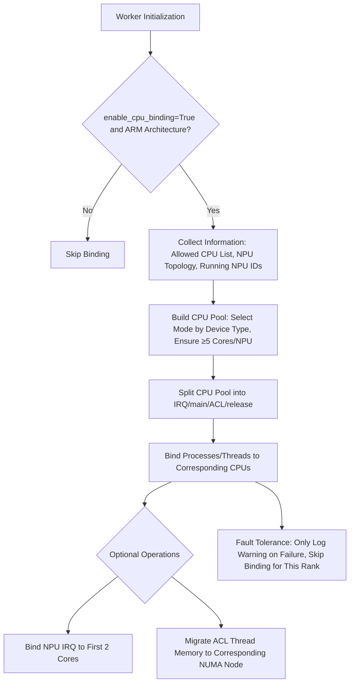

# CPU Binding for vLLM Ascend

## Core Concepts & Working Principles

CPU Binding is a performance optimization feature for vLLM, specifically designed for servers equipped with **ARM architecture and Ascend NPUs**. Its core objective is to reduce CPU-NPU cross-NUMA node communication overhead and stabilize inference latency in multi-process workloads by pinning vLLM processes and threads to specific CPU cores. This feature only adjusts host-side CPU affinity policies and **does not alter model execution logic or impact inference results**.

### 1. Core Allocation Logic

#### (1) Two Binding Modes (Distinguished by Device Type)

|Device Type|Default Mode|Core Logic|
|---|---|---|
|A3 (No Affinity)|`global_slice`|Splits the allowed CPU list evenly based on the **total number of global logical NPUs**, ensuring each NPU is assigned a contiguous segment of CPU cores. This prevents CPU core overlap across multiple process groups.|
|A2 / 310P / Others|`topo_affinity`|Allocates CPUs based on NPU topology affinity (retrieved via npu-smi). If multiple NPUs are assigned to a single NUMA node (which may cause bandwidth contention), the CPU allocation extends to adjacent NUMA nodes.|
#### (2) CPU Pool Role Division

Each CPU pool allocated to an NPU (with a minimum of 5 cores) is divided into fixed roles for dedicated tasks:

- First 2 cores: Reserved for NPU IRQ (Interrupt Request) binding (optional)

- Middle segment (pool[2:-2]): Assigned to the main process

- Second-to-last core: Dedicated to ACL threads (Ascend operator execution threads)

- Last core: Assigned to release threads (resource release threads)

#### (3) Allocation example: A3 inference server with 640 CPUs (8 NUMA nodes) and 16 NPUs

|NPU ID|Assigned CPU Cores (global_slice)|Role Division (IRQ/Main/ACL/Release)|
|---|---|---|
|0|0-39|`IRQ`: 0-1, `Main`: 2-37, `ACL`: 38, `Release`: 39|
|1|40-79|`IRQ`: 40-41, `Main`: 42-77, `ACL`: 78, `Release`: 79|
|...|...|...|
|15|600-639|`IRQ`: 600-601, `Main`: 602-637, `ACL`: 638, `Release`: 639|

#### (4) Core Execution Flow (Mermaid Diagram Below)


### 2. Quick Usage Examples

#### (1) Enable CPU Binding (Default: True)

- Online Deployment (CLI):

```bash
vllm serve Qwen/Qwen2.5-7B-Instruct \
  --additional-config '{"enable_cpu_binding": true}'
```

- Offline Inference (Python):

```python
from vllm import LLM

llm = LLM(
    model="Qwen/Qwen2.5-7B-Instruct",
    additional_config={"enable_cpu_binding": True},
)
```

#### (2) Disable CPU Binding

To disable CPU binding, simply set `enable_cpu_binding` to `False` while keeping other parameters unchanged.

### 3. Common Issues & Troubleshooting

|Error/Warning Message|Core Cause|Solution|
|---|---|---|
|Can not get running npu info.|The npu-smi process table is empty, or the `ASCEND_RT_VISIBLE_DEVICES` environment variable filters out all NPUs.|1. Ensure the process is running on visible NPUs; 2. Verify that the `ASCEND_RT_VISIBLE_DEVICES` value matches the actual logical NPU IDs.|
|Insufficient CPUs for binding...|The number of CPU cores allocated to each NPU is less than the minimum requirement of 5.|1. Expand the allowed CPU list; 2. Reduce the number of visible NPUs.|
|NPU topo affinity not found...|npu-smi is unable to retrieve NPU topology affinity information.|Verify the integrity of the npu-smi installation and ensure the user has sufficient execution permissions.|
|Bind cpus failed in rankX...|The CPU binding process failed (e.g., taskset is unavailable, or the user lacks write permissions for /proc/irq).|1. Confirm that required tools (taskset, lscpu, npu-smi) are installed and available; 2. Verify the Cpus_allowed_list in `/proc/self/status` is valid.|
### 4. Key Limitations

- ARM architecture only: Binding is automatically skipped on x86_64 systems.

- Symmetric NUMA layout required for optimal performance: CPU numbering should be aligned with NUMA nodes. Non-symmetric layouts may result in cross-NUMA CPU pools, reducing locality.

- IRQ binding requires write permissions for /proc/irq. Memory binding depends on the `migratepages` tool; if unavailable, memory migration is skipped.

---

## Summary

1. **Core Objective**: Reduce cross-NUMA communication by pinning vLLM processes and threads to specific CPU cores, thereby stabilizing inference latency in Ascend NPU deployments (only applicable to ARM architectures).

2. **Allocation Rules**: A3 devices use `global_slice` to split CPUs evenly. A2/310P and other devices use `topo_affinity` (falling back to `global_slice` if topology information is unavailable). Each NPU requires a minimum of 5 CPU cores.

3. **Key Limitations**: Limited to ARM architectures; relies on symmetric NUMA layouts; binding fails if the CPU pool has fewer than 5 cores; binding errors trigger a warning log but do not terminate the process.
