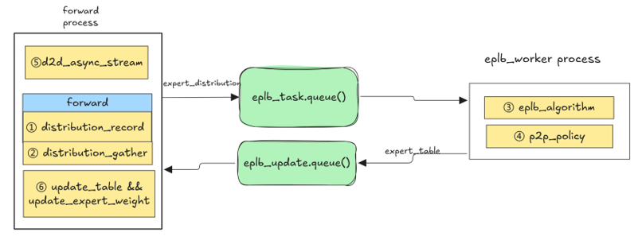

# Swift Balancer

## Overview
Experts balancing of MoE models for LLM serving is a mandatory option.Changing experts dynamically would have a negative impact on TTFT and TPOT while stop-the-world.
Asynchronously expert load balancing would be a better choice.
We have launched SwiftBalancer to support dynamic experts load balancing with Zero-overhead experts movement.

## Design



The overall workflow involves:
1. Record experts distribution during forward. We using expert_token_num after dispatch instead of topk_ids, thus we got much smaller tensor shape to reduce cost of hbm
   recording and add-operator.
2. Do all-gather for experts distribution. Using all-gather instead of all-reduce as less traffic volume.
3. Wake up eplb worker process with experts distribution when num_iterations comes. Run eplb algorithm in eplb worker.
4. Generate p2p send/recv ops and other operator such as log2phy would cost long cpu time.
5. Launch ibatch_send_recv in async_stream before forward.
6. After forward, wait for the ibatch_send_recv finish, then do update expert map and expert weights.

In our profiling shows experts transforming is hidden in the bubble between forward iterations. Cpu time cost of eplb algo. and other python operator such as log2phy
would be hidden by eplb worker process too.


## Examples
### Dynamic eplb
Enable dynamic eplb and specify the trigger rounds.
```shell
vllm serve Qwen/Qwen3-235B-A22 \
  --tensor-parallel-size 16 \
  --enable-expert-parallel \
  --additional-config '{ "dynamic_eplb":true,"num_iterations_eplb_update":400, "gate_eplb":true, "num_wait_worker_iterations":30}'
```
### Static eplb
1. Specify the path for the static eplb initialization file.
```shell
vllm serve Qwen/Qwen3-235B-A22 \
  --tensor-parallel-size 16 \
  --enable-expert-parallel \
  --additional-config '{ "expert_map_record_path": "/path/to/eplb.json", "init_redundancy_expert": 16, dynamic_eplb":true,"num_iterations_eplb_update":400, "gate_eplb":true, "num_wait_worker_iterations":30}'
```
2. If expert map has been recorded, enable static eplb with expert map path.
```shell
vllm serve Qwen/Qwen3-235B-A22 \
  --tensor-parallel-size 16 \
  --enable-expert-parallel \
  --additional-config '{ "expert_map_path": "/path/to/eplb.json"}'
```
