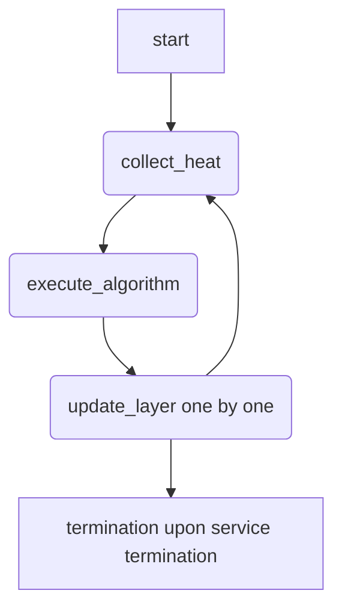

# Expert Parallelism Load Balancer (EPLB)

## Overview

Expert balancing for MoE (Mixture of Experts) models in LLM (Large Language) serving is essential for optimal performance. Dynamically changing experts during inference can negatively impact TTFT (Time To First Token) and TPOT (Time Per Output Token) due to stop-the-world operations. Our solution aims to minimize the negative impacts caused by the operation.

## EPLB Effects

- Reduced Latency: Dynamically balances expert loads to minimize TTFT and TPOT by distributing workloads evenly across experts.
- Adaptive Scaling: Automatically adjusts to workload fluctuations while maintaining stable performance.

## Support Scenarios

### Models

All MoE models supported by vLLM-Ascend.
But we have only verified the performance on deepseek-v3.1/r1 models.

> [!IMPORTANT]
> Ascend A5 does not support using EPLB with quant type "W4A8MXFP4", "W4A16", "W4A16MXFP4".

### MOE QuantType

| QuantType                       | Supported Hardware          |
| ------------------------------- | --------------------------- |
| W8A8 / W8A8-Dynamic             | A2, A3 |
| W4A8 (with fused MC2 enabled)   | A2, A3 |
| MXFP4                           | Ascend 950 Products         |
| MXFP8                           | Ascend 950 Products         |

### Usage Recommendations

EPLB is not recommended in the following scenarios because the load-balancing benefit may not offset its runtime overhead:

- P node workloads with input sequences shorter than `1024` tokens.
- D node workloads where the number of experts per die is `<= 8` (`<= 16` on 950DT), or where the per-die load is below `128` tokens.

> [!WARNING]
> Meeting the above conditions may lead to performance degradation.
> When there are around 8 experts per die, the EPLB benefit may be comparable to its overhead. Benchmark the actual workload and enable EPLB only after confirming a performance gain.

## How to Use EPLB

EPLB has three usage modes:

| Mode | Config in `eplb_config` | Env Variable |
| ---- | ----------------------- | ------------ |
| **Dynamic EPLB** | `dynamic_eplb: true` | `DYNAMIC_EPLB=true` |
| **Recording** (generate expert map) | `expert_map_record_path` | `DYNAMIC_EPLB=true` or `EXPERT_MAP_RECORD=true` |
| **Static EPLB** (load pre-recorded map) | `expert_map_path` | none required |

> [!IMPORTANT]
> For Dynamic EPLB and Recording modes, the env variable acts as a safety guard: setting `dynamic_eplb: true` in config alone is not enough — the assertion requires `DYNAMIC_EPLB=true` or `EXPERT_MAP_RECORD=true`. Static EPLB (loading a pre-recorded map via `expert_map_path`) does **not** require an env variable.

### Dynamic EPLB

We need to add environment variable `export DYNAMIC_EPLB="true"` to enable vLLM-Ascend EPLB. Enable dynamic balancing with auto-tuned parameters. Adjust expert_heat_collection_interval and algorithm_execution_interval based on workload patterns. In the current version, we recommend using SwiftBalanceEplb (policy type 2).

| Parameter | Description | Default |
| --- | --- | --- |
| dynamic_eplb | Enable dynamic EPLB. | False |
| expert_heat_collection_interval | Interval for collecting expert heat. | 600 |
| algorithm_execution_interval | Interval for executing the balancing algorithm. | 50 |
| eplb_policy_type | EPLB policy type. | 2 |
| num_redundant_experts | Number of redundant experts. | 0 |
| eplb_heat_collection_stage | Request stage used to collect expert heat. Available values: `all`, `prefill`, and `decode`. | `all` |



```shell
# D node or colocation
vllm serve Qwen/Qwen3-235B-A22 \
  --tensor-parallel-size 16 \
  --enable-expert-parallel \
  --additional-config '{ "eplb_config": {
    "dynamic_eplb": true,
    "expert_heat_collection_interval": 600,
    "algorithm_execution_interval": 50,
    "eplb_policy_type": 2,
    "num_redundant_experts": 16
    }}'

# P node
vllm serve Qwen/Qwen3-235B-A22 \
  --tensor-parallel-size 16 \
  --enable-expert-parallel \
  --additional-config '{ "eplb_config": {
    "dynamic_eplb": true,
    "expert_heat_collection_interval": 50,
    "algorithm_execution_interval": 5,
    "eplb_policy_type": 2,
    "num_redundant_experts": 16
    }}'
```

#### EPLB Policy Types

The `eplb_policy_type` parameter selects the balancing algorithm used during dynamic expert redistribution:

| Value | Policy | Description |
|-------|--------|-------------|
| `0` | Random | Randomly swaps experts between ranks. Suitable for basic testing only. |
| `1` | DefaultEplb | Open-source EPLB algorithm. Adds redundant experts to the hottest, packs via balanced assignment with local constraint exchange. |
| `2` | SwiftBalanceEplb | Optimized for low-bandwidth environments. Supports intra-node and inter-node expert redundancy, joint optimization of expert placement. **(Recommended)** |
| `3` | FlashLB | Statistical method using sliding-window mean/variance/covariance of expert loads. Uses FlashTree layered search for optimal replica allocation and `minimize_redeploy` for incremental adjustment. Best for high-frequency load fluctuations. |

#### Selective Expert Heat Collection

The `eplb_heat_collection_stage` option is intended for prefill-decode aggregation scenarios. Prefill requests usually process many tokens in one iteration, while decode requests usually process fewer tokens. As a result, the expert workload distribution can differ between the two stages. Collecting heat from both stages may hide the imbalance of the stage whose latency you want to optimize.

> [!IMPORTANT]
> Selective heat collection is currently implemented by the Ascend model runner V1. Dynamic EPLB, including this option, is not yet supported by the Ascend model runner V2.

Use `eplb_heat_collection_stage` to select the stage whose expert heat contributes to EPLB:

| Value | Behavior | Typical use |
| ----- | -------- | ----------- |
| `all` | Collect expert heat from both prefill and decode iterations. | General workloads; this is the default. |
| `prefill` | Collect expert heat only from iterations classified as prefill. | Optimize prefill workload balance and TTFT. |
| `decode` | Collect expert heat only from iterations classified as decode. | Optimize decode workload balance and TPOT. |

Choose the stage according to the actual workload. The following values can be used as initial tuning guidance:

- For workloads whose typical input sequence length is greater than `1024` tokens, start with `prefill`.
- For workloads whose typical input sequence length is less than `1024` tokens but concurrency is greater than `1024`, try `decode` or `all`.
- For other or mixed workloads, benchmark `all`, `prefill`, and `decode` against the target TTFT or TPOT before choosing a setting.

These thresholds are empirical starting points rather than strict requirements. Production traffic distribution, concurrency, model configuration, and hardware topology can all affect the optimal stage.

For example, to collect only prefill heat:

```shell
export DYNAMIC_EPLB="true"

vllm serve Qwen/Qwen3-235B-A22 \
  --tensor-parallel-size 16 \
  --enable-expert-parallel \
  --additional-config '{ "eplb_config": {
    "dynamic_eplb": true,
    "expert_heat_collection_interval": 600,
    "algorithm_execution_interval": 50,
    "eplb_policy_type": 2,
    "num_redundant_experts": 16,
    "eplb_heat_collection_stage": "prefill"
  }}'
```

To collect only decode heat, set:

```json
{
  "eplb_config": {
    "dynamic_eplb": true,
    "eplb_heat_collection_stage": "decode"
  }
}
```

> [!NOTE]
> Stage selection applies to dynamic EPLB heat collection. Internally, vLLM-Ascend classifies each forward iteration by comparing its padded scheduled token count with the maximum expected token count of a decode iteration. An iteration above the threshold is treated as prefill; an iteration at or below the threshold is treated as decode. Classification is therefore performed per forward iteration rather than per individual request.

When an iteration does not match the selected stage, its expert load is not accumulated and it does not advance the heat-collection interval. Once heat collection is complete, balancing calculation and layer-by-layer expert weight updates continue normally.

### Static EPLB

> [!WARNING]
> Static EPLB is scheduled for removal in v0.25.1.

#### Initial Setup (Record Expert Map)

We need to add environment variable `export EXPERT_MAP_RECORD="true"` to record expert map. Generate the initial expert distribution map using expert_map_record_path. This creates a baseline configuration for future deployments.

```shell
vllm serve Qwen/Qwen3-235B-A22 \
  --tensor-parallel-size 16 \
  --enable-expert-parallel \
  --additional-config '{ "eplb_config": {
    "expert_map_record_path": "/path/to/eplb.json",
    "num_redundant_experts": 16,
    "expert_heat_collection_interval": 400,
    "algorithm_execution_interval": 30
  }}'
```

#### Subsequent Deployments (Use Recorded Map)

Load the pre-recorded expert map for consistent performance. This avoids recalculating distributions at runtime.

```shell
vllm serve Qwen/Qwen3-235B-A22 \
  --tensor-parallel-size 16 \
  --enable-expert-parallel \
  --additional-config '{
    "eplb_config": {"expert_map_path": "/path/to/eplb.json"}
  }'
```

## Critical Considerations

1. Parameter Tuning:
   - expert_heat_collection_interval: Higher values (e.g., 600+) for stable workloads; lower values (e.g., 50-100) for fluctuating traffic.
   - algorithm_execution_interval: Should be ≥ 50 to avoid premature balancing during startup.
   - num_redundant_experts: (num_experts + num_redundant_experts) must be divisible by the expert-parallel size.

2. Hardware Requirements:
   - Ensure that all NPUs have identical memory capacity and compute capabilities.
   - Network bandwidth must support expert redistribution traffic (≥ 10 Gbps recommended).
   - shm needs to be mounted for container

3. Monitoring & Validation:
   - Track metrics: Search for [Expert Hotness] in the log. We will calculate the peak-to-average ratio of the load for each layer at different ranks, and then find their mean and maximum values. Current means actual peak-to-average ratio, update means estimated peak-to-average ratio after algorithm adjustment.
   - Use vLLM monitor to detect imbalances during runtime.
   - Always verify expert map JSON structure before loading (validate with jq or similar tools).
