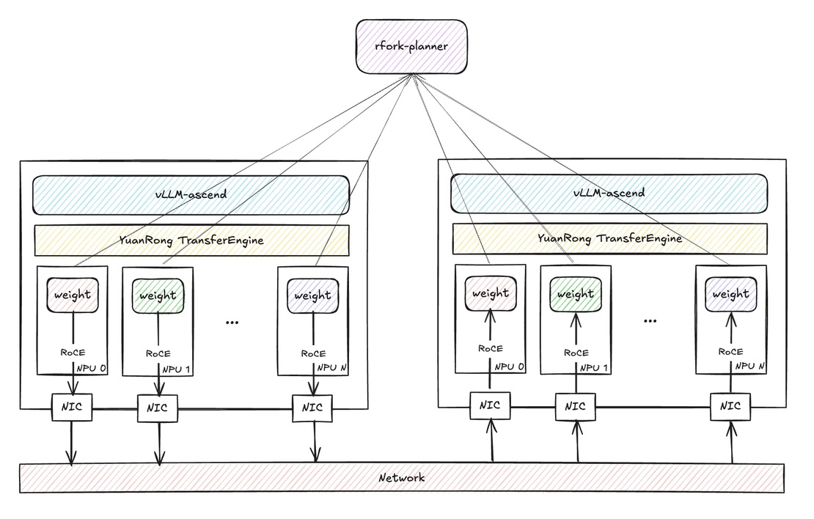

# Tensor R-Fork (RFork) Guide

This guide explains how to use **Tensor R-Fork** as a model-loader plugin in **vLLM Ascend**.

---

## TL;DR

**Tensor R-Fork** stands for **Tensor Remote Fork** and is abbreviated as **RFork**. It is a warm-start weight loading path for vLLM Ascend. Instead of always reading model weights from storage, a new instance can request a compatible **seed** instance from an external planner, then pull weights directly from that seed through `YuanRong TransferEngine`.

The "fork" is a remote tensor-level operation, not an operating-system process fork. RFork treats the NPU memory of an existing vLLM instance as a reusable weight source; the destination creates an independent model instance and reads the seed's registered tensors into its pre-allocated NPU parameter buffers.

## Background

For large models, repeatedly loading the same checkpoint can make storage and host-side staging the main startup bottlenecks. RFork changes the warm-start data path for later replicas:

| Load weights from | Data flow | Typical bottleneck |
|-------------------|-----------|--------------------|
| Remote storage | Remote storage → remote network → local network interface → local host DRAM → local NPU memory | Storage or network bandwidth |
| Local disk | Local disk → host DRAM → NPU memory | Disk bandwidth |
| Local host DRAM | Host DRAM → NPU memory | Host-to-device interconnect |
| RFork seed instance | Seed NPU memory → YuanRong TransferEngine → destination NPU memory | Inter-node transport bandwidth |

This design provides the following benefits for scale-out deployments:

- **Faster warm starts** by reusing tensors that are already resident on another NPU instance.
- **Less repeated storage traffic** because later replicas do not need to read the complete checkpoint again when a compatible seed is available.
- **Less host-side staging** because TransferEngine reads registered tensor ranges into the destination's final NPU buffers.
- **Lower source-side disruption** because the seed exposes registered memory instead of reloading or broadcasting the model through vLLM workers. Actual inference impact still depends on the inter-node transport, available bandwidth, and concurrent transfer load.

The first instance still needs to load the model normally. RFork accelerates subsequent compatible instances; it is not a replacement for the initial checkpoint load.

At cluster scale, this turns running vLLM Ascend replicas into a distributed pool of NPU-resident weight sources. An instance provides inference compute while also making its already-materialized tensors available to later replicas.

### Default Loader vs. RFork

| Characteristic | Default loader | RFork |
|----------------|----------------|-------|
| Weight source | Model storage | Running seed instance |
| Destination path | Storage and host staging before reaching NPU memory | TransferEngine reads into pre-allocated NPU buffers |
| Additional dependency | None beyond the normal model-loading stack | YuanRong TransferEngine and an RFork planner |
| Setup overhead | Storage access and checkpoint deserialization | NPU memory registration and seed discovery |
| Repeated scale-out | Every instance reads the checkpoint | Compatible instances reuse an existing seed |
| Failure behavior | Loading fails if the checkpoint path is unavailable | RFork cleans up and falls back to the default loader |

RFork is most useful when the same model and parallel configuration are started repeatedly. For a single cold start, memory registration and planner coordination add work without an existing seed to reuse.

## Architecture

RFork consists of four cooperating components:

- **Planner**: Tracks seed identity, deployment topology, health, and transfer leases, then selects a compatible seed for each destination.
- **Seed instance**: An initialized vLLM Ascend instance that registers its live NPU weight buffers and publishes TransferEngine metadata.
- **Destination instance**: A new vLLM Ascend instance that creates the matching tensor layout and pulls weights into its local NPU buffers.
- **YuanRong TransferEngine**: Manages registered memory and performs batched reads between the seed and destination.

### End-to-End Workflow

The RFork loading flow is:

1. vLLM starts with `--load-format rfork`.
2. RFork builds a **seed key** from the model identity and deployment topology.
3. RFork asks the planner for an available seed matching that key.
4. If a seed is returned, the new instance initializes the model structure on its local NPU, registers local weight memory, fetches the remote transfer-engine metadata from the seed, and performs batch weight transfer into local parameter buffers.
5. If no seed is available, or any step fails, RFork cleans up and falls back to the default loader.
6. After the instance finishes loading, it starts a local seed service and periodically reports heartbeat to the planner, so later instances can reuse it.

TransferEngine metadata is exchanged through the seed HTTP service, while tensor contents are transferred through TransferEngine. Each worker owns its own TransferEngine session and listening port, so corresponding parallel ranks transfer their local weight shards independently.

### Seed-Side Initialization

After a vLLM Ascend instance finishes loading its model, each RFork worker prepares the tensors that another instance may read:

1. RFork prepares the transferable Ascend tensor layout and enumerates the live model tensors.
2. Logical tensor ranges are associated with their backing NPU allocations. Overlapping logical ranges that share one allocation are registered without registering the same backing memory repeatedly.
3. Registration requests are split into bounded batches before being submitted to YuanRong TransferEngine.
4. The worker publishes its TransferEngine session, tensor addresses, element sizes, and shapes through the local seed service.
5. A heartbeat advertises the seed key, address, port, and rank to the planner.

The seed remains a normal serving instance. RFork does not ask it to reread the checkpoint or run a model-weight broadcast. Transfers can still consume inter-node and NPU-memory bandwidth, so production deployments should control concurrent readers and observe inference latency.

### Destination-Side Loading

When a destination receives a seed lease from the planner, it performs the following steps for each worker rank:

1. Build the destination model structure and allocate the final NPU tensor layout.
2. Register the destination tensor ranges with its local TransferEngine session.
3. Fetch the matching seed worker's session and tensor manifest over HTTP.
4. Verify tensor names, element counts, element sizes, and shapes before transferring data.
5. Group tensors into bounded chunks and use batched synchronous reads to copy them into the destination buffers.
6. Release the planner lease after the transfer, whether it succeeds or falls back.

Once loading completes, the destination can publish itself as another seed. A deployment can therefore grow from one storage-loaded instance into a pool of reusable NPU-resident weight sources.

### Registration and Shutdown Lifecycle

Registered NPU memory must remain valid while remote readers may still hold leases. RFork therefore keeps Python tensor owners and TransferEngine registration state alive until unregistration or finalization succeeds.

During worker shutdown, RFork first stops advertising the seed, terminates the heartbeat, and closes the local seed service. It then finalizes TransferEngine. If remote reads are still active, finalization retries `ErrorCode.kNotReady` with a bounded delay. If the seed service cannot stop or finalization does not complete within the retry limit, RFork retains the registration state rather than releasing memory that may still be referenced.

## Flowchart



## Application Scenarios

- **Scale-out after a first successful load**: The first instance may still load from storage, but later instances with the same deployment identity can reuse it as a seed and shorten startup time.
- **Elastic serving clusters**: Because RFork asks a planner for available seeds, it fits clusters where instances are created and reclaimed dynamically.
- **Topology-sensitive deployments**: RFork encodes `kv_role`, `node_rank`, optional `pp_rank`, `tp_rank`, optional `ep_rank`, and optional `draft` role into the seed key, so only topology-compatible instances are matched together.

---

## Usage

To enable RFork, pass `--load-format rfork` and provide RFork settings through `--model-loader-extra-config` as a JSON string.

### RFork Prerequisites

- Install `YuanRong TransferEngine` on every RFork instance.
- Run a planner service that implements the RFork seed protocol. A simple mock planner script is provided at [`rfork_planner.py`](https://github.com/vllm-project/vllm-ascend/blob/main/examples/rfork/rfork_planner.py).

### Configuration Fields

| Field Name | Type | Description | Allowed Values / Notes |
|------------|------|-------------|------------------------|
| **model_url** | String | Logical model identifier used to build the RFork seed key. | Required for RFork transfer. Instances that should share seeds must use the same value. |
| **model_deploy_strategy_name** | String | Deployment strategy identifier used together with `model_url` to build the seed key. | Required for RFork transfer. Instances that should share seeds must use the same value. |
| **rfork_scheduler_url** | String | Base URL of the planner service used for seed allocation, release, and heartbeat. | Required for planner-based matching. Example: `http://127.0.0.1:1223`. |
| **rfork_seed_timeout_sec** | Number | Timeout for waiting until the local seed HTTP service becomes healthy after startup. | Optional. Default: `5.0`. Must be greater than `0`. Invalid values fall back to the default. |
| **rfork_seed_key_separator** | String | Separator used when building the RFork seed key string. | Optional. Default: `$`. Keep the same value across compatible instances. |

### How RFork Matches Seeds

RFork does not match instances by `model_url` alone. The local seed key is composed from:

- `model_url`
- `model_deploy_strategy_name`
- disaggregation mode derived from `kv_transfer_config.kv_role` or `kv_both`
- `node_rank`
- `pp_rank` when pipeline parallel size is greater than 1
- `tp_rank`
- `ep_rank` when expert parallelism is enabled for an MoE model
- optional `draft` suffix when the worker runs as a draft model

This means two instances must agree on both model identity and deployment topology before the planner will treat them as interchangeable seeds.
For deployments without pipeline or expert parallelism, the existing seed-key format is unchanged.

### Planner Responsibilities

After an instance becomes ready, each worker periodically reports its seed metadata to the planner. A new instance asks the planner for a seed with the same seed key; the planner selects one with available capacity and returns a lease. A missing or unhealthy seed is not fatal because the destination can use the default loader and later join the seed pool itself.

The bundled planner demonstrates this workflow, but it is a functional example rather than a production scheduler. A production planner should provide:

- compatibility matching based on model identity and parallel deployment topology;
- heartbeat-based health tracking and stale-seed removal;
- capacity and lease accounting so one seed is not overloaded by concurrent destinations;
- reliable lease release when a transfer completes or fails;
- observability for seed selection, transfer failures, and fallback frequency.

### Quantized Models

For quantized models, RFork transfers tensors after Ascend weight post-processing instead of raw checkpoint parameters. The receiver first builds the same post-load tensor layout as the seed, then RFork copies the live NPU tensors used by inference.

This path handles Ascend quantization changes such as weight transposition, NZ format conversion, packed weights, derived scale tensors, and MLA/SFA runtime tensors such as `W_UV` and `W_UK_T`. Empty tensors that were released during post-processing are not included in the transfer manifest.

When validating RFork for a quantized model:

- Apply the same vLLM Ascend code to both the seed instance and the receiver instance.
- Restart the planner and all vLLM instances after changing RFork code, because existing seeds keep their old transfer metadata.
- Use a new `model_deploy_strategy_name` after changing model arguments or RFork code, so the planner does not match a receiver with an incompatible old seed.
- A successful RFork transfer logs `transfer weights starts` and `transfer weights time`. The fallback path logs `RFork transfer failed`.

## Supported Models

Mainstream DeepSeek/Qwen/GLM series are supported.

## Performance Considerations

RFork performance depends on model size, parallelism, NPU memory layout, TransferEngine registration time, inter-node bandwidth, and the number of concurrent destinations.

For an NPU deployment, compare RFork with the default loader using at least these metrics:

- time from process start until the service becomes ready;
- `transfer weights time` and transferred bytes reported in the vLLM logs;
- storage and host-memory traffic during startup;
- seed-instance inference latency while transfers are active;
- seed hit rate, transfer failure rate, and fallback rate.

Memory registration adds setup cost to the seed. Its benefit is realized when later replicas reuse that registration, so tests should include repeated scale-out rather than only a single cold start.

---

## Example Commands & Placeholders

> Replace parts in `<...>` before running.

### 1. Install YuanRong TransferEngine

```shell
pip install openyuanrong-datasystem
```

### 2. Start the Planner

A simple planner implementation is provided at [`rfork_planner.py`](https://github.com/vllm-project/vllm-ascend/blob/main/examples/rfork/rfork_planner.py).

```shell
python rfork_planner.py \
  --host 0.0.0.0 \
  --port <planner_port>
```

### 3. Start vLLM Instances

Use the same RFork startup command for both the first instance and later instances in the same deployment.

For the first instance, the planner usually has no compatible seed yet, so RFork falls back to the default loader. After loading finishes, that instance starts its local seed service and reports itself to the planner.

For later instances, if the planner can allocate a compatible seed, RFork will try to transfer weights from the existing seed instance before falling back to the default loader.

```shell
export RFORK_CONFIG='{
  "model_url": "<model_url>",
  "model_deploy_strategy_name": "<deploy_strategy>",
  "rfork_scheduler_url": "http://<planner_ip>:<planner_port>"
}'

vllm serve <model_path> \
  --tensor-parallel-size 1 \
  --served-model-name <served_model_name> \
  --port <port> \
  --load-format rfork \
  --model-loader-extra-config "${RFORK_CONFIG}"
```

### Placeholder Descriptions

- `<model_path>`: Model path or model identifier passed to `vllm serve`.
- `<served_model_name>`: Service name exposed by vLLM.
- `<planner_ip>`: IP address or hostname of the RFork planner.
- `<planner_port>`: Listening port of the RFork planner.
- `<model_url>`: Stable model identity string used to build the RFork seed key.
- `<deploy_strategy>`: Stable deployment-strategy name used to build the RFork seed key.
- `<port>`: Serving port of the vLLM instance being started.

---

## Note & Caveats

- RFork requires `MemoryRegistration`, `ErrorCode.kNotReady`, `batch_register_memory_ex()`, and `finalize()` from `YuanRong TransferEngine`. Packages without these APIs cannot initialize the transfer backend.
- If RFORK is used, **each worker process** must bind a listening port. That port is assigned randomly.
- RFork weight transfer does not support dynamic EPLB because expert weights and placement can change after the seed service starts. If `eplb_config.dynamic_eplb` or `eplb_config.expert_map_record_path` enables dynamic EPLB, RFork transfer is bypassed and the model is loaded through the default model loader.
- The example [`rfork_planner.py`](https://github.com/vllm-project/vllm-ascend/blob/main/examples/rfork/rfork_planner.py) is only a simple mock implementation. If you need stronger scheduling, capacity management, or production-grade availability behavior, implement your own planner based on the RFork seed protocol.
