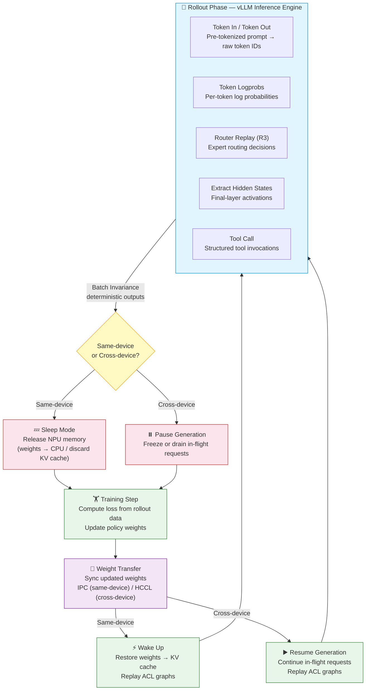

# vLLM-Ascend for RL

## Overview

vLLM is widely used as the **rollout (inference) engine** in reinforcement learning (RL) and post-training workflows such as RLHF, PPO, GRPO and DPO: the policy model generates rollouts with vLLM-Ascend, a training framework (e.g. [veRL](https://github.com/volcengine/verl), [OpenRLHF](https://github.com/OpenRLHF/OpenRLHF), [TRL](https://github.com/huggingface/trl)) optimizes the policy on those rollouts, and the updated weights are synchronized back into vLLM for the next round of generation. See the upstream vLLM [Reinforcement Learning from Human Feedback](https://docs.vllm.ai/en/latest/training/rlhf/) document for a list of RL libraries built on vLLM.

Running RL workloads imposes several requirements on the inference engine that ordinary serving does not:

- **Memory sharing between rollout and training** — generation and training phases usually cannot coexist on the same NPU, so the engine must be able to release its memory footprint and restore it later.
- **Frequent weight updates** — after every training step the rollout engine must pick up the new policy weights, ideally without a full restart.
- **Determinism and reproducibility** — RL rollouts must be reproducible across batch sizes and request orders; otherwise the on-policy assumption silently breaks. Batch invariance ensures the same input always produces the same output.
- **Training-critical data outputs** — RL algorithms (PPO, GRPO) require per-token logprobs for advantage and importance-sampling calculations; MoE models additionally need expert routing decisions (Router Replay) to prevent gradient corruption; hidden states are needed for value-function training and knowledge distillation.
- **Token-in / token-out API** — RL frameworks manage their own tokenization and detokenization. A raw token API bypasses redundant encode/decode steps, allowing the training loop to feed pre-tokenized prompt IDs and receive raw output token IDs directly.
- **Tool-call integration** — agentic RL rollouts require the model to emit structured tool calls that the environment executes, with results fed back into the generation loop.
- **DP-aware request routing** — in large-scale deployments with data-parallel replication, requests must be routed to the correct DP shard's engine to maintain locality and minimize redundant weight transfer.

This guide covers the RL-specific features of vllm-ascend. For general inference features (graph mode, speculative decoding, structured output, LoRA, parallelism strategies, etc.), see the respective feature guides under [Feature Guide](./index.md).

## Deployment modes

vLLM Ascend supports two RL deployment modes. Choose based on whether training and inference share the same NPU devices:

| Deployment mode | Description | Key APIs | Requires `enable_sleep_mode` |
|---|---|---|---|
| **Same-device** | Rollout engine and trainer share the same NPU card. The engine releases NPU memory via sleep so the trainer can use it. | `sleep(level)` / `wake_up(tags)` | **Yes** (CaMemAllocator memory pool required) |
| **Cross-device** | Rollout engine and trainer use different NPU cards. Weights are synchronized via weight transfer without releasing NPU memory. | `pause_generation(mode)` / `resume_generation()` + weight transfer | **No** (only scheduler pause is needed) |

The same-device mode maximizes hardware utilization when NPU cards are scarce but requires careful memory management. The cross-device mode is simpler to operate and allows generation and training to be pipelined (overlapped) for higher throughput.

## The RL loop and where each feature fits

| Stage of the RL loop | Requirement | Feature | Detailed guide |
| --- | --- | --- | --- |
| Free NPU memory for training | Release weights / KV cache without full restart | [Sleep Mode](#sleep-mode-returning-npu-memory-to-the-trainer) | [Sleep Mode](./sleep_mode.md) |
| Sync policy weights back to rollout engine | In-place weight update, no restart | [Weight Transfer](#weight-transfer-syncing-updated-policy-weights) | Upstream [Weight Transfer](https://docs.vllm.ai/en/latest/training/weight_transfer/) |
| Overlap generation and training | Pause / resume with in-flight requests | [Pause and Resume Generation](#pause-and-resume-generation-safe-mid-flight-weight-updates) | Upstream [Async RL](https://docs.vllm.ai/en/latest/training/async_rl/) |
| Reproducible, train-consistent rollouts | Deterministic compute across batch shapes | [Batch Invariance](#batch-invariance) | [Batch Invariance](./batch_invariance.md) |
| Feed pre-tokenized prompts, receive raw output tokens | Bypass redundant tokenization/detokenization in the RL loop | [Token In / Token Out](#token-in--token-out) | Upstream RFC [#22817](https://github.com/vllm-project/vllm/issues/22817) |
| Provide token-level logprobs to trainer | Per-token log probabilities for advantage / importance sampling | [Token Logprobs](#token-logprobs) | Upstream [SamplingParams](https://docs.vllm.ai/en/latest/dev/sampling_params/) |
| Align MoE expert routing between inference and training | Record and replay expert selections | [Router Replay (R3)](#router-replay-r3) | Upstream [Return Routed Experts](https://docs.vllm.ai/en/latest/features/moe/#return-routed-experts) |
| Provide hidden states for value / distillation | Return prompt hidden states | [Extract Hidden States](#extract-hidden-states) | Upstream [SamplingParams](https://docs.vllm.ai/en/latest/dev/sampling_params/) |
| Emit structured tool calls in agentic rollouts | Model emits function-call syntax, environment executes and returns results | [Tool Call](#tool-call) | Upstream [Tool Calling](https://docs.vllm.ai/en/latest/features/tool_calling/) |
| Route rollout requests to the correct DP shard | DP-index-aware request dispatching | [DP-Aware Routing](#dp-aware-routing) | — |

## Engine lifecycle between rollout and training

The diagram below shows a complete RL training step — from rollout generation through training to weight synchronization — and which RL-specific feature is used at each stage.



| Step | What happens | RL feature used |
|---|---|---|
| 1. Rollout | vLLM generates completions from pre-tokenized prompts; batch-invariant compute ensures deterministic outputs | Token In / Token Out, Batch Invariance |
| 2. Data outputs | vLLM returns per-token logprobs, expert routing decisions, and hidden states alongside generated token IDs | Token Logprobs, Router Replay (R3), Extract Hidden States, Tool Call |
| 3. Engine handoff | Rollout engine releases NPU memory (same-device → sleep) or pauses the scheduler (cross-device → pause) | Sleep Mode, Pause / Resume |
| 4. Training | Trainer computes loss and updates policy weights using the rollout data | — (trainer-side) |
| 5. Weight sync | Updated weights are pushed back into vLLM in-place without restart | Weight Transfer (IPC / HCCL) |
| 6. Resume | Engine restores memory and resumes serving (same-device → wake up / cross-device → resume) | Sleep Mode (wake_up), Pause / Resume (resume) |
| 7. Loop | Next rollout round begins with updated weights | — |

### Sleep Mode — returning NPU memory to the trainer

**Principle.** Generation and training are both memory-intensive and usually cannot run on the same NPU at the same time. Sleep Mode lets the rollout engine release its NPU memory footprint — offloading model weights and discarding the KV cache — while keeping the engine process alive, then restore everything on demand without a full restart. All NPU memory allocated by the engine is tagged as `weights` or `kv_cache`; sleep can release either or both.

- **Level 1 sleep** offloads model weights to CPU memory and discards the KV cache. Suitable when the same model will be reused.
- **Level 2 sleep** discards both weights and KV cache. Suitable when switching or updating the model.
- `wake_up(tags=["weights"])` / `wake_up(tags=["kv_cache"])` lets you reload weights between the two phases for fine-grained control.

**Graph-aware memory management.** On Ascend NPUs, ACL Graph (NPUGraph) capture records virtual memory addresses for replay. The sleep-mode allocator (CaMemAllocator) preserves these addresses across sleep/wake cycles so that captured graphs remain valid after `wake_up()` — no re-capture is needed under normal sleep (level 1 or 2 without extra cleanup). This is analogous to the CUDA-graph-aware weight offload via `torch_memory_saver` used in GPU RL stacks.

**Usage.** Start the server with sleep mode enabled (requires `VLLM_SERVER_DEV_MODE=1`):

```bash
VLLM_SERVER_DEV_MODE=1 vllm serve Qwen/Qwen2.5-0.5B-Instruct --enable-sleep-mode
```

During the RL loop, control sleep and wake-up via HTTP endpoints:

```bash
# Release NPU memory for the trainer
curl -X POST http://127.0.0.1:8000/sleep \
    -H "Content-Type: application/json" \
    -d '{"level": 1}'

# Check sleep status
curl -X GET http://127.0.0.1:8000/is_sleeping

# ... trainer step + reload / update weights ...

# Restore and resume serving
curl -X POST http://127.0.0.1:8000/wake_up
```

**Extra cleanup for same-device mode.** When training and inference share the same NPU card, every byte of NPU memory matters. Enable `enable_sleep_mode_extra_cleanup` to additionally release HCCL process groups and ACL graph attention workspaces during sleep, returning even more NPU memory to the trainer:

```bash
VLLM_SERVER_DEV_MODE=1 vllm serve Qwen/Qwen2.5-0.5B-Instruct \
    --enable-sleep-mode \
    --additional-config '{"enable_sleep_mode_extra_cleanup": true}'
```

The trade-off: `wake_up()` must re-establish HCCL groups and re-capture ACL graphs, increasing wake-up latency. For cross-device mode this option is unnecessary — the trainer has its own NPU memory.

For the full API reference, sleep levels, expert weight layout restoration, and caveats, see the [Sleep Mode Guide](./sleep_mode.md).

### Weight transfer — syncing updated policy weights

**Principle.** After each training step the updated policy weights must be reflected in the rollout engine. vLLM provides a pluggable **weight transfer** system so weights are synchronized in place without restarting the engine. The underlying protocol follows four phases: initialize → start weight update → transfer weights → finish.

vllm-ascend supports two strategies, matching different infrastructure setups:

| Strategy | Best for | How it works | Latency |
|---|---|---|---|
| **From tensor (IPC)** | Co-located training/rollout on same NPU | Trainer passes tensors directly via NPU IPC handles | Lowest (in-memory), same-device only |
| **From distributed (HCCL)** | Disaggregated training/rollout on separate devices | Trainer broadcasts weights to rollout workers via HCCL | Low (network), cross-device support |

#### From tensor (NPU IPC)

Best when the trainer and rollout engine are co-located on the same NPU. Weights are shared directly via NPU IPC (Inter-Process Communication) handles — no copy, no disk I/O:

```bash
vllm serve deepseek-ai/DeepSeek-V4 \
    --weight-transfer-config '{"backend": "ipc"}'
```

The trainer writes updated weights into shared NPU memory, and the rollout engine picks them up immediately. This requires both processes to be on the same NPU device.

#### From distributed (HCCL)

Best when training and inference run on separate devices. A dedicated HCCL communication group broadcasts weights from the trainer rank to all inference workers:

```bash
vllm serve deepseek-ai/DeepSeek-V4 \
    --weight-transfer-config '{"backend": "nccl"}'   # "nccl" maps to HCCL on Ascend
```

In this mode the trainer calls `init_weight_transfer_engine(info)` to set up the communication group, then `start_weight_update()`, `update_weights(info)`, and `finish_weight_update()` drive each transfer. The engine exposes corresponding HTTP endpoints under `VLLM_SERVER_DEV_MODE=1`.

**Limitation: FRACTAL_NZ incompatibility.** When weights are repeatedly reloaded (via either strategy), the FRACTAL_NZ weight layout can cause precision issues. Always set `weight_nz_mode=0` (or `VLLM_ASCEND_ENABLE_NZ=0`) for RL workloads. In same-device mode this is validated at `wake_up()` time; in cross-device mode it is validated at `start_weight_update()` time.

Complete RL examples are provided in the [examples/rl](https://github.com/vllm-project/vllm-ascend/tree/main/examples/rl) directory (`rlhf_async_new_apis.py`, `rlhf_http_hccl.py`, `rlhf_http_npu_ipc.py`).

For the four-phase protocol details and trainer-side APIs, see the upstream [Weight Transfer](https://docs.vllm.ai/en/latest/training/weight_transfer/) documentation.

### Pause and resume generation — safe mid-flight weight updates

**Principle.** In an asynchronous RL loop, generation and training are pipelined to keep both the rollout engine and the trainer busy. This means the weights must be updated *while requests may still be in flight*. `pause_generation()` gives the trainer a clean window for weight synchronization without losing in-flight work.

The correct flow is: `pause_generation` → update weights → `resume_generation`. An update can only happen when the engine is not actively processing inference tasks.

**Pause modes.**

| Mode | Behavior | In-flight requests | KV cache | Use case |
|---|---|---|---|---|
| `"abort"` (default) | Abort all in-flight requests, return partial results | Discarded | Released | Simple: discard and restart |
| `"wait"` | Wait for all in-flight requests to finish naturally | Completed | Released after completion | Clean drain before update |
| `"keep"` | Freeze requests in place; they resume generating when generation resumes | Frozen | Preserved (must not be flushed) | Fastest resume; requires weight-compatible KV cache |

The `clear_cache` parameter (default `True`) controls whether the KV cache and prefix cache are invalidated during the pause. Set it to `True` when the updated weights would make cached tokens stale; set it to `False` with `mode="keep"` when you know the KV cache is still valid (e.g., minor weight updates that don't change token distributions significantly).

**Usage.**

```bash
# Pause generation (keep in-flight requests frozen)
curl -X POST "http://127.0.0.1:8000/pause?mode=keep" \
    -H "Content-Type: application/json" \
    -d '{"clear_cache": true}'

# ... update weights (see Weight Transfer above) ...

# Resume generation
curl -X POST http://127.0.0.1:8000/resume
```

See the upstream [Async Reinforcement Learning](https://docs.vllm.ai/en/latest/training/async_rl/) documentation for the full flow and a runnable example.

## RL-Specific sampling and data outputs

RL algorithms require more from the inference engine than just generated text. The following features provide the training-critical data that PPO, GRPO, and related algorithms depend on.

### Token logprobs

**Principle.** PPO and GRPO compute advantage estimates and importance sampling ratios from per-token log probabilities. The rollout engine must return `logprobs` for every generated token, and `prompt_logprobs` for the prompt tokens.

**Usage.** Pass logprobs parameters in the completion request — no Ascend-specific configuration needed:

```bash
curl http://127.0.0.1:8000/v1/completions \
    -H "Content-Type: application/json" \
    -d '{
        "model": "deepseek-ai/DeepSeek-V4",
        "prompt": "Your prompt here",
        "max_tokens": 256,
        "temperature": 1.0,
        "logprobs": 1,
        "prompt_logprobs": 1
    }'
```

For GRPO-style group sampling, pair with the `n` parameter to generate multiple completions per prompt in a single forward pass.

### Router Replay (R3)

**Principle.** For MoE models (DeepSeek-V3/V4, Qwen-MoE, etc.), the training side must replay the exact expert routing decisions that the inference side made. If the trainer uses different expert selections, the gradients back-propagated through those experts are incorrect — this is called **gradient corruption** and silently degrades training.

The `enable_return_routed_experts` flag makes vLLM output `routed_experts`, a tensor of shape `[seq_len, num_moe_layers, top_k]` recording which experts were selected at each layer and position. The trainer reads this tensor and forces the same expert selections during the forward pass.

**Usage.**

```bash
vllm serve deepseek-ai/DeepSeek-V4 --enable-return-routed-experts
```

The `routed_experts` tensor is included in each completion response under `output.routed_experts` (shape: `[seq_len, num_moe_layers, top_k]`). The trainer reads this field from the API response and forces the same expert selections during its forward pass.

This is **required** for all MoE model RL training. Without it, the inference→training expert selection mismatch will corrupt the policy gradient.

### Extract hidden states

**Principle.** RL training often needs the model's hidden states (activations) at the final layer for:

- **Value function training** — a value head predicts the expected return from the hidden state of the last prompt token.
- **OPD (Off-Policy Distillation)** — teacher-student knowledge distillation uses hidden states as training signals.
- **Process reward models (PRM)** — hidden representations are features for step-level reward prediction.

**Usage.** Set `return_prompt_hidden_states=True` in the request body to receive the hidden states tensor in the completion response:

```bash
curl http://127.0.0.1:8000/v1/completions \
    -H "Content-Type: application/json" \
    -d '{
        "model": "deepseek-ai/DeepSeek-V4",
        "prompt": "Your prompt here",
        "max_tokens": 256,
        "temperature": 1.0,
        "return_prompt_hidden_states": true
    }'
```

The response includes a `prompt_hidden_states` field (shape: `[num_prompt_tokens, hidden_size]`). This returns hidden states for prompt tokens only. For generated tokens, use the logprobs API or a separate evaluation pass. Performance note: enabling this flag adds a small memory overhead because the hidden states must be held in NPU memory until the request completes.

### Batch invariance

**Principle.** RL training requires deterministic rollouts: the model's output must not depend on the batch size or the order of requests in a batch. Without batch invariance, numerical noise from floating-point non-determinism (e.g., different accumulation orders depending on batch composition) can cause token-probability drift between generation runs, silently breaking the on-policy assumption.

vllm-ascend implements batch invariance with deterministic attention kernels on Ascend NPUs. When enabled, every forward pass produces bitwise-identical results for the same input regardless of how requests are batched — at the cost of some throughput. Batch invariance is also required for validating that weight-synchronized engines produce identical outputs after each weight update.

**Usage.** Enable via the `VLLM_BATCH_INVARIANT=1` environment variable (requires building vllm-ascend from source on Atlas A2/A3):

```bash
VLLM_BATCH_INVARIANT=1 vllm serve Qwen/Qwen3-8B \
    --compilation-config '{"cudagraph_mode": "PIECEWISE"}'
```

When batch invariance is enabled, vllm-ascend automatically sets `HCCL_DETERMINISTIC=strict` and `LCCL_DETERMINISTIC=1` to ensure deterministic communication collectives.

> **Note on `cudagraph_mode`:** Despite the CUDA-derived name, this option controls graph capture on Ascend NPUs via ACLGraph / NPUGraph. `"PIECEWISE"` mode captures the computation graph in pieces, which avoids full-graph capture limitations such as incompatibility with certain attention backends.

For hardware requirements, tested models and current limitations, see the [Batch Invariance](./batch_invariance.md) guide and the upstream [Batch Invariance](https://docs.vllm.ai/en/latest/features/batch_invariance/) documentation.

### Token In / Token Out

**Principle.** In RL workflows, the training framework typically manages its own tokenizer — it constructs prompts from chat templates, tokenizes them, and detokenizes model outputs for reward computation. Passing raw text through vLLM's completion API means every request pays the cost of redundant encode/decode steps that the RL loop has already performed or will perform again.

The **Token In / Token Out** API (RFC [#22817](https://github.com/vllm-project/vllm/issues/22817)) makes vLLM's `AsyncLLM` a pure tokens-in / tokens-out engine. Instead of sending `"prompt": "..."` and receiving `"text": "..."`, the RL framework sends pre-tokenized `token_ids` and receives raw output `token_ids` — eliminating the tokenizer/detokenizer from the inference hot path entirely.

This architecture also enables **disaggregated tokenization** for large-scale serving: a separate Renderer microservice handles tokenization (converting OpenAI-compatible requests to token IDs), and a separate Coordinator handles detokenization and tool-call parsing. The RL training loop can bypass both and speak directly to the token API.

```text
RL Trainer (tokenizes prompts itself)
    │
    │  GenerateRequest { token_ids: [...], sampling_params: {...} }
    ▼
vLLM Token API (/generate)
    │
    │  GenerateResponse { token_ids: [...], logprobs: [...], finish_reason: "stop" }
    ▼
RL Trainer (computes rewards, advantages — no detokenization needed)
```

**Usage.** Start the server in token-in/token-out mode:

```bash
vllm serve-tokens deepseek-ai/DeepSeek-V4
```

The RL training loop sends pre-tokenized requests to the `/generate` endpoint:

```bash
curl http://127.0.0.1:8000/generate \
    -H "Content-Type: application/json" \
    -d '{
        "request_id": "rollout-001",
        "token_ids": [1, 234, 567, 890, 123, 456],
        "sampling_params": {
            "temperature": 1.0,
            "max_tokens": 256,
            "logprobs": 1
        }
    }'
```

Response:

```json
{
    "request_id": "rollout-001",
    "token_ids": [789, 321, 654, 987],
    "logprobs": [-0.5, -1.2, -0.8, -2.1],
    "prompt_logprobs": null,
    "finish_reason": "stop"
}
```

The `GenerateRequest` / `GenerateResponse` schema provides:

| Field | Direction | Description |
|---|---|---|
| `request_id` | In / Out | Unique identifier for this rollout request |
| `token_ids` | In / Out | Pre-tokenized input IDs (in) / generated output IDs (out) |
| `sampling_params` | In | Same `SamplingParams` as the standard completion API |
| `logprobs` | Out | Per-token log probabilities |
| `prompt_logprobs` | Out | Log probabilities for prompt tokens |
| `finish_reason` | Out | Why generation stopped (`stop`, `length`, `abort`) |
| `stop_reason` | Out | Which stop token was hit (if any) |

This is the most efficient path for RL: the RL framework sends token IDs it already has, and receives token IDs it can feed directly into the trainer's forward pass — no string serialization, no text decode on the critical path.

## RL inference workflow

### Tool call

**Principle.** In agentic RL (e.g., RL for coding agents, web agents, or tool-augmented reasoning), the model must emit structured tool/function calls during rollouts. The RL environment intercepts these calls, executes the corresponding tools, and feeds the results back as the next turn's prompt. This creates a multi-turn interaction loop:

```text
prompt → model generates tool call → environment executes tool → result appended to prompt → model continues
```

vLLM supports tool calling through [OpenAI-compatible function calling](https://platform.openai.com/docs/guides/function-calling). The server accepts a `tools` parameter defining the available functions, and the model can respond with a `tool_calls` block specifying which function to invoke and with what arguments. For RL, this enables:

- **Tool-augmented exploration** — the policy learns when and how to use tools to solve tasks.
- **Verifiable reward signals** — tool execution results (success/failure, return values) provide ground-truth feedback.
- **Multi-step agent trajectories** — complex tasks are decomposed into sequences of tool interactions.

**Usage.** Start the server with tool calling support:

```bash
vllm serve Qwen/Qwen3-8B --enable-auto-tool-choice --tool-call-parser hermes
```

In the RL loop, each rollout request includes a `tools` definition and the conversation history:

```bash
curl http://127.0.0.1:8000/v1/chat/completions \
    -H "Content-Type: application/json" \
    -d '{
        "model": "Qwen/Qwen3-8B",
        "messages": [
            {"role": "system", "content": "You are a coding assistant."},
            {"role": "user", "content": "List all Python files in the current directory."}
        ],
        "tools": [{
            "type": "function",
            "function": {
                "name": "list_files",
                "description": "List files in a directory",
                "parameters": {
                    "type": "object",
                    "properties": {
                        "pattern": {"type": "string", "description": "Glob pattern, e.g. *.py"}
                    },
                    "required": ["pattern"]
                }
            }
        }],
        "max_tokens": 256
    }'
```

The response may contain a `tool_calls` entry. The RL environment executes the tool, appends the result as a new `"tool"` role message, and sends the updated conversation back for the next generation step.

See the upstream [Tool Calling](https://docs.vllm.ai/en/latest/features/tool_calling/) documentation for supported parsers and models.

## RL serving infrastructure

### DP-Aware Routing

**Principle.** In large-scale RL deployments, the rollout engine is often replicated across multiple **data-parallel (DP)** shards. Each DP shard is paired with a training worker that holds the corresponding parameter shard. To minimize weight transfer overhead and ensure cache locality, rollout requests must be routed to the engine instance that serves the correct DP index.

Without DP-aware routing, a request assigned to DP shard *k* might land on the engine for DP shard *j* (j ≠ k), causing:
- **Unnecessary weight transfer** — the wrong engine must fetch weights from DP shard *k*'s trainer.
- **KV cache cold start** — the engine has no cached context for this DP group's conversation history.
- **Load imbalance** — random routing can concentrate requests on a subset of engines while others sit idle.

DP-aware routing addresses this by tagging each request with its target DP index and having the proxy/router dispatch it to the corresponding engine instance.

**Architecture.**

```text
Trainer DP-0 ←→ vLLM Engine :8000 ┐
Trainer DP-1 ←→ vLLM Engine :8001  ├── vLLM Router (:8080) ←── RL training loop
Trainer DP-2 ←→ vLLM Engine :8002  │    (dp-aware dispatch)
Trainer DP-3 ←→ vLLM Engine :8003 ┘
```

The RL training loop sends rollout requests to the router with a `dp_index` header or query parameter. The router maintains a mapping of `dp_index → engine_address` and forwards each request to the correct backend.

**Usage.** Start the vLLM router with DP-aware routing enabled, specifying the backend engines and their DP indices:

```bash
vllm serve router \
    --dp-routing-config '{
        "backends": [
            {"dp_index": 0, "url": "http://127.0.0.1:8000"},
            {"dp_index": 1, "url": "http://127.0.0.1:8001"},
            {"dp_index": 2, "url": "http://127.0.0.1:8002"},
            {"dp_index": 3, "url": "http://127.0.0.1:8003"}
        ]
    }'
```

The trainer then tags each rollout request with the target DP index:

```bash
curl http://127.0.0.1:8080/v1/completions \
    -H "Content-Type: application/json" \
    -H "X-DP-Index: 2" \
    -d '{
        "model": "deepseek-ai/DeepSeek-V4",
        "prompt": "Your prompt here",
        "max_tokens": 256
    }'
```

The `X-DP-Index` header tells the router which backend engine to forward the request to. If no header is provided, the router falls back to a round-robin or load-based policy.

## RL configuration checklist

Several options are required or recommended for RL workloads to run correctly on Ascend. See the [Additional Configuration](../configuration/additional_config.md) and [Environment Variables](../configuration/env_vars.md) pages for details.

| Option | Value for RL | Mode | Why |
| --- | --- | --- | --- |
| `additional_config.weight_nz_mode` (or legacy `VLLM_ASCEND_ENABLE_NZ`) | `0` | Both | Disables the FRACTAL_NZ weight layout. When weights are repeatedly reloaded via sleep/wake-up or weight transfer, the NZ layout transformation can introduce floating-point precision drift that accumulates across training steps. Setting to `0` keeps weights in their original layout. |
| `additional_config.enable_sleep_mode_extra_cleanup` | `true` (recommended) | Same-device | Releases HCCL process groups and ACL graph workspaces during sleep, returning more NPU memory to the trainer. Trade-off: longer wake-up latency. |
| `VLLM_SERVER_DEV_MODE` | `1` | Both | Exposes the `/sleep`, `/wake_up`, `/pause`, `/resume` and weight-transfer HTTP endpoints in `vllm serve` mode. |
| `VLLM_WORKER_MULTIPROC_METHOD` | `spawn` | Both | Required for sleep mode. |
| `PYTORCH_NPU_ALLOC_CONF` | must not contain `expandable_segments` | Same-device | `expandable_segments` is incompatible with the sleep-mode memory pool (CaMemAllocator); vllm-ascend skips it automatically when sleep mode is enabled. |
| `--enable-sleep-mode` | Required for same-device | Same-device | Enables CaMemAllocator memory pool for sleep/wake-up memory management. |
| `VLLM_BATCH_INVARIANT` | `1` (recommended) | Both | Enables deterministic compute for reproducible, train-consistent rollouts. Also sets `HCCL_DETERMINISTIC=strict` and `LCCL_DETERMINISTIC=1` automatically. Requires building from source. |
| `--enable-return-routed-expert` | Required for MoE models | Both | Records expert routing decisions during inference so the trainer can replay them identically. **Required** for DeepSeek, Qwen-MoE, and any other MoE model in RL training. |
| `--weight-transfer-config` | `{"backend": "nccl"}` or `{"backend": "ipc"}` | Cross-device | Enables in-place weight synchronization from trainer to rollout engine without restart. |
| `--enable-auto-tool-choice` | Required for agentic RL | Both | Enables the model to emit structured tool calls that the RL environment can execute. |

## References

- Upstream vLLM RL documentation: [RLHF](https://docs.vllm.ai/en/latest/training/rlhf/), [Async Reinforcement Learning](https://docs.vllm.ai/en/latest/training/async_rl/), [Weight Transfer](https://docs.vllm.ai/en/latest/training/weight_transfer/)
- Upstream RL-related features: [Batch Invariance](https://docs.vllm.ai/en/latest/features/batch_invariance/), [Tool Calling](https://docs.vllm.ai/en/latest/features/tool_calling/), [Return Routed Experts](https://docs.vllm.ai/en/latest/features/moe/#return-routed-experts), [SamplingParams](https://docs.vllm.ai/en/latest/dev/sampling_params/)
- Token In / Token Out RFC: [vllm-project/vllm#22817](https://github.com/vllm-project/vllm/issues/22817)
- vllm-ascend feature guides: [Sleep Mode](./sleep_mode.md), [Batch Invariance](./batch_invariance.md)
- RL examples: [examples/rl](https://github.com/vllm-project/vllm-ascend/tree/main/examples/rl)
- SGLang RL reference (for comparison): [SGLang for RL Systems](https://docs.sglang.ai/advanced_features/sglang_for_rl.html)
