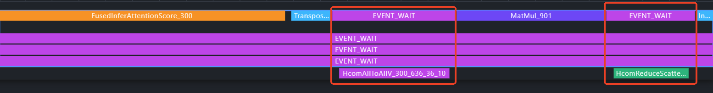

# Smart Move

## 特性一：纯DP场景下独立TP切分

### 优化场景与目标

**优化场景：**针对 Qwen-3 235B 等模型在服务化推理过程中遇到的显存限制问题，特别是在处理如强化学习（RL）中的长序列输出等场景时尤为明显。在decode阶段，为了避免KV cache的重复复制，通常采用纯DP策略。然而，这种做法导致某些较大的矩阵乘法操作（例如 O 矩阵和 QKV 矩阵）不进行TP切分，从而占用大量显存。

**优化目标：**通过单独对较大的矩阵（即O矩阵和QKV矩阵）实施TP切分，可以在一定程度上节省显存占用。尽管这种方法会引入额外的通信开销，但考虑到matmul在进行TP切分时仍能带来性能上的增益，只要整体性能未受到显著影响或仍在可接受范围内，这种策略便是可行的。利用由此节省下来的显存资源，我们可以增加decode组中的batch数量，从而实现更高的TPS，进而优化整个系统的性能表现。

### 方案设计

#### 方案逻辑流程

目前对于纯DP下独立TP切分有两种方案，需要根据实际情况选择对应的方案，下列以O矩阵TP切分为例（OTP=2），假设O矩阵的维度是$[h_1, h_2]$。

##### alltoall+矩阵行切+reduce-scatter

首先，在纯DP模式下，将 Attention 的输出按照OTP切分组进行一次 All-to-All 通信操作，将原本的 DP 并行模式转换为 TP 并行模式。随后，将转换后的数据与 O 矩阵的行切分部分进行矩阵乘法运算。最后，对计算结果执行 Reduce-Scatter 操作，将其重新分布并恢复到原始的 DP 并行状态。


根据上述流程进行通信量分析：

**all-to-all通信量**：$bsh_1\frac{OTP-1}{OTP}$

**reduce-scatter通信量**：$OTPbsh_2\frac{OTP-1}{OTP}$

**总通信量：**$X_1=bsh_1\frac{OTP-1}{OTP}+OTPbsh_2\frac{OTP-1}{OTP}=bs(h_1\frac{OTP-1}{OTP}+h_2(OTP-1))$

##### allgather+矩阵列切+alltoall

首先，在纯DP模式下，将 Attention 的输出按照OTP切分组进行一次 all-gather通信操作，将OTP组内所有的数据进行汇聚。随后，将转换后的数据与 O 矩阵的列切分部分进行矩阵乘法运算。最后，对计算结果执行 all-to-all 操作，将其重新分布并恢复到原始的 DP 并行状态。


根据上述流程进行通信量分析：

**all-gather通信量**：$bsh_1(OTP-1)$

**all-to-all通信量**：$bsh_2\frac{OTP-1}{OTP}$

**总通信量：**$X_2=bsh_1(OTP-1)+bsh_2\frac{OTP-1}{OTP}=bs(h_1(OTP-1)+h_2\frac{OTP-1}{OTP})$

#### 方案选择策略

比较上述两种方案的通信量：
$$
X_1>X_2 \\
bs(h_1\frac{OTP-1}{OTP}+h_2(OTP-1))>bs(h_1(OTP-1)+h_2\frac{OTP-1}{OTP}) \\
h_2(OTP-1)^2>h_1(OTP-1)^2 \\
h_2>h_1
$$
因此：

当$h_2>h_1$的时候，也就是矩阵是一个**升维的矩阵**的时候，恒$X_1>X_2$成立，**allgather+矩阵列切+alltoall**的方案通信量更小，性能更优。

当$h_1>h_2$的时候，也就是矩阵是一个**降维的矩阵**的时候，$X_2>X_1$恒成立，**alltoall+矩阵行切+reduce-scatter**的方案通信量更小，性能更优。

### 核心优化点分析

#### 节省显存，提高batch

以Qwen3-235B为例，单机混布，并行策略采用DP16，EP16。模型的相关参数如下：

| **dtype** | **layers** | **kv_head_num** | **kv_head_dim** | **kv_cache per token(GB)** | **weight per npu（GB）** |
| --------- | ---------- | --------------- | --------------- | -------------------------- | ------------------------ |
| bfloat16  | 94         | 4               | 128             | 0.000179                   | 41.36365                 |

其中O矩阵的维度是$[8192,4096]$，O矩阵的权重显存占用为
$$
\frac{8192\times4096\times2\times94}{1024^3}=5.875 (GB)
$$
如果不单独TP切分，那么每张卡中保存的是完整的O矩阵权重，当采用不同OTP切分数的时候，能够节省的显存如下所示：

| OTP              | 2      | 4       | 8        | 16        |
| ---------------- | ------ | ------- | -------- | --------- |
| 节省的显存（GB） | 2.9375 | 4.40625 | 5.140625 | 5.5078125 |

OTP=16能够**节省将近5.5GB的显存**，以4K的上下文，5.5GB的显存能够最多增加$\frac{5.5}{0.000179\times4096}\approx7$个batch，从而**提高decode的时候的组batch的数目**。

#### 引入通信开销，但同时matmul耗时降低

增加OTP的规模可以**减少显存使用**，并**降低O矩阵乘的计算量**。但是，这种方法会**导致更多的通信开销**。因为O矩阵是一个降维操作，所以采用了All-to-All和Reduce-Scatter的方案。当OTP的数量增加时，设备之间需要交换的数据量也会增加，这会导致通信时间变长，从而可能降低整体性能。**因此该优化的目的是在尽可能减少性能劣化或者是可接受的情况下增大OTP来节省显存。**

OTP之前：


OTP之后：



因此并非OTP切分越大越好，需要根据实际的情况，调整矩阵切分的TP数，下列测试了不同的TP数下O矩阵相关算子的耗时，测试条件：输入4K，输出1.5K，单DP48/8并发。

| **bs** | **otp** | **transpose(us)** | **alltoallv(us)** | **matmul(us)** | **reducescatter(us)** | **sum(us)** | **decode劣化(ms)** |
| ------ | ------- | ----------------- | ----------------- | -------------- | --------------------- | ----------- | ------------------ |
| 8      | 1       | /                 | /                 | 54.119         | /                     | 54.119      | /                  |
| 8      | 2       | 6.719             | 20.78             | 30.9           | 12.259                | 70.658      | 1.554666           |
| 8      | 4       | 8.040             | 25                | 19.14          | 14.060                | 66.24       | 1.139374           |
| 48     | 1       | /                 | /                 | 76.538         | /                     | 76.538      | /                  |
| 48     | 2       | 8.824             | 25.6              | 40.499         | 20.939                | 95.862      | 1.816456           |
| 48     | 4       | 8.180             | 28.28             | 30.379         | 18.920                | 85.759      | 0.866774           |

### 测试方案

#### 测试策略说明

测试分为两个场景：

1. **RL场景（输入2K，输出32K）**：在这种场景下，模型需要处理短输入但生成超长输出。decode阶段耗时显著，且由于序列长度较长，容易导致显存瓶颈。通过独立切分矩阵以节省显存，可以使得decode过程中的批处理量更大，从而提高整体输出吞吐量。
2. **单D场景（输出3K）**：该场景适用于PD分离架构下的D节点性能提升。尽管序列长度相对较短，但在高并发情况下仍可能导致显存瓶颈。通过优化显存使用，可以在不增加硬件成本的情况下提升系统的吞吐能力。
3. **短输入长输出（输入128，输出4K）**

#### 测试结果

##### RL场景（输入2K，输出32K）

拉起服务脚本：

```bash
source /sfs_turbo/humpy/B080/cann_b080/ascend-toolkit/set_env.sh
source /sfs_turbo/humpy/B080/cann_b080/nnal/atb/set_env.sh

# 分层通信
export HCCL_INTRA_PCIE_ENABLE=1
export HCCL_INTRA_ROCE_ENABLE=0
# AIV
export HCCL_OP_EXPANSION_MODE=AIV
export HCCL_OP_BASE_FFTS_MODE_ENABLE=true

export VLLM_USE_V1=1
export VLLM_VERSION=0.9.1
export VLLM_ASCEND_ENABLE_MOE_ALL2ALL_SEQ=1
export TASK_QUEUE_ENABLE=2
export PYTORCH_NPU_ALLOC_CONF=expandable_segments:True


rm -rf ./.torchair_cache/
rm -rf ./dynamo_*

nohup python -m vllm.entrypoints.openai.api_server \
    --model=/sfs_turbo/tzq/model/Qwen/Qwen3-235B-A22B \
    --served-model-name auto \
    --port 8006 \
    -tp 1 \
    -dp 16 \
    --enable_expert_parallel \
    --max-num-seqs 48 \
    --max-model-len 35840 \
    --gpu-memory-utilization 0.95 \
    --additional-config '{"oproj_tensor_parallel_size": 4, "torchair_graph_config":{"enabled":true,"use_cached_graph":true,"graph_batch_sizes_init":false,"graph_batch_sizes":[8, 16, 24, 48]}, "refresh":true}' > test.log 2>&1 &
```

benchmark测试脚本

```bash
nohup python /sfs_turbo/tzq/ant_code/vllm/benchmarks/benchmark_serving.py \
    --backend vllm \
    --trust-remote-code \
    --model auto 
    --tokenizer /sfs_turbo/humpy/Qwen3-235B-A22B/ \
    --num-prompts 1024 \
    --dataset-name custom \
    --dataset-path /sfs_turbo/yangyuzhuo.yyz/dataset/dapo-math-17k-update-reasoning.jsonl \
    --custom-output-len 32768 \
    --ignore-eos \
    --temperature 1.0 \
    --top-p 1.0 \
    --top-k -1 \
    --max-concurrency 768 \
    --metric-percentiles 50,90,99 \
    --base-url http://localhost:8006 \
    --save-result > benchmark.log 2>&1 &
```

| DP16+TP1+**OTP1**                                            | DP16+TP1+**OTP4**                                            |
| ------------------------------------------------------------ | ------------------------------------------------------------ |
|  |  |
| 输出吞吐测试结果：**517.66 TPS**                             | 输出吞吐测试结果：**602.16 TPS**                             |
| DP16+TP1+**OTP4+QKVTP4**                                     |                                                              |
|  |                                                              |
| 输出吞吐测试结果：**631.67 TPS**                             |                                                              |

由上表所示，OTP4相比于基线的输出吞吐提升了**16%**。

下图画出了server的单DP中输出吞吐随着时间变化的曲线图。


最初一段时间内，基线的输出吞吐量高于OTP4，这是因为此时系统尚未达到显存瓶颈。在这一阶段，两种场景下的请求组decode批次大小相同。然而，由于OTP引入了一定的性能开销，导致其整体输出吞吐量略低。

随着输出序列长度的逐渐增长，系统迅速达到了显存瓶颈。尽管OTP的单请求输出吞吐量较低，但由于其KV缓存能够利用更大的显存空间，从而支持更大的批处理规模（batch size）。因此，即使单请求吞吐量不高，较大的批处理规模使得总体吞吐量更高。

##### 单D场景（输出3K）

输出3K

baseline+batchsize8,16,24,48


qkvtp4+batchsize8,16,24,48


改进之后：


o proj tp4


##### PD混布场景（输入128，输出4K）

768并发，5000条请求

| 并行策略         | graph size   | TTFT(ms)  | TPOT(ms) | QPS  | 截图                                                         |
| ---------------- | ------------ | --------- | -------- | ---- | ------------------------------------------------------------ |
| DP16+OTP4+QKVTP4 | [48, 24]     | 34349.30  | 169.21   | 0.97 |  |
| DP16+TP1         | [48, 24]     | 122960.07 | 235.30   | 0.62 |  |
| DP8+TP2          | [48, 24]     | 341356.79 | 90.90    | 0.98 |  |
| DP8+TP2          | [96, 48, 24] | 22551.13  | 152.37   | 1.10 |  |

## 特性二：权重prefetch

通过预取Qwen3-235B的moe部分第一个groupmatmul的权重来提高decode性能。

#### 测试方案

输入4K，输出1.5K，并发64，请求条数512

| baseline                                                     | prefetch 25                                                  |
| ------------------------------------------------------------ | ------------------------------------------------------------ |
|  |  |

tpot收益达到**5%**。