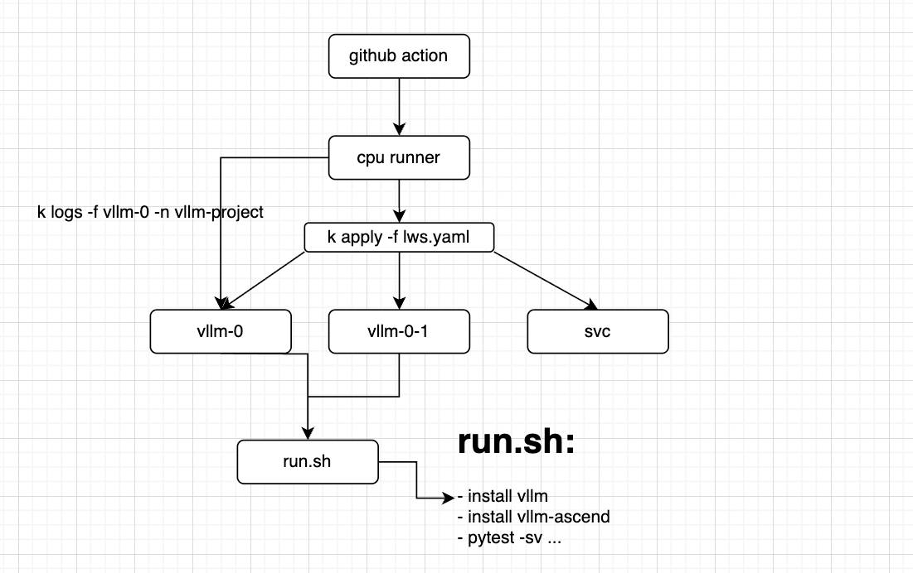

# How to Contribute to the Nightly CI

The **nightly CI** is a collection of end-to-end tests that run periodically on the **vllm-ascend inference engine** (including both single-node and multi-node scenarios).  
These tests are located under the `tests/e2e/nightly/` directory and aim to ensure the **functionality, performance, and accuracy** of vllm-ascend models.

---

## Single-Node Tests

Single-node tests are located in the `tests/e2e/nightly/models` directory and are executed on a **single NPU machine**.

### Test Cases

Take `test_qwen3_32b.py` as an example.  
The following shows how to start an online inference service and perform a simple end-to-end test:

```python
from typing import Any

import openai
import pytest

from tests.e2e.conftest import RemoteOpenAIServer

MODELS = [
    "Qwen/Qwen3-32B",
]

TENSOR_PARALLELS = [4]

prompts = [
    "San Francisco is a",
]

api_keyword_args = {
    "max_tokens": 10,
}


@pytest.mark.asyncio
@pytest.mark.parametrize("model", MODELS)
@pytest.mark.parametrize("tp_size", TENSOR_PARALLELS)
async def test_models(model: str, tp_size: int) -> None:
    # Any environment variables you want to add during service startup can be placed here
    env_dict = {
        "TASK_QUEUE_ENABLE": "1",
        "OMP_PROC_BIND": "false",
        "HCCL_OP_EXPANSION_MODE": "AIV",
        "PAGED_ATTENTION_MASK_LEN": "5500"
    }
    # The cli args for vllm serve ...
    server_args = [
        "--no-enable-prefix-caching", "--tensor-parallel-size",
        str(tp_size), "--port", "20002", "--max-model-len", "36864",
        "--max-num-batched-tokens", "36864", "--block-size", "128",
        "--trust-remote-code", "--gpu-memory-utilization", "0.9",
        "--additional-config", '{"enable_weight_nz_layout":true}'
    ]
    request_keyword_args: dict[str, Any] = {
        **api_keyword_args,
    }
    with RemoteOpenAIServer(model,
                            server_args,
                            server_port=20002,
                            env_dict=env_dict,
                            auto_port=False) as server:
        client = server.get_async_client()
        batch = await client.completions.create(
            model=model,
            prompt=prompts,
            **request_keyword_args,
        )
        choices: list[openai.types.CompletionChoice] = batch.choices
        assert choices[0].text, "empty response"
```

As shown in the example above, the key part of the test is providing the CLI arguments for `vllm serve`, which defines how the service should be started.
Within the `with RemoteOpenAIServer` context block, you can add any API-level test logic that interacts with the launched service.

### workflow

After writing a new test case, you’ll need to add it to the CI workflow.
All nightly test workflows are defined in the `vllm_ascend_test_nightly.yaml` file:

```yaml
jobs:
  qwen3-32b:
    strategy:
      matrix:
        # What runner the case running on
        os: [linux-aarch64-a2-4]
    uses: ./.github/workflows/_e2e_nightly.yaml
    with:
      vllm: v0.11.0
      runner: ${{ matrix.os }}
      # The location of the case
      tests: tests/e2e/nightly/models/test_qwen3_32b.py
```

Each model test corresponds to one job in the workflow file.
The job specifies the required hardware (`linux-aarch64-a2-4`) and the version of vLLM (`v0.11.0`) to be used.

## Multi-Node Tests

Multi-node tests are located in the `tests/e2e/nightly/multi_node/` directory and are used for distributed inference scenarios such as large-scale models running across multiple machines (e.g., data parallelism or prefill-decoder separation).

### How the multi-node test work

Multi-node tests are executed using **Kubernetes custom resources (LWS)**, which automatically manage the creation of leader and worker pods for distributed inference tasks.

#### What is LWS?

LeaderWorkerSet (LWS) is a Kubernetes API that aims to address common deployment patterns of AI/ML inference workloads.
A major use case is for multi-host/multi-node distributed inference.

vLLM can be deployed with [LWS](https://github.com/kubernetes-sigs/lws) on Kubernetes for distributed model serving.

Deploy the following yaml file `lws.yaml` will automatically pull two pods to execute custom scripts

```yaml
apiVersion: leaderworkerset.x-k8s.io/v1
kind: LeaderWorkerSet
metadata:
  name: vllm
  namespace: vllm-project
spec:
  replicas: 1
  leaderWorkerTemplate:
    size: 2
    restartPolicy: RecreateGroupOnPodRestart
    leaderTemplate:
      metadata:
        labels:
          role: leader
      spec:
        containers:
          - name: vllm-leader
            image: m.daocloud.io/quay.io/ascend/cann:8.2.rc1-a3-ubuntu22.04-py3.11
            env:
              - name: WORKSPACE
                value: "/root/workspace"
              # Set vLLM version and vLLM-Ascend version here, once there is a new release, update here.
              - name: VLLM_VERSION
                value: "v0.11.0"
              - name: VLLM_ASCEND_VERSION
                value: "main"
              - name: MOONCAKE_VERSION
                value: "06cc217504a6f1b0cdaa26b096b985651b262748"
            command:
              - sh
              - -c
              - |
                bash /root/.cache/tests/run.sh
            resources:
              limits:
                huawei.com/ascend-1980: "16"
                memory: 512Gi
                ephemeral-storage: 100Gi
              requests:
                huawei.com/ascend-1980: "16"
                ephemeral-storage: 100Gi
                cpu: 125
            ports:
              - containerPort: 8080
            # readinessProbe:
            #   tcpSocket:
            #     port: 8080
            #   initialDelaySeconds: 15
            #   periodSeconds: 10
            volumeMounts:
              - mountPath: /root/.cache
                name: shared-volume
              - mountPath: /usr/local/Ascend/driver/tools
                name: driver-tools
              - mountPath: /dev/shm
                name: dshm
        volumes:
        - name: dshm
          emptyDir:
            medium: Memory
            sizeLimit: 15Gi
        - name: shared-volume
          persistentVolumeClaim:
            claimName: nv-action-vllm-benchmarks-v2
        - name: driver-tools
          hostPath:
            path: /usr/local/Ascend/driver/tools
    workerTemplate:
      spec:
        containers:
          - name: vllm-worker
            image: m.daocloud.io/quay.io/ascend/cann:8.2.rc1-a3-ubuntu22.04-py3.11
            env:
              - name: WORKSPACE
                value: "/root/workspace"
              # Set vLLM version and vLLM-Ascend version here, once there is a new release, update here.
              - name: VLLM_VERSION
                value: "v0.11.0"
              - name: VLLM_ASCEND_VERSION
                value: "main"
              - name: MOONCAKE_VERSION
                value: "06cc217504a6f1b0cdaa26b096b985651b262748"
            command:
              - sh
              - -c
              - |
                bash /root/.cache/tests/run.sh
            resources:
              limits:
                huawei.com/ascend-1980: "16"
                memory: 512Gi
                ephemeral-storage: 100Gi
              requests:
                huawei.com/ascend-1980: "16"
                ephemeral-storage: 100Gi
                cpu: 125
            volumeMounts:
              - mountPath: /root/.cache
                name: shared-volume
              - mountPath: /usr/local/Ascend/driver/tools
                name: driver-tools
              - mountPath: /dev/shm
                name: dshm
        volumes:
        - name: dshm
          emptyDir:
            medium: Memory
            sizeLimit: 15Gi
        - name: shared-volume
          persistentVolumeClaim:
            claimName: nv-action-vllm-benchmarks-v2
        - name: driver-tools
          hostPath:
            path: /usr/local/Ascend/driver/tools
---
apiVersion: v1
kind: Service
metadata:
  name: vllm-leader
  namespace: vllm-project
spec:
  ports:
    - name: http
      port: 8080
      protocol: TCP
      targetPort: 8080
  selector:
    leaderworkerset.sigs.k8s.io/name: vllm
    role: leader
  type: ClusterIP

```

```bash
kubectl apply -f lws.yaml
```

Verify the status of the pods:

```bash
kubectl get pods
```

Should get an output similar to this:

```bash
NAME       READY   STATUS    RESTARTS   AGE
vllm-0     1/1     Running   0          2s
vllm-0-1   1/1     Running   0          2s
```

Verify that the distributed inference works:

```bash
kubectl logs vllm-0 -n vllm-project"
```

#### Running Multi-Node CI on Kubernetes

Building on top of LWS, we can define how each distributed inference test is executed within our CI system.

As shown in the diagram below, the test flow is triggered by GitHub Actions workflows, which then launch Kubernetes pods to run the actual distributed test logic.



Each test case is configured via a YAML file located under `tests/e2e/nightly/multi_node/config/models/`. which defines how the test should be executed. for example, a prefill-decoder separation test running across two A3 nodes. When we want to add a new test case, just add a yaml.

```yaml
# This is an example configuration file for testing Qwen3-235B-A22B-W8A8 model with disaggregated prefill.
# node0: 1 * atlas 800 A3(16 NPUs per node), node1: 1 atlas 800 A3 (16 NPUs per node)
# DP=2, TP=8, EP=16, each node holds 2 DP ranks.
test_name: "test Qwen3-235B-A22B-W8A8"
model: "vllm-ascend/Qwen3-235B-A22B-W8A8"
num_nodes: 2
npu_per_node: 16
# For disaggregated mode, set is_disaggregated: true, and set the following parameters:
# Prefiller_index: the hosts index of the node running prefiller
# Decoder_index: the hosts index of the node running decoder
# Suppose we have **4 nodes** running a 2P1D setup (2 Prefillers + 1 Decoder):
#   ┌───────────────┬───────────────┬───────────────┬───────────────┐
#   │   node0       │   node1       │   node2       │   node3       │
#   │ Prefiller #1  │ Prefiller #2  │   Decoder     │   Decoder     │
#   └───────────────┴───────────────┴───────────────┴───────────────┘
# For the prefiller nodes. the hosts should be node0 and node1
# For the decoder nodes. we only have 1 decoder node(dp+tp+ep across node2 and node3. Where node3 is running with headless mode)
# So the prefiller_host_index is [0, 1], and the decoder_host_index is [2]

disaggregated_prefill:
  enabled: true
  prefiller_host_index: [0]
  decoder_host_index: [1]
env_common:
  VLLM_USE_MODELSCOPE: true
  OMP_PROC_BIND: false
  OMP_NUM_THREADS: 100
  HCCL_BUFFSIZE: 1024
  SERVER_PORT: 8080
  ASCEND_AGGREGATE_ENABLE: 1
  ASCEND_TRANSPORT_PRINT: 0
  ACL_OP_INIT_MODE: 1
  ASCEND_A3_ENABLE: 1

deployment:
  -
    local_index: 0
    master_index: 0
    headless: false
    env_extend:
    server_cmd: >
      vllm serve vllm-ascend/Qwen3-235B-A22B-W8A8
        --host 0.0.0.0
        --port $SERVER_PORT
        --api-server-count 2
        --data-parallel-size 2
        --data-parallel-size-local 2
        --data-parallel-address $LOCAL_IP
        --data-parallel-rpc-port 13389
        --tensor-parallel-size 8
        --enable-expert-parallel
        --seed 1024
        --enforce-eager
        --max-model-len 32768
        --max-num-batched-tokens 32768
        --trust-remote-code
        --gpu-memory-utilization 0.9
        --kv-transfer-config
        '{"kv_connector": "MooncakeConnector",
        "kv_role": "kv_producer",
        "kv_port": "30000",
        "engine_id": "0",
        "kv_connector_module_path": "vllm_ascend.distributed.mooncake_connector",
        "kv_connector_extra_config": {
                  "prefill": {
                          "dp_size": 2,
                          "tp_size": 8
                  },
                  "decode": {
                          "dp_size": 2,
                          "tp_size": 8
                  }
            }
        }'
  -
    local_index: 1
    master_index: 0
    headless: true
    env_extend:
    server_cmd: >
      vllm serve /model/Qwen3-235B-A22B-W8A8
        --host 0.0.0.0
        --port 8004
        --api-server-count 4
        --data-parallel-size 2
        --data-parallel-size-local 2
        --data-parallel-address $LOCAL_IP
        --data-parallel-rpc-port 5964
        --tensor-parallel-size 8
        --enable-expert-parallel
        --seed 1024
        --max-model-len 32768
        --max-num-batched-tokens 512
        --max-num_seqs 16
        --trust-remote-code
        --no-enable-prefix-caching
        --gpu-memory-utilization 0.9
        --compilation-config '{"cudagraph_capture_sizes":[16]}'
        --kv-transfer-config
        '{"kv_connector": "MooncakeConnector",
        "kv_role": "kv_consumer",
        "kv_port": "30200",
        "engine_id": "1",
        "kv_connector_module_path": "vllm_ascend.distributed.mooncake_connector",
        "kv_connector_extra_config": {
                  "prefill": {
                          "dp_size": 2,
                          "tp_size": 8
                  },
                  "decode": {
                          "dp_size": 2,
                          "tp_size": 8
                  }
            }
        }'
benchmarks:
  perf:
    case_type: performance
    dataset_path: vllm-ascend/GSM8K-in3500-bs400
    request_conf: vllm_api_stream_chat
    dataset_conf: gsm8k/gsm8k_gen_0_shot_cot_str_perf
    num_prompts: 1
    max_out_len: 2
    batch_size: 1
    baseline: 5
    threshold: 0.97
  acc:
    case_type: accuracy
    dataset_path: vllm-ascend/AIME2024
    request_conf: vllm_api_general_chat
    dataset_conf: aime2024/aime2024_gen_0_shot_chat_prompt
    max_out_len: 10
    batch_size: 32
    baseline: 1
    threshold: 1
```
